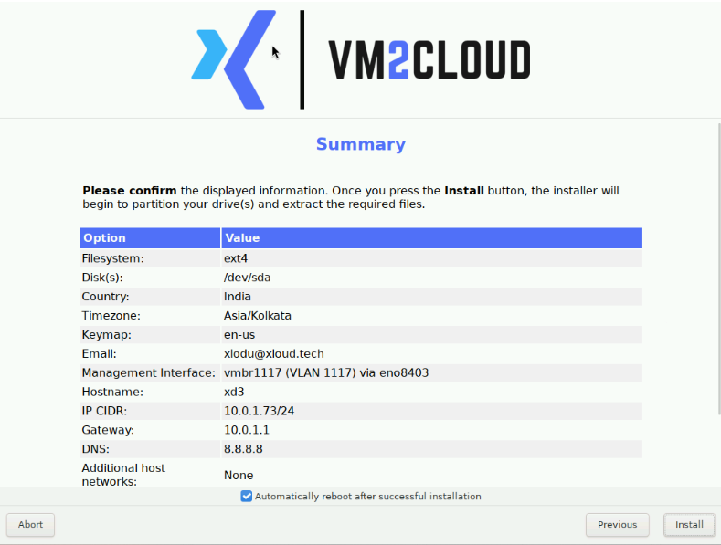
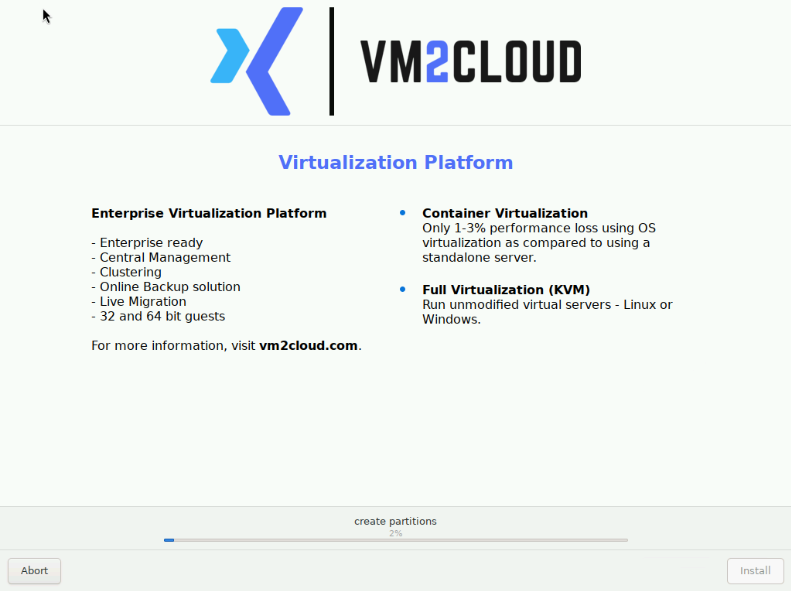

# Complete the Installation

---

## Overview

The Summary screen shows every value the installer will apply. Reviewing it is the last opportunity to correct a mistake — once installation starts, the selected disks are partitioned and returning to a previous screen cannot recover their contents.

| | |
|---|---|
| **Software version** | VM2Cloud VE 9.2, ISO build v10 |
| **Estimated time** | 10–20 minutes, depending on disk speed |
| **Data impact** | Selected disks are erased |

---

## When to Use

Follow this page after [Configure the Management Network](Configure-Management-Network.md), when the installer presents the Summary screen.

---

## Prerequisites

* All previous installer screens completed.
* The approved server plan available for comparison.
* Confirmation that everything on the selected disks can be lost.
* The server left undisturbed for the duration of the installation.

---

# Procedure

## Step 1: Review the Installation Summary

Compare every Summary row against the approved server plan before clicking **Install**.

**Installation Summary**

*Figure 1. The Summary screen presents the final values that will be applied when installation starts.*

| Summary item | What to verify |
|---|---|
| **Filesystem and Disk(s)** | The intended layout, and every disk that will be erased. |
| **Country, Timezone, Keymap** | The physical location and administrator keyboard. |
| **Email** | The operational notification address. |
| **Management Interface** | The generated bridge, VLAN, and final physical uplink. |
| **Hostname** | The unique node name. |
| **IP CIDR, Gateway, DNS** | Static addressing, routing, and resolver. |
| **Additional host networks** | The expected count, or **None**. |

Pay particular attention to the **final physical uplink** shown against the management interface. If a bond or VLAN was configured, this row is where you confirm the installer resolved it to the NIC you intended.

Keep **Automatically reboot after successful installation** enabled for the standard path.

If any value is wrong, click **Previous**, correct it, and return to Summary.

> **Warning:** Clicking **Install** begins partitioning the listed disks. Data on those disks cannot be preserved by returning to a previous screen once installation has started.

**Expected result:** Every Summary row matches the intended configuration, and automatic reboot is selected.

---

## Step 2: Start and Monitor the Installation

Click **Install**. Monitor the current task and percentage while the installer partitions the storage and writes the required files.

**Installation Progress**

*Figure 2. Installation has started and the progress area reports the current task at 2 percent.*

> **Warning:** Do not power off the server, reset it, disconnect storage, or unmap the installation ISO while partitioning and file extraction are running. An interrupted installation leaves the disks in an inconsistent state and the process must be restarted from the beginning.

Because automatic reboot is enabled, the server restarts once the installer reports success.

**Expected result:** The progress bar advances beyond partition creation without an installation error.

---

## Step 3: Allow the Installation to Complete and Reboot

Continue monitoring until all packages and boot files have been written.

After successful completion, the **Automatically reboot after successful installation** option restarts the server. The remote console may briefly show a blank screen or firmware messages during the transition.

1. Allow the reboot to continue **without** selecting the virtual optical drive again.
2. Confirm the installation ISO is no longer mapped — the console should report **Devices Mapped: 0**.
3. If the ISO is still mapped, unmap it now, so the server boots the installed system rather than reopening the installer.
4. Wait for the console login prompt.

That third point is the most common stumble at this stage. A still-mapped ISO combined with a boot order that reaches it first sends the server straight back into the installer, which looks alarming but is harmless.

**Expected result:** The server boots from its installed storage and displays the welcome message, management URL, and local login prompt.

Continue with [Verify the Installation](Verify-Installation.md).

---

# Configuration / Options

| Option | Description |
|---|---|
| **Automatically reboot after successful installation** | Restarts the server once installation finishes. Keep enabled for the standard path. |
| **Previous** | Returns to earlier screens. Available only *before* installation starts. |
| **Install** | Begins partitioning. The point of no return. |

---

# Verification

Before clicking **Install**:

* Every Summary row matches the approved plan.
* Every disk listed under Filesystem and Disk(s) can be erased.
* The management interface row shows the intended final physical uplink.
* The hostname is unique.
* Automatic reboot is enabled.

During and after installation:

* Progress advances past partition creation without error.
* The server reboots on its own.
* The console reports **Devices Mapped: 0**.
* The console login prompt appears.

---

# Common Issues

| Issue | Resolution |
|-------|------------|
| The installer starts again after reboot | The ISO is still mapped, or the virtual optical drive was selected again. Unmap it, confirm **Devices Mapped: 0**, and reboot from the installed disk. |
| Installation fails partway | Note the exact error. Usually a disk problem or damaged installation media. Verify disk health and remap a verified ISO. |
| Progress stalls at a low percentage | Partitioning can be slow on large or spinning disks. Allow time before intervening — interrupting is worse than waiting. |
| The wrong disk was erased | There is no recovery. This is what the Summary review exists to prevent. |
| Server does not reboot automatically | The automatic reboot option may have been disabled. Restart manually from the console. |
| Console goes blank during reboot | Normal during the firmware transition. Wait for the login prompt. |
| Management interface row shows an unexpected uplink | Return to the network screen and correct it before installing. |

---

# Best Practices

- **Read every Summary row against the plan**, rather than scanning it. This is the last recoverable moment.
- Confirm the final physical uplink, particularly when a bond or VLAN was configured.
- Keep automatic reboot enabled.
- Leave the server alone once installation starts.
- Watch the reboot rather than walking away — the still-mapped-ISO case is easiest to catch as it happens.
- Unmap the ISO as soon as the installed system boots.
- Record the installation date and ISO build in [Node Notes](../03-Nodes/Node-Notes.md) afterwards.

---

# Related Documentation

- [Configure the Management Network](Configure-Management-Network.md)
- [Verify the Installation](Verify-Installation.md)
- [Mount the Installation ISO](Mount-Installation-Media.md)
- [Installation Overview](README.md)
- [Node Notes](../03-Nodes/Node-Notes.md)
- [Reboot Node](../03-Nodes/Reboot-Node.md)

---

# Change History

| Date | Change |
|---|---|
| 22 July 2026 | Initial version, verified through first dashboard login. |
| 13 August 2026 | Converted to Markdown and split into its own page. |

---

# Summary

The Summary screen is the last point at which any installer decision can be corrected. Read every row against the approved plan — especially the disks that will be erased and the final physical uplink for the management interface, which is where a bond or VLAN configuration is confirmed.

Once **Install** is clicked, partitioning begins and previous screens can no longer recover the disk contents. Leave the server undisturbed until it reboots, then confirm the ISO is unmapped so it boots the installed system rather than returning to the installer.
