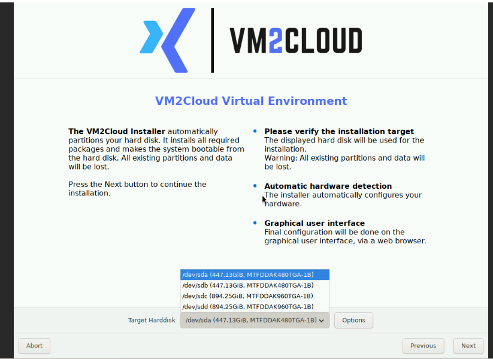
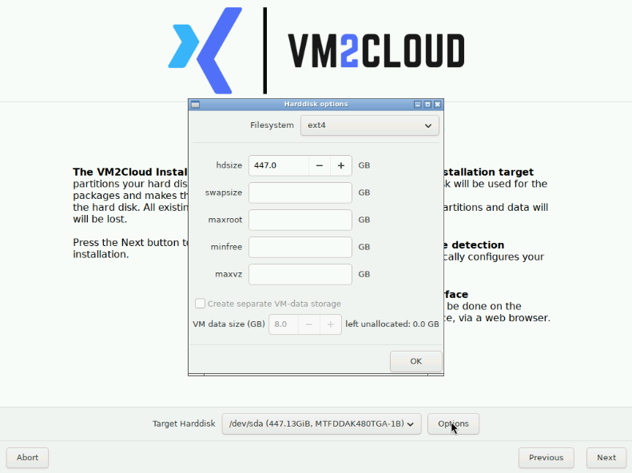
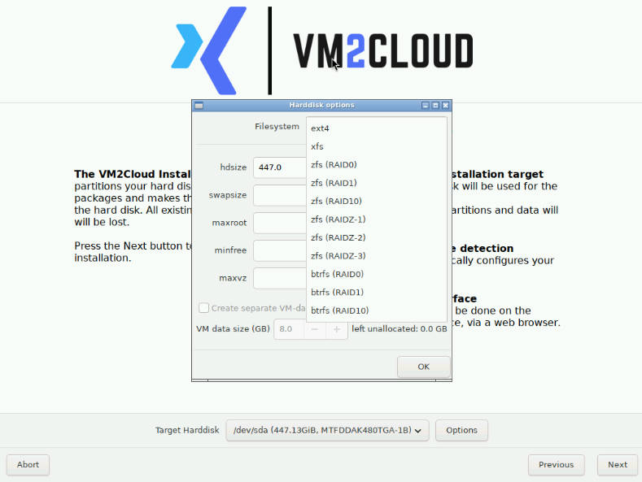
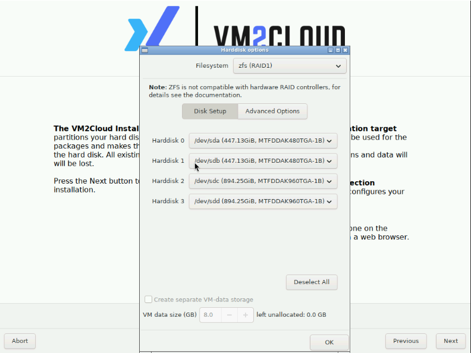
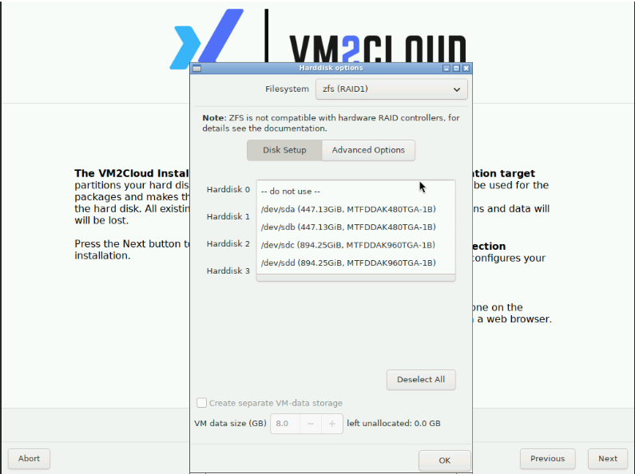
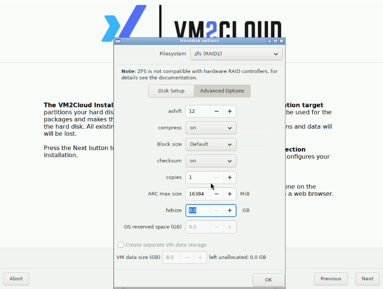

# Configure Installation Storage

---

## Overview

The first screen of the graphical installer selects which disks VM2Cloud VE is installed on, and what filesystem or redundancy layout is created across them.

This is the decision with the longest consequences. The layout chosen here cannot be changed later without reinstalling, and the selected disks are erased.

| | |
|---|---|
| **Software version** | VM2Cloud VE 9.2, ISO build v10 |
| **Estimated time** | 5–10 minutes |
| **Data impact** | Selected disks are erased |

> **Warning:** The installer erases all partitions and data on every selected disk. Confirm the disk identity — device name, capacity, and model — before proceeding. This cannot be undone.

---

## When to Use

Follow this page immediately after the graphical installer starts. See [Mount the Installation ISO](Mount-Installation-Media.md).

---

## Prerequisites

* A confirmed storage design, including the required filesystem or redundancy layout.
* A record of the intended disk models, capacities, and device assignments.
* For ZFS, disks presented directly rather than through hardware RAID.

---

## Which Path to Follow

| Requirement | Path |
|---|---|
| Install on one disk | Target disk → optionally review **Options** → **Next** |
| Create ZFS or Btrfs storage | Target disk → **Options** → choose layout → **Disk Setup** → optional **Advanced Options** |

> **Note:** Device names, disk sizes, and models in the screenshots are examples from one server. Use the values assigned to the server you are installing.

---

# Procedure

## Step 1: Select the Target Disk

Open **Target Harddisk**. Identify the intended installation disk by device name, capacity, and model, then select it.

The selected disk becomes part of the VM2Cloud VE system storage. Device names such as `/dev/sda` are assigned by the current server and are not universal identifiers — always confirm capacity and model as well.

**Target Disk List**

*Figure 1. The installer lists detected target disks by device name, capacity, and model.*

**Expected result:** Target Harddisk displays the intended physical disk, and its capacity and model match the approved storage plan.

If a single disk with the default filesystem is all you need, click **Next** and continue with [Configure Location and Administrator Access](Configure-Location-and-Administrator.md).

---

# Optional: Review Single-Disk Sizing

Click **Options** to review the single-disk filesystem and its calculated sizing fields.

**Harddisk Options**

*Figure 2. Harddisk options for a single-disk filesystem.*

| Field | What it controls |
|---|---|
| **Filesystem** | The filesystem or multi-disk layout created by the installer. |
| **hdsize** | How much of the physical disk is made available to the installation. |
| **swapsize** | Capacity assigned to swap. |
| **maxroot** | Maximum capacity assigned to the root filesystem. |
| **minfree** | Capacity kept free for storage-management operations. |
| **maxvz** | Maximum capacity assigned to local VM and container data. |
| **Create separate VM-data storage** | Separates VM-data allocation from operating-system storage. |

Keep the automatically calculated values unless the deployment has an approved partition-sizing requirement. Click **OK** to retain the configuration.

---

# Optional: Choose a Multi-Disk Layout

Click **Options**, open **Filesystem**, and select the layout the deployment requires.

**Filesystem Layout Menu**

*Figure 3. The Filesystem menu presents the single-disk, ZFS, and Btrfs layouts available.*

| Option | Minimum disks | Failure protection | Use |
|---|---:|---|---|
| ext4 | 1 | None | Simple single-disk installation. |
| xfs | 1 | None | Single-disk installation using XFS. |
| zfs (RAID0) | 2 | None | Striping for capacity and performance; any member failure loses the pool. |
| zfs (RAID1) | 2 | Mirror | Copies data across all mirror members; usable capacity follows the smallest disk. |
| zfs (RAID10) | 4, even | Mirrored pairs | Striping across mirrors for performance and redundancy. |
| zfs (RAIDZ-1) | 3 | One disk | Single-parity ZFS layout. |
| zfs (RAIDZ-2) | 4 | Two disks | Dual-parity ZFS layout. |
| zfs (RAIDZ-3) | 5 | Three disks | Triple-parity ZFS layout. |
| btrfs (RAID0) | 2 | None | Btrfs striping without redundancy. |
| btrfs (RAID1) | 2 | Mirrored data | Btrfs redundant data copies. |
| btrfs (RAID10) | 4, even | Mirrored stripes | Btrfs RAID10 layout. |

> **Warning:** Use disks with matching capacity and performance characteristics — a mirror is constrained by its smallest member. **RAID is not a backup.** It protects against disk failure, not against deletion or corruption. See [Backup Jobs Overview](../02-Datacenter/Backup/Backup-Jobs-Overview.md).

---

# Optional: Select Disks for a ZFS Layout

After selecting a ZFS layout, open **Disk Setup**. Click **Deselect All** when the automatic selection does not match the deployment plan.

**ZFS Disk Setup**

*Figure 4. ZFS RAID1 Disk Setup assigns detected physical disks to Harddisk positions.*

**Disk Selector**

*Figure 5. Each Harddisk position can use one detected disk or be set to `-- do not use --`.*

1. Open each required **Harddisk** position.
2. Select a physical disk belonging to the intended array.
3. Set unused positions to `-- do not use --`.
4. Confirm every selected disk appears only once.
5. Confirm the selected count satisfies the layout minimum.
6. Verify device name, capacity, and model before continuing.

> **Warning:** Do not place ZFS on hardware RAID virtual disks. ZFS needs direct access to the physical disks to manage redundancy and detect errors — present them through an HBA, JBOD, or passthrough configuration.

---

# Optional: Review ZFS Advanced Options

Open **Advanced Options**. Review the installer-calculated values and change them only when the deployment has an approved ZFS design.

**ZFS Advanced Options**

*Figure 6. ZFS Advanced Options controls alignment, compression, checksums, cache, and capacity allocation.*

| Field | Purpose | Guidance |
|---|---|---|
| **ashift** | ZFS sector alignment. | Keep the detected value unless the disk-sector design requires otherwise. |
| **compress** | Transparent compression. | Keep enabled unless the storage design specifies otherwise. |
| **Block size** | Data or volume block size. | Keep Default unless workload testing requires a change. |
| **checksum** | Data-integrity checksums. | Keep enabled. |
| **copies** | Additional block copies. | Consumes capacity and does not replace RAID or backups. |
| **ARC max size** | Memory allocated to the ZFS cache. | Use the calculated value unless host memory has been planned explicitly. |
| **hdsize** | Disk capacity made available. | Set according to the disk-allocation plan. |
| **OS reserved space** | Capacity reserved for the operating system. | Available when storage separation is enabled. |
| **VM data size** | Capacity for separate VM-data storage. | Use only when separate VM-data storage is required. |

**Expected result:** The selected disks and advanced settings match the approved storage design. Click **OK**, then **Next**.

---

# Configuration / Options

The decisions made on this screen and their permanence:

| Decision | Changeable later |
|---|---|
| Which disks are used | No — requires reinstallation |
| Filesystem and RAID layout | No — requires reinstallation |
| Partition sizing | No — requires reinstallation |
| ZFS tunables such as compression | Some, after installation |
| Additional storage added later | Yes — see [Add Storage](../02-Datacenter/Storage/Add-Storage.md) |

---

# Verification

Before clicking **Next**, verify:

* Every selected disk is correct by device name, capacity, **and** model.
* The layout has enough disks for its minimum requirement.
* No disk is assigned to two positions.
* Unused positions are set to `-- do not use --`.
* For ZFS, disks are presented directly rather than through hardware RAID.
* You are content to lose everything currently on the selected disks.

---

# Common Issues

| Issue | Resolution |
|-------|------------|
| The required disk is not listed | It may not be presented to the installer, may be behind unsupported controller configuration, or may have failed. Verify firmware, controller, HBA/JBOD, cabling, and disk health. **Do not select a different disk merely because it appears.** |
| The RAID layout is unavailable or invalid | Too few disks selected, a disk assigned twice, or the layout does not support that count. Return to Disk Setup and correct the assignments. |
| Usable capacity is lower than expected | A mirror is limited by its smallest member. Parity layouts also reserve capacity. |
| ZFS performs poorly | It may be running on hardware RAID virtual disks. This requires reinstallation to correct. |
| Unsure which physical disk a device name refers to | Match by capacity and model as well as device name. Device names are assigned per boot. |

---

# Best Practices

- **Verify disk identity three ways** — device name, capacity, and model. This is the last point at which a mistake is recoverable.
- Keep the calculated sizing values unless there is an approved reason to change them.
- Use matched disks in any redundant layout.
- Never place ZFS on hardware RAID.
- Decide the layout before starting the installer, not during it.
- Remember RAID is not a backup — configure [backup jobs](../02-Datacenter/Backup/Backup-Jobs-Overview.md) once the node is running.

---

# Related Documentation

- [Mount the Installation ISO](Mount-Installation-Media.md)
- [Configure Location and Administrator Access](Configure-Location-and-Administrator.md)
- [Installation Overview](README.md)
- [Storage Types](../02-Datacenter/Storage/Storage-Types.md)
- [ZFS](../03-Nodes/Disks/ZFS.md)
- [Disks Overview](../03-Nodes/Disks/Disks-Overview.md)
- [Add Storage](../02-Datacenter/Storage/Add-Storage.md)

---

# Change History

| Date | Change |
|---|---|
| 22 July 2026 | Initial version, verified through first dashboard login. |
| 13 August 2026 | Converted to Markdown and split into its own page. |

---

# Summary

The installer's storage screen selects the disks VM2Cloud VE installs onto and the filesystem or RAID layout built across them. Both choices are permanent — changing either later means reinstalling — and every selected disk is erased.

Verify disk identity by device name, capacity, **and** model before continuing, since device names are assigned per boot and are not reliable on their own. Use matched disks in redundant layouts, never place ZFS on hardware RAID, and remember that redundancy here protects against disk failure but not against deletion, which is what backups are for.
