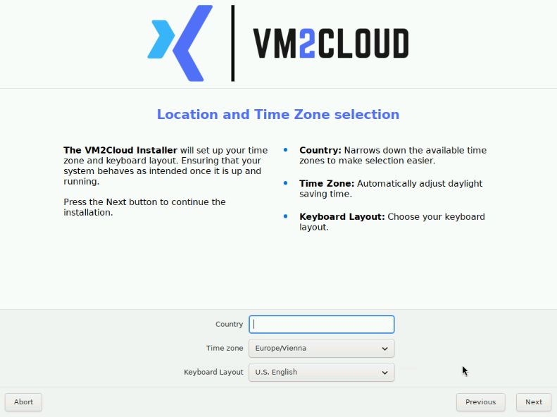
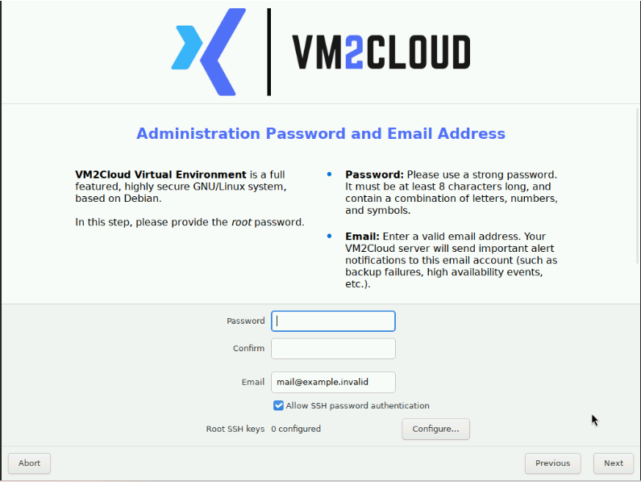

# Configure Location and Administrator Access

---

## Overview

Two installer screens follow the storage selection: regional settings, and the root password with the operational notification address.

Both are short, and both matter more than they look. The time zone affects logs, scheduled tasks, certificate validation, and cluster troubleshooting for the life of the node. The root password becomes the credential for console access and for the first web login.

| | |
|---|---|
| **Software version** | VM2Cloud VE 9.2, ISO build v10 |
| **Estimated time** | 3–5 minutes |

---

## When to Use

Follow this page after [Configure Installation Storage](Configure-Installation-Storage.md), when the installer presents the Location and Time Zone screen.

---

## Prerequisites

* The physical location of the server.
* A strong, unique root password, and somewhere to record it — a shared password manager, not a personal note.
* A monitored operational email address.
* Your organisation's policy on SSH password authentication.
* Any approved root SSH public keys, if key-based access is required.

---

# Procedure

## Step 1: Select Regional Settings

1. Enter the physical server's **Country**.
2. Select the matching **Time zone**.
3. Select the administrator's **Keyboard Layout**.
4. Click **Next**.

**Location and Time Zone**

*Figure 1. Country, time zone, and keyboard layout are selected for the server location and administrator keyboard.*

The keyboard layout matters immediately — you are about to type a password at a console using it. A layout mismatch is a common reason a correct password appears to be rejected later.

Correct time-zone selection matters for logs, scheduled tasks, certificate validation, and cluster troubleshooting. In a cluster, nodes must agree on time. See [Time and NTP](../03-Nodes/System/Time-and-NTP.md).

**Expected result:** The installer displays the Administration Password and Email Address screen.

---

## Step 2: Set the Root Password and Notification Email

1. Enter a strong, unique password in **Password**.
2. Enter the same password in **Confirm**.
3. Replace the example address with a monitored operational address in **Email**.
4. Keep **Allow SSH password authentication** enabled only when your access policy permits root password login.
5. When key-based root access is required, click **Configure** beside **Root SSH keys** and add the approved public keys.
6. Click **Next**.

**Administration Password and Email**

*Figure 2. The installer collects the root password, confirmation, operational email, and SSH-access preferences.*

> **Warning:** Never place real passwords or private SSH keys in documentation, tickets, screenshots, or source control.

**Expected result:** The installer displays Management Network Configuration.

---

# Configuration / Options

| Field | Description |
|---|---|
| **Country** | The server's physical location. Sets sensible regional defaults. |
| **Time zone** | Applied to logs, schedules, and certificate validation. |
| **Keyboard Layout** | The layout used at the console. Affects password entry immediately. |
| **Password** / **Confirm** | The root password. Used for console login and the first web login as `root@pam`. |
| **Email** | Operational notification address. Should be monitored, and ideally a shared mailbox. |
| **Allow SSH password authentication** | Whether root may log in over SSH with a password. Disable where policy requires key-based access. |
| **Root SSH keys** | Public keys authorised for root SSH access. |

---

## About the Root Password

This password becomes the `root@pam` account — the same credential for the console and for the web interface. See [Authentication Realms](../02-Datacenter/Permissions/Authentication-Realms.md).

Three things worth deciding now rather than later:

**Record it somewhere the team can reach.** A root password known only to one person becomes a console-recovery problem the moment they are unavailable. See [Reset Root Password](../03-Nodes/Reset-Root-Password.md).

**Plan to create individual accounts.** Shared root logins make it impossible to tell who did what. Create per-person accounts as soon as the node is running — see [Users](../02-Datacenter/Permissions/Users.md).

**Use a monitored email address.** This address receives operational notifications including backup failures. A personal address, or one nobody reads, means silent failure later. Prefer a shared mailbox or distribution list.

---

# Verification

Verify the following before continuing:

* Country, time zone, and keyboard layout match the deployment location.
* The time zone is correct for the server's physical site, not for your own location.
* The password was typed identically twice, using the selected keyboard layout.
* The password is recorded in your password manager.
* The email address is valid and monitored.
* The SSH-access choice matches security policy.

---

# Common Issues

| Issue | Resolution |
|-------|------------|
| Password rejected at first console login | Usually a keyboard-layout mismatch between the installer and the console. Check for special characters that move between layouts. |
| Time zone wrong after installation | It can be corrected. See [Time and NTP](../03-Nodes/System/Time-and-NTP.md). |
| Cluster time problems later | Nodes must agree on time. Configure NTP after installation. |
| No notification emails arrive | The address may be wrong, unmonitored, or the node cannot send mail. See [Notifications](../02-Datacenter/Notifications.md). |
| Nobody knows the root password | See [Reset Root Password](../03-Nodes/Reset-Root-Password.md). Requires console access and a reboot. |
| SSH root login refused after installation | **Allow SSH password authentication** was disabled. Use a key, or change the setting on the running node. |

---

# Best Practices

- Set the time zone to the **server's** physical location, not yours.
- Confirm the keyboard layout matches the one you will use at the console.
- Record the root password in a shared password manager immediately, before continuing the installation.
- Use a shared mailbox for the notification address, never an individual's.
- Prefer SSH keys over password authentication for root.
- Create individual administrator accounts as soon as the node is running, and stop using root for routine work.
- Plan for at least two administrator accounts so a lost password is never a crisis.

---

# Related Documentation

- [Configure Installation Storage](Configure-Installation-Storage.md)
- [Configure the Management Network](Configure-Management-Network.md)
- [Installation Overview](README.md)
- [Time and NTP](../03-Nodes/System/Time-and-NTP.md)
- [Users](../02-Datacenter/Permissions/Users.md)
- [Authentication Realms](../02-Datacenter/Permissions/Authentication-Realms.md)
- [Reset Root Password](../03-Nodes/Reset-Root-Password.md)
- [Notifications](../02-Datacenter/Notifications.md)

---

# Change History

| Date | Change |
|---|---|
| 22 July 2026 | Initial version, verified through first dashboard login. |
| 13 August 2026 | Converted to Markdown and split into its own page. |

---

# Summary

These two installer screens set the server's regional settings and its root credentials. Both have effects that outlast the installation: the time zone governs logs, schedules, and certificate validation, while the root password becomes the `root@pam` account used for both console and web access.

Set the time zone to the server's location rather than your own, confirm the keyboard layout matches what you will type at the console, and record the root password somewhere the whole team can reach before moving on. Use a monitored shared mailbox for the notification address — it is where backup failures will be reported.
