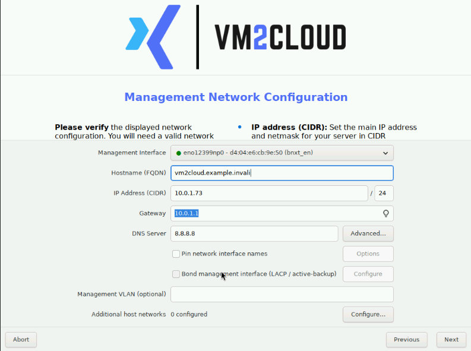
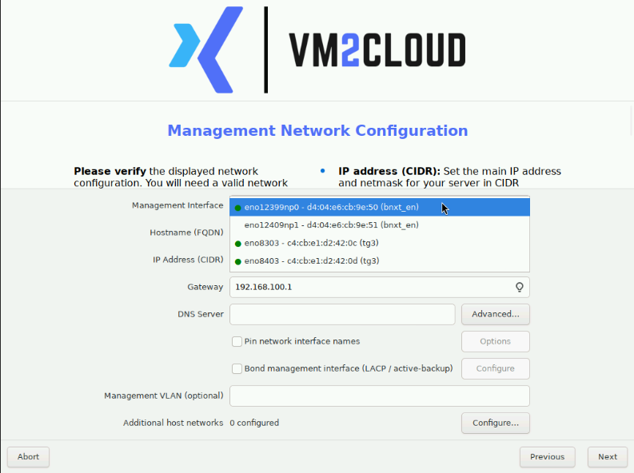
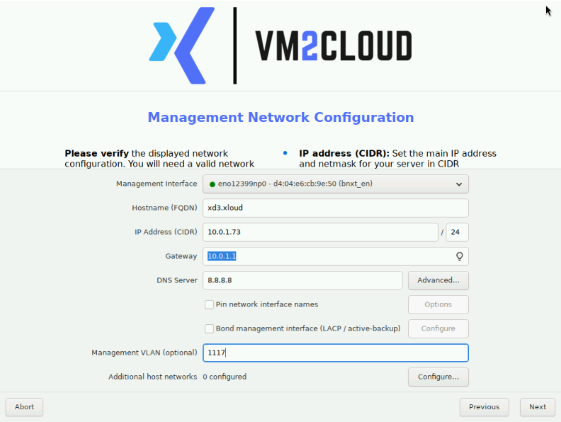
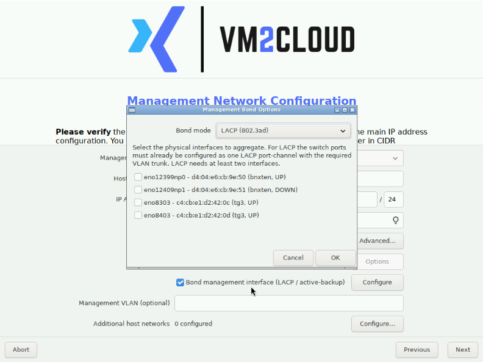
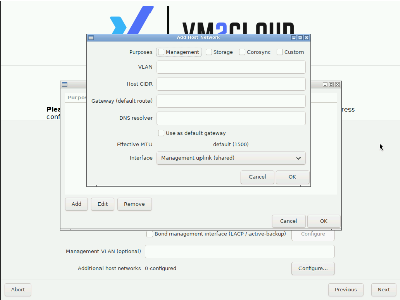

# Configure the Management Network

---

## Overview

The management network screen sets how the node will be reached after installation — which physical interface carries management traffic, its hostname, and its static addressing.

This is the screen where a mistake costs the most. Get the addressing, VLAN, or bond wrong and the server finishes installing perfectly and is then unreachable, requiring console access to diagnose.

| | |
|---|---|
| **Software version** | VM2Cloud VE 9.2, ISO build v10 |
| **Estimated time** | 5–15 minutes depending on options used |

> **Note:** Interface names, MAC addresses, IP addresses, VLANs, and hostnames in the screenshots are examples from one server. Use the values assigned to the server being installed.

---

## When to Use

Follow this page after [Configure Location and Administrator Access](Configure-Location-and-Administrator.md).

---

## Prerequisites

* A unique fully qualified hostname for this node.
* A static management IP address with its CIDR prefix, gateway, and DNS resolver.
* The management VLAN ID, if the network is tagged.
* For a bond: at least two connected interfaces, and matching switch-side configuration.
* For additional networks: their purpose, VLAN, host CIDR, routing, DNS, and interface assignments.

---

## Which Path to Follow

| Requirement | Path |
|---|---|
| One management interface | Management Interface → hostname → IP/CIDR → gateway → DNS |
| Change the detected interface | Open **Management Interface** and select the connected NIC |
| Tag the management network | Complete addressing, then set **Management VLAN** |
| Bond management interfaces | **Bond management interface** → **Configure** → mode → members |
| Add storage, Corosync, or custom networks | **Additional host networks** → **Configure** → **Add** |

---

# Procedure

## Step 1: Configure One Management Interface

1. Verify **Management Interface** is the physical NIC connected to the management network.
2. Enter the node's unique fully qualified domain name in **Hostname (FQDN)**.
3. Enter the assigned static address in **IP Address (CIDR)**, including its prefix length.
4. Enter the management-network default router in **Gateway**.
5. Enter a reachable resolver in **DNS Server**.
6. When no VLAN, bond, or additional network is required, verify all values and click **Next**.

**Management Network Configuration**

*Figure 1. Basic management-network fields. Interface names and addresses shown are server-specific examples.*

**Expected result:** The management interface has a unique hostname and static configuration reachable from the administration network.

If nothing else is needed here, continue with [Complete the Installation](Complete-Installation.md).

---

# Optional: Change the Management Interface

Open **Management Interface**. Match the intended NIC by interface name and MAC address, verify its link indicator, and select it.

**Interface Selector**

*Figure 2. The Management Interface list identifies each detected NIC by name, MAC address, driver, and connection state.*

A green indicator identifies a detected active link. Investigate a disconnected or down interface before assigning management traffic to it — a NIC showing DOWN here will be unreachable after installation.

**Expected result:** Management Interface displays the physical NIC connected to the intended network.

---

# Optional: Attach a Management VLAN

Enter the assigned VLAN ID in **Management VLAN (optional)**. Use the IP/CIDR, gateway, and DNS values that belong to that VLAN.

**Management VLAN**

*Figure 3. A management VLAN is entered after the hostname and static addressing are configured.*

Before continuing:

* Confirm the connected switch port permits the same tagged VLAN.
* Do **not** enter a VLAN when the switch presents management traffic untagged.
* Confirm the management IP belongs to that VLAN's subnet.

**Expected result:** Management traffic is tagged with the configured VLAN after installation.

---

# Optional: Create a Management Bond

1. Enable **Bond management interface (LACP / active-backup)**.
2. Click **Configure**.
3. Select the required **Bond mode**.
4. Select at least two intended physical member interfaces.
5. Verify the member MAC addresses and link states.
6. Click **OK**.

**Bond Options**

*Figure 4. Management Bond Options selects a bonding mode and physical member interfaces.*

| Mode | Use | Network requirement |
|---|---|---|
| **LACP (802.3ad)** | Link aggregation and redundancy. | The connected switch ports must already belong to one matching LACP port channel and permit the required VLANs. |
| **active-backup** | Failover without aggregation. | Both links must reach the same network. No switch-side LACP needed. |

> **Warning:** Incorrect LACP or switch VLAN configuration makes the management interface unreachable immediately after installation. LACP requires the switch side to be configured **before** you install. If you are not certain the port channel exists and is correct, use **active-backup** — it needs nothing from the switch.

---

# Optional: Add Another Host Network

1. Beside **Additional host networks**, click **Configure**.
2. Click **Add**.
3. Select the applicable **Purposes**: Management, Storage, Corosync, or Custom.
4. Enter the **VLAN** when the network uses tagged traffic.
5. Enter this node's address and prefix in **Host CIDR**.
6. Enter **Gateway (default route)** and **DNS resolver** only when that network design requires them.
7. Enable **Use as default gateway** only when this network must provide the node's default route.
8. Review **Effective MTU** and select the intended **Interface**.
9. Click **OK**, review the entry, and click **OK** again.

**Add Host Network**

*Figure 5. Add Host Network creates an additional Management, Storage, Corosync, or Custom network.*

> **Warning:** A node normally has exactly one default route. Do not enable a second default gateway unless the routing design explicitly requires it — two default routes produce intermittent, hard-to-diagnose connectivity failures.

A separate **Corosync** network is worth configuring here for clustered deployments. Cluster communication is latency-sensitive, and keeping it off the general management network improves stability. See [Quorum](../02-Datacenter/Cluster/Quorum.md).

**Expected result:** Additional host networks reports the configured count, and the entry shows the intended purpose, addressing, VLAN, and interface.

---

# Configuration / Options

| Field | Description |
|---|---|
| **Management Interface** | The physical NIC carrying management traffic. |
| **Hostname (FQDN)** | The node's unique fully qualified name. Must be unique across the cluster. |
| **IP Address (CIDR)** | Static address **with** prefix length. |
| **Gateway** | Default router for the management network. |
| **DNS Server** | Resolver reachable from this node. |
| **Management VLAN** | VLAN ID when management traffic is tagged. Leave empty for untagged. |
| **Bond management interface** | Combines interfaces for redundancy or aggregation. |
| **Additional host networks** | Extra networks for storage, Corosync, or custom purposes. |

---

# Verification

Before clicking **Next**, verify:

* The management interface is the NIC that is physically connected, with an active link.
* The hostname is unique and fully qualified.
* The IP address is unique and includes the correct prefix.
* The IP belongs to the subnet implied by the gateway and, if used, the VLAN.
* The gateway is reachable on that subnet.
* The DNS resolver is reachable.
* For a VLAN, the switch port permits that tag.
* For LACP, the switch port channel already exists and matches.
* Only one default gateway is configured.

Check the switch side before continuing. Everything on this screen is trivially fixable now and requires console access afterwards.

---

# Common Issues

| Issue | Resolution |
|-------|------------|
| The intended interface shows DOWN | Missing cable, disabled switch port, wrong transceiver, or incomplete link configuration. Verify physical connectivity before continuing. |
| LACP networking unreachable after installation | Server bond members and switch LACP members, VLANs, or port-channel settings do not match. Compare NIC MAC addresses against the switch ports. |
| Node unreachable, everything looks correct | Check whether the switch presents the management VLAN tagged or untagged. A VLAN entered when the switch sends untagged traffic makes the node unreachable. |
| Web interface does not open on port 8006 | Verify the console-displayed URL, management NIC, VLAN, gateway, and the network path from your workstation. |
| Intermittent connectivity | Often two default gateways. A node should have one. |
| Cluster unstable later | Cluster communication may be sharing a congested management network. Consider a dedicated Corosync network. |

---

# Best Practices

- **Verify the switch side before you install.** Every failure on this screen is a five-minute fix now and a console session later.
- Use **active-backup** rather than LACP unless the switch port channel is already confirmed correct.
- Enter the IP address with its prefix, always.
- Confirm whether the switch presents management traffic tagged or untagged before entering a VLAN.
- Configure exactly one default gateway.
- Add a dedicated Corosync network for clustered deployments.
- Record the hostname, IP, VLAN, and interface in [Node Notes](../03-Nodes/Node-Notes.md) once the node is running.
- Keep BMC console access available — it is how you recover from a mistake here.

---

# Related Documentation

- [Configure Location and Administrator Access](Configure-Location-and-Administrator.md)
- [Complete the Installation](Complete-Installation.md)
- [Installation Overview](README.md)
- [Network Overview](../03-Nodes/System/Network/Network-Overview.md)
- [Manage Linux Bridge](../03-Nodes/System/Network/Manage-Linux-Bridge.md)
- [Manage Bond](../03-Nodes/System/Network/Manage-Bond.md)
- [Manage VLAN](../03-Nodes/System/Network/Manage-VLAN.md)
- [Network Troubleshooting](../03-Nodes/System/Network/Network-Troubleshooting.md)
- [Quorum](../02-Datacenter/Cluster/Quorum.md)

---

# Change History

| Date | Change |
|---|---|
| 22 July 2026 | Initial version, verified through first dashboard login. |
| 13 August 2026 | Converted to Markdown and split into its own page. |

---

# Summary

The management network screen decides how the node is reached after installation: which NIC carries management traffic, the node's hostname, and its static addressing, plus optional VLAN tagging, bonding, and additional networks.

It is the screen with the highest cost of error, because a wrong value produces a server that installs perfectly and cannot be reached. Verify the switch side first — particularly whether the management VLAN is tagged or untagged, and whether an LACP port channel actually exists. If the switch configuration is uncertain, choose **active-backup** over LACP; it requires nothing from the switch and still provides failover.
