# Mount the Installation ISO

---

## Overview

This page covers mounting the VM2Cloud VE installation ISO on a physical server through the BMC remote console, restarting the server, and booting the graphical installer.

**Virtual Media** presents an ISO stored on your own computer to the physical server as though a bootable CD/DVD were inserted locally. The one-shot boot menu then starts from that temporary device without permanently changing the server's normal boot order.

Skip this and the server simply boots its existing operating system — the installer never starts.

| | |
|---|---|
| **Software version** | VM2Cloud VE 9.2, ISO build v10 |
| **Environment** | Physical server with a browser-based BMC remote console |
| **Estimated time** | 10–15 minutes |
| **Service impact** | Server restart required |

> **Note:** Button placement and colours differ between BMC implementations. This procedure is vendor-neutral — follow the named controls: **Virtual Media**, **Map CD/DVD**, **Console Controls**, and **Boot Manager**.

---

## When to Use

Follow this procedure when:

* Installing VM2Cloud VE on a physical server for the first time.
* Rebuilding a server after a failure.
* Re-installing a node before [re-adding it to a cluster](../02-Datacenter/Cluster/Re-Add-Removed-Node.md).

---

## Prerequisites

Before starting, ensure that:

* You have authorized access to the server's BMC web interface.
* You have permission to launch the remote console, connect Virtual Media, and restart the server.
* The file `vm2cloud-ve-9.2-amd64-v10.iso` is available on your computer.
* The network connection between your computer and the BMC is stable.
* An approved maintenance window is in place.

> **Warning:** Restarting the server stops its running operating system and every service on it. Confirm the maintenance window before continuing.

---

# Procedure

## Step 1: Open the Virtual Media Window

From the remote console toolbar, click **Virtual Media**. Confirm the page states **Virtual Media is connected**.

The Virtual Media connection is what allows the BMC to expose a file from your computer as a virtual device to the server.

**Virtual Media Window Before Mapping**

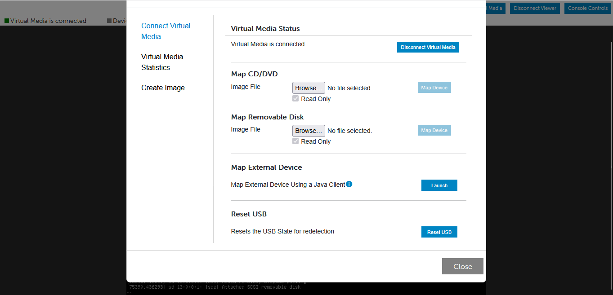

*Figure 1. Virtual Media is connected and the Map CD/DVD image field is empty.*

**Expected result:** The window displays **Map CD/DVD** with an **Image File** field, a **Browse** button, a **Read Only** option, and a **Map Device** button.

---

## Step 2: Select and Map the ISO

1. Under **Map CD/DVD**, click **Browse**.
2. Select `vm2cloud-ve-9.2-amd64-v10.iso`.
3. Keep **Read Only** selected.
4. Click **Map Device**.

Use **Map CD/DVD**, not **Map Removable Disk** — this is the most common mistake at this step. Read-only mode prevents the server from attempting to modify the installation image.

**ISO Selected for Mapping**

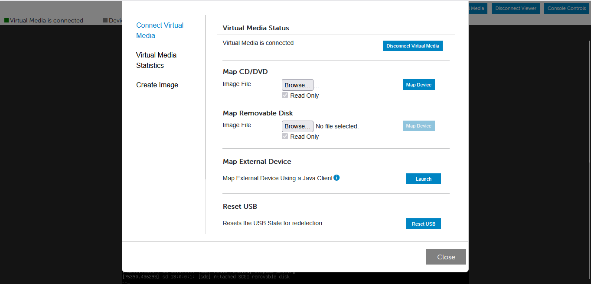

*Figure 2. The installation image has been selected and Map Device is available.*

**Expected result:** The console reports **Devices Mapped: 1** and states the ISO is mapped to the CD/DVD drive in read-only mode.

---

## Step 3: Verify the Virtual Optical Device

Close the Virtual Media window and inspect the status line at the top of the remote console.

**ISO Mapped**

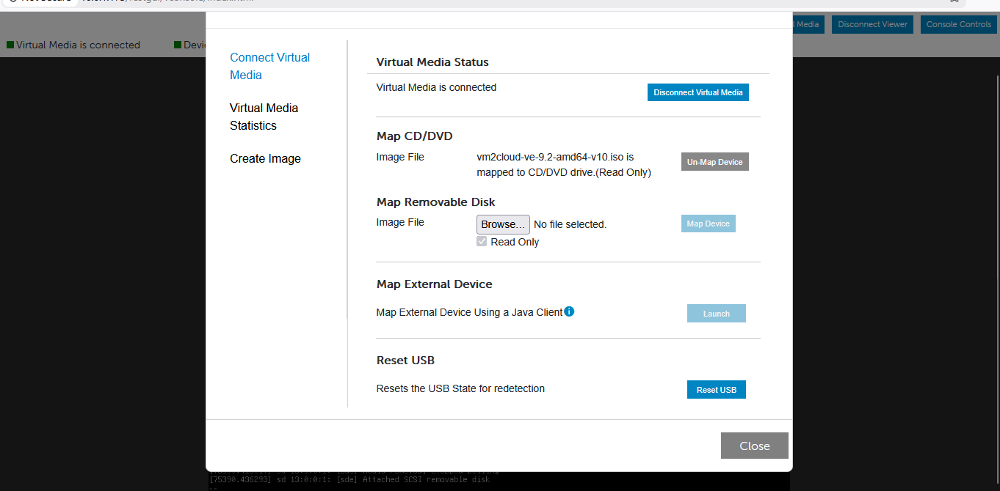

*Figure 3. The ISO is mapped to the virtual CD/DVD drive.*

**Console Status Confirmation**

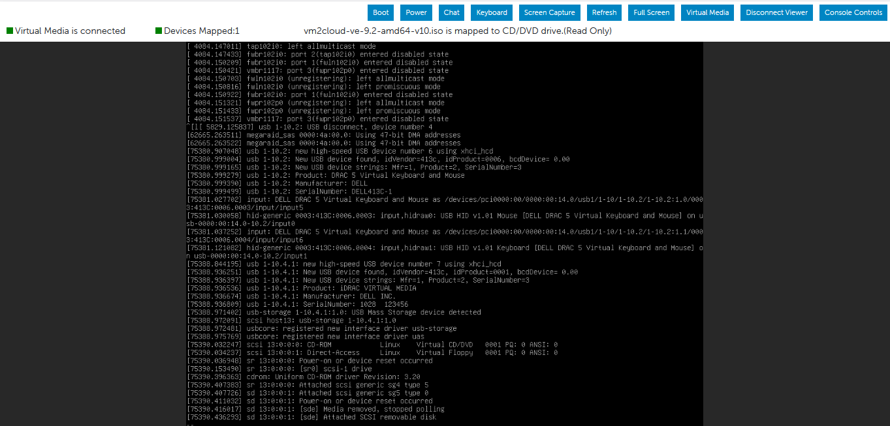

*Figure 4. The console confirms one mapped device and identifies the ISO as a read-only CD/DVD.*

**Expected result:** The console shows **Virtual Media is connected**, **Devices Mapped: 1**, and `vm2cloud-ve-9.2-amd64-v10.iso is mapped to CD/DVD drive (Read Only)`.

> **Warning:** Do not continue while the mapped-device count is zero. Reopen Virtual Media and map the ISO again. Restarting before the device is mapped boots the existing operating system instead.

---

## Step 4: Restart the Server

1. Click **Console Controls**.
2. Under **General**, select **Ctrl-Alt-Del** from **Keyboard Macros**.
3. Click the adjacent **Apply** button.

The BMC sends the key sequence to the server, and the running operating system begins a controlled restart.

**Console Controls**

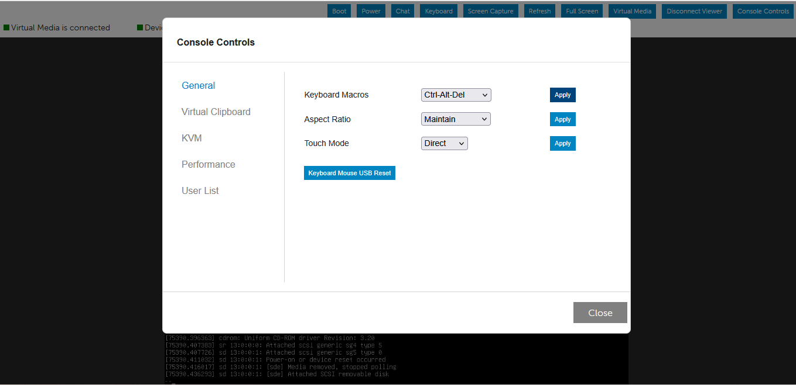

*Figure 5. Console Controls configured to send the Ctrl-Alt-Del keyboard macro.*

**Expected result:** The console displays service shutdown messages followed by the server startup sequence.

---

## Step 5: Open Boot Manager with F11

Watch the console during startup. When the firmware prompt appears, press `F11` to open **Boot Manager**.

The timing window is brief. **Click inside the remote console before pressing `F11`**, so the keystroke reaches the server rather than your browser.

**Shutdown Beginning**

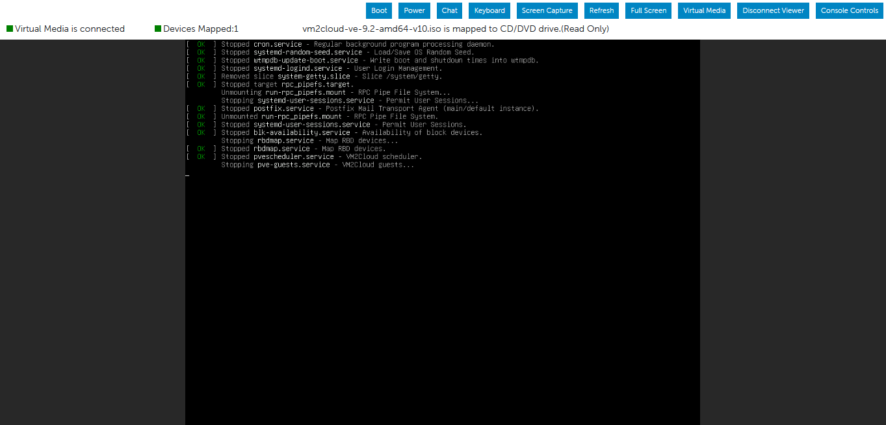

*Figure 6. The existing operating system begins stopping services.*

**Shutdown Continuing**

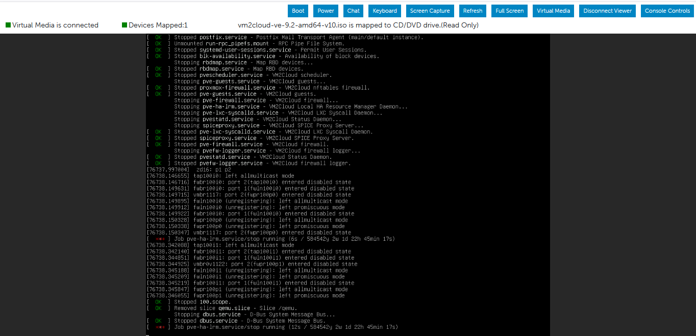

*Figure 7. Services continue stopping. Wait for the firmware startup screen.*

**Expected result:** The **Boot Manager Main Menu** appears.

---

## Step 6: Open the One-Shot UEFI Boot Menu

Select **One-shot UEFI Boot Menu**.

A one-shot selection applies only to this startup. It does not change the server's persistent boot order.

**Boot Manager**

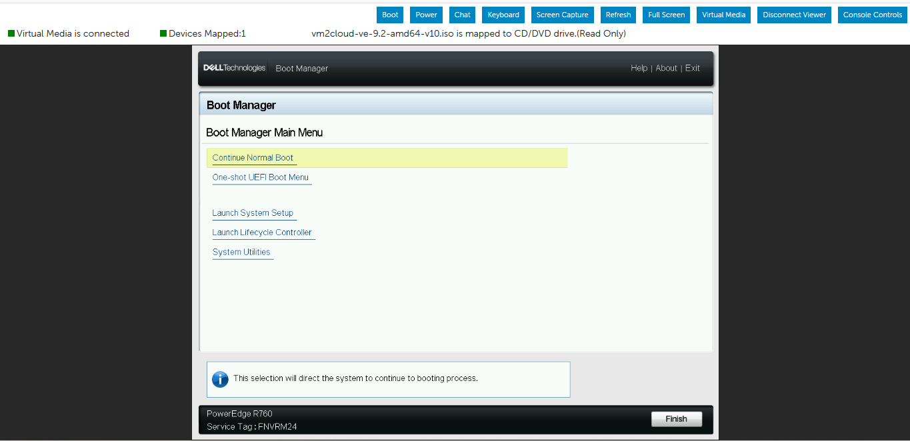

*Figure 8. Boot Manager opens after the F11 keystroke. The initial selection may remain on Continue Normal Boot.*

**One-Shot Menu Selected**

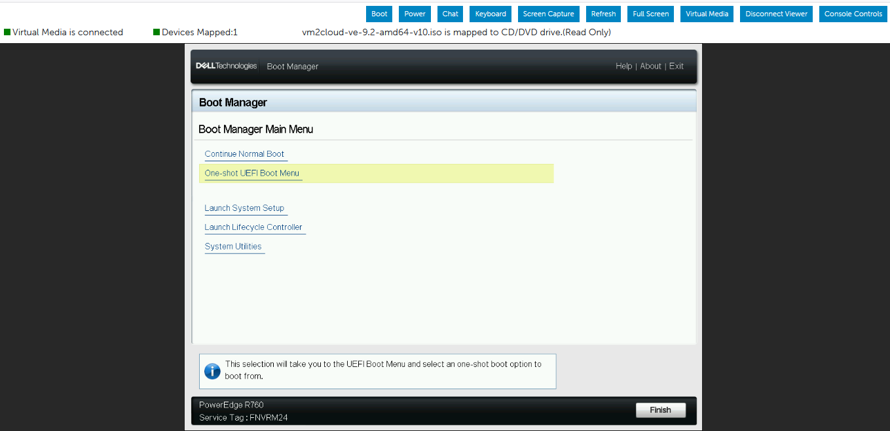

*Figure 9. One-shot UEFI Boot Menu selected, opening the temporary boot-device list.*

**Expected result:** Boot Manager displays the available UEFI boot devices.

---

## Step 7: Boot from the Virtual Optical Drive

Select **Virtual Optical Drive**.

This device is the mapped ISO. Do not select an existing operating system, a RAID volume, a network boot option, or a virtual floppy device.

**Virtual Optical Drive Selected**

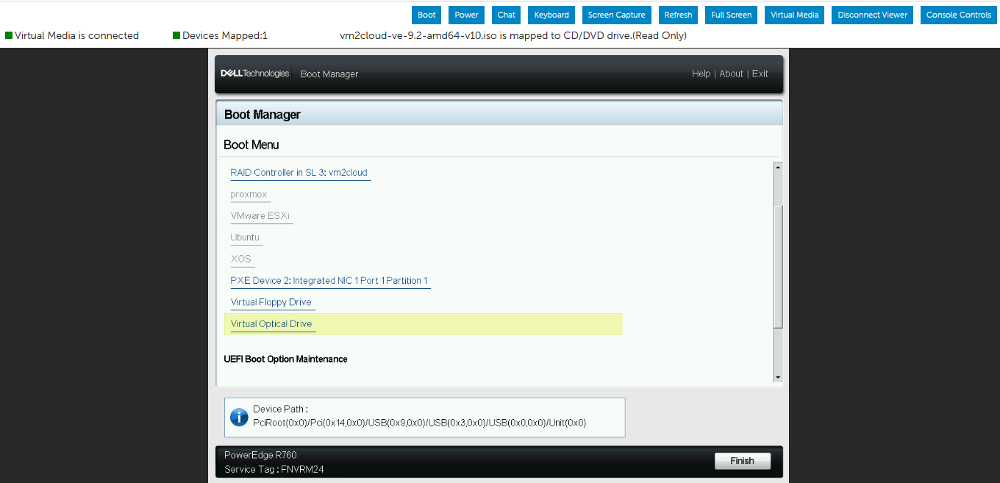

*Figure 10. One-time UEFI boot-device list with Virtual Optical Drive selected.*

**Expected result:** The server reads the mapped ISO and displays the VM2Cloud VE installer menu.

---

## Step 8: Start the Graphical Installer

Use the arrow keys to highlight **Install VM2Cloud VE (Graphical)**, then press `Enter`.

The graphical option starts the standard interactive installer. The Terminal UI and Serial Console options exist for environments that cannot use a graphical console.

**Installer Boot Menu**

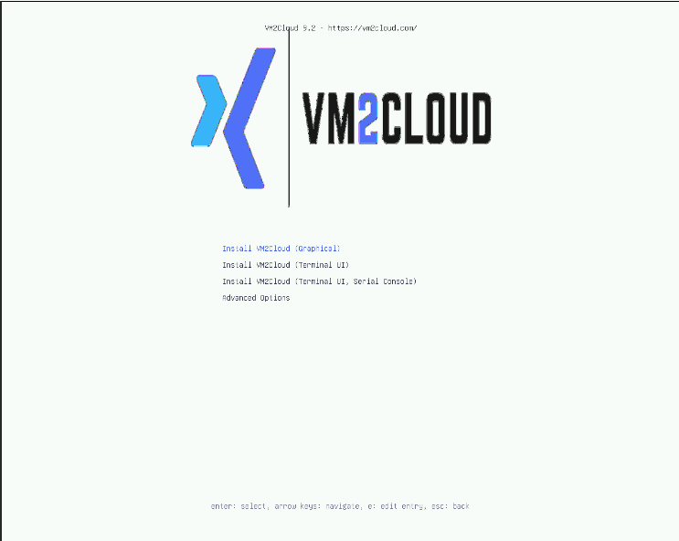

*Figure 11. VM2Cloud VE installer boot menu.*

**Expected result:** The graphical installation wizard begins loading.

Continue with [Configure Installation Storage](Configure-Installation-Storage.md).

---

# Verification

Verify the following:

1. The console status shows **Devices Mapped: 1**.
2. The mapped filename is `vm2cloud-ve-9.2-amd64-v10.iso`.
3. Boot Manager lists and accepts **Virtual Optical Drive**.
4. The installer menu displays **Install VM2Cloud VE (Graphical)**.
5. Pressing `Enter` starts the graphical installation wizard.

The objective is complete only once the graphical wizard starts. Reaching Boot Manager alone is not sufficient.

---

# Common Issues

| Issue | Resolution |
|-------|------------|
| **Map Device** is unavailable | No image file is selected. Click **Browse** under **Map CD/DVD** and select the ISO. |
| **Virtual Optical Drive** does not appear | Virtual Media disconnected, the ISO was not mapped, or the BMC did not present the device at startup. Reconnect, remap, confirm **Devices Mapped: 1**, and restart. |
| The existing operating system starts | The `F11` prompt was missed, or a normal boot entry was selected. Restart and press `F11` during firmware startup. |
| The graphical installer does not load | The ISO transfer was interrupted, the image is damaged, or graphical console compatibility is unavailable. Remap a verified copy and retry. |
| Used **Map Removable Disk** by mistake | Unmap it and use **Map CD/DVD** instead. |
| Restarted before mapping | Verify **Devices Mapped: 1** before sending Ctrl-Alt-Del. |
| BMC connection unstable | Reconnect and confirm Virtual Media is still mapped before restarting. |

---

# Recovery

If installation must be postponed:

1. Do not change the persistent boot order.
2. Allow the server to boot its existing operating system.
3. Open **Virtual Media** and click **Un-Map Device**.
4. Confirm the mapped-device count returns to zero.

For support escalation, capture the BMC event log, the exact boot-screen error, the ISO filename, and the time of the failed attempt.

---

# Best Practices

- Confirm **Devices Mapped: 1** before restarting. Almost every failed attempt at this stage skipped that check.
- Click inside the remote console before pressing `F11`, so the keystroke reaches the server.
- Use a wired, stable connection to the BMC. An interrupted transfer produces a damaged image and a failed boot.
- Keep **Read Only** enabled when mapping.
- Use the one-shot boot menu rather than changing the persistent boot order — the server then boots normally after installation without further intervention.
- Unmap the ISO once installation completes.

---

# Related Documentation

- [Installation Overview](README.md)
- [Configure Installation Storage](Configure-Installation-Storage.md)
- [Verify Installation](Verify-Installation.md)
- [Logging In](../01-Getting-Started/Logging-In.md)
- [Re-Add a Removed Node](../02-Datacenter/Cluster/Re-Add-Removed-Node.md)

---

# Change History

| Date | Change |
|---|---|
| 22 July 2026 | Initial version, verified against supplied screenshots. |
| 13 August 2026 | Converted to Markdown and moved into the documentation set. |

---

# Summary

Mounting the installation ISO uses the server's BMC Virtual Media to present the image as a virtual CD/DVD, then a one-shot UEFI boot to start from it without altering the persistent boot order.

Two checks prevent most failures at this stage: confirm **Devices Mapped: 1** before restarting, and click inside the remote console before pressing `F11` so the keystroke reaches the server. The step is complete only when the graphical installer is loading — reaching Boot Manager is not enough.
