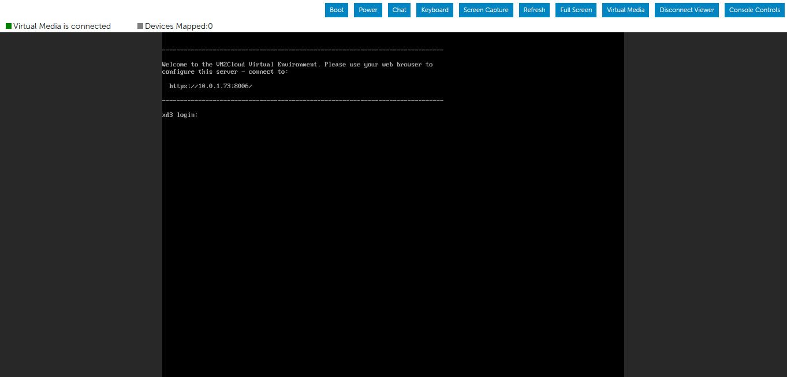
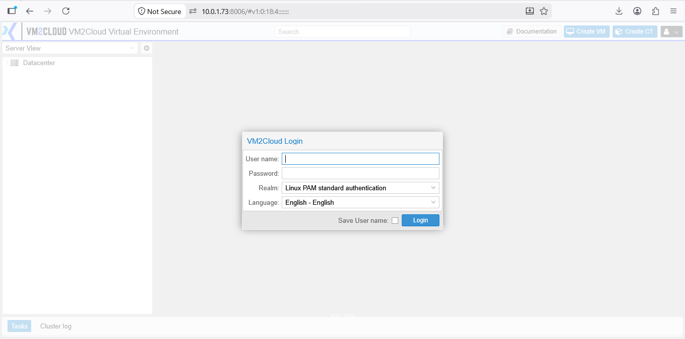
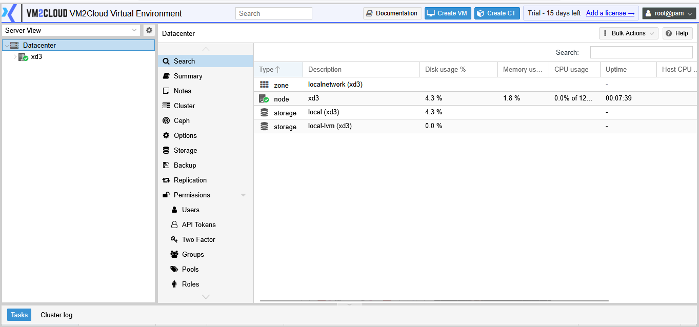

# Verify the Installation

---

## Overview

Installation is not finished when the installer says it is. It is finished when the node boots from its own storage, accepts credentials at the console, serves the web interface on its management address, and shows a healthy dashboard.

This page covers those four checks, and the full end-to-end verification list for the whole installation.

| | |
|---|---|
| **Software version** | VM2Cloud VE 9.2, ISO build v10 |
| **Estimated time** | 5–10 minutes |

---

## When to Use

Follow this page after [Complete the Installation](Complete-Installation.md), once the server has rebooted.

---

## Prerequisites

* The server has rebooted from its installed storage.
* The installation ISO is unmapped.
* The root password created during installation.
* An administration workstation that can reach the management network.

---

# Procedure

## Step 1: Verify First Boot and Console Login

At the console login prompt, enter:

| Field | Value |
|---|---|
| **User name** | `root` |
| **Password** | The root password created during installation |

Press `Enter` after the user name, type the password, and press `Enter` again. Linux does not display characters or placeholders while a password is typed — the absence of feedback is normal.

**First Boot Console**

*Figure 1. The installed system has booted, Virtual Media reports zero mapped devices, and the console displays the management URL and node login prompt.*

Note the **management URL** shown on this screen. It is the address to use in the next step.

> **Warning:** Never place the actual root password in documentation, screenshots, source control, or support messages.

**Expected result:** Authentication succeeds and the root shell prompt appears.

---

## Step 2: Open the Web Interface

1. From a workstation that can reach the management network, open the URL shown by the console — for example `https://10.0.1.73:8006/`.
2. If the browser reports the certificate is not trusted, follow your organisation's approved certificate-warning procedure. This is expected on a new installation.
3. Enter `root` in **User name**.
4. Enter the root password created during installation.
5. Keep **Realm** set to **Linux PAM standard authentication**.
6. Select the required interface language.
7. Optionally enable **Save User name** on a trusted workstation.
8. Click **Login**.

**Web Login**

*Figure 2. The web login is available through the management address on HTTPS port 8006.*

The realm matters. The root account is a Linux account, so it authenticates through **Linux PAM** — selecting a different realm fails even with the correct password. See [Logging In](../01-Getting-Started/Logging-In.md).

**Expected result:** The node authenticates `root@pam` and opens the management dashboard.

---

## Step 3: Verify the Dashboard

1. Confirm the upper-right identity shows `root@pam`.
2. Expand **Datacenter** and confirm the installed node appears.
3. Confirm the node status indicator is active.
4. Confirm the expected local network and local storage entries appear beneath the node.
5. Review the Summary panel for disk usage, memory usage, CPU usage, and uptime.

**Management Dashboard**

*Figure 3. Successful first login displays the Datacenter dashboard, the installed node, its local resources, and the authenticated identity `root@pam`.*

**Installation is verified** once the node is installed, booted from local storage, reachable at its management address, and accepting the credentials created during installation.

---

# Full Installation Verification Checklist

Work through this once, end to end:

1. Every selected installation disk was correct by device name, capacity, and model.
2. The storage layout has enough disks and the intended redundancy.
3. Country, time zone, and keyboard layout match the deployment location.
4. The operational email is valid, and the SSH-access choice matches security policy.
5. The hostname is unique and fully qualified.
6. The management IP is unique and belongs to the stated CIDR.
7. Gateway, DNS, VLAN, bond, and additional-network settings match the network plan.
8. For LACP, the switch configuration matched before installation.
9. Every Summary value was confirmed, including the final physical uplink.
10. Automatic reboot was enabled and installation completed without error.
11. The system rebooted and Virtual Media reports **Devices Mapped: 0**.
12. Console authentication works with `root` and the installer-defined password.
13. Web login works with `root` and the **Linux PAM** realm.
14. The dashboard shows the installed node and the identity `root@pam`.

---

# What to Do Next

The node is installed but not yet ready for production. In roughly this order:

1. **Configure repositories and apply updates.** See [Repositories](../03-Nodes/Updates/Repositories.md) and [Update Node](../03-Nodes/Updates/Update-Node.md).
2. **Set up time synchronization.** See [Time and NTP](../03-Nodes/System/Time-and-NTP.md).
3. **Create individual administrator accounts** and stop using root for routine work. See [Users](../02-Datacenter/Permissions/Users.md).
4. **Enable two-factor authentication** on administrator accounts. See [Two-Factor Authentication](../02-Datacenter/Permissions/Two-Factor-Authentication.md).
5. **Replace the self-signed certificate.** See [ACME Certificates](../02-Datacenter/ACME-Certificates.md).
6. **Configure storage.** See [Storage Overview](../02-Datacenter/Storage/Storage-Overview.md).
7. **Record the node's details** — location, hardware, out-of-band address. See [Node Notes](../03-Nodes/Node-Notes.md).
8. **Create a cluster, or join one**, if this node is not standalone. See [Create Cluster](../02-Datacenter/Cluster/Create-Cluster.md) and [Join Node to Cluster](../02-Datacenter/Cluster/Join-Node-to-Cluster.md).
9. **Configure backup jobs** before any workload matters. See [Backup Jobs Overview](../02-Datacenter/Backup/Backup-Jobs-Overview.md).

New to the interface? Start with the [Interface Tour](../01-Getting-Started/Interface-Tour.md).

---

# Common Issues

| Issue | Resolution |
|-------|------------|
| The installer starts again instead of the installed system | The ISO is still mapped. Unmap it, confirm **Devices Mapped: 0**, and reboot. |
| Console login rejected | Check the keyboard layout selected during installation — a layout mismatch changes special characters. Confirm Caps Lock. |
| The web interface does not open on port 8006 | Verify the URL shown on the console, the management NIC, VLAN, gateway, and the network path from your workstation. See [Configure the Management Network](Configure-Management-Network.md). |
| Certificate warning in the browser | Expected on a new installation. See [ACME Certificates](../02-Datacenter/ACME-Certificates.md). |
| Web login rejected with the correct password | The realm is wrong. Root uses **Linux PAM standard authentication**. |
| Dashboard opens but the node shows offline | Check the node's services and network configuration. See [Node Troubleshooting](../03-Nodes/Node-Troubleshooting.md). |
| Local storage missing from the tree | Confirm the storage layout was created as intended. See [Storage Overview](../02-Datacenter/Storage/Storage-Overview.md). |
| Cannot reach the node at all | Use the BMC console to confirm the address, then verify the switch port, VLAN, and cabling. |

---

# Best Practices

- Verify all four stages — boot, console login, web login, dashboard. Any one alone is insufficient evidence the installation succeeded.
- Note the management URL from the console rather than assuming the address.
- Unmap the ISO as soon as the installed system boots.
- Create individual accounts and stop using root before the node carries any workload.
- Configure backups before the first production guest, not after.
- Record the node's details in [Node Notes](../03-Nodes/Node-Notes.md) while the information is fresh.
- Keep BMC console access working — it is the recovery path for everything.

---

# Related Documentation

- [Complete the Installation](Complete-Installation.md)
- [Installation Overview](README.md)
- [Logging In](../01-Getting-Started/Logging-In.md)
- [Interface Tour](../01-Getting-Started/Interface-Tour.md)
- [Node Summary](../03-Nodes/Node-Summary.md)
- [Update Node](../03-Nodes/Updates/Update-Node.md)
- [Users](../02-Datacenter/Permissions/Users.md)
- [Create Cluster](../02-Datacenter/Cluster/Create-Cluster.md)
- [Backup Jobs Overview](../02-Datacenter/Backup/Backup-Jobs-Overview.md)
- [Node Troubleshooting](../03-Nodes/Node-Troubleshooting.md)

---

# Change History

| Date | Change |
|---|---|
| 22 July 2026 | Initial version, verified through first dashboard login. |
| 13 August 2026 | Converted to Markdown, split into its own page, and extended with post-installation next steps. |

---

# Summary

An installation is verified only when four things hold: the node boots from its own storage, the console accepts the root credentials, the web interface answers on port 8006 at the management address, and the dashboard shows the node with the identity `root@pam`.

If the installer reappears after reboot, the ISO is still mapped. If the console rejects a password you are certain of, check the keyboard layout chosen during installation. If the web login fails with the right password, check the realm — root authenticates through Linux PAM.

Once verified, the node is installed but not production-ready: apply updates, set up time synchronization, create individual accounts, and configure backups before it carries anything that matters.
