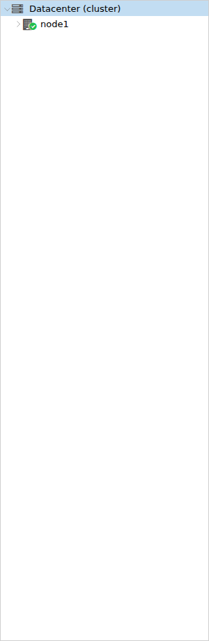
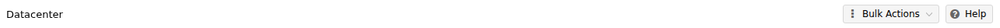

# Interface Tour

---

## Overview

The Dashboard is the primary interface of VM2Cloud VE. It provides a centralized view of the virtualization environment and serves as the starting point for managing clusters, nodes, storage, networking, virtual machines, containers, users, and system resources.

From the Dashboard, administrators can quickly navigate to different components, monitor system health, and perform day-to-day management tasks.

---

## When to Use

Use the Dashboard to:

* Navigate through the VM2Cloud VE environment.
* Access Datacenter, Nodes, Virtual Machines, and Containers.
* Monitor the overall infrastructure.
* View recent tasks and system status.
* Access configuration and management options.

---

## Prerequisites

Before accessing the Dashboard, ensure that:

* The VM2Cloud VE web interface is accessible.
* You have a valid user account.
* You have successfully logged in.

---

# Dashboard Layout

The Dashboard is divided into several sections that help administrators navigate and manage the environment efficiently.

---

## Navigation Panel

Located on the left side of the interface, the Navigation Panel displays the complete VM2Cloud VE resource tree.

From here, you can access:

* Datacenter
* Cluster Nodes
* Virtual Machines
* Containers
* Storage
* Network
* Backup
* Pools
* Other configured resources

Select a resource from the navigation panel to open its management page.

---

### Screenshot 1

**Navigation Panel**

Selecting an entry in the resource tree fills the middle column with that resource's menu.
The menu is contextual — a datacenter, a node, and a guest each show a different list.

The right-hand area shows whichever panel you selected. Everything you configure happens
here.
---

## Resource Tree

The Resource Tree displays the hierarchy of all configured resources within VM2Cloud VE.

Depending on your environment, the tree may include:

* Datacenter
* Cluster
* Nodes
* Virtual Machines
* Containers
* Storage Resources

The tree automatically expands as additional resources are added.

---

### Screenshot 2

**Resource Tree**

The tree is the left column: the datacenter at the top, then nodes, then the guests and
storage belonging to each. It expands as resources are added.

---

## Workspace

The Workspace occupies the main area of the Dashboard.

When a resource is selected from the Navigation Panel, its information and available management options are displayed here.

Examples include:

* Cluster information
* Node Summary
* Storage details
* Network configuration
* Virtual Machine management
* Container management

---

## Search

The Search box allows administrators to quickly locate resources within the VM2Cloud VE environment.

You can search for:

* Nodes
* Virtual Machines
* Containers
* Storage
* Other managed resources

Search results are displayed as you type.

---

### Screenshot 3

**Search Box**

The search box sits in the header and searches every resource in the cluster.

---

## Header Bar

The Header Bar provides quick access to commonly used functions.

Depending on your VM2Cloud VE deployment, it may include:

* Search
* Create VM
* Create Container
* Documentation
* User Menu
* Notifications
* Help

---

### Screenshot 4

**Header Bar**

The header carries the product name, the search box, **Documentation**, **Create VM**,
**Create CT**, the licence status, and the user menu.

---

## User Menu

The User Menu is located in the upper-right corner of the Dashboard.

From this menu, administrators can:

* View account information
* Change the password
* Configure user preferences
* Log out of VM2Cloud VE

The available options depend on the user's permissions.

---

### Screenshot 5

**User Menu**

The user menu holds **My Settings**, **Password**, **TFA**, **Language**, **Colour Theme**,
and **Logout**.

---

## Task Viewer

The Task Viewer displays background operations currently running or recently completed.

Examples include:

* Creating virtual machines
* Starting or stopping virtual machines
* Uploading ISO images
* Creating backups
* Storage operations
* Cluster operations

Task status helps administrators monitor the progress of management activities.

---

### Screenshot 6

**Task Viewer**

The bottom panel has two tabs: **Tasks**, listing operations, and **Cluster log**, listing
events. It stays visible whatever else you are doing.

---

# Verification

Verify the following:

* The Dashboard loads successfully after login.
* The Navigation Panel is visible.
* The Resource Tree displays the available resources.
* The Workspace updates when a resource is selected.
* The Search function is available.
* The Header Bar and User Menu are accessible.
* The Task Viewer displays recent or active tasks.

---

# Common Issues

| Issue                                           | Resolution                                                                                        |
| ----------------------------------------------- | ------------------------------------------------------------------------------------------------- |
| Dashboard does not load                         | Verify that the VM2Cloud VE management services are running and refresh the browser.                 |
| Resources are missing from the Navigation Panel | Confirm that the resources exist and that your user account has permission to view them.          |
| Search does not return results                  | Verify the resource name and refresh the Dashboard.                                               |
| Task Viewer is empty                            | If no management tasks have been performed recently, the Task Viewer may not display any entries. |
| Permission denied                               | Verify that your account has the required privileges to access the requested resources.           |

---

# Summary

The Dashboard is the central management interface of VM2Cloud VE. It provides quick access to all infrastructure resources, allows administrators to navigate the environment efficiently, and serves as the starting point for managing clusters, nodes, storage, networking, virtual machines, containers, and other platform components.
