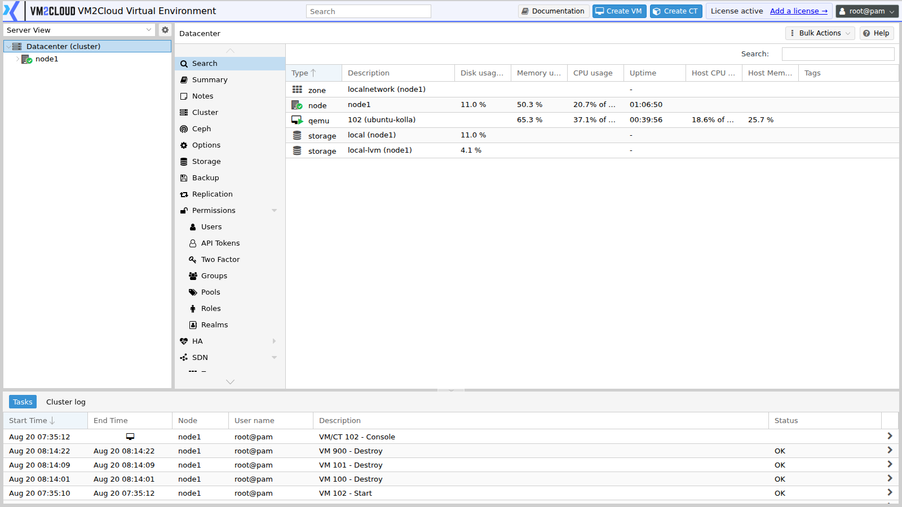

# Logging In

---

## Overview

The VM2Cloud VE web interface is reached over HTTPS on port **8006**.

```text
https://<node-address>:8006
```

Any node in a cluster can be used — each runs the full interface and shows the whole environment, so a node being down does not prevent managing the rest.

---

## When to Use

Read this when:

* Accessing a new installation for the first time.
* A certificate warning appears in the browser.
* Login fails and you need to identify why.
* You are unsure which realm to select.
* You need to reach the interface while a node is down.

---

## Prerequisites

* Network access to a node on TCP port 8006.
* A user account and its realm.
* A current browser with JavaScript enabled.

---

# Procedure

## Step 1: Open the Interface

Enter the address, including the port:

```text
https://192.168.1.10:8006
```

The port is required. Omitting it fails, because nothing serves the interface on the default HTTPS port.

Use `https`, not `http`.

---

### Screenshot 1

**Login Screen**



The login window asks for a user name, a password, a **Realm**, and a **Language**, with a
**Save User name** option.

**Realm** decides which authentication source checks the credentials. A fresh installation
offers **Linux PAM standard authentication**, which is where `root` lives.
---

## Step 2: Accept the Certificate Warning

A new installation uses a self-signed certificate, so browsers warn that the connection is not trusted.

This is expected on first access. Proceed past the warning to reach the login screen.

To remove the warning permanently, obtain a trusted certificate — see [ACME Certificates](../02-Datacenter/ACME-Certificates.md).

> **Warning:** Accept the warning only when you are certain of the address you typed. On a first connection you have no way to distinguish a genuine self-signed certificate from an intercepted connection. Verify the address before proceeding, and configure a trusted certificate so future warnings mean something.

---

## Step 3: Enter Credentials and Realm

1. Enter the **User name**.
2. Enter the **Password**.
3. Select the **Realm**.
4. Click **Login**.

The realm is the part that catches people out.

| Realm | Accounts |
|---|---|
| **Linux PAM standard authentication** | System accounts on the node, including `root` |
| **VM2Cloud Virtual Environment authentication server** | Accounts created inside VM2Cloud VE |
| **LDAP / Active Directory** | Accounts from a directory service, if configured |

Selecting the wrong realm fails even with the correct password, because the account is looked up in the wrong place. On a fresh installation, log in as `root` with the **Linux PAM** realm and the root password set during installation.

Usernames are written `name@realm` — `root@pam`, `alice@pve`. See [Authentication Realms](../02-Datacenter/Permissions/Authentication-Realms.md).

---

## Step 4: Complete Two-Factor Authentication

If the account has 2FA enabled, a second prompt appears. Enter the code from your authenticator.

See [Two-Factor Authentication](../02-Datacenter/Permissions/Two-Factor-Authentication.md).

---

## Step 5: First Login on a New Installation

Do these before anything else:

1. **Change the root password** if it is weak or shared. See [Reset Root Password](../03-Nodes/Reset-Root-Password.md).
2. **Create individual user accounts.** Shared root logins make it impossible to tell who did what. See [Users](../02-Datacenter/Permissions/Users.md).
3. **Create a second administrator account**, so a lost password never requires console recovery.
4. **Enable 2FA** on administrator accounts.
5. **Configure a trusted certificate**, so certificate warnings become meaningful again.

---

### Screenshot 2

**Interface After Login**


After login the tree, the menu, the workspace, and the task panel are all populated.

---

## Step 6: Log Out

Use the user menu in the top right corner and select **Logout**.

Sessions also expire after a period of inactivity. Log out explicitly on shared machines rather than relying on that.

---

# Configuration / Options

| Field | Description |
|---|---|
| **User name** | Account name, without the realm suffix. |
| **Password** | Account password. |
| **Realm** | Where the account is authenticated. Must match the account. |
| **Language** | Interface language. |
| **Save User name** | Remembers the username on this browser. Avoid on shared machines. |

> **Verify:** Capture the login screen and confirm the exact field labels and available
> options in this deployment.

---

# Verification

Verify the following:

* The interface loads over HTTPS on port 8006.
* Login succeeds with the correct realm.
* The resource tree shows the expected nodes and guests.
* Permissions match what the account should have.
* 2FA prompts, where configured.
* Logging in via a different node shows the same environment.

---

# Common Issues

| Issue | Resolution |
|-------|------------|
| Page does not load | Check the address includes `:8006` and uses `https`. Confirm the node is reachable. |
| Connection refused | The node may be down, or the interface service stopped. See [Interface Troubleshooting](Interface-Troubleshooting.md). |
| Connection times out | A firewall is blocking port 8006. See [Firewall Lockout Recovery](../02-Datacenter/Firewall/Firewall-Lockout-Recovery.md). |
| Certificate warning | Expected with the default self-signed certificate. See [ACME Certificates](../02-Datacenter/ACME-Certificates.md). |
| Login fails with correct password | Wrong realm selected. `root` uses Linux PAM. |
| Account disabled or expired | Check the account state. See [Users](../02-Datacenter/Permissions/Users.md). |
| Logged in but nothing visible | The account has no permissions. See [Assign Permissions](../02-Datacenter/Permissions/Assign-Permissions.md). |
| Password unknown and nobody can log in | See [Reset Root Password](../03-Nodes/Reset-Root-Password.md). |
| Directory account fails | Confirm the realm is configured and the directory reachable. |
| Session drops repeatedly | Check time synchronization across nodes. |

---

# Best Practices

- Access by DNS name rather than IP, so a trusted certificate can be issued.
- Configure a trusted certificate early. Warnings you have trained yourself to click through protect nothing.
- Create individual accounts. Shared root logins destroy accountability.
- Keep at least two administrator accounts.
- Enable 2FA on anything with administrative rights.
- Bookmark more than one node, so a single node being down does not block access.
- Do not save the username on shared machines.
- Record the interface address in [Datacenter Notes](../02-Datacenter/Notes.md) and outside the system.

---

# Related Documentation

- [Interface Tour](Interface-Tour.md)
- [What Is VM2Cloud VE](What-Is-VM2Cloud-VE.md)
- [My Settings](My-Settings.md)
- [Interface Troubleshooting](Interface-Troubleshooting.md)
- [Users](../02-Datacenter/Permissions/Users.md)
- [Authentication Realms](../02-Datacenter/Permissions/Authentication-Realms.md)
- [Two-Factor Authentication](../02-Datacenter/Permissions/Two-Factor-Authentication.md)
- [Reset Root Password](../03-Nodes/Reset-Root-Password.md)
- [ACME Certificates](../02-Datacenter/ACME-Certificates.md)

---

# Summary

VM2Cloud VE is reached at `https://<node-address>:8006`. The port is required, and any node in a cluster serves the full interface, so one node being down does not prevent managing the rest.

The two things that catch people out are the certificate warning — expected on a new installation, and worth removing with a trusted certificate so future warnings still mean something — and the **realm**, which must match where the account lives. A correct password in the wrong realm fails exactly like a wrong password.
