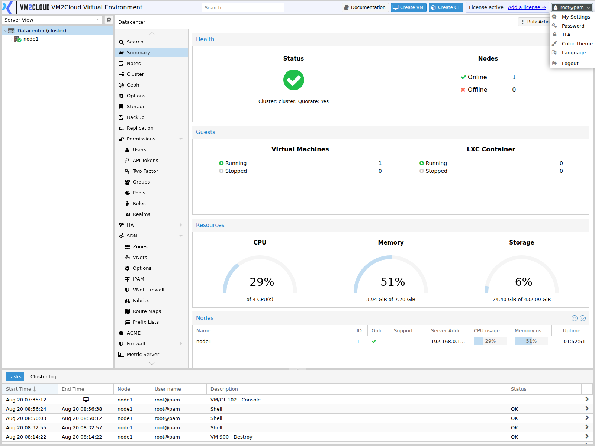
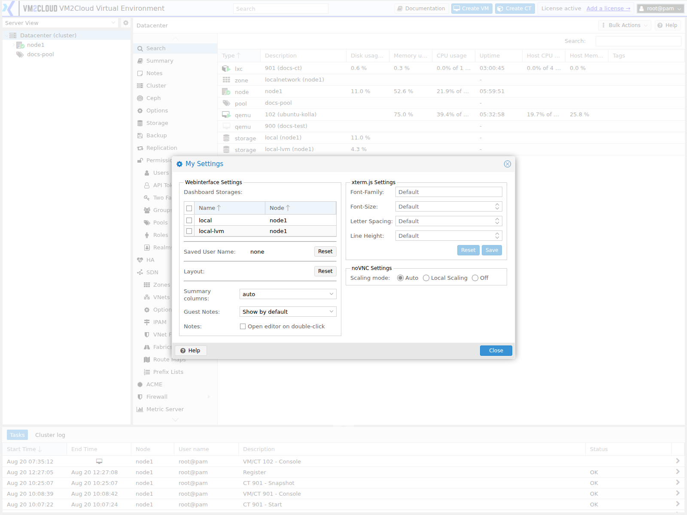

# My Settings

---

## Overview

The **user menu** in the top-right corner holds the settings that apply to your own account and browser session — password, two-factor authentication, interface preferences, and logout.

These are personal settings. Nothing here affects other users or the environment. Administrative account management lives in [Users](../02-Datacenter/Permissions/Users.md).

---

## When to Use

Open the user menu when you need to:

* Change your own password.
* Set up two-factor authentication on your account.
* Change the interface language.
* Adjust display preferences such as the default console type.
* Log out.

---

## Prerequisites

* You are logged in.
* For a password change, you know your current password.
* For 2FA setup, you have an authenticator app or hardware key available.

---

# Procedure

## Step 1: Open the User Menu

1. Click your username in the top-right corner of the interface.

The menu shows the account you are logged in as, written `name@realm`, and the available options.

---

### Screenshot 1

**User Menu**



Everything personal to your account is reached from the user menu in the header.

---

## Step 2: Change Your Password

1. Select the password option.
2. Enter the new password and confirm it.
3. Confirm.

For a `@pam` account this changes the underlying Linux password on the node. For a `@pve` account it updates the VM2Cloud VE user database.

> **Warning:** If you change the `root@pam` password here, make sure it is recorded somewhere the team can reach — a password manager, not a note on your own machine. A root password known only to one person becomes a console-recovery problem the moment they are unavailable. See [Reset Root Password](../03-Nodes/Reset-Root-Password.md).

---

### Screenshot 2

**Change Password**



**My Settings** opens as a dialog rather than a panel, holding the personal preferences —
the interface language, colour theme, and the resource-tree behaviour. Password and
two-factor enrolment are separate entries on the same user menu.

---

## Step 3: Configure Two-Factor Authentication

1. Open the two-factor option.
2. Select the method — typically a time-based authenticator app, or a hardware key.
3. Follow the enrolment steps, scanning the code or registering the key.
4. Enter a verification code to confirm enrolment.
5. **Save the recovery codes** somewhere safe.

> **Warning:** Recovery codes are shown once. Save them before closing the dialog. Without them, losing your authenticator means an administrator must remove 2FA from your account — and if the account was the only administrator, that means console recovery. See [Two-Factor Authentication](../02-Datacenter/Permissions/Two-Factor-Authentication.md).

---

### Screenshot 3

**Two-Factor Enrolment**

```text
[ Place Screenshot Here ]
```

> **Capture:** The two-factor setup dialog, showing the method selection and enrolment
> step.

---

## Step 4: Set Interface Preferences

The preferences dialog holds display settings for your session.

Typically available:

* **Language** — interface language.
* **Default console type** — which console technology opens by default.
* **Theme or colour scheme**, where offered.
* **Behaviour options** such as confirmation prompts.

These are per user, stored against your account, so they follow you between browsers.

> **Verify:** Capture the preferences dialog and confirm exactly which settings are
> available in this deployment.

---

### Screenshot 4

**User Preferences**

```text
[ Place Screenshot Here ]
```

> **Capture:** The preferences dialog opened from the user menu, showing the available
> settings.

---

## Step 5: Log Out

1. Open the user menu.
2. Select **Logout**.

Log out explicitly on shared or public machines. Sessions do expire, but not immediately.

---

# Configuration / Options

| Option | Scope | Description |
|---|---|---|
| **Password** | Your account | Changes your own password. |
| **TFA** | Your account | Enrols or manages two-factor authentication. |
| **Language** | Your account | Interface language. |
| **Console type** | Your account | Default console technology. |
| **Theme** | Your account | Colour scheme, where offered. |
| **Logout** | Session | Ends the session. |

> **Verify:** Capture the user menu and confirm the exact option names in this
> deployment.

---

# Verification

Verify the following:

* The user menu shows the correct account and realm.
* A password change succeeds and the new password works after logging out.
* 2FA prompts on the next login, once enrolled.
* Recovery codes have been saved somewhere safe.
* Preference changes persist after logging out and back in.
* Logout ends the session and returns the login screen.

Test a password change by logging out and back in, rather than assuming. A password changed but mistyped twice is only discovered at the next login, possibly days later.

---

# Common Issues

| Issue | Resolution |
|-------|------------|
| Password change rejected | The current password may be wrong, or a policy applies. |
| Cannot change password | Directory-backed accounts are managed in the directory, not here. |
| 2FA code rejected | Usually clock skew between your device and the node. Check both. |
| Lost the authenticator | Use a recovery code. Without one, an administrator must remove 2FA. |
| Recovery codes not saved | They are shown once. Regenerate them if the option exists; otherwise re-enrol. |
| Preferences not persisting | Confirm the setting saved, and that you are logging in as the same account. |
| Session ends unexpectedly | Check time synchronization across nodes. |
| Console opens in the wrong type | Set the default console type in preferences. |

---

# Best Practices

- Change any default or shared password on first login.
- Store passwords in a shared password manager, not personally. A credential only one person holds is an outage waiting for their holiday.
- Enable 2FA on every administrative account.
- Save recovery codes immediately, somewhere separate from the authenticator itself.
- Check clock accuracy on your authenticator device — most 2FA failures are clock skew.
- Log out explicitly on shared machines.
- Verify a password change by logging out and back in.
- Keep a second administrator account, so a locked-out account is never a crisis.

---

# Related Documentation

- [Logging In](Logging-In.md)
- [Interface Tour](Interface-Tour.md)
- [Users](../02-Datacenter/Permissions/Users.md)
- [Two-Factor Authentication](../02-Datacenter/Permissions/Two-Factor-Authentication.md)
- [Authentication Realms](../02-Datacenter/Permissions/Authentication-Realms.md)
- [Reset Root Password](../03-Nodes/Reset-Root-Password.md)
- [VM Console](../04-Virtual-Machines/VM-Console.md)
- [Permissions Troubleshooting](../02-Datacenter/Permissions/Permissions-Troubleshooting.md)

---

# Summary

The user menu holds your own account settings — password, two-factor authentication, interface preferences, and logout. Nothing here affects other users; administrative account management is in [Users](../02-Datacenter/Permissions/Users.md).

Two things deserve care. A `root@pam` password changed here must be recorded somewhere the whole team can reach, or it becomes a console-recovery problem when its holder is unavailable. And 2FA recovery codes are displayed once — save them before closing the dialog, because losing both the authenticator and the codes on a sole administrator account means recovering at the console.
