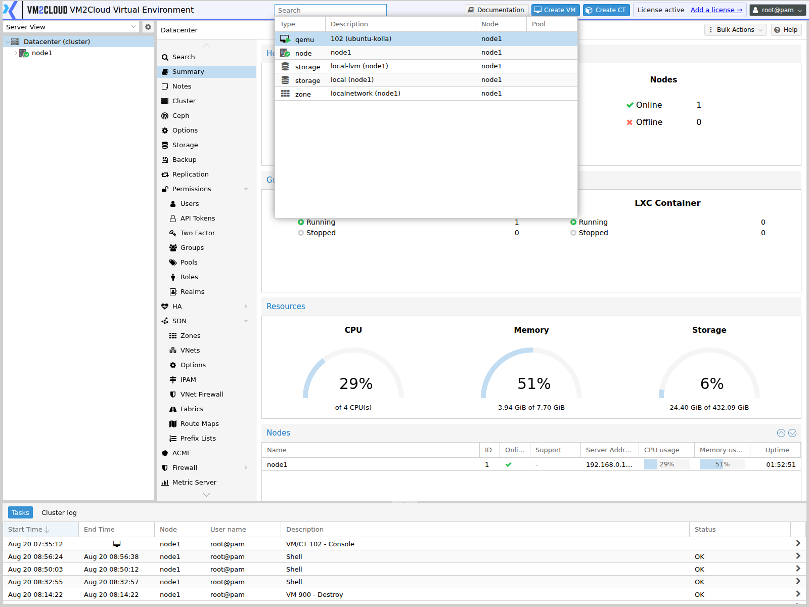
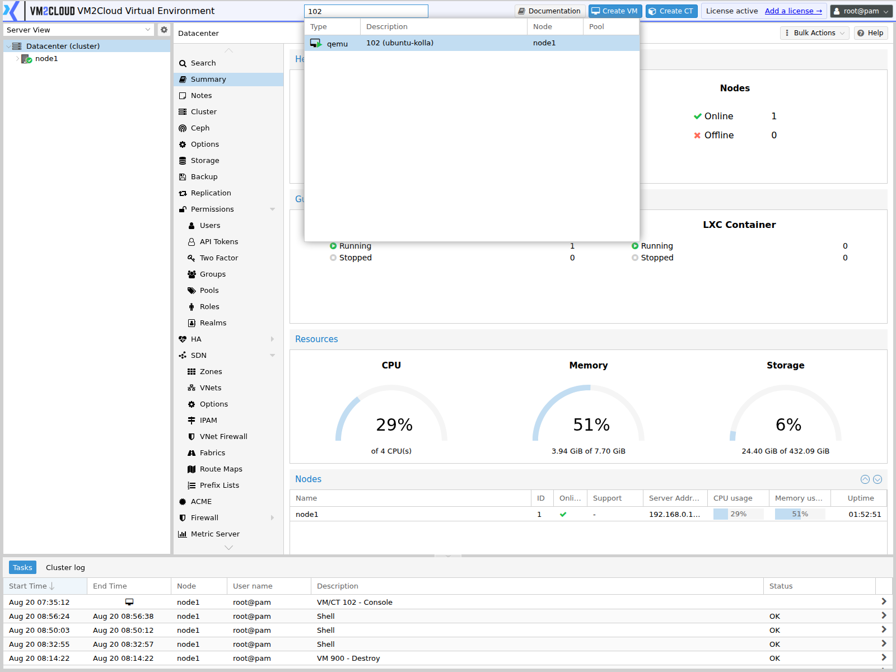
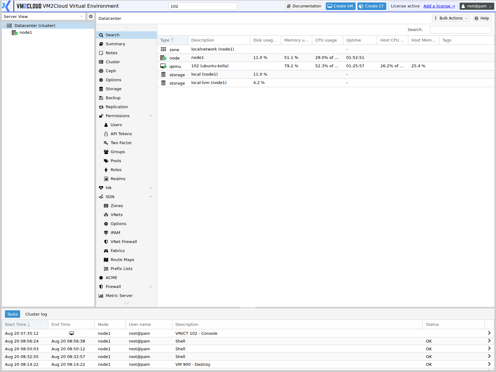
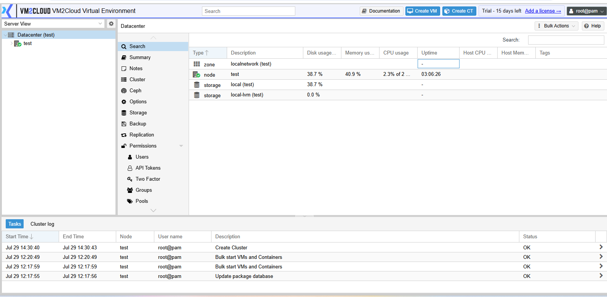

# Search

---

## Overview

The **Search** feature allows administrators to quickly locate resources within the VM2Cloud VE environment. Instead of manually navigating the resource tree, users can search for virtual machines, containers, nodes, storage resources, and other managed objects directly from the search bar.

The search function helps administrators efficiently locate resources in environments containing multiple nodes and workloads.

---

## When to Use

Use the Search feature to:

- Locate virtual machines.
- Locate containers.
- Locate nodes.
- Locate storage resources.
- Quickly navigate to a specific resource.
- Reduce time spent browsing the resource tree.

---

## Prerequisites

Before using Search, ensure that:

- You are logged in to the VM2Cloud VE web interface.
- You have permission to view the resource being searched.

---

# Search for a Resource

## Step 1: Locate the Search Box

1. Log in to the VM2Cloud VE web interface.
2. Locate the **Search** box at the top of the interface.

---

### Screenshot 1

**Search Box**

The header search box is available from every screen.

---

## Step 2: Enter a Search Term

Type the name or identifier of the resource.

Examples include:

- Node name
- Virtual Machine ID
- Virtual Machine name
- Container ID
- Container name
- Storage name

Matching results are displayed automatically while typing.

---

### Screenshot 2

**Search Results**

Results appear as you type, matched across guests, nodes, and storage. Typing a guest ID
finds it directly.

---

## Step 3: Select the Resource

1. Select the required resource from the search results.

The VM2Cloud VE interface automatically opens the selected resource.

---

### Screenshot 3

**Resource Opened**

Datacenter → Search is the same search as a full panel, listing every resource with its
type, description, and live usage figures.

---

# Datacenter Search Panel

In addition to the header search box, a **Search** panel is available at the Datacenter level.

1. Select **Datacenter** in the resource tree.
2. Click **Search**.

The panel lists every resource in the environment in a sortable table.

Columns include:

- Type (node, storage, zone, VM, container)
- Description
- Disk usage
- Memory usage
- CPU usage
- Uptime
- Host CPU and Host Memory
- Tags

Use the **Search** field at the top right of the panel to filter the list.

---

**Datacenter Search Panel**

---

# Search Tips

Search works best when using:

- Complete resource names.
- Partial resource names.
- VM IDs.
- Container IDs.
- Node names.

If multiple resources match the search text, select the appropriate result from the list.

---

# Verification

Verify the following:

- The Search box is visible.
- Matching resources appear while typing.
- Selecting a result opens the correct resource.
- The displayed resource matches the selected search result.

---

# Common Issues

| Issue | Resolution |
|--------|------------|
| No search results | Verify that the resource exists and that the search term is correct. |
| Unable to locate a resource | Confirm that you have permission to view the resource. |
| Search results are incomplete | Check the spelling or use a partial resource name. |
| Selecting a result does not open the resource | Refresh the interface and try again. |

---

# Summary

The Search feature provides a quick and efficient way to locate resources within the VM2Cloud VE environment. By using the search box, administrators can rapidly navigate to nodes, virtual machines, containers, and storage resources without manually browsing the resource tree.
