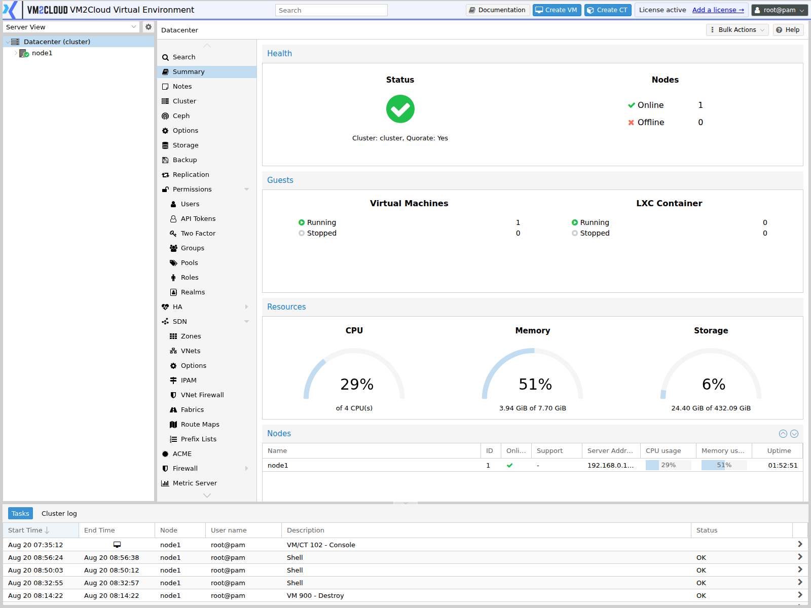
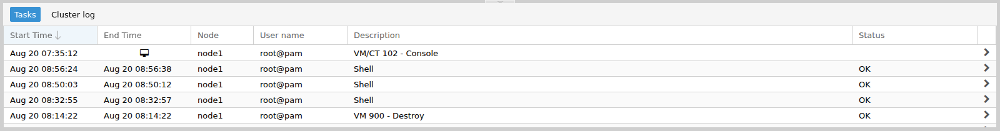
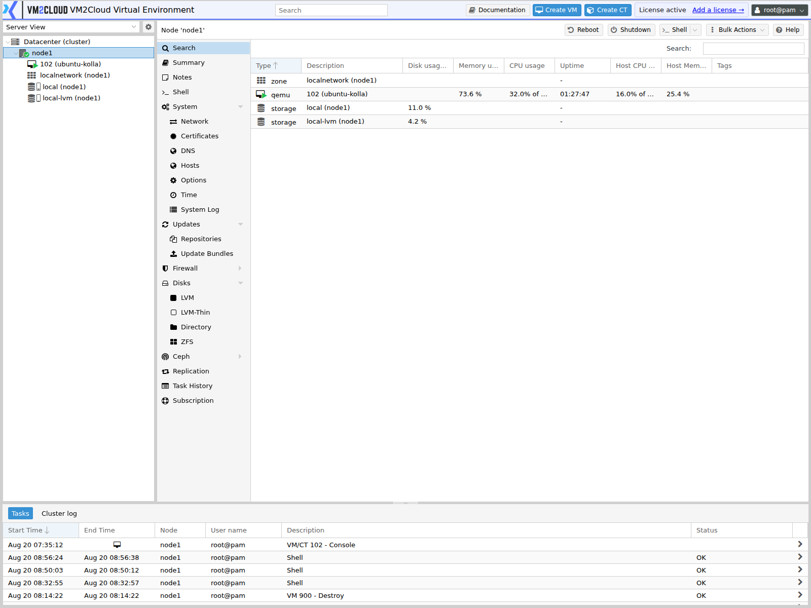
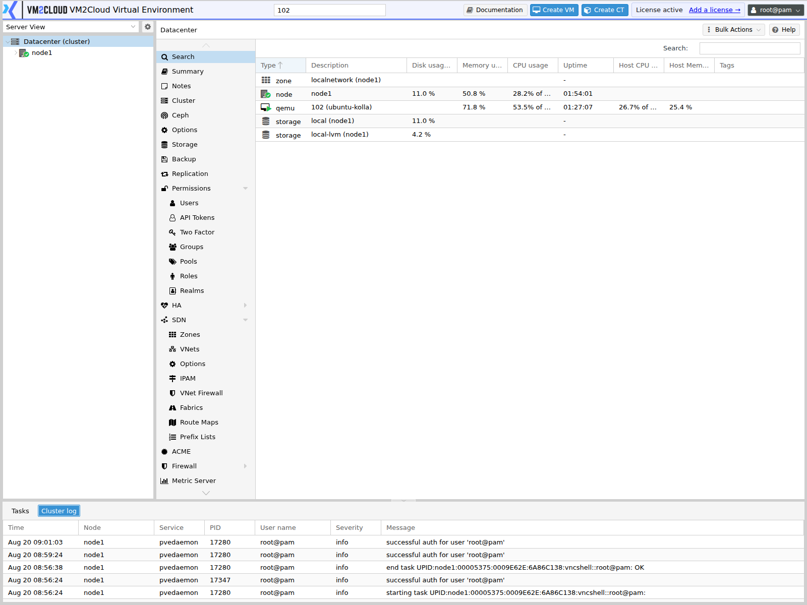

# Recent Tasks and Cluster Log

---

## Overview

The Dashboard provides two monitoring tabs that help administrators monitor activity within the VM2Cloud VE environment:

- **Tasks** – Displays administrative operations performed through the VM2Cloud VE web interface, such as creating virtual machines, creating containers, backups, migrations, storage operations, and configuration changes.
- **Cluster log** – Displays cluster and system events generated across the VM2Cloud VE environment, helping administrators monitor system activity and troubleshoot issues.

Together, these tabs provide real-time visibility into both administrative tasks and cluster events.

---

## When to Use

Use the **Tasks** and **Cluster log** tabs to:

- Monitor running administrative tasks.
- Verify completed operations.
- Review failed tasks.
- View task details.
- Monitor cluster-wide events.
- Review recent system activities.
- Troubleshoot operational issues.

---

## Prerequisites

Before viewing Tasks and Cluster Log, ensure that:

- You have logged in to the VM2Cloud VE web interface.
- You have sufficient permissions to view task information and cluster events.

---

# View Recent Tasks

## Step 1: Open the Dashboard

1. Log in to the VM2Cloud VE web interface.
2. Open the Dashboard.

---

### Screenshot 1

**Dashboard**



The log panel is docked to the bottom of every screen.

---

## Step 2: Locate the Tasks Panel

1. At the bottom of the Dashboard, select the **Tasks** tab.

The Tasks panel displays recent administrative operations performed within the VM2Cloud VE environment.

---

### Screenshot 2

**Tasks Panel**



The **Tasks** tab lists operations newest first, across the whole cluster.

Columns are **Start Time**, **End Time**, **Node**, **User name**, **Description**, and
**Status**. A running task shows no end time.
---

## Step 3: Review Task Information

Each task entry displays information such as:

- Start Time
- End Time
- Node
- User Name
- Task Description
- Status

Use this information to monitor current and completed operations.

---

## Step 4: View Task Details

1. Select the required task.
2. Review the detailed task information.

Depending on the operation, the details may include:

- Task identifier
- Execution time
- Progress
- Result
- Error messages (if any)

---

### Screenshot 3

**Task Detail Window**



Double-clicking a task opens its **Output** and **Status** tabs.

---

## Task Status

The task status indicates the result of an operation.

Common task statuses include:

| Status | Description |
|---------|-------------|
| Running | The operation is currently in progress. |
| OK | The operation completed successfully. |
| Error | The operation failed. Review the task details for more information. |
| Warning | The operation completed with warnings that may require attention. |

---

### Screenshot 4

**Task Status Values**

```text
[ Place Screenshot Here ]
```

> **Capture:** A task list containing at least one successful and one failed entry, so
> the status colouring is visible side by side.

---

## View Task History

The Tasks panel displays the most recent operations performed in the environment.

To review older operations:

1. Select the appropriate resource (Datacenter, Node, Virtual Machine, or Container).
2. Open the **Task History** page.

---

### Screenshot 5

**Task History at Resource Level**

```text
[ Place Screenshot Here ]
```

> **Capture:** A node or guest → **Task History**, showing the same log scoped to a
> single resource.

---

# View the Cluster Log

The **Cluster log** displays important events that occur throughout the VM2Cloud VE environment. Unlike the Tasks tab, which records administrative operations, the Cluster log records cluster and system events.

---

## Step 1: Open the Cluster Log

1. At the bottom of the Dashboard, click the **Cluster log** tab.

The Cluster log displays recent events generated by the VM2Cloud VE environment.

---

### Screenshot 6

**Cluster Log Tab**



The **Cluster log** tab sits beside Tasks and shows events rather than operations —
logins, service messages, and cluster changes.

---

## Step 2: Review Cluster Events

Each log entry provides information about an event that occurred within the environment.

Typical information includes:

- Date and Time
- Node
- Service
- Event Description
- Severity (when applicable)

Review the log entries to identify recent system activities or unexpected events.

---

### Screenshot 7

**Cluster Log Entries**

```text
[ Place Screenshot Here ]
```

> **Capture:** Cluster log rows showing severity, node, user, and message.

---

## Common Cluster Events

The Cluster log may contain events related to:

- Node startup or shutdown
- Cluster membership changes
- Virtual machine operations
- Container operations
- Storage events
- High Availability (HA) events
- Replication events
- Network configuration changes
- User authentication events
- System service events

---

### Screenshot 8

**Authentication and Service Events**

```text
[ Place Screenshot Here ]
```

> **Capture:** The cluster log scrolled or filtered to show a login event and a service
> event together.

---

## When to Review the Cluster Log

Use the Cluster log to:

- Monitor cluster-wide activity.
- Verify configuration changes.
- Review system events.
- Identify unexpected behavior.
- Assist with troubleshooting.

---

### Screenshot 9

**Cluster Log Used for Diagnosis**

```text
[ Place Screenshot Here ]
```

> **Capture:** The cluster log showing a real warning or error entry — that is the case
> this page is written for.

---

# Verification

Verify the following:

- The Tasks tab is visible.
- The Cluster log tab is visible.
- New administrative tasks appear automatically.
- Task status is displayed correctly.
- Task details can be opened.
- Recent cluster events are displayed.
- Log entries correspond to recent administrative activity.

---

# Common Issues

| Issue | Resolution |
|---------|------------|
| No tasks are displayed | If no administrative operations have been performed recently, the Tasks panel may be empty. |
| Task remains in the Running state | Wait for the operation to complete. If it remains active for an extended period, review the related resource and system logs. |
| Task failed | Open the task details to review the error message and identify the cause. |
| Unable to view task details | Verify that your user account has permission to access task information. |
| Tasks list is not updating | Refresh the Dashboard and confirm that the VM2Cloud VE management services are operational. |
| Cluster log is empty | Verify that recent cluster events have occurred and that the required services are running. |
| Recent cluster events are not displayed | Refresh the Dashboard and ensure the cluster services are operating correctly. |

---

# Summary

The **Tasks** and **Cluster log** tabs provide real-time visibility into administrative operations and cluster events within the VM2Cloud VE environment. By monitoring task status, reviewing task details, and examining cluster events, administrators can verify successful operations, identify failures, and troubleshoot issues more efficiently.
