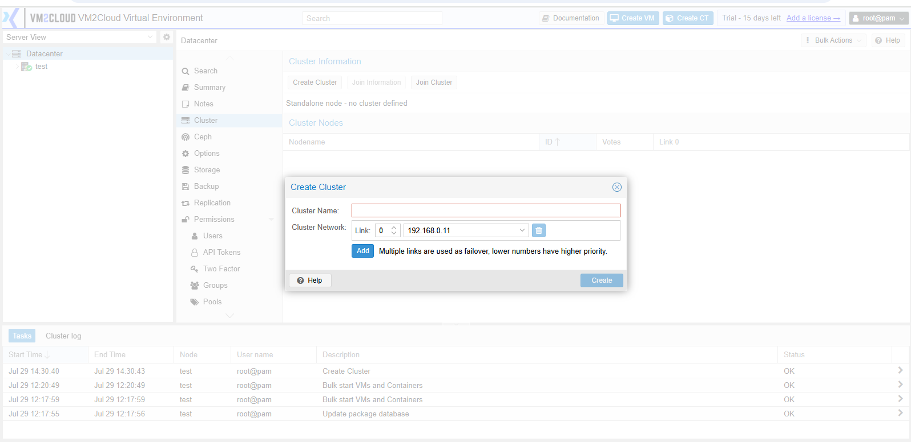
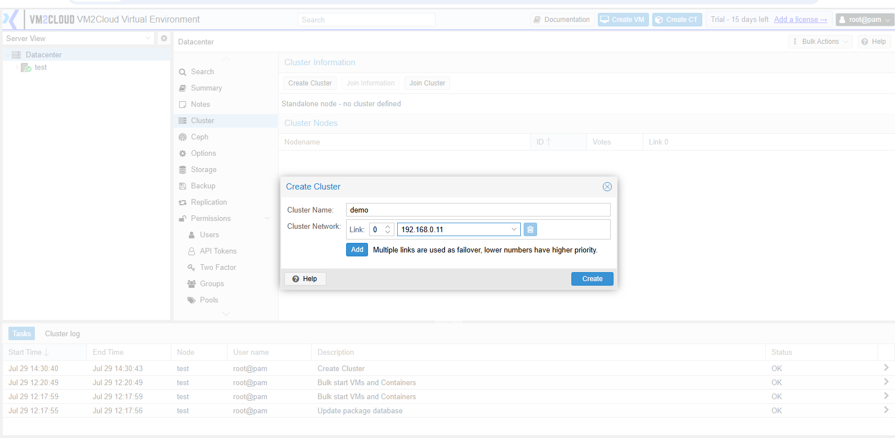
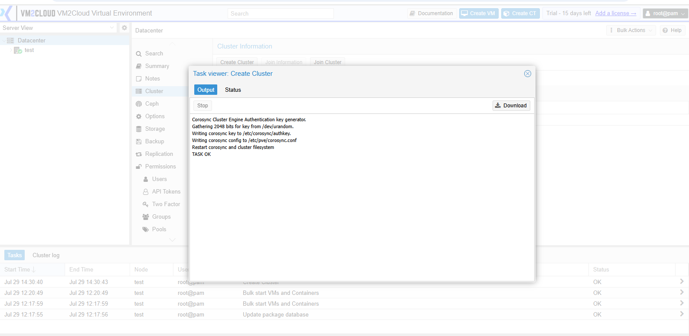
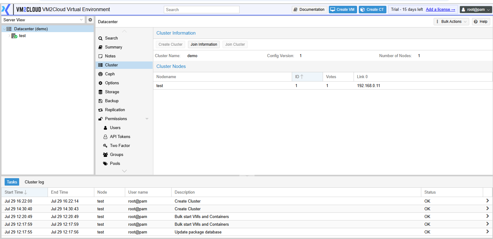

# Create Cluster

---

## Overview

A cluster allows multiple VM2Cloud nodes to work together as a single environment. After creating a cluster, additional nodes can be added, enabling centralized management, workload distribution, and features such as High Availability and live migration.

---

## When to Use

Create a cluster when:

* Deploying a new VM2Cloud environment.
* Preparing to add additional nodes.
* Enabling High Availability.
* Managing multiple physical servers from a single interface.

---

## Prerequisites

Before creating a cluster, ensure that:

* VM2Cloud is installed on the server.
* The server has a static IP address.
* The hostname is configured correctly.
* Time synchronization is configured on the server.
* Network connectivity is working properly.
* You have administrator privileges.

---

# Procedure

## Step 1: Open Cluster Management

1. Log in to the VM2Cloud web interface.
2. In the navigation pane, select **Datacenter**.
3. Click **Cluster**.

---

**Open Cluster Management**

---

## Step 2: Start Cluster Creation

1. On the **Cluster** page, click **Create Cluster**.
2. The **Create Cluster** window will open.

---

**Create Cluster Window**

---

## Step 3: Enter Cluster Details

1. Enter the **Cluster Name**.
2. Review the cluster network configuration.
3. Verify the communication network settings.

> **Note:** The cluster name cannot be changed after the cluster has been created. Choose a meaningful and unique name.

---

**Cluster Configuration**

---

## Step 4: Create the Cluster

1. Review the configuration.
2. Click **Create**.
3. Wait for the task to complete.

---

**Cluster Creation Progress**

---

## Step 5: Verify Cluster Creation

After the task completes:

* The cluster name is displayed on the **Cluster** page.
* The local node appears as a member of the cluster.
* The task completes successfully without errors.

---

**Cluster Created Successfully**

---

# Verification

Verify the following before continuing:

* The cluster is listed in the Datacenter view.
* The node status is **Online**.
* No warning or error messages are displayed.
* Recent Tasks shows the operation completed successfully.

---

# Common Issues

| Issue                        | Resolution                                                 |
| ---------------------------- | ---------------------------------------------------------- |
| Create button is disabled    | Verify you have administrator privileges.                  |
| Cluster creation fails       | Check the hostname, DNS, and network configuration.        |
| Cluster page does not update | Refresh the VM2Cloud interface and verify the task status. |
| Communication error          | Verify the management network is reachable.                |

---

# Summary

You have successfully created a new VM2Cloud cluster. The current server is now the first node in the cluster and is ready for additional nodes to join. Once the cluster is created, you can proceed with adding more nodes and configuring shared resources.

