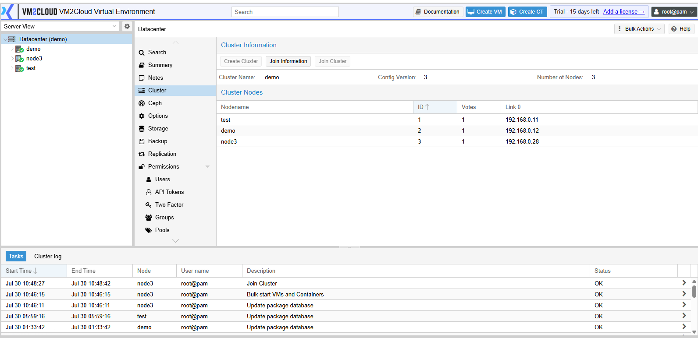
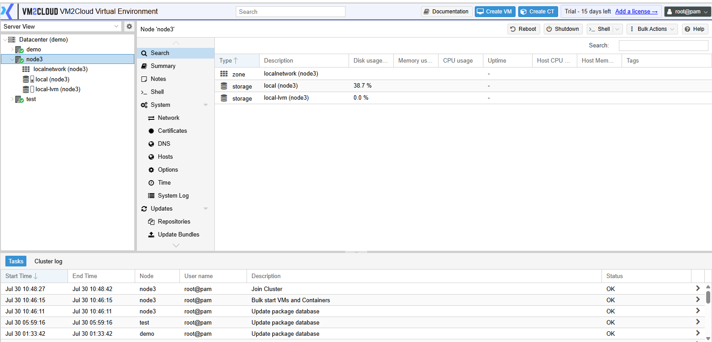
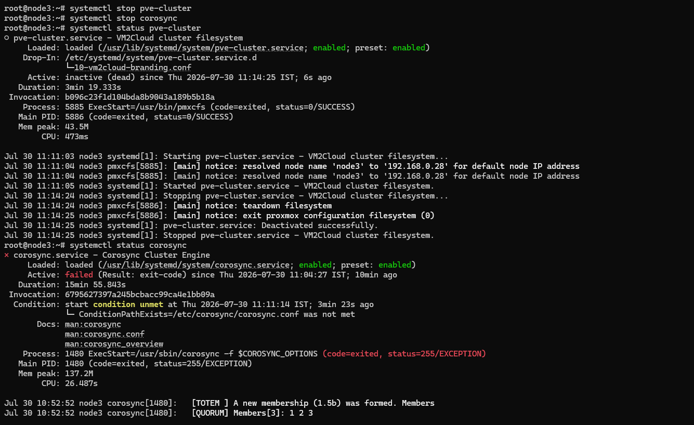
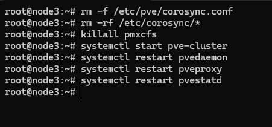
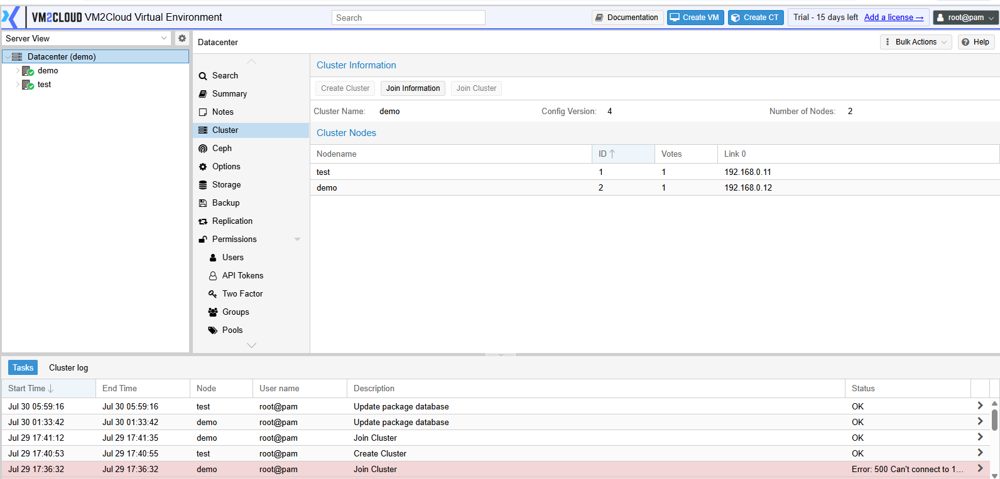

# Remove Node from Cluster

---

## Overview

A node can be removed from a VM2Cloud cluster when it is no longer required, is being replaced, or needs to be rebuilt. Before removing a node, ensure that all virtual machines and containers have been migrated or backed up to prevent service disruption.

---

## When to Use

Remove a node from the cluster when you need to:

* Decommission a physical server.
* Replace faulty hardware.
* Reinstall the operating system.
* Reduce the size of the cluster.
* Remove an offline or failed node.

---

## Prerequisites

Before removing a node, ensure that:

* You have administrator privileges.
* The node is a member of the cluster.
* All virtual machines have been migrated or shut down.
* All containers have been migrated or stopped.
* No backup or migration tasks are running.
* The cluster is healthy.

---

# Procedure

## Step 1: Verify the Node

1. Log in to the **VM2Cloud** web interface.
2. Navigate to **Datacenter → Cluster**.
3. Verify that the node you want to remove is part of the cluster.
4. Confirm that the cluster is healthy before proceeding.

---

### Screenshot 1

**Cluster Nodes**





---

## Step 2: Migrate Workloads

1. Migrate all virtual machines from the node to another cluster node.
2. Migrate all containers from the node to another cluster node.
3. Verify that no virtual machines or containers remain on the node.

> **Important:** A node should not contain any running workloads before it is removed from the cluster.

---

### Screenshot 2

**Node Workloads**





---

## Step 3: Prepare the Node

1. Ensure that no users are connected to the node.
2. Verify that no backup, replication, or migration tasks are running.
3. Confirm that the node is ready to be removed from the cluster.

---

### Screenshot 3

**Prepare Node**


---

## Step 4: Remove the Node from the Cluster

> **Note:** Removing a node from a cluster cannot be completed from the VM2Cloud web interface. This operation must be performed from the command line on one of the **remaining cluster nodes**, **not** on the node being removed.

Open an SSH session on one of the remaining cluster nodes and run:

```bash
pvecm delnode <node-name>
```

Example:

```bash
pvecm delnode node03
```

Wait until the command completes successfully.

---

### Screenshot 4

**CLI Node Removal**


---

## Step 5: Clean the Removed Node

After removing the node from the cluster, log in to the removed node using SSH.

1. Stop the VM2Cloud cluster services.

```bash
systemctl stop pve-cluster
systemctl stop corosync
```

2. Verify that the services have stopped.

```bash
systemctl status pve-cluster
systemctl status corosync
```

3. Start the VM2Cloud cluster filesystem in local mode.

```bash
pmxcfs -l
```

> **Note:** Keep this process running and open another SSH session to continue.

4. Remove the cluster configuration file.

```bash
rm -f /etc/pve/corosync.conf
```

5. Remove the Corosync configuration.

```bash
rm -rf /etc/corosync/*
```

6. Stop the local VM2Cloud cluster filesystem.

```bash
killall pmxcfs
```

7. Start the VM2Cloud cluster service.

```bash
systemctl start pve-cluster
```

8. Restart the VM2Cloud management services.

```bash
systemctl restart pvedaemon
systemctl restart pveproxy
systemctl restart pvestatd
```
### Screenshot 5

**Clean Removed Node**






---

## Step 6: Verify the Cluster

1. Return to the **VM2Cloud** web interface.
2. Navigate to **Datacenter → Cluster**.
3. Verify that the removed node no longer appears in the cluster.
4. Confirm that all remaining nodes are online and operating normally.

---

### Screenshot 6

**Updated Cluster**





> Capture the **Datacenter → Cluster** page showing that the removed node is no longer part of the cluster.

---

# Verification

Verify the following:

* The removed node no longer appears under **Datacenter → Cluster**.
* All remaining nodes are online.
* The cluster is healthy.
* Virtual machines and containers continue running normally on the remaining nodes.
* The removed server now operates as a standalone VM2Cloud host.

---

# Common Issues

| Issue | Resolution |
|------|------------|
| Node cannot be removed | Verify that no virtual machines or containers remain on the node before executing the removal command. |
| `pvecm delnode` fails | Ensure the command is executed on a remaining cluster node, not on the node being removed. |
| Unable to remove `/etc/pve/corosync.conf` | Start the VM2Cloud cluster filesystem in local mode using `pmxcfs -l` before deleting the file. |
| Node still appears in the cluster | Refresh the VM2Cloud web interface after the removal completes successfully. |
| Command execution fails | Review the command output and resolve any reported errors before continuing. |

---

# Summary

The node has been successfully removed from the VM2Cloud cluster.

The remaining nodes continue operating normally as part of the cluster, while the removed server has been converted into a standalone VM2Cloud host. The standalone server can be reused to create a new cluster or join another existing cluster if required.
