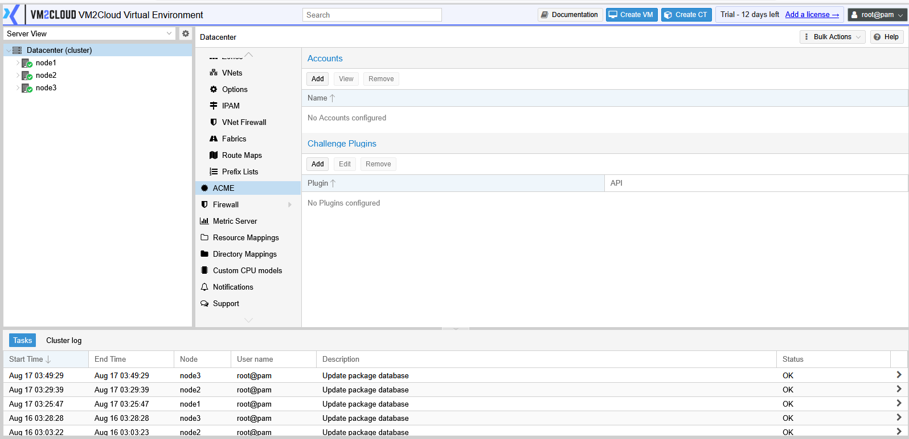
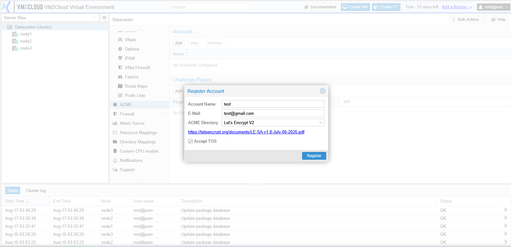
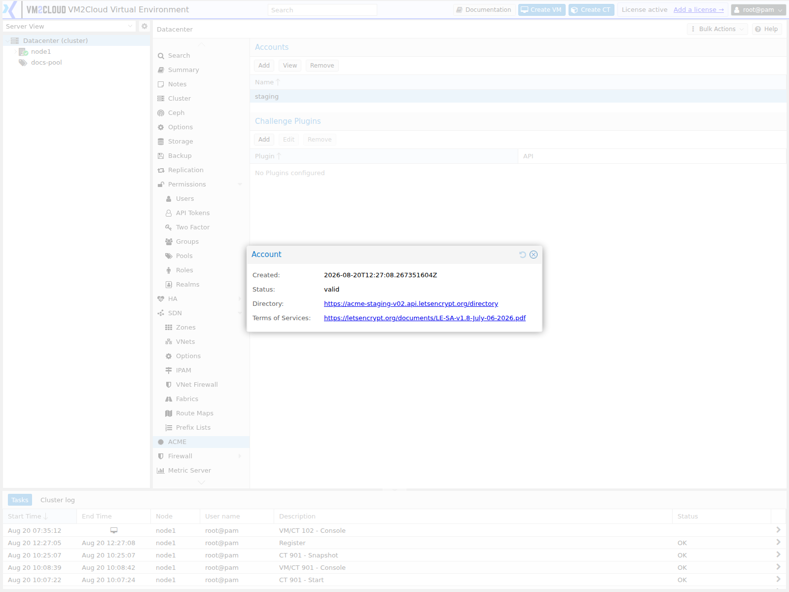
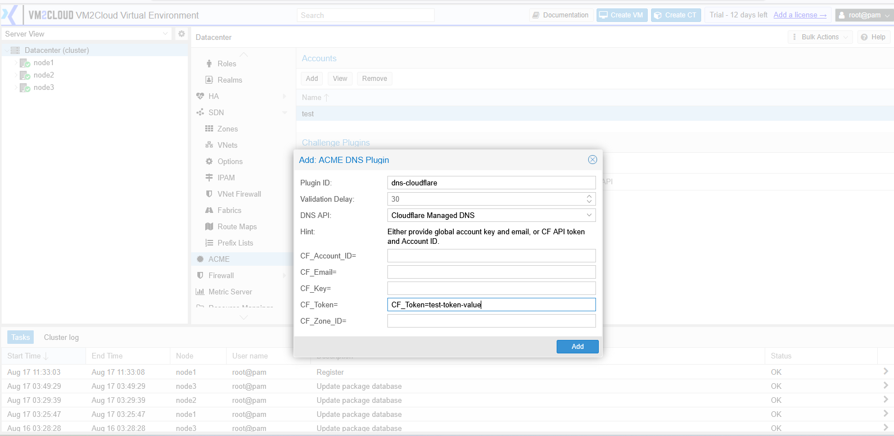
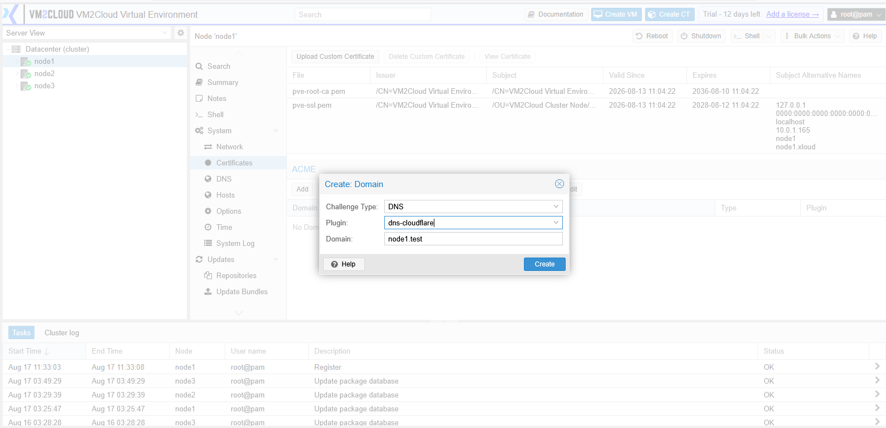

# ACME Certificates

---

## Overview

**ACME** automates TLS certificates for the VM2Cloud VE web interface. Instead of the self-signed certificate every installation starts with — the one that makes browsers warn on every visit — ACME obtains a trusted certificate from a certificate authority and renews it automatically before it expires.

The automation is the point. Certificates from public authorities are short-lived by design, so manual renewal is a recurring task that eventually gets missed. ACME removes it.

Configuration happens at two levels:

| Level | What it holds |
|---|---|
| **Datacenter → ACME** | Accounts with the certificate authority, and challenge plugins |
| **Node → System → Certificates** | Per-node certificate ordering and the resulting certificate |

This page covers the datacenter side. See [Certificates](../03-Nodes/System/Certificates.md) for the node side.

---

## When to Use

Use ACME when:

* Browser certificate warnings should stop.
* The interface is reachable at a real DNS name.
* Certificates should renew without anyone remembering.
* A compliance requirement calls for trusted certificates.
* Scripts or API clients fail because of an untrusted certificate.

Do **not** use ACME when:

* Nodes are reachable only by IP address. Public authorities issue for names, not addresses.
* The organisation uses its own internal certificate authority — upload those certificates manually instead.
* Nodes are on an isolated network with no path for the validation challenge.

---

## Prerequisites

Before configuring ACME, ensure that:

* Each node has a resolvable DNS name pointing at it.
* You have an email address for the account, used for expiry warnings.
* You can complete one of the challenge types below.
* Time is synchronized. Certificate validation is time-sensitive. See [Time and NTP](../03-Nodes/System/Time-and-NTP.md).
* The cluster has quorum.

---

# How Validation Works

Before issuing a certificate, the authority verifies you control the name. There are two ways, and choosing correctly is most of the work.

| Challenge | How it proves control | Requires |
|---|---|---|
| **HTTP-01** | Serves a token over HTTP on port 80 | Port 80 reachable from the internet |
| **DNS-01** | Publishes a token as a DNS record | API access to your DNS provider |

**HTTP-01** is simpler but needs the node reachable from the public internet on port 80. For a management interface, that is often unacceptable, and frequently impossible.

**DNS-01** needs no inbound access at all — the node talks outbound to your DNS provider's API. It is the right choice for management interfaces, and the only choice for internal ones.

> **Warning:** DNS-01 requires storing DNS provider API credentials in VM2Cloud VE. Those credentials can usually modify your DNS. Use a scoped or restricted API token where the provider supports one, rather than a full-access key.

---

# Procedure

## Step 1: Open the ACME Panel

1. Log in to the VM2Cloud VE web interface.
2. Select **Datacenter** in the resource tree.
3. Click **ACME**.

---

### Screenshot 1

**Datacenter ACME Panel**

Both sections are empty on a new cluster. **Accounts** carries Add, View, and Remove;
**Challenge Plugins** carries Add, Edit, and Remove.

---

## Step 2: Register an Account

1. In the **Accounts** section, click **Add**.
2. Enter an account **Name**.
3. Enter the **Email** address for expiry notifications.
4. Select the **ACME Directory** — the certificate authority endpoint.
5. Accept the terms of service.
6. Confirm.

Most authorities provide a **staging** directory alongside production. Register against staging first. Staging certificates are not trusted by browsers, but the rate limits are far more forgiving — and production limits are strict enough that a misconfigured setup can lock you out for a week.

> **Warning:** Production certificate authorities enforce rate limits per domain. Repeated failed attempts can exhaust your quota and block further issuance for days. Test against staging until the whole flow works, then switch.

---

### Screenshot 2

**Register ACME Account**

The dialog asks for an account name, an email address, and the directory. The terms of
service link and its **Accept TOS** checkbox appear once a directory is chosen — the
account cannot be registered without ticking it.

---

## Step 3: Confirm the Account Registered

Registration contacts the authority immediately, so a failure here is visible at once rather than surfacing later during an order.

1. Select the account in the **Accounts** list.
2. Click **View**.
3. Confirm **Status** reads `valid`.
4. Confirm **Directory** is the endpoint you intended — staging and production are easy to confuse, and the difference only becomes obvious when a browser rejects the resulting certificate.

The dialog is read-only. Close it when finished.

---

### Screenshot 3

**Account Details**

**View** on a selected account opens a read-only window showing the **Created** timestamp,
the account **Status**, the **Directory** it was registered against, and a link to the terms
of service accepted at registration.

`valid` is what a working account reports. The Directory line is worth reading carefully —
a staging account and a production account look identical everywhere else, and the
difference only becomes obvious when a browser rejects the resulting certificate.

---

## Step 4: Add a Challenge Plugin (DNS-01 Only)

Skip this if using HTTP-01.

1. In the **Challenge Plugins** section, click **Add**.
2. Enter a plugin **ID**.
3. Select your **DNS provider**.
4. Enter the API credentials the provider requires.
5. Set a validation delay if the provider propagates slowly.
6. Confirm.

> **Verify:** Capture the challenge plugin dialog and the DNS provider list available in
> this deployment, and confirm the credential fields for the providers you use.

---

### Screenshot 4

**Challenge Plugin Configuration**

Selecting a DNS API reveals that provider's credential fields as **separate labelled
inputs** — for Cloudflare, `CF_Account_ID`, `CF_Email`, `CF_Key`, `CF_Token`, and
`CF_Zone_ID`. Enter only the value; the key is the label. The hint above them states which
combinations the provider accepts, and mixing the two methods is rejected.

---

## Step 5: Order a Certificate on a Node

Certificates are per node, ordered from the node's own panel.

1. Select the node.
2. Open **System** → **Certificates**.
3. In the ACME section, add a **Domain** — the node's resolvable DNS name.
4. Select the challenge type, and the plugin for DNS-01.
5. Click **Order Certificates Now**.
6. Watch the task output.

The interface restarts briefly when the certificate is installed. A short disconnection is expected.

---

### Screenshot 5

**Ordering a Certificate**

Domains are added from the node's own Certificates panel. The dialog takes the challenge
type, the plugin when the type is DNS, and the domain itself. The panel above lists the
certificates currently installed on the node, with their issuer, validity dates, and
subject alternative names.

---

## Step 6: Verify

1. Reload the interface using the node's DNS name, not its IP address.
2. Confirm no certificate warning appears.
3. Inspect the certificate and confirm the issuer and expiry.
4. Repeat for each node.

Accessing by IP will still warn, because the certificate is issued for the name. That is expected, not a fault.

---

## Step 7: Confirm Automatic Renewal

Renewal is automatic, and it is worth confirming rather than assuming.

1. Note the expiry date.
2. Confirm the renewal mechanism is scheduled.
3. Check again after the first renewal window.

> **Verify:** Confirm how renewal is scheduled in this deployment and where its status
> can be checked.

---

# Configuration / Options

### Account

| Option | Description |
|---|---|
| **Name** | Local identifier for the account. |
| **Email** | Address for expiry and problem notifications. |
| **ACME Directory** | The authority endpoint. Use staging for testing. |
| **Terms of Service** | Must be accepted to register. |

### Challenge plugin

| Option | Description |
|---|---|
| **Plugin ID** | Local identifier. |
| **Validation delay** | Wait before checking, for slow-propagating DNS providers. |
| **API credentials** | Provider-specific. Scope them as narrowly as possible. |

---

# Verification

Verify the following:

* The account is registered and shows as valid.
* The challenge plugin is configured, for DNS-01.
* Each node has a domain configured.
* Certificates were issued without errors.
* The interface loads by DNS name with no warning.
* The certificate issuer and expiry are correct.
* Renewal is scheduled.
* Time is synchronized across nodes.

---

# Common Issues

| Issue | Resolution |
|-------|------------|
| Validation fails on HTTP-01 | Port 80 is not reachable from the internet. Use DNS-01 instead. |
| Validation fails on DNS-01 | Check the API credentials and increase the validation delay — slow propagation is the usual cause. |
| Rate limit reached | Too many failed attempts against production. Wait, and test on staging next time. |
| Certificate not trusted | It may be a staging certificate. Reissue against the production directory. |
| Warning when accessing by IP | Expected. Certificates are issued for names. Use the DNS name. |
| Certificate expired | Renewal is not running. Check the schedule and the account status. |
| Order fails with a time error | Node time is out of sync. See [Time and NTP](../03-Nodes/System/Time-and-NTP.md). |
| Works on one node, not another | Each node needs its own domain and certificate. |
| Cannot register an account | Check outbound connectivity to the authority endpoint. |

---

# Best Practices

- **Test against the staging directory first.** Production rate limits are unforgiving of a misconfigured setup.
- Prefer **DNS-01** for management interfaces. It needs no inbound access.
- Use scoped DNS API tokens, not full-access credentials.
- Use a monitored email address for the account — expiry warnings are the last safety net.
- Keep time synchronized. Certificate validation depends on it.
- Order certificates for every node, not just the one you usually use.
- Confirm the first automatic renewal actually happened rather than assuming.
- Record which DNS provider and credentials are in use, so the setup is maintainable by someone else.

---

# Related Documentation

- [Certificates](../03-Nodes/System/Certificates.md)
- [Cluster Certificates](Cluster/Cluster-Certificates.md)
- [DNS](../03-Nodes/System/DNS.md)
- [Time and NTP](../03-Nodes/System/Time-and-NTP.md)
- [Datacenter Options](Options.md)
- [Interface Troubleshooting](../01-Getting-Started/Interface-Troubleshooting.md)

---

# Summary

ACME replaces the self-signed certificate that causes browser warnings with a trusted one that renews automatically. Accounts and DNS challenge plugins are configured at datacenter level; certificates are ordered per node from the node's Certificates panel.

The main decision is the challenge type. HTTP-01 is simpler but requires port 80 reachable from the internet, which is rarely acceptable for a management interface. DNS-01 needs no inbound access and is usually the right answer, at the cost of storing DNS API credentials — so scope those credentials narrowly. Test against the staging directory before production, because production rate limits will lock you out for days if the configuration is wrong.
