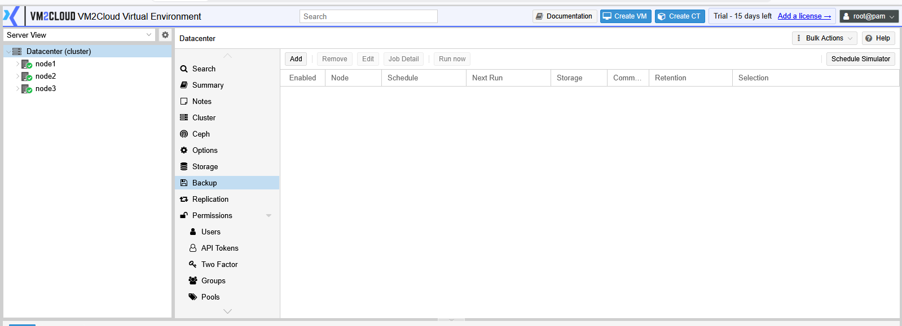
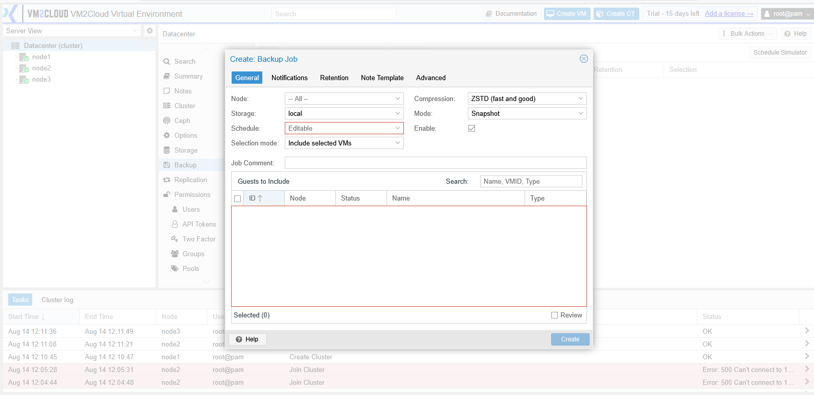
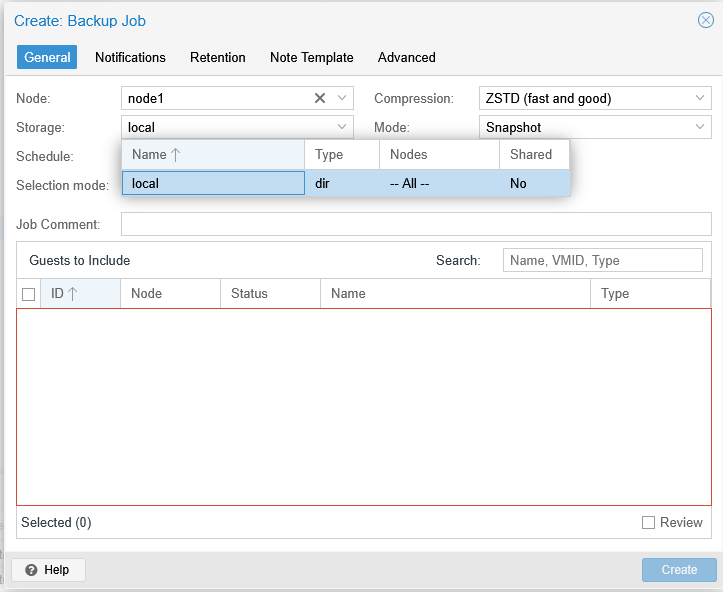
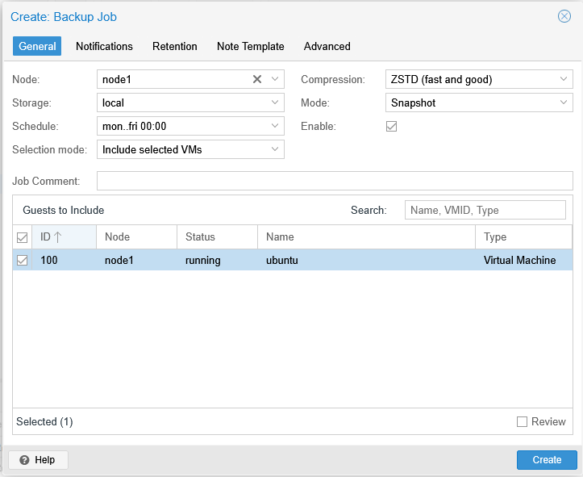
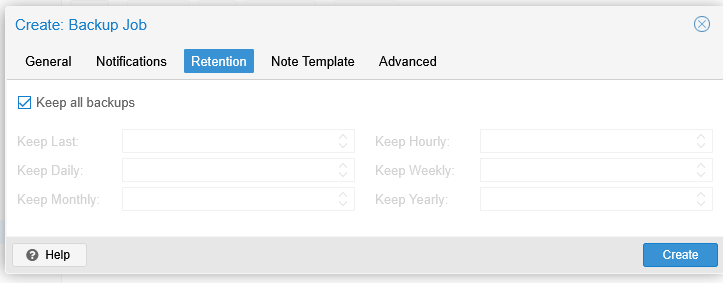
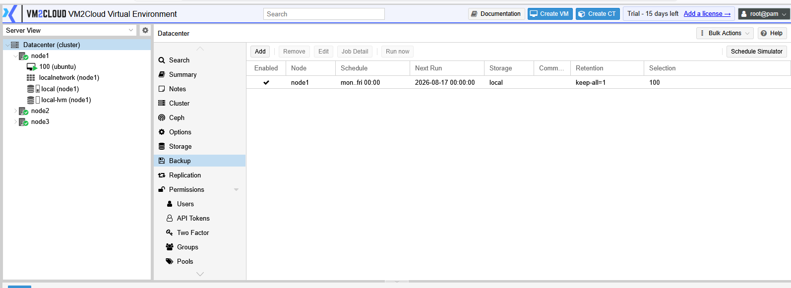

# Create Backup Job

---

## Overview

This page covers creating a scheduled backup job at **Datacenter → Backup**.

A backup job selects a set of guests, a target storage, a schedule, a backup mode, and a retention policy, then runs automatically without further intervention.

For how backup jobs work, how they differ from replication, and what each mode means, see [Backup Jobs Overview](Backup-Jobs-Overview.md).

---

## When to Use

Create a backup job when:

* Guests need protecting on a recurring schedule.
* A new group of guests has been deployed and needs coverage.
* A different schedule or retention is needed for a subset of guests.
* Separate jobs are needed per node, per pool, or per workload tier.

---

## Prerequisites

Before creating a backup job, ensure that:

* You have administrator privileges.
* A storage exists with **backup** content enabled.
* That storage has capacity for the retention you intend to keep.
* You know which guests the job must cover.
* You know the acceptable backup window.
* For Stop mode, you know the downtime is acceptable.
* The cluster has quorum.

---

# Procedure

## Step 1: Open the Backup Panel

1. Log in to the VM2Cloud VE web interface.
2. Select **Datacenter** in the resource tree.
3. Click **Backup**.

Existing jobs are listed.

---

**Datacenter Backup Panel**



---

## Step 2: Open the Add Backup Job Dialog

1. Click **Add**.

The job creation dialog opens.

---

**Add Backup Job Dialog**



---

## Step 3: Choose the Node Scope

1. In **Node**, either:
   - Select a specific node, to back up only guests on that node.
   - Leave it unset to cover guests across all nodes.

Restricting by node is useful when different nodes have different backup windows or different target storage.

---

## Step 4: Select the Target Storage

1. In **Storage**, select the storage where backups will be written.

Only storage with backup content enabled appears here. If the storage you want is missing, enable backup content on it — see [Manage Storage](../Storage/Manage-Storage.md).

> **Warning:** Do not write backups to the same physical storage that holds the guests being backed up. If that storage fails, the guests and their backups are lost together.

---

**Storage Selected**



---

## Step 5: Set the Schedule

1. In **Schedule**, set when the job runs.

Choose a window when guest load is low and the job can finish before business hours. If you have several jobs, stagger their start times so they do not compete for storage and network bandwidth.

> **Verify:** Confirm the schedule field format in this deployment — whether it accepts
> a dropdown of presets, a calendar-event expression, or both — and capture the
> available presets.

---


**Schedule Configured**





> **Capture:** The schedule field of the Add Backup Job dialog, showing the input format
> and any preset options available.

---

## Step 6: Select the Guests

Choose how the job decides which guests to cover.

| Selection mode | Behaviour |
|---|---|
| **All** | Every guest in scope, including guests created later. |
| **Exclude selected VMs** | Everything except the guests you tick. New guests are included automatically. |
| **Include selected VMs** | Only the guests you tick. New guests are **not** included. |
| **Pool based** | Every guest in a chosen pool. Adding a guest to the pool adds it to the job. |

This choice determines whether guests created next month are protected.

**Include selected VMs** is the most common source of unprotected guests: someone creates a new production VM, and nobody remembers to add it to the job. Prefer **All**, **Exclude selected**, or **Pool based** unless you specifically need a fixed list.

> **Verify:** Confirm the exact selection mode names in the dialog.

---

**Guest Selection**


---

## Step 7: Choose the Backup Mode

1. Set **Mode**:
   - **Snapshot** — guest keeps running, no downtime. Requires snapshot-capable storage.
   - **Suspend** — guest is paused during the backup.
   - **Stop** — guest is shut down, backed up, then restarted.

Use **Snapshot** for most workloads. Use **Stop** for databases and other transactional applications, unless the guest agent is installed and configured to quiesce the filesystem.

> **Warning:** **Stop** mode shuts the guest down for the entire duration of the backup. On a large guest this can be a long outage. Confirm the downtime is acceptable before selecting it.

---

## Step 8: Set Compression and Notifications

1. Set **Compression**. Higher compression saves storage but takes longer and uses more CPU.
2. In **Send email to**, enter the address for job reports.
3. Set the notification condition — on failure only, or always.

At minimum, configure failure notifications. A backup job that silently stops working is worse than no backup job, because it creates false confidence.

> **Verify:** Capture the available compression algorithms and the exact notification
> options.

---

### Screenshot 6

**Compression and Notification Settings**

```text
[ Place Screenshot Here ]
```

> **Capture:** The compression and email notification fields of the Add Backup Job
> dialog, with the compression dropdown open.

---

## Step 9: Configure Retention

Set how many backups to keep. Without retention, the target storage will eventually fill and the job will start failing.

See [Backup Retention](Backup-Retention.md) for the full option reference.

---

**Retention Settings**



---

## Step 10: Review and Create

1. Review every field, particularly the storage, selection mode, and mode.
2. Click **Create**.

The job appears in the list.

---

**Job Created**



---

## Step 11: Run the Job Once Manually

Do not wait for the first scheduled run to find out whether the job works.

1. Select the job.
2. Click **Run now**.
3. Monitor the task output.
4. Confirm it completes without errors.
5. Confirm backup files appear on the target storage.

---

**Manual Run Result**


---

# Configuration / Options

| Option | Description |
|---|---|
| **Node** | Restricts the job to one node, or covers all nodes when unset. |
| **Storage** | Target for backup files. Must have backup content enabled. |
| **Schedule** | When the job runs. |
| **Selection mode** | How guests are chosen. Determines whether future guests are included. |
| **Mode** | **Snapshot**, **Suspend**, or **Stop**. |
| **Compression** | Algorithm applied to backup files. Trades CPU and time against storage. |
| **Send email to** | Address receiving job reports. |
| **Email notification** | Whether to report always or only on failure. |
| **Enable** | Whether the job is active. |
| **Retention** | How many backups to keep and for how long. |

> **Verify:** Capture the complete Add Backup Job dialog and confirm all field labels,
> the compression algorithm list, and the notification options.

---

# Verification

Verify the following:

* The job appears in the Datacenter → Backup list.
* The job is enabled.
* The next run time is what you intended.
* A manual run completes without errors.
* Backup files exist on the target storage.
* Every guest that should be covered appears in the job detail.
* The backup completes within the intended window.
* Email reports arrive if configured.
* Free space on the target storage is sufficient for the configured retention.

Then, separately: **restore one backup to a scratch guest** and confirm it boots. Until you have done that, the job is untested.

---

# Common Issues

| Issue | Resolution |
|-------|------------|
| Storage does not appear in the dropdown | Backup content is not enabled on it. See [Manage Storage](../Storage/Manage-Storage.md). |
| Job fails immediately | Check the task log. Usually a storage permission, capacity, or connectivity problem. |
| Snapshot mode fails | The guest's storage does not support snapshots. Use Suspend or Stop, or move the guest. |
| Job runs but a guest is missing | The selection mode uses a fixed list that does not include it. |
| Backup exceeds the window | Reduce guests per job, stagger jobs, or adjust compression. |
| Storage fills after a few cycles | Retention is not configured or is too generous. |
| Guest was shut down unexpectedly | Stop mode was selected. Switch to Snapshot if downtime is not acceptable. |
| No notification on failure | Notifications are set to report only on success, or mail delivery is not configured. |

---

# Best Practices

- Run the job manually once, immediately after creating it.
- Prefer a selection mode that captures new guests automatically.
- Always configure retention at creation time, not later.
- Write backups to storage independent of the guests being protected.
- Stagger multiple jobs rather than starting them together.
- Enable failure notifications at minimum.
- Use Stop mode or a quiescing guest agent for databases.
- Group guests with similar recovery requirements into the same job.
- Name and comment jobs so their purpose is obvious months later.
- Test a restore before relying on the job.

---

# Related Documentation

- [Backup Jobs Overview](Backup-Jobs-Overview.md)
- [Manage Backup Job](Manage-Backup-Job.md)
- [Backup Retention](Backup-Retention.md)
- [Backup and Restore VM](../../04-Virtual-Machines/Backup-and-Restore-VM.md)
- [Backup and Restore Container](../../05-Containers/Backup-and-Restore-Container.md)
- [Manage Storage](../Storage/Manage-Storage.md)
- [Replication Overview](../Replication/Replication-Overview.md)

---

# Summary

Creating a backup job means choosing which guests to cover, where to write the backups, when to run, how to handle the running guest, and how much history to keep. Two decisions matter more than the rest: the selection mode, which determines whether guests created later are protected automatically, and retention, which determines whether the target storage eventually fills and the job starts failing.

Run the job manually as soon as you create it, and restore one backup to a scratch guest before treating the job as working.
