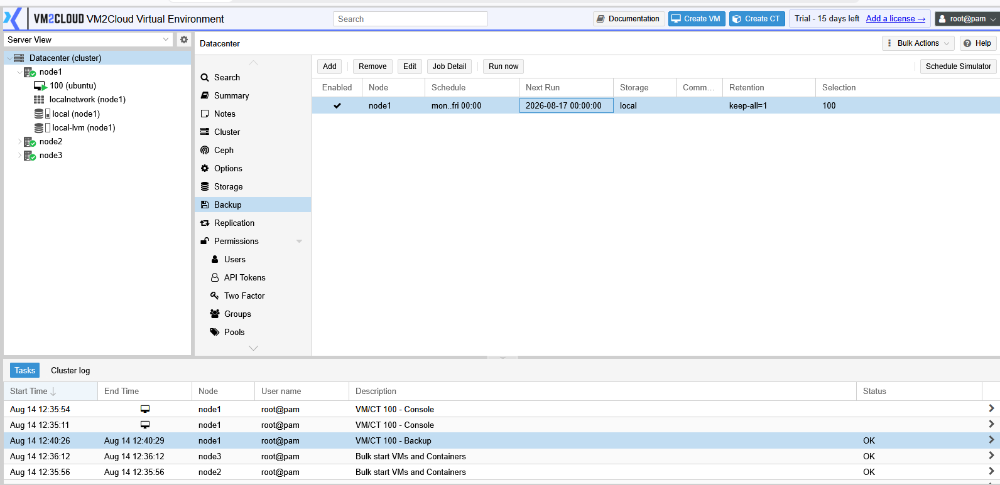
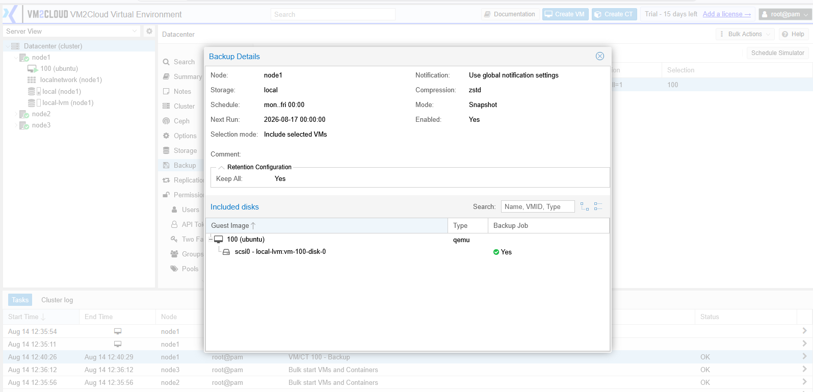
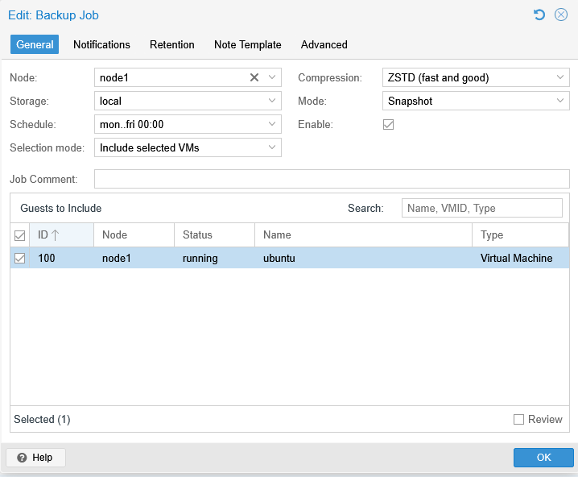
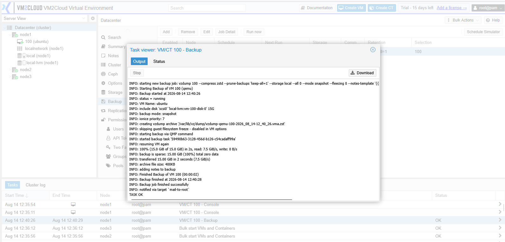
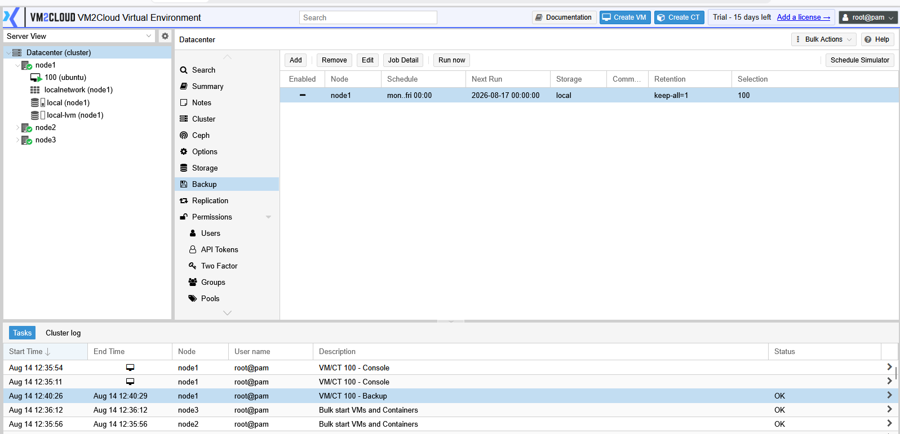

# Manage Backup Job

---

## Overview

This page covers editing, running, disabling, and removing existing backup jobs at **Datacenter → Backup**, and reviewing whether they are actually working.

Creating a job is the easy part. Keeping it correct as guests are added, storage fills, and requirements change is the ongoing work.

For how backup jobs work, see [Backup Jobs Overview](Backup-Jobs-Overview.md). For creating one, see [Create Backup Job](Create-Backup-Job.md).

---

## When to Use

Manage backup jobs when:

* A new guest needs adding to an existing job.
* The schedule or backup window must change.
* Retention needs adjusting because storage is filling.
* A job needs pausing during maintenance.
* A job is failing and needs investigating.
* A job is obsolete and should be removed.
* You are auditing whether every guest is actually protected.

---

## Prerequisites

Before managing backup jobs, ensure that:

* You have administrator privileges.
* You know which guests the job currently covers.
* You understand the impact of the change on retention and storage.
* The cluster has quorum.

---

# Procedure

## Step 1: Open the Backup Panel

1. Log in to the VM2Cloud VE web interface.
2. Select **Datacenter** in the resource tree.
3. Click **Backup**.

---

**Backup Job List**

---

## Step 2: Review What a Job Actually Covers

Do not assume the selection is still correct.

1. Select the job.
2. Click **Job Detail**.
3. Review the list of guests the job resolves to right now.

This is the check that catches unprotected guests. A job created six months ago with a fixed guest list will not include anything deployed since.

---

**Job Detail View**

---

## Step 3: Edit a Job

1. Select the job.
2. Click **Edit**.
3. Change the required settings.
4. Click **OK**.

Changes take effect from the next scheduled run. Backups already taken are unaffected, except that reducing retention will cause older backups to be pruned on the next run.

> **Warning:** Reducing retention deletes backups that fall outside the new policy the next time the job runs. Confirm you do not need those restore points before saving.

---

**Editing a Backup Job**

---

## Step 4: Add a Guest to a Job

How you do this depends on the job's selection mode.

| Selection mode | How to add a guest |
|---|---|
| **Include selected VMs** | Edit the job and tick the new guest. |
| **Exclude selected VMs** | Already covered. Confirm the guest is not in the exclusion list. |
| **All** | Already covered. No action needed. |
| **Pool based** | Add the guest to the pool. See [Pools](../Permissions/Pools.md). |

With pool-based selection, backup coverage follows pool membership — which means assigning a guest to the right pool at creation protects it automatically.

---

## Step 5: Run a Job Manually

Useful before a risky change, or to test a job after editing it.

1. Select the job.
2. Click **Run now**.
3. Monitor the task output.
4. Confirm completion without errors.

A manual run does not affect the schedule; the next automatic run happens as normal.

---

**Manual Job Run**

---

## Step 6: Disable a Job Temporarily

Preferable to deleting when you need a pause.

1. Select the job.
2. Click **Edit**.
3. Clear **Enable**.
4. Click **OK**.

The job stays configured but does not run. Re-enable it the same way.

> **Warning:** A disabled job provides no protection. Set a reminder to re-enable it — a job disabled "temporarily" during maintenance and then forgotten is a common way to discover, months later, that nothing has been backed up.

---

**Disabled Job**

---

## Step 7: Review Job Results

1. Check the task log for recent backup tasks.
2. Confirm each run completed.
3. Investigate any failures.
4. Confirm every guest in the job appears in the run output.

A job can succeed overall while skipping an individual guest. Check per-guest results, not just the job status.

---

**Backup Task History**

> **Capture:** The task log filtered to backup tasks, showing several completed runs
> with their status.

---

## Step 8: Remove a Job

1. Select the job.
2. Click **Remove**.
3. Confirm.

> **Warning:** Removing a job stops all future backups for the guests it covered. Confirm another job covers them, or that they genuinely no longer need protection. Removing the job does not delete existing backup files — those remain on the storage until pruned or deleted manually.

---

# Configuration / Options

Editable settings are the same as at creation. See [Create Backup Job](Create-Backup-Job.md) for the full reference.

Controls on the Backup panel:

| Control | Purpose |
|---|---|
| **Add** | Create a new job. |
| **Edit** | Change an existing job's settings. |
| **Remove** | Delete the job. Existing backup files are not removed. |
| **Run now** | Trigger the job immediately without affecting its schedule. |
| **Job Detail** | Show which guests the job currently resolves to. |

> **Verify:** Confirm the exact control labels on the Datacenter → Backup panel.

---

# Verification

Verify the following:

* The job list shows the intended jobs, with the intended enabled state.
* Job Detail resolves to the guests you expect.
* Every guest in your environment is covered by at least one job.
* Recent runs completed successfully.
* Per-guest results show no silent skips.
* Backup files on the target storage match the retention policy.
* Free space on backup storage is stable over several cycles.
* Disabled jobs are disabled deliberately, and someone knows why.

---

# Common Issues

| Issue | Resolution |
|-------|------------|
| A guest is not backed up | Check Job Detail. The selection mode probably uses a fixed list. |
| Job no longer runs | The job is disabled, or the schedule was changed. |
| Storage filling despite retention | Retention applies per job. Several jobs writing to one storage each keep their own history. |
| Editing retention deleted backups | Reducing retention prunes older backups on the next run. This is expected. |
| Job succeeds but a guest is skipped | Check per-guest output. A locked, migrating, or offline guest may be skipped. |
| Removing a job did not free space | Backup files remain after job removal. Delete them from the storage content view. |
| Two jobs back up the same guest | Duplicate coverage wastes space and time. Consolidate. |
| Cannot edit or remove a job | Confirm administrator privileges and cluster quorum. |

---

# Best Practices

- Audit coverage regularly using Job Detail, not by reading the job configuration.
- Review job results weekly. A schedule that runs is not the same as a backup that works.
- Prefer disabling to deleting, and record why a job was disabled.
- Set a reminder whenever you disable a job.
- Use pool-based selection so coverage follows pool membership automatically.
- Consolidate overlapping jobs rather than letting duplicates accumulate.
- Adjust retention before storage fills, not after jobs start failing.
- Run a job manually after any edit to confirm it still works.
- Keep a record of which job protects which guests, with what retention.
- Test restores periodically, not just backups.

---

# Related Documentation

- [Backup Jobs Overview](Backup-Jobs-Overview.md)
- [Create Backup Job](Create-Backup-Job.md)
- [Backup Retention](Backup-Retention.md)
- [Backup and Restore VM](../../04-Virtual-Machines/Backup-and-Restore-VM.md)
- [Backup and Restore Container](../../05-Containers/Backup-and-Restore-Container.md)
- [Pools](../Permissions/Pools.md)
- [Manage Storage](../Storage/Manage-Storage.md)

---

# Summary

Managing backup jobs is mostly about confirming they still do what you think. Use **Job Detail** to see which guests a job actually resolves to, review run results rather than assuming success, and check per-guest output for silent skips. Prefer disabling over deleting, always record why, and remember that a disabled job protects nothing. Reducing retention prunes existing backups on the next run, and removing a job leaves its backup files behind on the storage.
