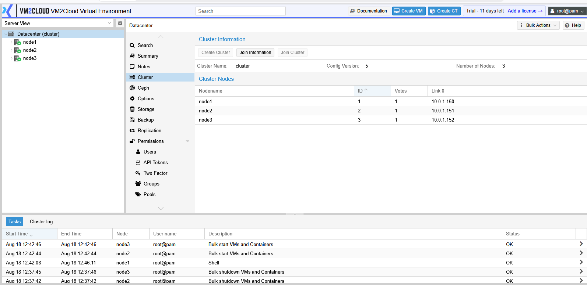
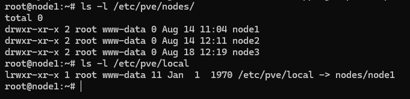

# Cluster Certificates

---

## Overview

VM2Cloud VE uses **cluster certificates** to establish secure communication between nodes within a cluster. These certificates help ensure that management traffic exchanged between cluster members is authenticated and encrypted.

When a node joins a cluster, VM2Cloud VE automatically distributes and synchronizes the required certificates. Administrators normally do not need to manually manage these certificates during routine cluster operations.

---

## Purpose

Cluster certificates are used to:

- Authenticate communication between cluster nodes.
- Secure management traffic.
- Establish trust between cluster members.
- Support secure access to cluster resources.
- Protect cluster configuration synchronization.

---

## How Cluster Certificates Work

Each node has its own certificate and private key.

When a new node joins the cluster:

- The cluster verifies the joining node.
- Required certificates are synchronized automatically.
- Trust is established between all cluster members.
- Secure communication is enabled.

Administrators are not required to manually copy certificate files between nodes.

---

## Certificate Synchronization

Cluster certificates are automatically synchronized as part of the cluster configuration.

Whenever a new node joins the cluster, VM2Cloud VE distributes the required certificates to maintain trusted communication.

No manual synchronization is required.

---

## When Certificate Management May Be Required

Although certificate management is automatic, administrators may need to regenerate certificates in situations such as:

- Hostname changes.
- IP address changes affecting node communication.
- Certificate corruption.
- Certificate expiration.
- Cluster recovery procedures.

These tasks should only be performed during maintenance windows or when instructed by VM2Cloud VE documentation or support.

---

# Verify Cluster Certificates

## Step 1: Open the Cluster

1. Log in to the VM2Cloud VE web interface.
2. Verify that all cluster nodes are online.
3. Confirm that cluster communication is functioning normally.

If cluster communication is healthy, certificate synchronization is typically functioning correctly.

---

### Screenshot 1

**Healthy Cluster**



All three nodes online with the cluster reporting its full node count. There is no
certificate view at this level — a healthy cluster panel is itself the indication that
certificate synchronisation is working, because nodes could not communicate otherwise.

---

## Verify Using the CLI

For troubleshooting purposes, administrators can verify the cluster certificate files from the command line.

Example:

```bash
ls -l /etc/pve/nodes/
```

This command displays the configuration directories for cluster nodes.

To view certificate files:

```bash
ls -l /etc/pve/local
```

---

### Screenshot 2

**Certificate Directory**



`/etc/pve/nodes/` holds one directory per cluster member, each containing that node's own
certificate and key. `/etc/pve/local` is a **symlink to the current node's directory** —
`nodes/node1` here — which is how the same path resolves to different files on each node.
Anything written under `/etc/pve/local` on one node is that node's own configuration, not
shared state.

---

## Best Practices

- Use unique hostnames for all cluster nodes.
- Configure DNS correctly before creating a cluster.
- Synchronize system time on all nodes.
- Do not manually copy certificate files between nodes.
- Avoid modifying certificate files unless required for troubleshooting.
- Perform certificate-related maintenance during scheduled maintenance windows.

---

# Verification

Verify the following:

- All cluster nodes communicate successfully.
- Nodes appear online in the cluster.
- No certificate-related errors are displayed.
- Cluster operations complete successfully.

---

# Common Issues

| Issue | Resolution |
|--------|------------|
| Node cannot join the cluster | Verify hostname resolution, network connectivity, and cluster communication. |
| Certificate verification failed | Confirm that the node belongs to the correct cluster and that system time is synchronized. |
| Secure communication failed | Verify network connectivity and confirm that cluster services are running on all nodes. |
| Certificate synchronization issue | Check cluster health and ensure quorum has been established. |

---

# Related Documentation

- Cluster Overview
- Create Cluster
- Join Node to Cluster
- Cluster Quorum
- Cluster File System
- Cluster Troubleshooting

---

# Summary

Cluster certificates enable secure communication between VM2Cloud VE cluster nodes. They are automatically created and synchronized during cluster operations, allowing administrators to securely manage the cluster without manual certificate distribution under normal operating conditions.
