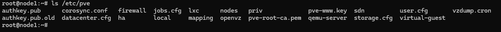

# Cluster File System

---

## Overview

The **Cluster File System (pmxcfs)** is a distributed file system used by VM2Cloud VE to store and synchronize cluster configuration across all nodes.

Unlike traditional file systems, the Cluster File System stores configuration information instead of virtual machine data. When a configuration change is made on one node, it is automatically synchronized with all other nodes in the cluster.

This allows administrators to manage the entire cluster from any cluster node while maintaining a consistent configuration.

---

## Purpose

The Cluster File System is responsible for:

- Storing cluster configuration.
- Synchronizing configuration between cluster nodes.
- Providing a consistent configuration database.
- Allowing centralized cluster management.
- Supporting cluster-wide administration.

---

## How the Cluster File System Works

The Cluster File System runs on every cluster node.

Configuration data is synchronized through the cluster communication service (Corosync).

When an administrator modifies a configuration file through the VM2Cloud VE web interface or supported management tools, the change is automatically propagated to the other cluster members.

The synchronization process is automatic and does not require manual intervention.

---

## Configuration Location

Cluster configuration is stored in:

```text
/etc/pve
```

This directory is managed by the Cluster File System.

Do not manually copy configuration files between cluster nodes. The Cluster File System automatically maintains consistency.

---

## Information Stored in the Cluster File System

The Cluster File System stores configuration such as:

- Cluster configuration
- Virtual Machine configuration
- Container configuration
- Storage configuration
- Network configuration
- User and permission configuration
- Firewall configuration
- High Availability configuration
- Replication configuration
- SSL certificates

Virtual machine disks, container disks, ISO images, backups, and other storage content are **not** stored in the Cluster File System.

---

## Benefits

The Cluster File System provides:

- Centralized configuration management.
- Automatic synchronization.
- Consistent configuration across all nodes.
- Simplified cluster administration.
- Reduced configuration errors.

---

## View the Cluster Configuration Directory

The Cluster File System operates automatically and does not require routine administration through the web interface.

For verification or troubleshooting, administrators can view the configuration directory using the CLI.

```bash
ls /etc/pve
```

The directory contains cluster configuration files and folders managed by VM2Cloud VE.

---

### Screenshot 1

**Cluster Configuration Directory**



Every entry here is replicated to all members. `corosync.conf` carries the cluster
membership, `storage.cfg` and `datacenter.cfg` the cluster-wide configuration, `user.cfg`
the access control database, and `qemu-server/` and `lxc/` the guest configurations —
which is why a guest can be started on any node. `mapping/` and `virtual-guest/` hold the
resource mappings and custom CPU models. `local` and `nodes/` are the per-node view
described in [Cluster Certificates](Cluster-Certificates.md).

---

## Common Configuration Directories

Examples of directories commonly found under `/etc/pve` include:

| Directory | Description |
|-----------|-------------|
| nodes/ | Node-specific configuration. |
| qemu-server/ | Virtual Machine configuration files. |
| lxc/ | Container configuration files. |
| storage.cfg | Storage configuration. |
| user.cfg | User, group, role, and permission configuration. |
| firewall/ | Cluster firewall configuration. |
| ha/ | High Availability configuration. |

---

## Important Considerations

- Do not manually edit cluster configuration files unless instructed by VM2Cloud VE documentation or support.
- Do not delete files from `/etc/pve`.
- Ensure reliable communication between cluster nodes to maintain synchronization.
- Loss of quorum may temporarily prevent configuration updates.

---

## Verification

Verify the following:

- The `/etc/pve` directory is accessible.
- Configuration changes are synchronized across cluster nodes.
- Newly created virtual machines appear on all cluster nodes.
- Storage and permission changes are visible throughout the cluster.

---

## Common Issues

| Issue | Resolution |
|--------|------------|
| Configuration changes are not synchronized | Verify cluster communication and quorum status. |
| Unable to access `/etc/pve` | Confirm that cluster services are running and the node is part of the cluster. |
| Missing configuration files | Verify that the affected node is connected to the cluster. |
| Configuration appears outdated | Ensure that cluster communication is healthy and synchronization is functioning correctly. |

---

## Related Documentation

- Cluster Overview
- Create Cluster
- Cluster Quorum
- Cluster Certificates
- Cluster Troubleshooting

---

## Summary

The Cluster File System (pmxcfs) provides centralized and synchronized configuration management for VM2Cloud VE clusters. By automatically distributing configuration changes across all cluster nodes, it enables consistent administration and simplifies the management of clustered environments while maintaining configuration integrity.
