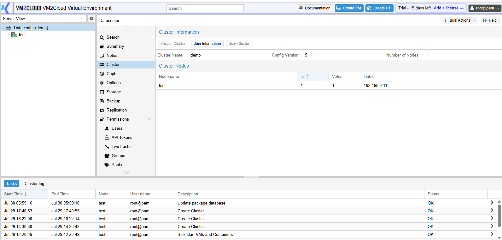
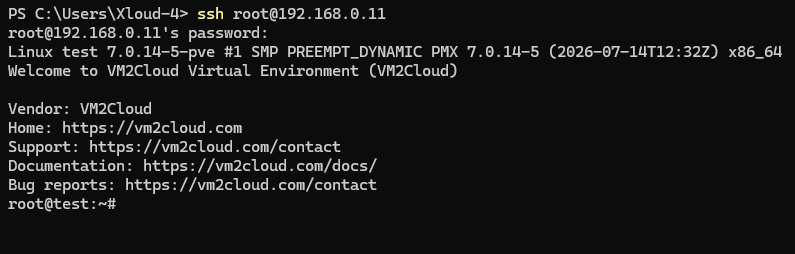
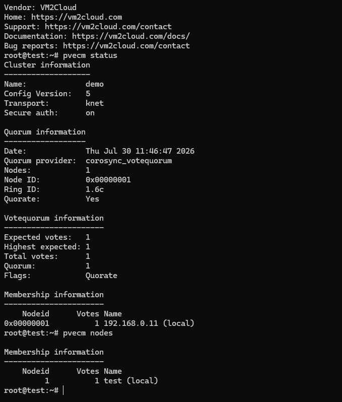
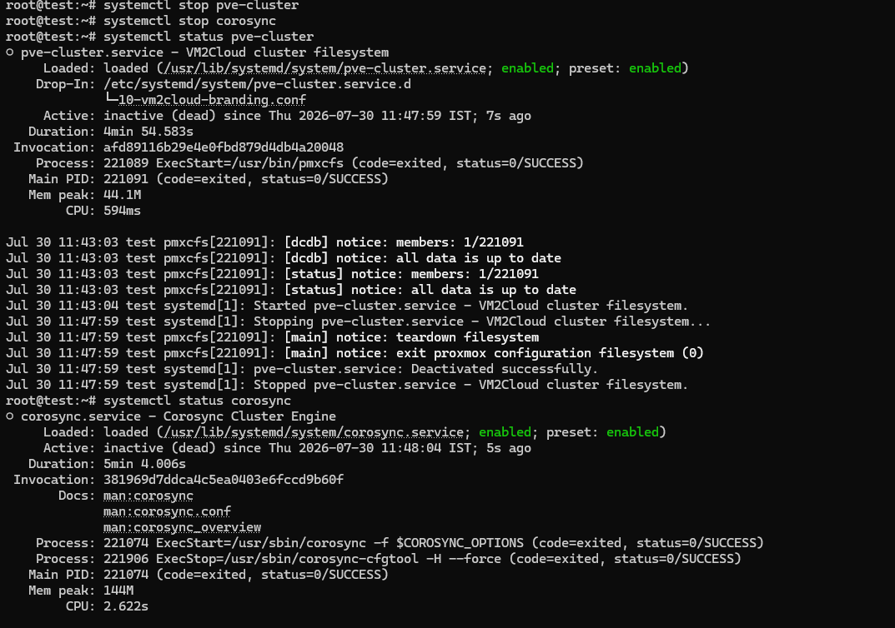
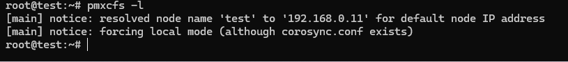
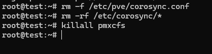
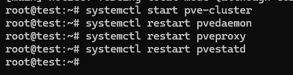
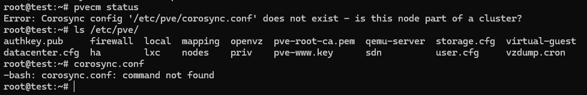
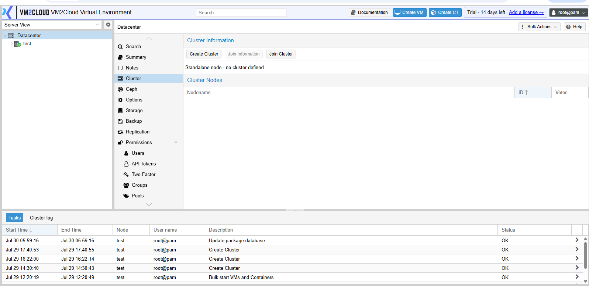

# Delete Cluster

---

## Overview

Deleting a cluster permanently removes the cluster configuration from the VM2Cloud VE node. This operation is typically performed when decommissioning a cluster, rebuilding the environment, or converting a clustered node back to a standalone server.

> **Important:** Cluster deletion cannot be performed from the VM2Cloud VE web interface. This operation must be completed using the command line.

---

## When to Use

Delete a cluster when you need to:

* Decommission an existing cluster.
* Rebuild the cluster from scratch.
* Convert a clustered node into a standalone server.
* Remove an unused test or lab cluster.

---

## Prerequisites

Before deleting the cluster, ensure that:

* You have administrator privileges.
* All virtual machines and containers have been migrated or backed up.
* All additional nodes have been removed from the cluster.
* The node you are working on is the last remaining node.
* A recent backup of important data is available.

---

# Procedure

---

## Step 1: Verify the Cluster

1. Log in to the **VM2Cloud VE web interface**.

2. Navigate to:

```
Datacenter → Cluster
```

3. Verify that all additional nodes have already been removed.

4. Confirm the node that will be converted into a standalone VM2Cloud VE host.

---


**Cluster Overview**





---

# Step 2: Connect to the Server

1. Open an SSH session or access the local console.

2. Log in using an administrator account.

Example:

```bash
ssh root@<node-ip-address>
```

---


**SSH Session**





---

# Step 3: Verify Current Cluster Status

Before deleting the cluster, verify the existing cluster configuration.

Check cluster status:

```bash
pvecm status
```

Check cluster nodes:

```bash
pvecm nodes
```

---


**Cluster Status Verification**




---

# Step 4: Stop Cluster Services

Stop the VM2Cloud VE cluster services:

```bash
systemctl stop pve-cluster
systemctl stop corosync
```

Verify service status:

```bash
systemctl status pve-cluster
systemctl status corosync
```

---


**Stop Cluster Services**





---

# Step 5: Start VM2Cloud VE Cluster Filesystem in Local Mode

The `/etc/pve` directory is managed by the VM2Cloud VE cluster filesystem.

Before removing cluster configuration, start the filesystem in local mode.

Run:

```bash
pmxcfs -l
```

Expected output:

```text
[main] notice: forcing local mode
```

> **Note:** Keep this process running. Open another SSH session to continue the next steps.

---


**VM2Cloud VE Cluster Filesystem Local Mode**





---

# Step 6: Remove Cluster Configuration

Remove the cluster configuration file:

```bash
rm -f /etc/pve/corosync.conf
```

Remove Corosync configuration files:

```bash
rm -rf /etc/corosync/*
```

Stop the local VM2Cloud VE cluster filesystem process:

```bash
killall pmxcfs
```

---


**Remove Cluster Configuration**





---

# Step 7: Restart VM2Cloud VE Services

Start the VM2Cloud VE cluster filesystem service:

```bash
systemctl start pve-cluster
```

Restart VM2Cloud VE management services:

```bash
systemctl restart pvedaemon
systemctl restart pveproxy
systemctl restart pvestatd
```

---


**Restart VM2Cloud VE Services**





---

# Step 8: Verify Cluster Removal

Check cluster status:

```bash
pvecm status
```

Expected output:

```text
Error: Corosync config '/etc/pve/corosync.conf' does not exist
```

Verify that the cluster configuration file is removed:

```bash
ls /etc/pve/
```

Confirm that:

```text
corosync.conf
```

is no longer present.

---


**Cluster Removal Verification**





---

# Step 9: Verify Standalone Mode From VM2Cloud VE Interface

1. Refresh the VM2Cloud VE web interface.

2. Navigate to:

```
Datacenter → Cluster
```

3. Confirm that:

* No cluster name is displayed.
* No cluster nodes are listed.
* The server appears as a standalone VM2Cloud VE host.

---


**Standalone Node**





---

# Verification Checklist

Verify the following:

* Cluster configuration has been removed.
* Corosync configuration has been deleted.
* Node operates as a standalone VM2Cloud VE host.
* Cluster membership information is no longer visible.
* Virtual machines are still available.
* Storage configuration remains unchanged.
* Node can create a new cluster or join another cluster.

---

# Common Issues

| Issue | Resolution |
| --- | --- |
| Unable to remove `/etc/pve/corosync.conf` | Start VM2Cloud VE cluster filesystem in local mode using `pmxcfs -l` before deleting the file. |
| Permission denied while removing cluster file | `/etc/pve` is managed by the VM2Cloud VE cluster filesystem. Stop services and use local mode. |
| Cluster information still appears | Restart VM2Cloud VE services and refresh the web interface. |
| Node fails after removing cluster | Check Corosync configuration and service status. |
| Command execution fails | Review command output and fix reported errors before continuing. |

---

# Summary

The cluster has been successfully removed from the VM2Cloud VE node.

The server now operates as a standalone VM2Cloud VE host.

Existing virtual machines, containers, storage pools, and data remain unchanged.

The node can later be used to:

* Create a new VM2Cloud VE cluster.
* Join an existing VM2Cloud VE cluster.
* Operate as an independent virtualization host.
