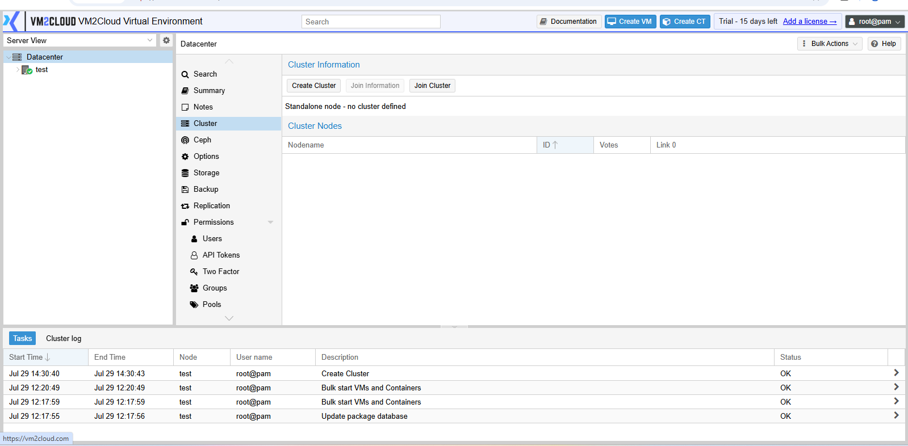
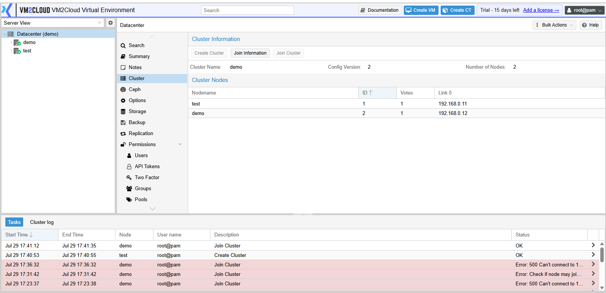

# Re-Add a Removed Node

---

## Overview

A node that has been removed from a cluster **cannot simply rejoin it**. The hardware must be reinstalled first.

This surprises people, and attempting the shortcut causes real damage, so it is worth understanding why.

When a node is removed with `pvecm delnode`, the cluster forgets it — its entry, its keys, and its configuration are purged from the remaining members. The removed node, however, still holds a complete copy of the old cluster configuration: the cluster name, the member list, the corosync configuration, and its own copy of the cluster file system.

That machine still believes it is a member of a cluster that no longer recognises it. Pointing it back at the cluster produces two disagreeing views of the same cluster, which can corrupt the cluster file system and affect the healthy nodes as well as the returning one.

The supported path is: **reinstall VM2Cloud VE on that hardware, then join it as a new node.**

> **Warning:** Never attempt to rejoin a previously removed node without reinstalling. The consequences land on the *working* cluster, not just the node you are adding.

For removing a node in the first place, see [Remove Node from Cluster](Remove-Node-from-Cluster.md).

---

## When to Use

Use this procedure when:

* A node was removed and now needs to return to the cluster.
* Hardware was repaired after a failure and the node had been removed during the outage.
* A node was removed in error.
* Hardware is being repurposed back into the cluster.

If the node is still a cluster member and merely offline, this does not apply — bring it back online and it rejoins on its own. Check with `pvecm nodes` first.

---

## Prerequisites

Before re-adding a node, ensure that:

* The node was genuinely removed — confirm with `pvecm nodes` on a working node.
* The cluster is healthy and has quorum.
* You have installation media for VM2Cloud VE.
* You have console or physical access to the hardware being reinstalled.
* **Any data on that node has been backed up or is no longer needed.** Reinstallation destroys it.
* You know the hostname and IP address the node will use.
* You have the root password for an existing cluster node.

---

# Procedure

## Step 1: Confirm the Node Was Properly Removed

On a working cluster node:

```bash
pvecm nodes
```

The node should **not** appear. If it does, it was never fully removed — complete [Remove Node from Cluster](Remove-Node-from-Cluster.md) before continuing.

Also confirm no leftover directory remains for it:

```bash
ls /etc/pve/nodes/
```

If a directory for the removed node is still present, the cluster has not fully forgotten it. Resolve that first; a stale entry will conflict with the rejoining node, particularly if you reuse the same hostname.

---

### Screenshot 1

**Confirming the Node Is Absent**

```text
[ Place Screenshot Here ]
```

> **Capture:** A shell on a **remaining** cluster node, showing `pvecm nodes` and
> `ls /etc/pve/nodes/` in one frame, taken after a node has been removed. The removed
> node must be absent from both — that is what the step asks the reader to confirm.

---

## Step 2: Decide on the Hostname and Address

You may reuse the previous hostname and IP, or choose new ones.

| Choice | Consideration |
|---|---|
| **Reuse** | Simpler for documentation and monitoring. Requires the old entry to be fully purged, verified in Step 1. |
| **New** | Avoids any chance of a stale reference. Means updating anything that referenced the old name. |

If Step 1 showed any leftover entry, use a new name until the old one is properly cleared.

---

## Step 3: Back Up Anything Still Needed

Reinstallation erases the node.

Confirm that:

* Any guests that were on it have been migrated, restored elsewhere, or are genuinely expendable.
* Local storage contains nothing needed.
* Node-specific configuration you want to keep has been recorded.

> **Warning:** Reinstalling destroys all local data on the node, including any guest still stored on it. Verify before proceeding — this step cannot be undone.

---

## Step 4: Reinstall VM2Cloud VE

1. Boot the hardware from the installation media.
2. Install VM2Cloud VE.
3. Set the hostname and network configuration decided in Step 2.
4. Complete the installation and let the node boot.

The node comes up standalone, with no cluster configuration — which is exactly what is required.

---

## Step 5: Prepare the Fresh Node

Before joining, confirm the basics. A node that joins with the wrong time or an unreachable name causes problems that are harder to diagnose afterwards.

1. Confirm the node is reachable on the network.
2. Confirm its hostname resolves correctly from the existing cluster nodes, and theirs from it. See [Hosts](../../03-Nodes/System/Hosts.md).
3. Confirm time is synchronized. See [Time and NTP](../../03-Nodes/System/Time-and-NTP.md).
4. Confirm it has no guests configured.

Time synchronization matters more than it appears — cluster communication and certificate validation both depend on it.

---

### Screenshot 2

**Freshly Installed Node**



The Cluster panel of a node with no cluster configuration reads **Standalone node - no cluster defined**, and the Cluster Nodes table is empty. A reinstalled node looks exactly like a node that has never been clustered, which is the state the join procedure expects.

---

## Step 6: Join the Cluster

Follow the normal join procedure — the node is new as far as the cluster is concerned.

See [Join Node to Cluster](Join-Node-to-Cluster.md) for the full workflow, including obtaining the join information from an existing node.

---

## Step 7: Verify the Node Rejoined

On any cluster node:

```bash
pvecm nodes
```

The node should appear as a member.

```bash
pvecm status
```

Confirm expected votes increased to include it, and the cluster is quorate.

In the interface, confirm the node appears in the resource tree and reports **Online**.

---

### Screenshot 3

**Node Rejoined**

```text
[ Place Screenshot Here ]
```

> **Capture:** `pvecm nodes` and `pvecm status` run on an existing cluster node after
> the rejoin, in one frame. The membership list must show every node including the
> returned one, and **Total votes** must match the full node count — that contrast with
> the reduced count during removal is the whole point of the shot.

---

### Screenshot 4

**Node Online in the Interface**



The rejoined node appears in the resource tree alongside the existing members, and the Cluster Nodes table lists it with its own ID, one vote, and its address.

---

## Step 8: Restore the Node to Service

1. Reconfigure storage that should be available on this node. See [Add Storage](../Storage/Add-Storage.md).
2. Reconfigure networking — bridges, bonds, VLANs. See [Network Overview](../../03-Nodes/System/Network/Network-Overview.md).
3. Re-apply the node firewall configuration if used. See [Node Firewall](../../03-Nodes/Node-Firewall.md).
4. Migrate guests back, or restore them from backup.
5. Add the node to HA placement rules if it should host HA resources.
6. Confirm backup jobs covering this node still resolve correctly. See [Manage Backup Job](../Backup/Manage-Backup-Job.md).

A reinstalled node keeps none of its previous configuration. Everything node-specific must be set up again.

---

# Configuration / Options

| Command | Purpose |
|---|---|
| `pvecm nodes` | List cluster members. Confirms whether a node is present. |
| `pvecm status` | Show quorum state and expected votes. |
| `ls /etc/pve/nodes/` | Show per-node directories, revealing stale entries. |

> **Verify:** Confirm whether the interface exposes the cluster member list anywhere that
> makes Step 1 possible without the shell.

---

# Verification

Verify the following:

* `pvecm nodes` lists the node as a member.
* `pvecm status` shows expected votes including it, and the cluster quorate.
* The node reports **Online** in the resource tree.
* The cluster file system is writable.
* Storage configured for the node is accessible from it.
* Networking matches the other nodes where it should.
* Migration to and from the node works.
* HA rules referencing the node behave as intended.
* Backup jobs resolve to the expected guests.

Test a migration to the node before returning production workloads to it.

---

# Common Issues

| Issue | Resolution |
|-------|------------|
| Join fails with a name or address conflict | The old entry was not fully purged. Check `/etc/pve/nodes/` on every cluster node. |
| Join fails with a certificate error | Usually a time synchronization problem. Confirm time on both sides. |
| Node appears offline after joining | Check network connectivity and cluster communication. See [Cluster Troubleshooting](Cluster-Troubleshooting.md). |
| Cluster file system errors after joining | A node was rejoined without reinstalling. Remove it, reinstall, and join again. |
| Node joined but guests will not migrate to it | Storage available on the source is not configured on the new node. |
| Expected votes did not increase | The join did not complete. Check `pvecm status` and the join task output. |
| Old node name still visible in the interface | A stale directory remains. Resolve before reusing the name. |
| HA does not place resources on the node | It is not included in the relevant placement rules. See [Node Affinity](../HA/Node-Affinity.md). |

---

# Best Practices

- **Always reinstall.** There is no supported shortcut, and the failure mode damages the working cluster.
- Confirm the node is genuinely absent from the cluster before reinstalling, so you are not solving the wrong problem.
- Check `/etc/pve/nodes/` on every cluster node, not only the one you happen to be on.
- Verify backups of anything on the node before erasing it.
- Synchronize time before joining. It prevents the most common join failure.
- Prefer a new hostname when there is any doubt about stale entries.
- Rebuild storage and network configuration to match the other nodes deliberately, rather than assuming defaults match.
- Test a migration before returning production workloads.
- Record why the node was removed and re-added.

---

# Related Documentation

- [Remove Node from Cluster](Remove-Node-from-Cluster.md)
- [Join Node to Cluster](Join-Node-to-Cluster.md)
- [Cluster Overview](Cluster-Overview.md)
- [Quorum](Quorum.md)
- [Recover Quorum](Recover-Quorum.md)
- [Cluster Troubleshooting](Cluster-Troubleshooting.md)
- [Hosts](../../03-Nodes/System/Hosts.md)
- [Time and NTP](../../03-Nodes/System/Time-and-NTP.md)
- [Node Firewall](../../03-Nodes/Node-Firewall.md)
- [Add Storage](../Storage/Add-Storage.md)

---

# Summary

A removed node cannot rejoin its old cluster. It still holds the previous cluster configuration while the cluster has purged every trace of it, and forcing the two together can corrupt the cluster file system on the healthy nodes as well as the returning one.

The supported path is to reinstall VM2Cloud VE on the hardware and join it as a new node. Before reinstalling, confirm the node is genuinely absent and that no stale directory remains under `/etc/pve/nodes/` on any member. Afterwards, remember the node keeps nothing — storage, networking, firewall rules, and HA placement all have to be configured again.
