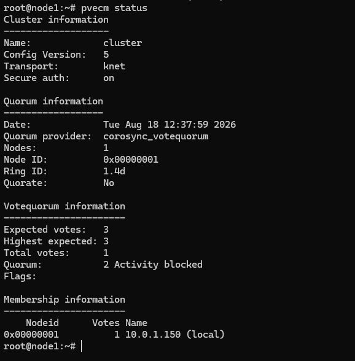
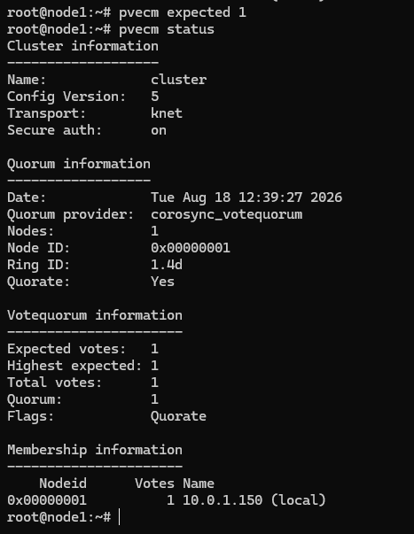

# Recover Quorum

---

## Overview

When a VM2Cloud VE cluster loses quorum, the cluster file system becomes **read-only**. You cannot start or stop guests, change configuration, or perform most administrative operations. The interface still loads and still shows the environment, but nothing can be changed.

This page covers restoring operation when quorum has been lost and the missing nodes cannot be brought back quickly.

The recovery command is `pvecm expected`, which temporarily lowers the number of votes the cluster requires. **There is no interface equivalent** — the cluster cannot repair its own quorum from a read-only state, so this is a console operation.

For what quorum is and how votes are counted, see [Quorum](Quorum.md).

> **Warning:** This procedure deliberately disables the protection that prevents split-brain. If you lower expected votes while the "missing" nodes are actually still running — reachable by their guests, just not by this node — you create two independent clusters that both believe they are authoritative. Both will write to shared storage. **This corrupts data, and the corruption is not recoverable.**
>
> Never run `pvecm expected` until you have positively confirmed the missing nodes are powered off or otherwise incapable of running workloads.

---

## When to Use

Use this procedure when **all** of the following are true:

* The cluster reports it is not quorate.
* Configuration changes are being rejected, or the cluster file system is read-only.
* The missing nodes cannot be restored quickly — hardware failure, extended outage.
* You have **positively confirmed** the missing nodes are powered off.
* Workloads must be restored before the missing nodes can return.

Do **not** use it when:

* The missing nodes are merely unreachable over the network but may still be running.
* You have not physically or otherwise verified their state.
* The nodes can simply be brought back online — do that instead.
* You are troubleshooting a transient network problem that is likely to resolve.

A network partition looks identical to a node failure from this side. That is exactly why the confirmation step matters.

---

## Prerequisites

Before recovering quorum, ensure that:

* You have console, SSH, or physical access to a surviving node. The web interface may be unable to perform actions.
* You have **verified the state of every missing node** — powered off, disconnected, or confirmed failed.
* You know how many nodes the cluster expects and how many are currently voting.
* You understand this is a temporary measure, not a fix.
* You have a plan to restore proper quorum afterwards.

---

# Procedure

## Step 1: Confirm the Cluster Is Not Quorate

Open a shell on a surviving node. See [Shell](../../03-Nodes/Shell.md).

```bash
pvecm status
```

Review the output:

* **Expected votes** — how many the cluster wants.
* **Total votes** — how many it currently has.
* **Quorate** — whether the requirement is met.

If quorate reports `Yes`, quorum is not your problem and this procedure does not apply.

---

### Screenshot 1

**Cluster Status Showing Loss of Quorum**



A three-node cluster with two nodes down. **Expected votes: 3** against **Total votes: 1**,
`Quorate: No`, and the Quorum line reads **`2 Activity blocked`** — the cluster wants two
votes and has one. Only the surviving node appears in the membership list.

---

## Step 2: Identify Which Nodes Are Missing

```bash
pvecm nodes
```

This lists the cluster members and which are currently visible.

Note every node that is not participating. You must account for each one in the next step.

---

## Step 3: Verify the Missing Nodes Are Genuinely Down

**Do not skip this. Do not assume.**

For each missing node, confirm by a means that does not depend on the cluster network:

* Check the physical power state, or the out-of-band management interface (iDRAC, iLO, IPMI, or equivalent).
* Confirm with whoever manages the hardware or the data centre.
* If it is a virtual node, check the state in its hypervisor.

Ask specifically: **could this node still be running guests right now?**

If you cannot answer that with certainty, stop. Restoring the network or bringing the node back is safer than guessing.

> **Warning:** "I cannot ping it" is not confirmation. A node isolated by a switch or firewall failure is unreachable *and* still running, still holding its guests, still writing to shared storage. That is precisely the situation this protection exists for.

---

## Step 4: Calculate the New Expected Votes

Set expected votes to the number of nodes that are **currently running and reachable**.

| Situation | Surviving nodes | Command |
|---|---:|---|
| Two-node cluster, one node dead | 1 | `pvecm expected 1` |
| Three-node cluster, two nodes dead | 1 | `pvecm expected 1` |
| Five-node cluster, two nodes dead | 3 | `pvecm expected 3` |

In the last case the cluster already has 3 of 5 votes, which is a majority — it would still be quorate and no action would be needed. Only lower expected votes when the survivors genuinely do not form a majority.

---

## Step 5: Lower the Expected Votes

On a surviving node:

```bash
pvecm expected 1
```

Substitute the number calculated in the previous step.

The cluster immediately re-evaluates. The cluster file system becomes writable and normal operations resume.

---

### Screenshot 2

**Setting Expected Votes**



`pvecm expected 1` prints nothing; the following `pvecm status` shows the effect.
**Expected votes** and **Quorum** are both now 1, `Quorate: Yes`, and **Flags: Quorate**.
The Activity blocked note is gone and the cluster file system is writable again.

Note that **Highest expected** also dropped to 1. The output no longer records that this is
a three-node cluster — see the warning under [Configuration / Options](#configuration--options).

---

## Step 6: Verify the Cluster Is Writable

```bash
pvecm status
```

Confirm **Quorate** now reports `Yes`.

Then confirm the cluster file system is writable:

```bash
touch /etc/pve/.write-test && rm /etc/pve/.write-test && echo "writable"
```

If that succeeds, configuration changes will work again.

---

## Step 7: Restore Service

With the cluster writable, start the guests that need to run. See [Manage Virtual Machine](../../04-Virtual-Machines/Manage-Virtual-Machine.md) and [Manage Container](../../05-Containers/Manage-Container.md).

If HA is configured, HA may begin recovering resources on its own now that quorum exists. Monitor the task log.

---

## Step 8: Restore Proper Quorum

This is the step people skip, and it leaves the cluster unprotected.

The expected-votes change is **temporary**. It does not persist across a restart of the cluster communication service, and it leaves the cluster running without split-brain protection until the underlying situation is resolved.

Choose one:

**If the failed nodes will return:**

1. Repair and bring them back online.
2. Confirm they rejoin — `pvecm nodes`.
3. Confirm expected votes returns to the full count — `pvecm status`.

**If the failed nodes will not return:**

1. Remove them permanently. See [Remove Node from Cluster](Remove-Node-from-Cluster.md).
2. `pvecm delnode <node-name>` adjusts expected votes to match the reduced cluster.
3. Confirm the cluster is quorate at its new, correct size.

Do not leave a cluster running indefinitely on a manually lowered vote count.

---

# Configuration / Options

| Command | Purpose |
|---|---|
| `pvecm status` | Show quorum state, expected votes, total votes, and cluster members. |
| `pvecm nodes` | List cluster members and their current visibility. |
| `pvecm expected <n>` | Temporarily set the number of votes the cluster requires. |
| `pvecm delnode <name>` | Permanently remove a node and adjust expected votes. |

`pvecm status` groups its output into four blocks. The one that matters here is
**Votequorum information**:

| Field | Meaning |
|---|---|
| **Expected votes** | How many votes the cluster wants. This is what `pvecm expected` changes. |
| **Highest expected** | Tracks the same value. `pvecm expected` lowers this too — it does **not** preserve the original figure. |
| **Total votes** | How many votes are currently present. |
| **Quorum** | The number needed for a majority. When that number is not met, `Activity blocked` is appended to this line. |
| **Flags** | Reads `Quorate` when the requirement is met, and is **empty** when it is not. |

The **Quorate** line in the Quorum information block above gives the same answer as a plain
`Yes` or `No`.

> **Warning:** Once expected votes is lowered, `pvecm status` shows no trace of the
> cluster's real size — Expected votes, Highest expected, and Quorum all read the new
> number, and a cluster running degraded looks identical to a healthy cluster of that
> smaller size. Nothing will remind you. The only clue is the membership list being shorter
> than the cluster you know you built, which is why Step 8 exists and why it is the step
> people skip.

**The interface cannot help here.** Datacenter → Cluster reports the cluster name, config
version, node count, and a per-node table — but never the quorum state, whether the cluster
is healthy or not. Recovering quorum is a shell operation from beginning to end.

---

# Verification

Verify the following:

* `pvecm status` reports **Quorate: Yes**.
* The cluster file system accepts writes.
* Configuration changes succeed in the interface.
* Guests can be started and stopped.
* No unexpected guests started on more than one node.
* Shared storage shows no signs of concurrent access from a partitioned node.
* After the underlying problem is resolved, expected votes match the real cluster size.

That fifth check matters. If a supposedly dead node was actually running, you may see the same guest active in two places. Investigate immediately if so.

---

# Common Issues

| Issue | Resolution |
|-------|------------|
| `pvecm expected` reports an error | Confirm you are running it as root on a node that is part of the cluster. |
| Cluster still not quorate after the command | The number given may still be above the surviving vote count. Re-check `pvecm status`. |
| Cluster file system still read-only | Confirm the cluster reports quorate, then check the cluster file system service is running. See [Cluster File System](Cluster-File-System.md). |
| Quorum lost again after a restart | The setting is temporary by design. Resolve the underlying node failure or remove the dead nodes. |
| The same guest is running on two nodes | A partitioned node was still live. Stop one copy immediately and check storage integrity before continuing. |
| HA did not recover guests | HA requires quorum. It should act once quorum is restored; check the HA service state in [HA Troubleshooting](../HA/HA-Troubleshooting.md). |
| Nodes rejoined but votes look wrong | Confirm no removed node is still listed. See [Remove Node from Cluster](Remove-Node-from-Cluster.md). |

---

# Best Practices

- **Build clusters with an odd number of voting nodes** so a single failure never removes the majority. This is the fix that prevents needing this page.
- Consider a QDevice for two-node clusters, so one node failure does not lose quorum.
- Verify node state out-of-band before lowering expected votes — never from the cluster network alone.
- Treat lowered expected votes as an incident in progress, not a resolved state.
- Restore proper quorum the same day, either by returning the nodes or removing them.
- Keep out-of-band management access working and documented, so verification is possible under pressure.
- Record what you did and why. The next administrator needs to know the cluster is running with reduced protection.
- Rehearse this on a test cluster before you need it in production.

---

# Related Documentation

- [Quorum](Quorum.md)
- [Cluster Overview](Cluster-Overview.md)
- [Cluster File System](Cluster-File-System.md)
- [Remove Node from Cluster](Remove-Node-from-Cluster.md)
- [Cluster Troubleshooting](Cluster-Troubleshooting.md)
- [HA Overview](../HA/HA-Overview.md)
- [HA Troubleshooting](../HA/HA-Troubleshooting.md)
- [Fencing](../HA/Fencing.md)
- [Shell](../../03-Nodes/Shell.md)

---

# Summary

A cluster that loses quorum goes read-only and stays that way until enough votes return. When the missing nodes cannot be recovered quickly, `pvecm expected` lowers the vote requirement so the survivors can operate. There is no interface equivalent, because a read-only cluster cannot repair itself.

The command is safe only when the missing nodes are genuinely down. A network partition looks identical from this side, and lowering votes during one produces two clusters that both believe they are authoritative — which corrupts shared storage unrecoverably. Verify node state out-of-band first, treat the lowered count as a temporary measure, and restore proper quorum by returning or removing the failed nodes as soon as possible.
