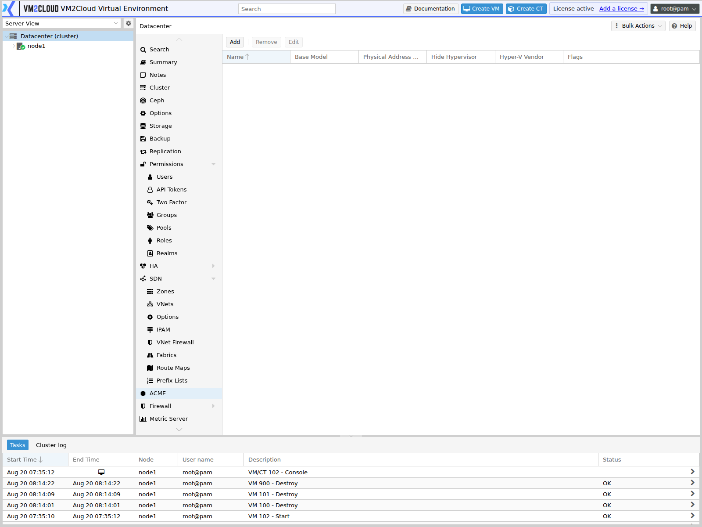
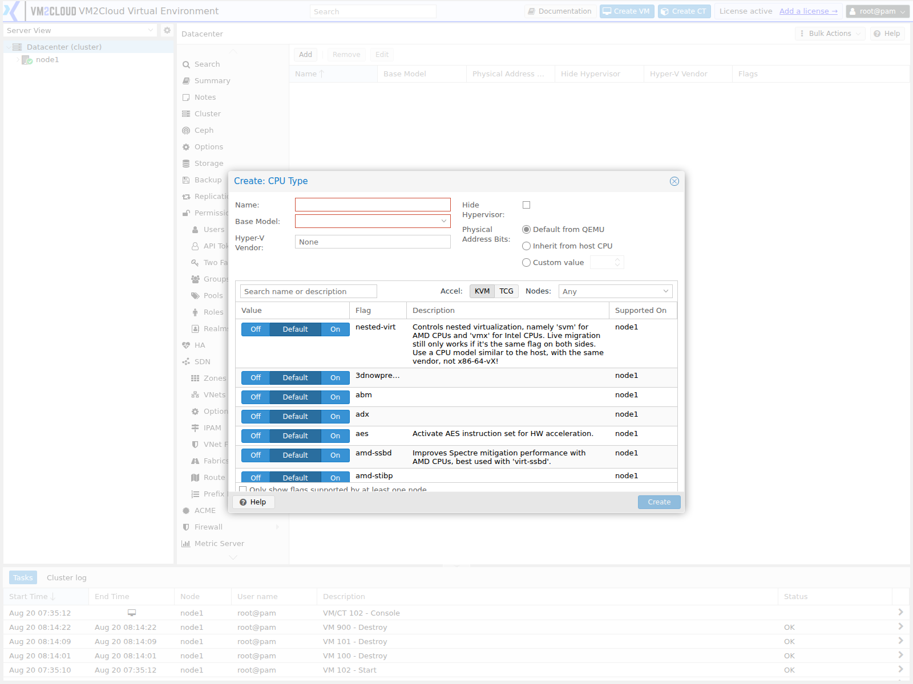

# Custom CPU Models

---

## Overview

A **custom CPU model** is a named CPU definition you create once at datacenter level and then assign to virtual machines, instead of picking from the built-in models.

It solves a problem specific to mixed clusters. The CPU model a machine is given is a trade-off: a model exposing more host features performs better, but ties the machine to processors that have those features. In a cluster where nodes have different generations of CPU, a machine set to a host-specific model may refuse to migrate.

A custom model lets you define the exact feature set **every** node can provide, so machines using it migrate anywhere in the cluster while still exposing more than the most conservative built-in model would.

Custom models appear in a machine's CPU selector prefixed with `custom-`.

---

## When to Use

Create a custom CPU model when:

* The cluster has processors of different generations and migration must work across all of them.
* Built-in models are either too conservative for the workload or too specific to migrate.
* A workload needs particular CPU features exposed consistently.
* You want one definition applied across many machines rather than per-machine settings.

If every node has identical processors, a built-in model is simpler and sufficient.

---

## Prerequisites

* You have administrator privileges, or `Mapping.Modify`.
* The cluster has quorum.
* You know which CPU features the workload requires.
* You know which features every node actually supports.

---

# Procedure

## Step 1: Open the Custom CPU Models Panel

1. Log in to the VM2Cloud VE web interface.
2. Select **Datacenter**.
3. Click **Custom CPU Models**.

---

### Screenshot 1

**Custom CPU Models Panel**

The list shows **Name**, **Base Model**, **Physical Address Bits**, **Hide Hypervisor**,
**Hyper-V Vendor**, and **Flags**, with Add, Remove, and Edit. It is empty until a model is
created.

---

## Step 2: Create a Model

1. Click **Add**.
2. Enter a **Name**. Machines will reference it as `custom-<name>`.
3. Select the **base model** the custom definition starts from.
4. Adjust the fields and flags described below.
5. Confirm.

Choose a base model every node can run. Building on a base that only some nodes support reintroduces the migration problem the custom model was meant to solve.

---

### Screenshot 2

**Create Custom CPU Model**

Everything is in one dialog — there is no separate flag step. The top half takes **Name**,
**Base Model**, **Hyper-V Vendor**, **Hide Hypervisor**, and **Physical Address Bits**,
which is a three-way choice between *Default from QEMU*, *Inherit from host CPU*, and a
custom value.

The lower half is the flag table, and the column that matters is **Supported On** — it names
the nodes that actually provide each flag. A search box, an **Accel** switch between KVM and
TCG, a **Nodes** filter, and a *"Only show flags supported by at least one node"* checkbox
sit above it. Each flag is a three-state control: **Off**, **Default**, **On**.

---

## Step 3: Set the Flags

Flags enable or disable individual CPU features on top of the base model.

The dialog indicates which flags each node actually supports. **Use that.** A flag enabled in the model but absent on a node means machines using the model cannot start there — which appears as a migration failure or an HA recovery that lands nowhere.

Enable only what the workload needs. Every additional flag narrows the set of nodes the machine can run on.

> **Verify:** Capture the flag list and confirm how per-node support is indicated in this
> deployment.

---

## Step 4: Assign the Model to a Machine

1. Select the virtual machine.
2. Open **Hardware** and edit the **Processors** entry — or set it during creation.
3. Choose the model, shown as `custom-<name>`.
4. Confirm.

The machine must be restarted for a CPU model change to take effect. See [Manage VM Hardware](../04-Virtual-Machines/Manage-VM-Hardware.md).

---

## Step 5: Verify Migration

1. Start the machine.
2. Confirm it boots and the workload runs.
3. Migrate it to each node it may run on.
4. Confirm it starts on every one.

Test every node, not one. A flag unsupported on a single node produces a machine that migrates fine until it lands there.

---

# Configuration / Options

| Field | Description |
|---|---|
| **Name** | Model identifier. Referenced by machines as `custom-<name>`. |
| **Base model** | The built-in model the definition starts from. |
| **Vendor** | CPU vendor reported to the guest. |
| **Physical address bits** | How much physical address space the guest sees. Relevant for very large memory configurations. |
| **Flags** | Individual CPU features enabled or disabled on top of the base model. |
| **Hidden** | Whether virtualization is hidden from the guest. Some software behaves differently when it detects it is virtualized. |
| **Hypervisor vendor ID** | The identifier reported to the guest, where a specific value is required. |

The definition is stored in the cluster configuration and can also be maintained from the shell — see [CLI Reference](../06-CLI-Reference.md).

> **Verify:** Capture the dialog and confirm which of these fields are present and their
> exact labels.

---

# Access Control

Custom CPU models use the mapping privileges, so their management can be delegated:

| Privilege | Allows |
|---|---|
| `Mapping.Audit` | Seeing the model in listings. |
| `Mapping.Modify` | Creating, changing, and deleting models. |
| `Mapping.Use` | Assigning a model to a machine. |

Grant `Mapping.Use` to teams that build machines, and keep `Mapping.Modify` with whoever owns the cluster's hardware policy. See [Roles](Permissions/Roles.md).

---

# Verification

Verify the following:

* The model appears in the list.
* It is selectable on a machine as `custom-<name>`.
* A machine using it starts.
* The workload sees the CPU features it expects.
* The machine migrates to **every** node it may run on.
* HA can recover it, if HA is configured.
* Users with `Mapping.Use` can assign it but not redefine it.

---

# Common Issues

| Issue | Resolution |
|-------|------------|
| Machine will not start on one node | A flag in the model is unsupported there. Remove it, or accept that node is excluded. |
| Migration fails to a specific node | Same cause. Check that node's flag support. |
| HA cannot recover the machine | The model restricts it to nodes HA is not choosing. |
| Model not selectable | The user lacks `Mapping.Use`, or the machine was not restarted after the change. |
| Change had no effect | CPU model changes apply at next start, not on reboot from inside the guest. |
| Workload does not see an expected feature | The flag is not enabled in the model, or the base model does not provide it. |
| Cannot create a model | Confirm administrator privileges or `Mapping.Modify`, and cluster quorum. |

---

# Best Practices

- **Define to the lowest common denominator across the cluster.** A model only nodes A and B support is a machine that cannot run on C.
- Enable only the flags the workload genuinely needs.
- Use the per-node support indication rather than assuming uniform hardware.
- Re-check models when adding a node with different processors — the new node may not support an existing model.
- Name models after the workload or hardware generation, such as `custom-db-tier`.
- Test migration to every node before putting production workloads on a custom model.
- Delegate with `Mapping.Use`, keeping `Mapping.Modify` centrally.
- Record which machines use which model, so hardware changes can be assessed.

---

# Related Documentation

- [Manage VM Hardware](../04-Virtual-Machines/Manage-VM-Hardware.md)
- [Create Virtual Machine](../04-Virtual-Machines/Create-Virtual-Machine.md)
- [Migrate Virtual Machine](../04-Virtual-Machines/Migrate-Virtual-Machine.md)
- [Resource Mappings](Resource-Mappings.md)
- [Directory Mappings](Directory-Mappings.md)
- [Roles](Permissions/Roles.md)
- [HA Resources](HA/HA-Resources.md)
- [CLI Reference](../06-CLI-Reference.md)

---

# Summary

A custom CPU model is a named CPU definition created once and assigned to machines as `custom-<name>`. It exists for mixed-hardware clusters, where the built-in models force a choice between performance and the ability to migrate.

The rule that governs everything here is that a model must be supported by **every** node a machine may run on. Enabling a flag only some nodes provide gives you a machine that runs, migrates to most nodes, and then fails on one — or that HA cannot recover when it matters. Define to the lowest common denominator, and re-check your models whenever a node with different processors joins the cluster.
