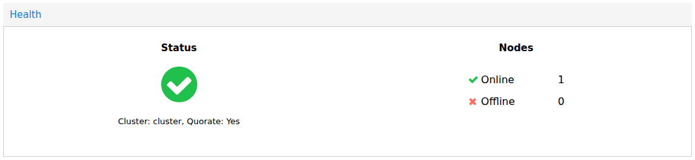
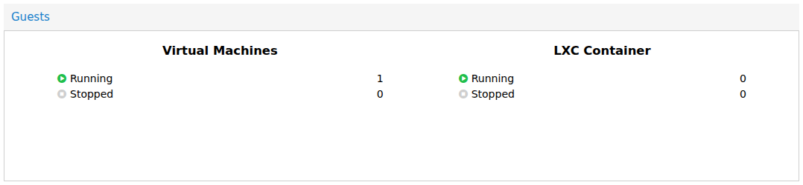
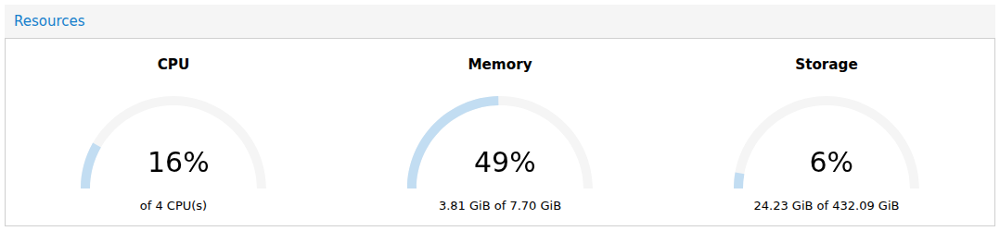
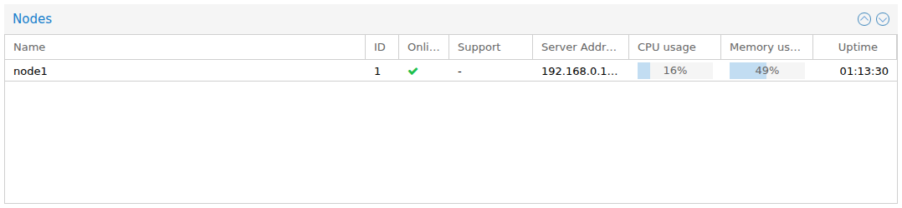
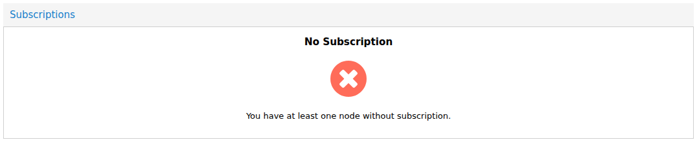

# Datacenter Summary

---

## Overview

The Dashboard displays several widgets that provide a quick overview of the VM2Cloud VE environment. These widgets help administrators monitor infrastructure health, resource utilization, and system status without navigating to individual resources.

The available widgets may vary depending on your VM2Cloud VE configuration and the resources available in your environment.

---

## Resource Summary

The **Resource Summary** widget provides a high-level overview of the virtualization environment.

It may display information such as:

* Number of Nodes
* Number of Virtual Machines
* Number of Containers
* Storage Resources
* Cluster Status

Use this widget to quickly understand the current state of your VM2Cloud VE environment.

---

### Screenshot 1

**Health**

The **Health** widget is the first thing to read. It reports the cluster name, whether the
cluster is **quorate**, and how many nodes are online against how many are offline. A single
node that is its own cluster still shows quorate here, because one vote of one is a
majority.

---

## CPU Usage

The **Guests** widget displays the current processor utilization across the selected resource.

Depending on the selected object, the widget may show CPU usage for:

* Datacenter
* Node
* Virtual Machine
* Container

Monitoring CPU utilization helps identify overloaded systems and resource bottlenecks.

---

### Screenshot 2

**Guests**

**Guests** counts virtual machines and containers separately, split by running and stopped.
It counts across the whole cluster, not the node you happen to be looking at.

---

## Memory Usage

The **Resources** widget displays the amount of physical memory currently being used.

The widget generally includes:

* Total Memory
* Used Memory
* Available Memory
* Memory Utilization

Regularly monitoring memory usage helps prevent performance issues caused by insufficient RAM.

---

### Screenshot 3

**Resources**

**Resources** carries CPU, memory, and storage as three gauges in one widget — not as three
separate panels. Each shows a percentage and the underlying figures, so 50% memory reads as
`3.90 GiB of 7.70 GiB`. The totals are cluster-wide sums.

---

## Storage Usage

The **Nodes** widget provides information about the storage resources available to the selected object.

Typical information includes:

* Total Capacity
* Used Space
* Available Space
* Storage Utilization

This information helps administrators identify storage resources that are approaching capacity.

---

### Screenshot 4

**Nodes**

The **Nodes** table lists every member with its ID, online state, support level, address,
and live CPU, memory, and uptime figures. This is where a node that has stopped reporting
becomes visible.

---

## Node Status

The **Subscriptions** widget displays the operational state of the nodes in the VM2Cloud VE environment.

Administrators can quickly determine whether a node is:

* Online
* Offline
* Available
* Experiencing issues

Monitoring node status helps identify infrastructure problems before they affect workloads.

---

### Screenshot 5

**Subscriptions**

**Subscriptions** summarises licensing across the cluster. It reports the worst case rather
than a list — one unlicensed node makes the whole widget say so.

---

## Subscription Information

The **Subscription Information** widget displays the subscription status for the selected node.

Depending on your deployment, this section may include:

* Subscription Status
* Repository Configuration
* License Information

If your environment does not use subscriptions, this widget may display a notification instead.

---

# Verification

Verify the following:

* Dashboard widgets load successfully.
* Resource information is displayed correctly.
* CPU and Memory usage are updating.
* Storage utilization is visible.
* Node status is displayed correctly.
* Subscription information is available for the selected node.

---

# Common Issues

| Issue                                   | Resolution                                                                   |
| --------------------------------------- | ---------------------------------------------------------------------------- |
| Widget does not load                    | Refresh the Dashboard and verify the selected resource is available.         |
| CPU or Memory values are not updating   | Confirm the node is online and refresh the page.                             |
| Storage information is missing          | Verify that storage has been configured for the selected node or datacenter. |
| Node status is incorrect                | Check the node's connectivity and refresh the Dashboard.                     |
| Subscription information is unavailable | Verify the node's subscription configuration and permissions.                |

---

# Summary

Dashboard widgets provide administrators with a quick overview of the VM2Cloud VE environment, including resource utilization, storage capacity, node health, and subscription status. Regularly reviewing these widgets helps administrators monitor the infrastructure and identify potential issues at an early stage.
