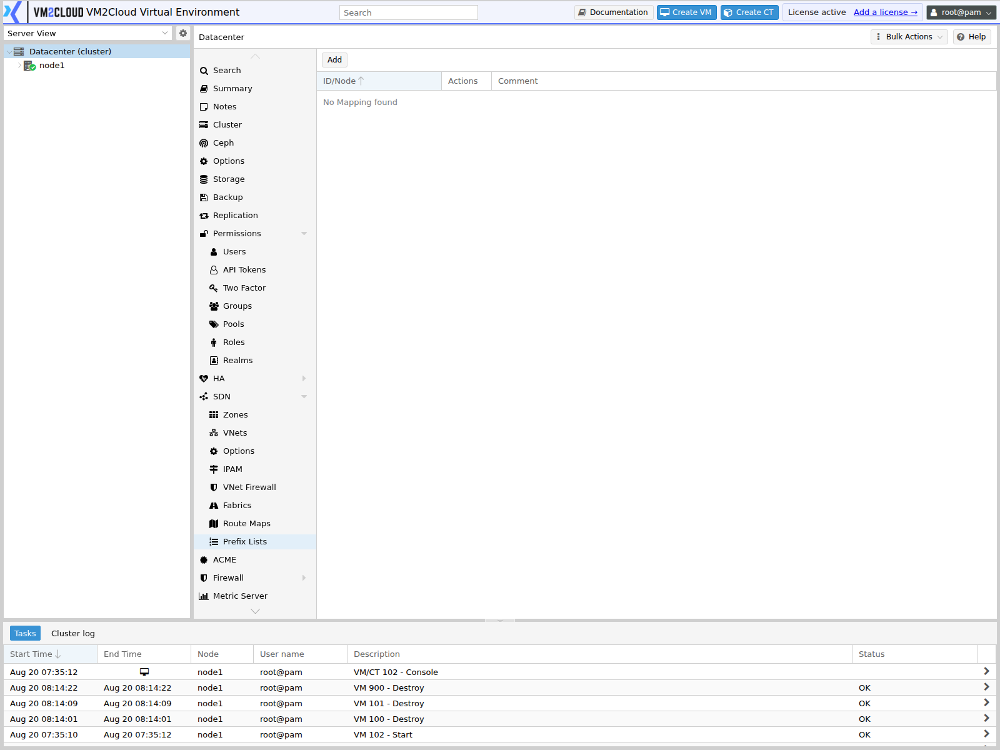
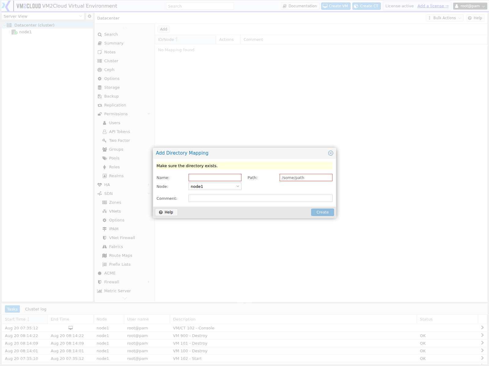

# Directory Mappings

---

## Overview

A **directory mapping** gives a directory on the host a cluster-wide logical name, and records which path that name refers to **on each node**.

It is the same idea as a [resource mapping](Resource-Mappings.md), applied to storage paths instead of hardware. A virtual machine that shares a host directory references the mapping by name rather than by path, so the machine can start on any node where the mapping is defined — even if the directory lives at a different path there.

The share itself is provided through virtiofs, which presents a host directory to the guest as a filesystem rather than as a virtual disk.

> **Verify:** Confirm this panel's exact behaviour in your deployment. Upstream reference
> material covers the guest-side virtiofs configuration but documents the Directory
> Mappings panel only indirectly. In particular, confirm whether mappings apply to
> containers as well as virtual machines — containers use bind mount points, which are
> configured separately on [Manage Container Resources](../05-Containers/Manage-Container-Resources.md).

---

## When to Use

Create a directory mapping when:

* A virtual machine needs access to a directory on the host.
* Guests need to share a common dataset without each holding a copy.
* A large read-only dataset should not be duplicated into every guest's disk.
* A guest sharing a host directory must be able to migrate.

Do **not** use it as a substitute for [storage](Storage/Storage-Overview.md). Guest disks belong on configured storage; a directory share is for exposing existing host content to a guest.

---

## Prerequisites

* You have administrator privileges, or `Mapping.Modify`.
* The cluster has quorum.
* The directory exists on every node the guest may run on.
* Its contents are equivalent across those nodes, or the directory is on shared storage.
* You understand what the guest will be able to do with the contents.

> **Warning:** A shared directory gives the guest access to host filesystem content. Anything the guest can write, it can change on the host. Share only directories intended for that guest, never system paths, and consider whether the share should be read-only.

---

# Procedure

## Step 1: Open the Directory Mappings Panel

1. Log in to the VM2Cloud VE web interface.
2. Select **Datacenter**.
3. Click **Directory Mappings**.

---

### Screenshot 1

**Directory Mappings Panel**



Unlike Resource Mappings, this is a single list — columns **ID/Node**, **Actions**, and
**Comment**, with one **Add** control. It reads `No Mapping found` when empty.

---

## Step 2: Create the Mapping

1. Click **Add**.
2. Enter a **Name** — the logical identifier guests reference.
3. Select the **Node**.
4. Enter the **path** on that node.
5. Confirm.

Name it after the content rather than the path, since the path may differ per node — `shared-media` or `build-cache`, not `mnt-data`.

---

### Screenshot 2

**Add Directory Mapping**



The fields are **Name**, **Node**, **Path**, and **Comment** — the path shown as a
`/some/path` placeholder. The dialog carries its own warning: **"Make sure the directory
exists."** Nothing here creates the directory for you, and a mapping pointing at a path that
does not exist on the selected node fails only when a guest tries to use it.

---

## Step 3: Add an Entry for Every Node

A mapping covering one node confines the guest to that node.

1. Edit the mapping.
2. Add an entry for each additional node.
3. Enter that node's path.
4. Confirm.

The paths need not match. The **contents** must be equivalent, or the guest will see different data depending on where it is running — which is a far more confusing failure than not starting at all.

The cleanest arrangement is a directory on shared storage, mounted at the same path on every node.

---

### Screenshot 3

**Mapping Across Nodes**

```text
[ Place Screenshot Here ]
```

> **Capture:** A directory mapping with entries for two or more nodes.

---

## Step 4: Attach the Share to a Machine

1. Select the virtual machine.
2. Open **Hardware**.
3. Add a virtiofs share.
4. Select the directory mapping.
5. Set the sharing options.
6. Confirm and restart the machine.

The guest operating system must support virtiofs to mount the share. See [Manage VM Hardware](../04-Virtual-Machines/Manage-VM-Hardware.md).

> **Verify:** Capture the dialog used to attach a virtiofs share and confirm the exact
> options — caching behaviour, direct I/O, and whether extended attributes and ACLs are
> exposed.

---

## Step 5: Mount Inside the Guest

The share appears to the guest as a filesystem to be mounted. Mount it at the intended path, and add it to the guest's filesystem table if it should persist across reboots.

---

## Step 6: Verify Migration

1. Confirm the guest reads the share correctly.
2. Migrate it to another node in the mapping.
3. Confirm the share is present and the contents are the same.

That second check is the one that matters. A mapping pointing at different content on each node produces a guest whose data silently changes when it moves.

---

# Configuration / Options

| Field | Description |
|---|---|
| **Name** | Logical identifier referenced by guests. |
| **Node** | Which node this entry describes. |
| **Path** | Directory on that node. |
| **Comment** | Optional description. |

Share options set on the guest typically include caching behaviour, direct I/O, and whether extended attributes and access control lists are visible to the guest.

> **Verify:** Capture the Add dialog and confirm the exact field labels and available
> per-share options.

---

# Access Control

Directory mappings use the mapping privileges:

| Privilege | Allows |
|---|---|
| `Mapping.Audit` | Seeing the mapping in listings. |
| `Mapping.Modify` | Creating, changing, and deleting mappings. |
| `Mapping.Use` | Attaching the mapping to a guest. |

`Mapping.Modify` is the significant one — whoever holds it decides which host paths can be exposed to guests. Keep it with the cluster owner.

---

# Verification

Verify the following:

* The mapping appears with the intended name.
* Every node the guest may run on has an entry.
* Each path exists on its node.
* Contents are equivalent across nodes, or the directory is on shared storage.
* The guest mounts the share.
* The guest sees the expected contents.
* The guest migrates and still sees the same contents.
* Write access matches what was intended.

---

# Common Issues

| Issue | Resolution |
|-------|------------|
| Guest will not start on a node | That node has no entry, or the path does not exist there. |
| Share is missing after migration | Same cause. Add an entry for the target node. |
| Contents differ after migration | The mapping points at different directories. Use shared storage, or synchronise the contents. |
| Guest cannot mount the share | The guest operating system may not support virtiofs. Check guest support. |
| Permission errors inside the guest | Filesystem ownership on the host does not align with the guest's expectations. |
| Guest modified host files unexpectedly | The share is writable. Make it read-only if the guest should not write. |
| Poor performance | Review the caching option on the share. |
| Non-admin cannot attach a share | They need `Mapping.Use`. |

---

# Best Practices

- **Map every node the guest may run on.** A partial mapping removes migration and blocks HA recovery.
- Prefer a directory on shared storage mounted at the same path on every node — it removes the risk of divergent contents entirely.
- Make shares read-only unless the guest genuinely needs to write.
- Never share system paths. Share a directory created for the purpose.
- Name mappings after their content, not their path.
- Keep `Mapping.Modify` centrally — it controls which host paths guests can reach.
- Verify contents after a migration, not just that the share mounted.
- Use configured storage for guest disks. Directory shares are for exposing existing host content.

---

# Related Documentation

- [Resource Mappings](Resource-Mappings.md)
- [Custom CPU Models](Custom-CPU-Models.md)
- [Manage VM Hardware](../04-Virtual-Machines/Manage-VM-Hardware.md)
- [Manage Container Resources](../05-Containers/Manage-Container-Resources.md)
- [Storage Overview](Storage/Storage-Overview.md)
- [Roles](Permissions/Roles.md)
- [Migrate Virtual Machine](../04-Virtual-Machines/Migrate-Virtual-Machine.md)

---

# Summary

A directory mapping gives a host directory a cluster-wide name and records the path it corresponds to on each node, so a machine sharing that directory through virtiofs can migrate rather than being pinned to one host.

Two things matter more than the mechanics. The mapping must cover every node the guest may run on, or migration and HA recovery quietly stop working. And the contents must be equivalent across those nodes — a mapping pointing at different directories produces a guest whose data changes when it moves, which is far harder to diagnose than a guest that simply fails to start. A directory on shared storage, mounted identically everywhere, avoids both problems.
