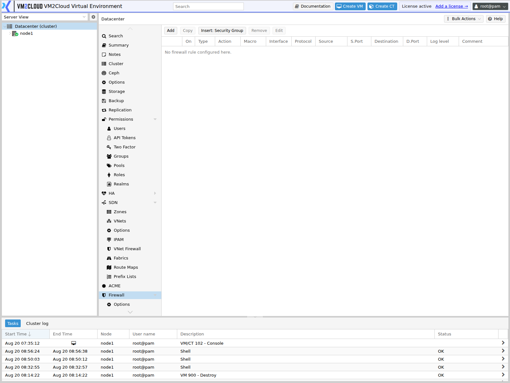
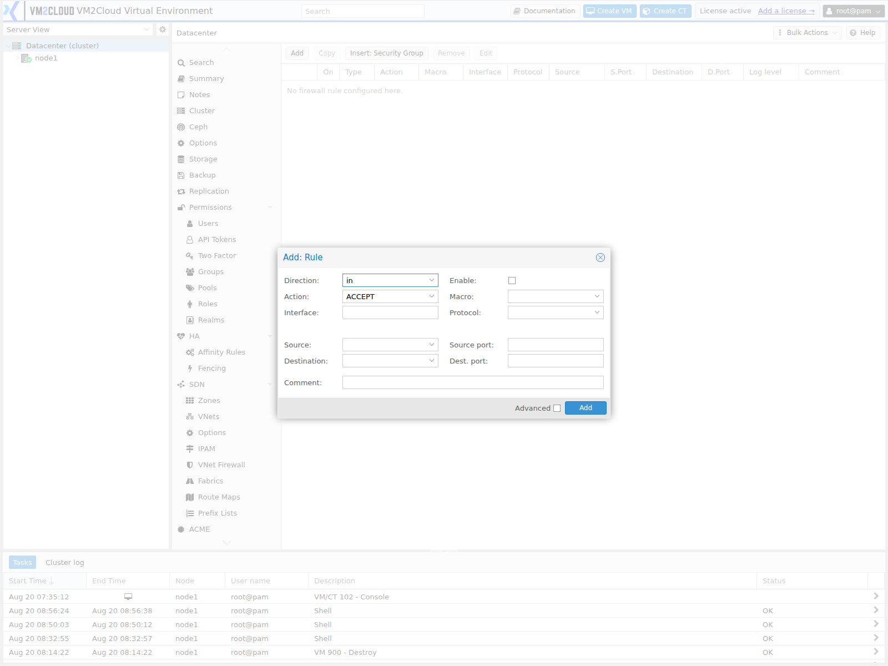

# Firewall Rules

---

## Overview

The **Rules** panel at Datacenter → Firewall holds the cluster-wide rule list. Rules defined here apply across the cluster, above any node-level or guest-level rules.

A rule matches traffic by direction, protocol, source, destination, and port, and then accepts, drops, or rejects it. Rules are evaluated top to bottom and the first match wins.

For direction, actions, evaluation order, and how the three firewall levels interact, see [Firewall Overview](Firewall-Overview.md). This page covers creating and managing rules on the datacenter panel.

> **Warning:** A rule that blocks TCP port **8006** removes access to the VM2Cloud VE web interface. A rule that blocks traffic between node addresses can break cluster communication and cause nodes to lose quorum. Review every rule before enabling it.

---

## When to Use

Use the datacenter Rules panel when:

* A rule should apply across the whole cluster rather than one node or guest.
* Management access must be restricted to an administrative network.
* A baseline policy should apply everywhere.
* You are inserting a security group cluster-wide.

Use the node or guest panels instead when a rule applies to only one node or one guest.

---

## Prerequisites

Before creating firewall rules, ensure that:

* You have administrator privileges.
* You know the protocol, port, source, and destination the rule must match.
* You know where the rule belongs in the evaluation order.
* You have console access to a node in case a rule removes web access.
* Any alias, IPSet, or security group the rule references already exists.

---

# Procedure

## Step 1: Open the Rules Panel

1. Log in to the VM2Cloud VE web interface.
2. Select **Datacenter** in the resource tree.
3. Expand **Firewall**.
4. Click **Rules**.

The existing cluster-wide rules are listed in evaluation order.

---

### Screenshot 1

**Datacenter Firewall Rules Panel**



Rules created here apply cluster-wide. The list is empty on a new cluster, and the
firewall itself is disabled until you enable it in [Firewall Options](Firewall-Options.md).

---

## Step 2: Open the Add Rule Dialog

1. Click **Add**.

The rule creation dialog opens.

---

### Screenshot 2

**Add Rule Dialog**



The dialog takes a **Direction**, an **Action**, an optional **Interface** and **Source** /
**Destination**, and either a **Macro** or an explicit protocol and port. **Enable** is a
checkbox on the rule itself, so a rule can exist without being active.

---

## Step 3: Set the Direction and Action

1. Set **Direction**:
   - **in** for traffic arriving at the protected object.
   - **out** for traffic leaving it.
2. Set **Action**:
   - **ACCEPT** to permit the traffic.
   - **DROP** to discard it silently.
   - **REJECT** to discard it and return an error to the sender.

Direction is judged from the point of view of the thing being protected, not from the network.

---

## Step 4: Choose a Macro, or Set Protocol and Ports

Either select a predefined service or specify the protocol yourself.

**Using a macro:**

1. Select the required service from **Macro**.
2. The protocol and port fields are set by the macro and cannot be edited.

**Setting the protocol manually:**

1. Leave **Macro** unset.
2. Set **Protocol**, for example `tcp` or `udp`.
3. Enter the **Dest. port**, which is the port of the service being reached.
4. Leave **Source port** empty unless you specifically need to match it.

Use the manual route whenever a service runs on a non-standard port.

---

### Screenshot 3

**Rule With Protocol and Port Configured**

```text
[ Place Screenshot Here ]
```

> **Capture:** The Add Rule dialog filled in for an inbound TCP rule on a specific
> destination port, showing the Macro field left empty.

---

## Step 5: Set the Source and Destination

1. In **Source**, enter the address, network, alias, or IPSet the traffic comes from. Leave empty to match any source.
2. In **Destination**, enter the address, network, alias, or IPSet the traffic is going to. Leave empty to match any destination.

Restricting the source is what turns an open service into a controlled one. A management-access rule should always name the administrative network rather than matching any source.

---

## Step 6: Add a Comment and Confirm

1. Enter a **Comment** explaining why the rule exists.
2. Confirm **Enable** is set as intended. Leave it off to stage a rule without activating it.
3. Review every field.
4. Click **Add**.

The rule appears in the list.

---

### Screenshot 4

**Rule Added to the List**

```text
[ Place Screenshot Here ]
```

> **Capture:** Datacenter → Firewall → Rules showing the newly created rule in the list,
> with its direction, action, port, and comment visible.

---

## Step 7: Position the Rule

Because the first match wins, order matters.

1. Select the rule.
2. Use the move controls to raise or lower it.
3. Place narrower rules above broader ones.

> **Verify:** Confirm how rules are reordered on this panel — whether by drag and drop,
> by move up / move down buttons, or both.

---

### Screenshot 5

**Rule Ordering**

```text
[ Place Screenshot Here ]
```

> **Capture:** The Rules panel with several rules present, showing the controls used to
> change rule order.

---

## Step 8: Edit or Remove a Rule

**To edit:**

1. Select the rule.
2. Click **Edit**.
3. Change the required fields.
4. Click **OK**.

**To disable without deleting:**

1. Select the rule.
2. Click **Edit**.
3. Clear **Enable**.
4. Click **OK**.

Disabling is the safer option while troubleshooting — the rule stays documented and can be restored instantly.

**To remove:**

1. Select the rule.
2. Click **Remove**.
3. Confirm.

> **Warning:** Removing a rule takes effect immediately. Removing a management-access rule while the firewall is enabled will cut off the web interface.

---

### Screenshot 6

**Editing a Rule**

```text
[ Place Screenshot Here ]
```

> **Capture:** The Edit dialog for an existing rule, showing the populated fields and
> the **Enable** control.

---

# Configuration / Options

| Option | Description |
|---|---|
| **Direction** | **in** or **out**, relative to the protected object. |
| **Action** | **ACCEPT**, **DROP**, or **REJECT**. |
| **Enable** | Whether the rule is active. Disabled rules stay in the list but do not match. |
| **Macro** | Predefined service template. Sets protocol and ports automatically. |
| **Protocol** | IP protocol such as `tcp`, `udp`, or `icmp`. Locked when a macro is selected. |
| **Source** | Source address, network, alias, or IPSet. Empty matches any source. |
| **Destination** | Destination address, network, alias, or IPSet. Empty matches any destination. |
| **Source port** | Source port or range. Rarely required. |
| **Dest. port** | Destination port or range — the service being reached. |
| **Interface** | Restricts the rule to one network interface. |
| **Log level** | Logging detail for traffic matching this rule. |
| **Comment** | Free-text description. |

> **Verify:** Confirm the exact field labels, the available log levels, and the full
> macro list in the Add Rule dialog.

---

# Verification

Verify the following:

* The rule appears in the list with the intended direction, action, and ports.
* The rule sits in the correct position relative to broader rules.
* The rule shows as enabled if it should be active.
* Permitted traffic reaches its destination.
* Blocked traffic fails as intended.
* The web interface remains reachable from another machine.
* Cluster nodes remain online and communicating.
* Matching traffic appears in the firewall log if logging is enabled.

Test from a machine other than your administrative workstation.

---

# Common Issues

| Issue | Resolution |
|-------|------------|
| Rule appears to do nothing | Check the firewall is enabled at datacenter level, and for guests also on the guest and its network device. |
| Rule is never reached | An earlier rule matched first. Move it above the broader rule. |
| Cannot edit protocol or port | A macro is selected. Clear the macro to set them manually. |
| Locked out of the web interface | Follow [Firewall Lockout Recovery](Firewall-Lockout-Recovery.md), then correct the rule. |
| Cluster nodes lose quorum | Cluster traffic is being filtered. Permit traffic between node addresses on the cluster network. |
| Connections hang rather than fail | The action is **DROP**. Use **REJECT** on internal networks for immediate failure. |
| An alias or IPSet is not accepted | The object must exist before it can be referenced. Create it first. |
| Rule matches more than intended | The source or destination is empty and matching everything. Narrow it. |

---

# Best Practices

- Create the management-access rule first and verify it before enabling the firewall.
- Comment every rule with the reason it exists, not a restatement of its fields.
- Order rules most specific first.
- Use aliases and IPSets instead of repeating raw addresses.
- Use security groups for any rule set needed on more than one object.
- Stage risky rules with **Enable** cleared, then activate deliberately.
- Disable rather than delete while troubleshooting.
- Enable logging on new rules during validation, then reduce it.
- Review the rule list periodically and remove rules that no longer apply.
- Change rules during a maintenance window with console access available.

---

# Related Documentation

- [Firewall Overview](Firewall-Overview.md)
- [Firewall Options](Firewall-Options.md)
- [Security Groups](Security-Groups.md)
- [Aliases](Aliases.md)
- [IPSets](IPSets.md)
- [Node Firewall](../../03-Nodes/Node-Firewall.md)
- [VM Firewall](../../04-Virtual-Machines/VM-Firewall.md)
- [Container Firewall](../../05-Containers/CT-Firewall.md)

---

# Summary

The datacenter Rules panel holds the cluster-wide firewall rule list. Each rule matches traffic by direction, protocol, source, destination, and port, then accepts, drops, or rejects it, with the first matching rule winning. Order is therefore as important as content — narrower rules belong above broader ones. Reference aliases, IPSets, and security groups rather than repeating addresses, comment every rule, and always confirm management access remains permitted before enabling anything.
