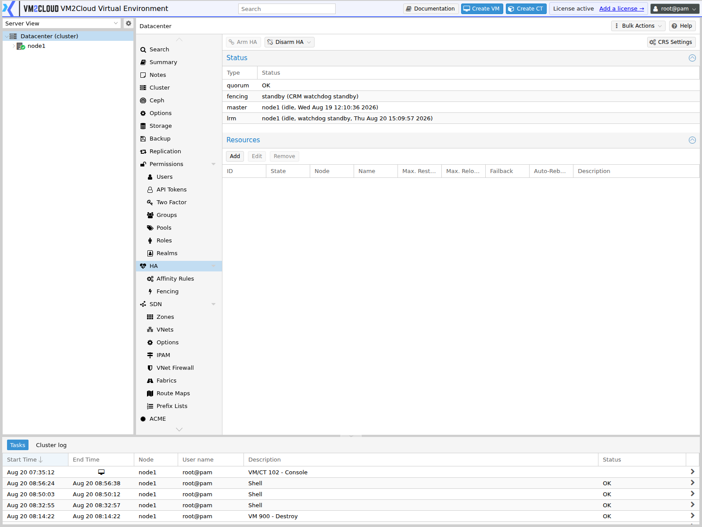
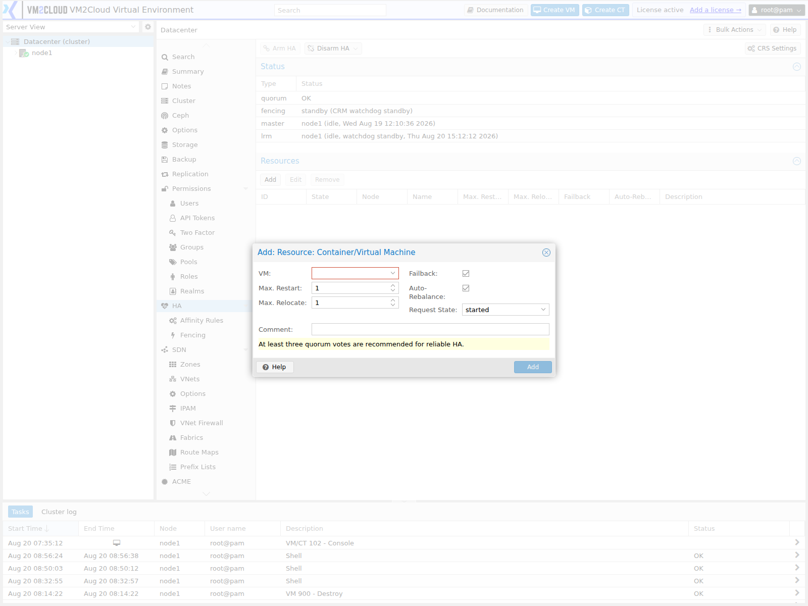

# HA Resources

## Overview

An HA resource is a virtual machine or container that is managed by the VM2Cloud VE High Availability system.

When a VM or container is added as an HA resource, VM2Cloud VE monitors its state and can perform HA operations according to the configured resource state, cluster health, node availability, and HA placement rules.

HA resources are normally used for workloads that should automatically recover when the node running them becomes unavailable.

---

## When to Use

Use HA resources when:

- A VM requires automatic recovery after a node failure.
- A container requires automatic recovery after a node failure.
- A production workload should be managed by HA.
- You want HA to control the start/stop state of a guest.
- You want a guest to participate in HA placement and recovery rules.

Do not add every VM or container to HA automatically. HA should be enabled only for workloads that have been designed and tested for HA recovery.

---

## Prerequisites

Before adding a resource to HA:

- The VM2Cloud VE cluster must be configured.
- The cluster should have quorum.
- The required nodes must be available.
- The guest must already exist.
- Required guest storage must be available on eligible recovery nodes.
- Required networking must be available on eligible nodes.
- Any required hardware must be available on the nodes where the guest may run.
- Appropriate permissions are required to manage HA resources.

For production workloads, verify that backups and recovery procedures are also available.

---

# What Is an HA Resource?

An HA resource is a guest that has been registered with the HA system.

For example:

```text
Cluster
├── node1
│   └── VM 100
├── node2
└── node3
```

In this example, VM 100 runs on node1. If VM 100 is registered as an HA resource and node1 fails, HA can recover VM 100 on node2 or node3, provided the required storage and networking are available there.

---

## Step 1: Open the HA Configuration

1. Log in to the VM2Cloud VE web interface.
2. Select **Datacenter** from the left navigation tree.
3. Select **HA**.
4. Review the existing HA resources.

### Screenshot 1

**HA Panel**



Datacenter → HA lists the guests HA manages, with their requested state and current status.
It is empty until a resource is added.

---

## Step 2: Add a Resource

1. In the **Resources** section, click **Add**.
2. Select the VM or container to manage.
3. Configure the required resource options.
4. Click **Add**.

### Screenshot 2

**Add Resource Dialog**



The dialog selects the guest, then takes **Max. Restart**, **Max. Relocate**, a **Group**,
a **Request State**, and a comment.

---

## Step 3: Configure the Requested State

The requested state tells HA how the guest should be managed.

| State | Behaviour |
|-------|-----------|
| started | HA keeps the guest running and recovers it after a node failure. |
| stopped | HA keeps the guest stopped but continues to manage it. |
| disabled | The resource remains configured but HA takes no action. |
| ignored | The resource is not managed by HA while this state is set. |

Select the state that matches the workload requirement.

### Screenshot 3

**Requested State Selector**

```text
[ Place Screenshot Here ]
```

> **Capture:** The state dropdown open, showing every value it contains. **This clears a
> `Verify` marker** — the state list on this page is inferred.

---

## Step 4: Verify the Resource

Confirm that the resource appears in the HA resource list with the expected state.

### Screenshot 4

**Managed Resource**

```text
[ Place Screenshot Here ]
```

> **Capture:** The resource list showing the guest with its requested state and current
> node.

---

# Configuration / Options

Typical HA resource options include:

- **Resource** — the VM or container ID being managed.
- **Requested State** — the state HA should maintain.
- **Max Restart** — how many times HA retries starting the guest on the same node.
- **Max Relocate** — how many times HA tries relocating the guest to another node.
- **Group or placement rule** — where the guest is allowed or preferred to run.
- **Comment** — an optional description.

The available options depend on the installed VM2Cloud VE version.

---

# Verification

Verify the following:

- The guest appears in the HA resource list.
- The requested state is displayed correctly.
- The current state matches the requested state.
- The guest continues to run normally.
- The cluster reports quorum.
- No HA errors are shown in the task log.

---

# Common Issues

| Issue | Resolution |
|-------|------------|
| Resource cannot be added | Verify that the cluster has quorum and that you have permission to modify HA configuration. |
| Resource stays in an error state | Review the HA task log and verify that the required storage and network are available on the node. |
| Resource does not recover after a node failure | Confirm the cluster retained quorum and that an eligible node has access to the guest's storage. |
| Guest starts on an unexpected node | Review the configured node-affinity and resource-affinity rules. |
| HA repeatedly restarts the guest | Investigate the guest operating system; HA restarts a guest that fails to stay running. |

---

# Related Documentation

- [HA Overview](HA-Overview.md)
- [Node Affinity](Node-Affinity.md)
- [Resource Affinity](Resource-Affinity.md)
- [Fencing](Fencing.md)
- [Quorum](../Cluster/Quorum.md)
- [HA Troubleshooting](HA-Troubleshooting.md)

---

# Summary

An HA resource is a virtual machine or container registered with the VM2Cloud VE High Availability system. Once registered, HA monitors the guest and maintains its requested state, recovering it on another eligible node when the node running it becomes unavailable. Add only workloads that have been designed and tested for automatic recovery, and confirm that every eligible node can reach the guest's storage and networking.
