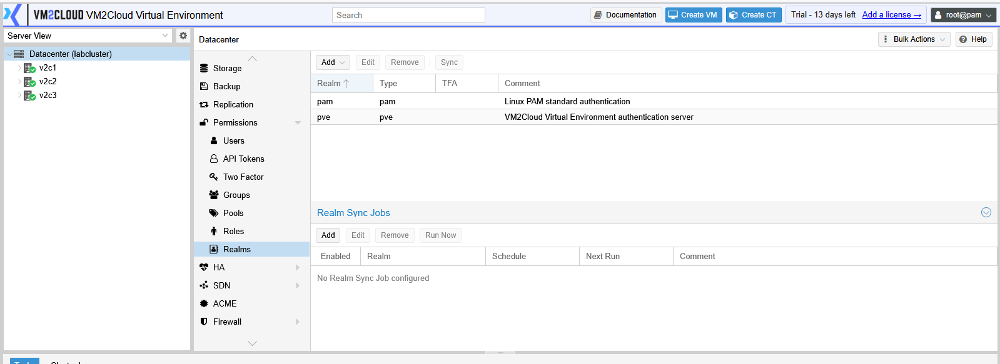
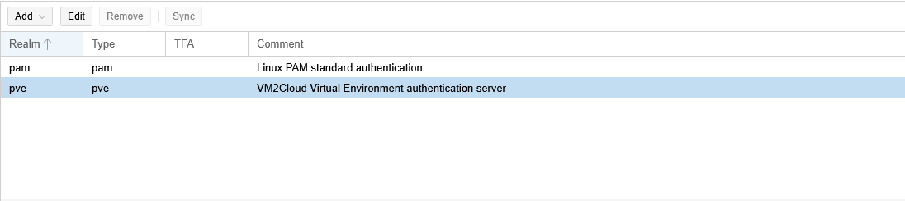
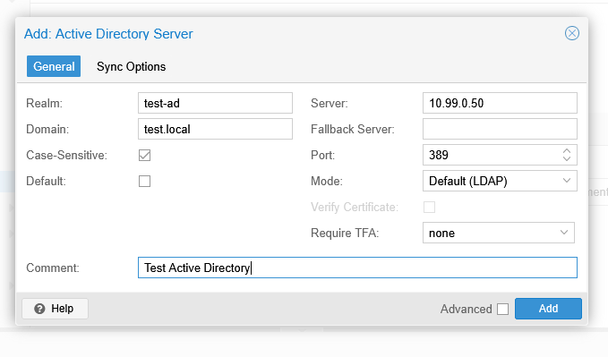

# Authentication Realms

---

## Overview

An Authentication Realm defines how users authenticate when logging in to VM2Cloud VE. A realm specifies the source used to validate user credentials, such as the local user database or an external authentication service.

VM2Cloud VE supports multiple authentication realms, allowing organizations to integrate with existing identity management systems while maintaining local administrative access.

---

## When to Use

Use Authentication Realms to:

- Manage local user authentication.
- Integrate with external directory services.
- Configure centralized user authentication.
- Control how users log in to VM2Cloud VE.

---

## Prerequisites

Before managing authentication realms, ensure that:

- You have administrator privileges.
- The external authentication service (if used) is available and properly configured.
- Required connection details are available.

---

# Access Authentication Realms

1. Log in to the VM2Cloud VE web interface.
2. Select **Datacenter**.
3. Click **Permissions**.
4. Click **Realms**.

The Realms page displays all configured authentication realms.

---

**Realms Page**



---

# View Authentication Realms

The Realms page displays information such as:

- Realm Name
- Type
- Default Realm
- Sync Status (if applicable)
- Comment

Select a realm to view its configuration.

---

**Configured Realms**



---

# Supported Authentication Realms

Depending on your VM2Cloud VE deployment, one or more of the following realm types may be available.

| Realm Type | Description |
|------------|-------------|
| Linux PAM | Authenticates users using the local Linux operating system accounts. |
| VM2Cloud Virtual Environment Authentication Server | Uses the internal VM2Cloud VE user database. |
| LDAP | Authenticates users using an LDAP directory service. |
| Microsoft Active Directory | Authenticates users against an Active Directory domain. |
| OpenID Connect (OIDC) | Supports authentication through an OpenID Connect identity provider. |

> **Note:** The available authentication realms depend on your VM2Cloud VE deployment and configuration.

---

### Screenshot 3

**Realms Panel**

```text
[ Place Screenshot Here ]
```

> **Capture:** Datacenter → Permissions → Realms, showing every realm this deployment
> offers. **This clears the `Verify` marker above** — the realm list on this page is
> inferred.

---

# Add an Authentication Realm

1. Click **Add**.
2. Select the required realm type.
3. Configure the required settings.
4. Click **Add** or **Create**.

> **Note:** The available configuration options vary depending on the selected authentication realm.

---

**Add an Authentication Realm**



---

# Edit an Authentication Realm

1. Select the required realm.
2. Click **Edit**.
3. Modify the required settings.
4. Click **OK**.

---

### Screenshot 5

**Edit a Realm**

```text
[ Place Screenshot Here ]
```

> **Capture:** A realm open for editing, showing its settings.

---

# Remove an Authentication Realm

> **Warning:** Do not remove an authentication realm that is currently being used by active users unless an alternative authentication method is available.

1. Select the required realm.
2. Click **Remove**.
3. Confirm the operation.

---

### Screenshot 6

**Remove a Realm**

```text
[ Place Screenshot Here ]
```

> **Capture:** The removal confirmation.

---

# Verification

Verify the following:

- The authentication realm appears in the Realms list.
- The configuration is displayed correctly.
- Users can authenticate successfully using the configured realm.
- No authentication errors are reported.

---

# Common Issues

| Issue | Resolution |
|-------|------------|
| Unable to connect to the authentication server | Verify the server address, network connectivity, and connection settings. |
| User authentication fails | Confirm that the user exists in the selected authentication realm and that the credentials are correct. |
| Realm cannot be added | Verify that all required configuration fields have been completed. |
| External directory is unavailable | Check the status of the LDAP, Active Directory, or OIDC server. |
| Unable to remove a realm | Ensure that the realm is not actively being used and that you have sufficient permissions. |

---

# Summary

Authentication Realms determine how users authenticate when accessing VM2Cloud VE. Administrators can configure local or external authentication services to provide secure and centralized access management across the virtualization environment.
