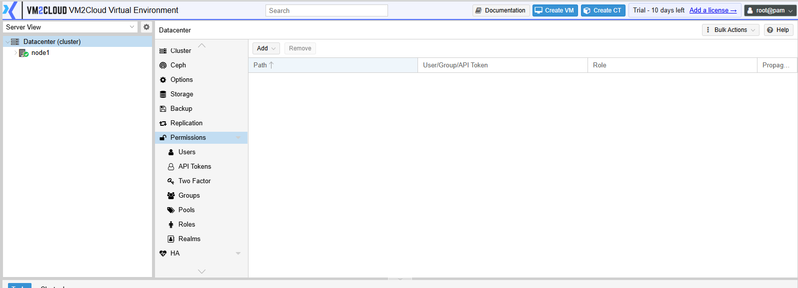
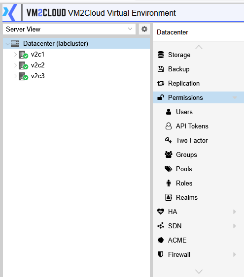

# Permissions Overview

---

## Overview

User and Permission Management allows administrators to control who can access VM2Cloud and what actions they are allowed to perform. By creating users, organizing them into groups, assigning roles, and configuring permissions, administrators can securely manage access to cluster resources.

VM2Cloud supports both local and external authentication methods, enabling organizations to integrate with existing identity management systems while maintaining secure administrative access.

Proper user and permission management helps protect the virtualization environment by ensuring that users have access only to the resources and operations required for their responsibilities.

---

## When to Use

Use User and Permission Management to:

- Create and manage user accounts.
- Configure authentication methods.
- Organize users into groups.
- Assign roles to users and groups.
- Control access to nodes, virtual machines, containers, storage, and other resources.
- Configure API access for automation.
- Enable additional authentication methods such as Two-Factor Authentication (2FA).

---

## Prerequisites

Before managing users and permissions, ensure that:

- You have administrator privileges.
- The VM2Cloud cluster is accessible.
- Authentication services are available if using external authentication.
- You understand the required access level for each user.

---

# Access User and Permission Management

1. Log in to the VM2Cloud web interface.
2. Select **Datacenter**.
3. Click **Permissions**.

The Permissions section provides access to all user and permission management features.

---





---

# Components of User and Permission Management

The Permissions section includes the following components.

| Component | Description |
|-----------|-------------|
| Users | Create, edit, and delete user accounts. |
| Groups | Organize users into logical groups for easier permission management. |
| Roles | Define sets of privileges that can be assigned to users or groups. |
| Permissions | Assign roles to users or groups for specific resources. |
| Realms | Configure local or external authentication methods. |
| API Tokens | Create secure authentication tokens for automation and API access. |
| Two-Factor Authentication | Configure additional authentication methods for enhanced security. |

---





---

# User Access Model

VM2Cloud controls access using the following hierarchy:

```text
Authentication Realm
        │
        ▼
      User
        │
        ▼
     Group (Optional)
        │
        ▼
      Role
        │
        ▼
   Permission
        │
        ▼
Protected Resource
```

A user authenticates through an authentication realm. The user may belong to one or more groups. Roles define the privileges available to the user or group, while permissions determine where those privileges apply.

---


---

# Security Best Practices

When managing users and permissions:

- Assign only the permissions required for a user's responsibilities.
- Use groups to simplify permission management.
- Avoid sharing user accounts.
- Enable Two-Factor Authentication for administrative users.
- Review user accounts and permissions regularly.
- Remove unused accounts and API tokens.

---

# Verification

Verify the following:

- Users can successfully authenticate.
- Groups and roles are configured correctly.
- Permissions provide the expected level of access.
- Users can access only the resources assigned to them.
- Administrative accounts are secured with appropriate authentication methods.

---

# Common Issues

| Issue | Resolution |
|-------|------------|
| User cannot log in | Verify the username, password, and selected authentication realm. |
| User cannot access resources | Confirm that the appropriate role and permissions have been assigned. |
| Permission changes are not effective | Verify that the permissions are assigned to the correct resource path and that there are no conflicting permissions. |
| Authentication fails | Check the configuration of the selected authentication realm. |
| API authentication fails | Verify that the API token is valid and has the required permissions. |

---

# Summary

The User and Permission Management section provides centralized control over authentication, authorization, and access management in VM2Cloud. By properly configuring users, groups, roles, permissions, authentication realms, and API tokens, administrators can secure the environment while ensuring that users have access only to the resources they need.
