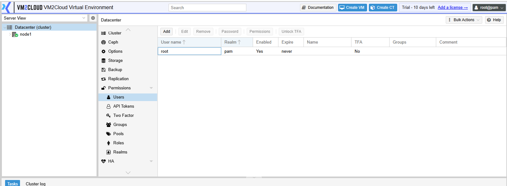
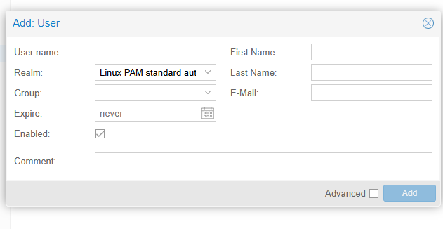
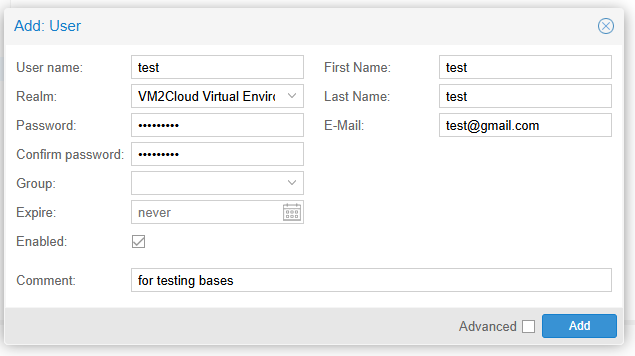
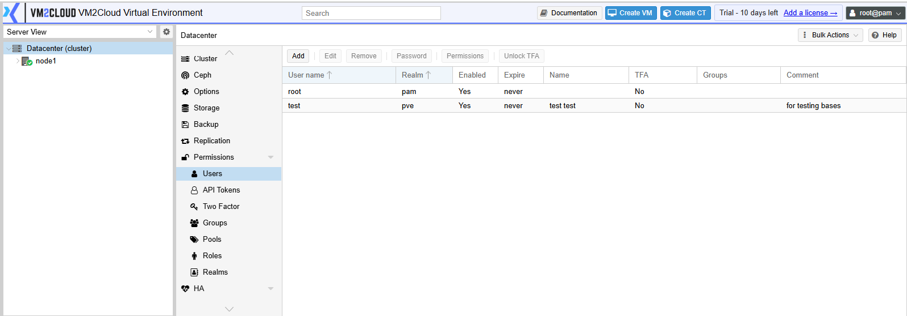
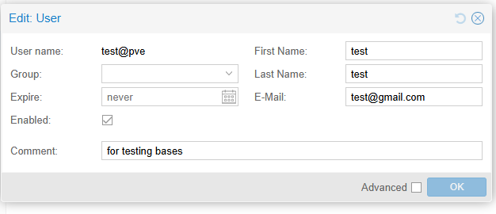
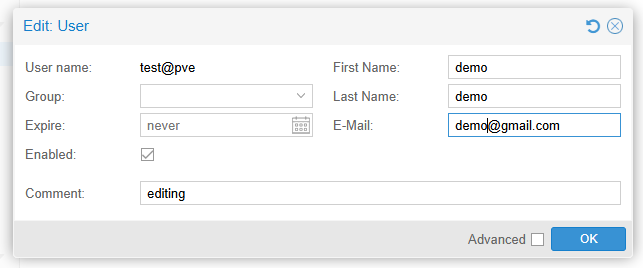

# Users

---

## Overview

User Management allows administrators to create, modify, and remove user accounts in VM2Cloud. Each user authenticates through an authentication realm and can be assigned roles and permissions to control access to cluster resources.

User accounts can also be enabled, disabled, or configured with an expiration date to meet organizational security requirements.

---

## When to Use

Use User Management to:

- Create new user accounts.
- Modify user information.
- Enable or disable user accounts.
- Configure account expiration.
- Remove users who no longer require access.

---

## Prerequisites

Before managing users, ensure that:

- You have administrator privileges.
- The required authentication realm exists.
- The required roles and permissions have been identified.

---

# Access User Management

1. Log in to the VM2Cloud web interface.
2. Select **Datacenter**.
3. Click **Permissions**.
4. Click **Users**.

The Users page displays all configured user accounts.

---

**Users Page**



---

# Create a User

## Step 1: Open the Create User Window

1. Click **Add**.

The **Add User** window opens.

---

**Add User Window**



---

## Step 2: Configure the User

Enter the required information.

Typical fields include:

- User Name
- Realm
- Password
- Confirm Password
- Expire (Optional)
- First Name (Optional)
- Last Name (Optional)
- Email (Optional)
- Comment (Optional)
- Enable Account

Review the configuration before continuing.

---

**Configure the User**



---

## Step 3: Create the User

1. Click **Add**.

The user is created and appears in the Users list.

---

**New User Created**



---

# Edit a User

> **Note:** The username and authentication realm cannot be changed after the user has been created.

## Step 1: Select the User

1. Select the required user.
2. Click **Edit**.

---

**Edit User**



---

## Step 2: Update the User

Modify the required information.

Typical editable fields include:

- First Name
- Last Name
- Email
- Expire
- Comment
- Enable Account

Click **OK** to save the changes.

---

**Update the User**



---

## Step 3: Verify the Update

The updated details appear in the Users list.

---

**Updated User**


---

# Delete a User

> **Warning:** Deleting a user permanently removes the account from VM2Cloud.

## Step 1: Select the User

1. Select the required user.

---

## Step 2: Delete the User

1. Click **Remove**.
2. Review the confirmation message.
3. Click **Yes**.

The user account is permanently removed.

---

### Screenshot 7

```text
[ Place Screenshot Here ]
```

---

# Verification

Verify the following:

- The user appears in the Users list after creation.
- Updated information is displayed correctly after editing.
- Disabled users cannot authenticate.
- Deleted users no longer appear in the Users list.
- The user has the expected roles and permissions.

---

# Common Issues

| Issue | Resolution |
|-------|------------|
| Unable to create a user | Verify that all required fields are completed and the username is unique within the selected authentication realm. |
| User cannot log in | Confirm that the account is enabled, the correct authentication realm is selected, and the password is correct. |
| User cannot access resources | Verify that the appropriate role and permissions have been assigned. |
| Unable to edit the user | Ensure that you have administrator privileges. |
| Unable to delete the user | Verify that the correct user is selected and that your account has sufficient privileges. |

---

# Summary

User Management enables administrators to create, update, and remove user accounts while maintaining secure access to VM2Cloud resources. After creating a user, assign the appropriate roles and permissions to provide the required level of access while following the principle of least privilege.
