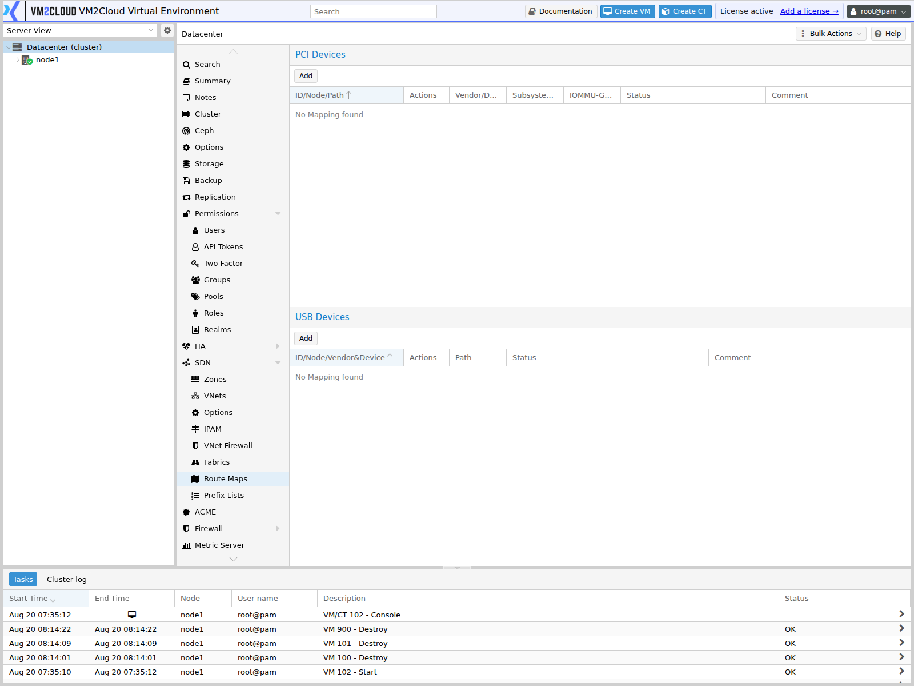
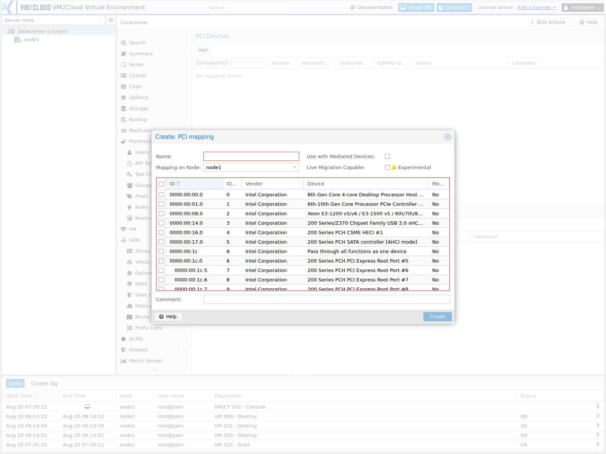

# Resource Mappings

---

## Overview

A **resource mapping** gives a physical device — a PCI card or a USB device — a cluster-wide logical name, and records which actual device that name refers to **on each node**.

It exists to solve a specific problem. A guest with a device passed through is normally tied to one node, because the device address differs on every machine. Mapping the device gives the guest a name instead of an address, so it can start on any node that has an equivalent device.

That makes three things possible that otherwise are not:

* **Migration** of a guest using passthrough hardware.
* **High availability** for such a guest — HA can recover it on another node that has the mapped device.
* **Delegation**, since a non-root user can be granted use of a mapped device without being given raw device access.

---

## When to Use

Create a resource mapping when:

* A guest needs a GPU, network card, or other PCI device passed through.
* A guest needs a USB device — a licence dongle, a serial adapter.
* Such a guest must be able to migrate, or be protected by HA.
* Non-administrators should be able to assign a device without administrator rights.

If a guest with passthrough will only ever run on one node and never needs HA, a mapping adds nothing over configuring the device directly.

---

## Prerequisites

* You have administrator privileges.
* The cluster has quorum.
* The device is present on every node the guest may run on.
* For PCI passthrough, the host is configured for it — IOMMU enabled in firmware and the relevant kernel settings applied.
* You know the device address on each node.

> **Warning:** Passing a device through gives the guest direct control of that hardware. The host cannot use it at the same time, and a device in use by the host must be released first. Do not map a device the host depends on, such as the boot controller or the management network card.

---

# Procedure

## Step 1: Open the Resource Mappings Panel

1. Log in to the VM2Cloud VE web interface.
2. Select **Datacenter**.
3. Click **Resource Mappings**.

The panel lists PCI and USB mappings separately.

---

### Screenshot 1

**Resource Mappings Panel**



The panel has two independent sections, **PCI Devices** and **USB Devices**, each with its
own **Add** control. The PCI table carries ID/Node/Path, Actions, Vendor/Device, Subsystem
Vendor/Device, **IOMMU-Group**, Status, and Comment. Both read `No Mapping found` until
something is mapped.

---

## Step 2: Add a Mapping

1. Click **Add** in the PCI or USB section.
2. Enter a **Name** — the logical identifier guests will reference.
3. Select the **Node**.
4. Select the **device** on that node.
5. Confirm.

Name the mapping after what the device *is*, not where it sits — `gpu-passthrough` or `licence-dongle`, not `slot-3`. The whole point is that the location differs per node.

---

### Screenshot 2

**Add Mapping Dialog**



The dialog asks for a mapping name and then the node and device, with the devices detected
on the selected node offered for selection.

---

## Step 3: Add an Entry for Every Node

A mapping with one node entry works, but the guest can then only run on that node — which defeats the purpose.

1. Edit the mapping.
2. Add an entry for each additional node.
3. Select that node's equivalent device.
4. Confirm.

The devices do not have to sit at the same address on each node. They do have to be genuinely equivalent — a guest expecting a particular GPU will not work correctly if one node maps a different model.

---

### Screenshot 3

**Mapping Across Multiple Nodes**

```text
[ Place Screenshot Here ]
```

> **Capture:** A mapping with entries for two or more nodes, showing the different device
> addresses on each.

---

## Step 4: Assign the Device to a Guest

1. Select the virtual machine.
2. Open **Hardware**.
3. Click **Add** and select the PCI or USB device type.
4. Choose the **mapped device** rather than a raw device.
5. Confirm.

See [Manage VM Hardware](../04-Virtual-Machines/Manage-VM-Hardware.md).

---

## Step 5: Grant Access (Optional)

Mapped devices can be delegated without administrator rights, using the mapping privileges:

| Privilege | Allows |
|---|---|
| `Mapping.Audit` | Seeing the mapping in listings. |
| `Mapping.Modify` | Creating, changing, and deleting mappings. |
| `Mapping.Use` | Assigning the mapped device to a guest. |

Grant `Mapping.Use` to a team that needs to attach a device, without giving them the ability to redefine what the mapping points at. See [Roles](Permissions/Roles.md).

---

## Step 6: Verify Migration

The reason for the mapping.

1. Start the guest on one node.
2. Confirm the device is present inside the guest.
3. Migrate to another node with an entry in the mapping.
4. Confirm the guest starts and the device is still present.

Test this before relying on HA. A mapping that covers only some nodes produces a guest that HA cannot recover, and that only becomes apparent during a failure.

---

# Configuration / Options

| Field | Description |
|---|---|
| **Name** | Logical identifier referenced by guests. |
| **Node** | Which node this entry describes. |
| **Device** | The physical device on that node. |
| **Comment** | Optional description. |

> **Verify:** Capture the Add dialog for both PCI and USB mappings and confirm the exact
> field labels and any additional per-device options.

---

# Verification

Verify the following:

* The mapping appears with the intended name.
* Every node the guest may run on has an entry.
* The devices mapped on each node are genuinely equivalent.
* The guest starts with the device present.
* The guest migrates successfully between mapped nodes.
* HA recovers the guest onto a mapped node, if HA is configured.
* Users granted `Mapping.Use` can assign the device and nothing more.

---

# Common Issues

| Issue | Resolution |
|-------|------------|
| Guest will not start on a node | That node has no entry in the mapping, or its device is unavailable. |
| Migration blocked | The target node is not in the mapping. Add an entry for it. |
| HA cannot recover the guest | Same cause — HA can only place it on nodes the mapping covers. |
| Device not detected on a node | Check the hardware is present and that passthrough is enabled on that host. |
| Guest starts but the device misbehaves | The mapped devices may not be equivalent across nodes. Compare models. |
| Host lost a function after mapping | The device was in use by the host. Do not map devices the host depends on. |
| Non-admin cannot assign the device | They need `Mapping.Use` on the mapping. |

---

# Best Practices

- **Map every node the guest may run on**, not just its current one. A partial mapping silently removes migration and HA.
- Name mappings after the device's purpose, since the address differs per node.
- Use identical hardware on every mapped node where possible.
- Never map a device the host needs — boot controllers, management NICs.
- Grant `Mapping.Use` rather than administrator rights when delegating.
- Test a migration before relying on HA for a guest with passthrough.
- Record which guests use which mapping, so hardware changes can be assessed.

---

# Related Documentation

- [Manage VM Hardware](../04-Virtual-Machines/Manage-VM-Hardware.md)
- [Directory Mappings](Directory-Mappings.md)
- [Custom CPU Models](Custom-CPU-Models.md)
- [Roles](Permissions/Roles.md)
- [Assign Permissions](Permissions/Assign-Permissions.md)
- [HA Resources](HA/HA-Resources.md)
- [Migrate Virtual Machine](../04-Virtual-Machines/Migrate-Virtual-Machine.md)

---

# Summary

A resource mapping gives a PCI or USB device a cluster-wide name and records which physical device that name means on each node. Guests then reference the name rather than an address, which is what allows a guest with passthrough hardware to migrate and to be protected by HA.

The mistake that matters is mapping only one node. The guest works, the device appears, and everything looks correct — until a migration is attempted or HA tries to recover it, and there is nowhere to place it. Map every node the guest may run on, and test a migration before trusting HA.
