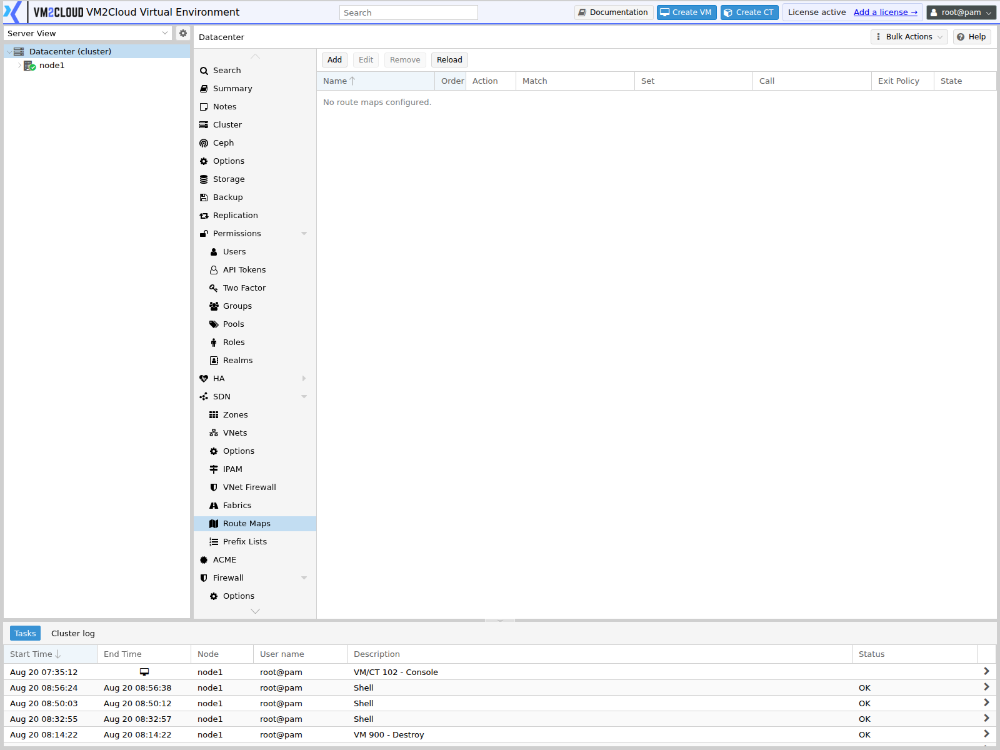
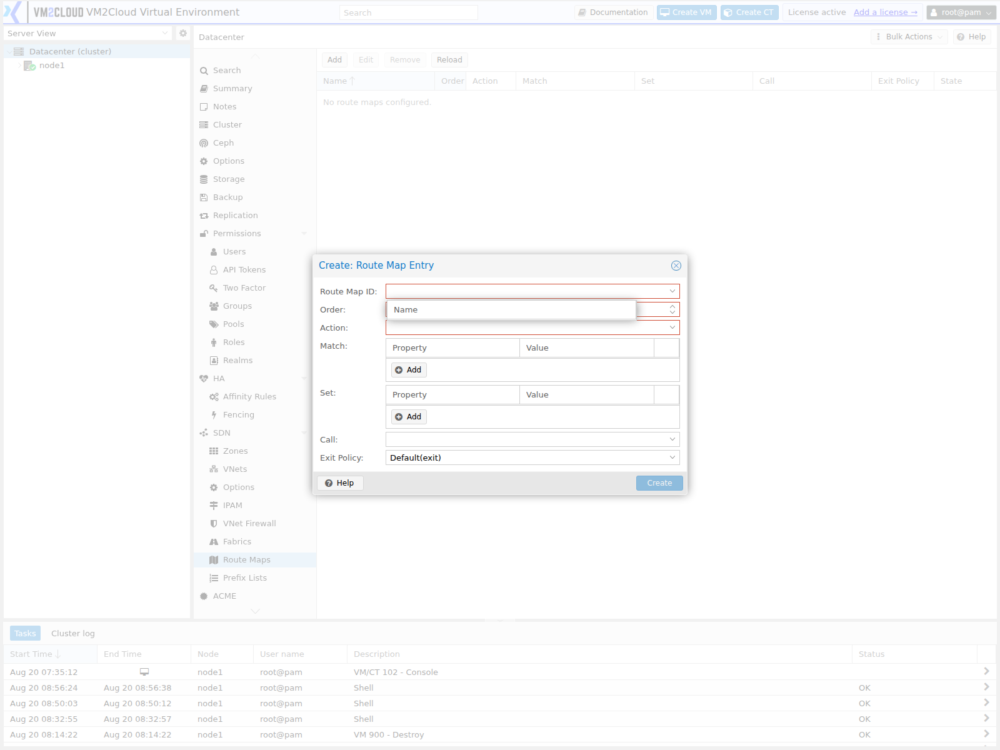

# Route Maps

---

## Overview

A **route map** controls which routes are exchanged with routing peers, and lets you modify the attributes of routes as they pass.

It answers two questions: *should this route be accepted or advertised at all?* and *if so, should anything about it change?*

Route maps apply to routes exchanged with BGP, EVPN, OSPF, or fabric peers. They are only relevant once routing is involved — a simple or VLAN zone exchanges no routes and needs none.

Route maps are frequently paired with [prefix lists](Prefix-Lists.md), which supply the "which destinations" part of a match.

---

## When to Use

Create a route map when you need to:

* Stop specific routes being advertised to a peer.
* Accept only certain routes from a peer.
* Prefer one path over another by adjusting route attributes.
* Tag routes so downstream policy can act on them.
* Filter what an EVPN zone exchanges.

If you are not running EVPN, BGP, or a routed [fabric](Fabrics.md), you do not need route maps.

---

## Prerequisites

* SDN is configured with a routing-capable zone or fabric.
* You understand the routing design — which peers, which routes, which direction.
* Any [prefix list](Prefix-Lists.md) you intend to match on already exists.
* The cluster has quorum.

> **Warning:** A route map with a `deny` entry, or one that falls through to the implicit deny at the end, drops routes. Applied to the wrong direction or peer, it removes connectivity for everything those routes served. Build and review the entries before attaching a map to a peer.

---

# How a Route Map Works

A map is an ordered list of entries. Each entry has a **match** condition and an **action**.

```text
route arrives
      │
      ▼
entry 10  ── match? ──yes──▶ action: permit  ──▶ apply Set  ──▶ done
      │no
      ▼
entry 20  ── match? ──yes──▶ action: deny    ──▶ route dropped
      │no
      ▼
   no entry matched  ──▶  implicit deny  ──▶  route dropped
```

Two consequences worth holding onto:

**Order decides everything.** Entries are evaluated by their order number, lowest first, and the first match wins.

**Anything unmatched is dropped.** A map that permits only what you listed silently discards the rest. If you intend to permit everything else, add a final entry that does so explicitly.

---

# Procedure

## Step 1: Open the Route Maps Panel

1. Log in to the VM2Cloud VE web interface.
2. Select **Datacenter**.
3. Expand **SDN**.
4. Click **Route Maps**.

---

### Screenshot 1

**Route Maps Panel**



Route maps shape which routes are accepted and advertised in a routed SDN deployment.

---

## Step 2: Add an Entry

1. Click **Add**.
2. Enter the map **Name**. Entries sharing a name form one map.
3. Set the **Order** — the evaluation position within that map.
4. Set the **Action** — permit or deny.
5. Set the **Match** conditions.
6. Set any **Set** attributes to modify.
7. Confirm.

---

### Screenshot 2

**Add Route Map Entry**



Each entry pairs a match condition with an action, applied in sequence.

---

## Step 3: Choose the Order Deliberately

Order numbers run from 0 upward and must be unique within a map.

Leave gaps. Numbering entries 10, 20, 30 lets you insert an entry at 15 later without renumbering everything. Consecutive numbering guarantees a renumber the first time requirements change.

---

## Step 4: Set Match Conditions

Match narrows which routes the entry applies to.

| Match on | Selects |
|---|---|
| **Prefix list** | Routes whose destination appears in a named [prefix list](Prefix-Lists.md). |
| **Route type** | Routes of a particular kind. |
| **VNI** | Routes belonging to a specific VXLAN network identifier. |
| **Metric** | Routes with a given metric. |
| **Peer** | Routes from or to a specific peer. |

An entry with no match condition matches **every** route. That is useful as a final catch-all, and dangerous anywhere else.

> **Verify:** Capture the Match field and confirm the full set of match types available.

---

## Step 5: Set Attributes to Modify

**Set** changes route attributes when the entry matches and permits.

| Set | Effect |
|---|---|
| **Local preference** | Influences which path is preferred. Higher wins. |
| **Metric** | Adjusts the route's cost. |
| **Next hop** | Overrides where traffic for the route is sent. |
| **Tag** | Marks the route so later policy can match on it. |

Set is optional. A map that only filters needs none of it.

---

## Step 6: Control the Exit Policy

By default, evaluation stops at the first matching entry.

The exit policy can change that — continuing to the next entry, or jumping to a specific one, so several entries can act on the same route in sequence.

Leave it at the default unless you have a specific reason. Chained evaluation is powerful and makes the effective policy much harder to reason about.

> **Verify:** Confirm the exact exit policy options offered.

---

## Step 7: Apply and Verify

1. Return to the **SDN** panel and click **Apply**.
2. Confirm the entries show as applied rather than pending.
3. Confirm the routes you expect are present, and the ones you filtered are not.
4. Confirm connectivity still works for everything the routes served.

Verify from the network, not from the map. A map that reads correctly and drops a route you needed looks the same in the panel either way.

---

# Configuration / Options

| Field | Description |
|---|---|
| **Name** | Map identifier. Entries with the same name form one ordered map. |
| **Order** | Evaluation position. Unique within a map, lowest first. |
| **Action** | **permit** — allow the route, applying any Set. **deny** — drop it. |
| **Match** | Which routes the entry applies to. Empty matches everything. |
| **Set** | Attributes to modify on a permitted route. |
| **Call** | Invoke another map as part of evaluation. |
| **Exit Policy** | Whether evaluation stops at this entry or continues. |
| **State** | Applied, or pending until **Apply** runs. |

> **Verify:** Capture the Add dialog and confirm the exact field labels, the valid order
> range, and the available match and set options.

---

# Verification

Verify the following:

* Entries appear under the intended map name.
* Order numbers are unique and in the sequence you intended.
* **Apply** completed with nothing pending.
* Routes you intended to permit are present at the peer.
* Routes you intended to filter are absent.
* Nothing you did not intend to filter has disappeared.
* Connectivity is unchanged for everything else.

---

# Common Issues

| Issue | Resolution |
|-------|------------|
| All routes disappeared | The map permits only what was listed and everything else hit the implicit deny. Add a final permit entry. |
| An entry never matches | An earlier entry matched first. Check the order numbers. |
| Entry applies to everything | The match condition is empty, which matches all routes. |
| Cannot insert an entry cleanly | Order numbers are consecutive. Renumber with gaps. |
| Changes have no effect | **Apply** was not clicked. |
| Prefix list match fails | The list does not exist, or the name does not match. See [Prefix Lists](Prefix-Lists.md). |
| Path preference unchanged | Confirm the Set attribute is one the peer honours, and that the entry actually matched. |
| Policy hard to follow | An exit policy is chaining entries. Simplify to first-match-wins. |

---

# Best Practices

- **Number entries in tens.** Inserting later then needs no renumbering.
- Add an explicit final entry if you want unmatched routes permitted — never rely on remembering the implicit deny.
- Give every entry a match condition unless it is deliberately the catch-all.
- Use [prefix lists](Prefix-Lists.md) for destination matching rather than repeating CIDRs across entries.
- Keep exit policy at the default. Chained evaluation is rarely worth the loss of clarity.
- Build and review the whole map before attaching it to a peer.
- Verify from the routing table, not from the panel.
- Name maps after their purpose and direction, such as `to-spine-out`.

---

# Related Documentation

- [Prefix Lists](Prefix-Lists.md)
- [SDN Overview](SDN-Overview.md)
- [Zones](Zones.md)
- [Fabrics](Fabrics.md)
- [SDN Options](SDN-Options.md)
- [Network Troubleshooting](../../03-Nodes/System/Network/Network-Troubleshooting.md)

---

# Summary

A route map is an ordered list of entries that decides which routes are exchanged with a peer and how their attributes are modified. Entries are evaluated lowest order first, the first match wins, and anything matching no entry is dropped by an implicit deny at the end.

That implicit deny is what catches people: a map written to permit a few specific routes silently discards every other route as well. If the intent is "filter these and allow the rest", the "allow the rest" has to be an explicit final entry. Number in tens so entries can be inserted later, and verify against the actual routing table rather than the panel.
