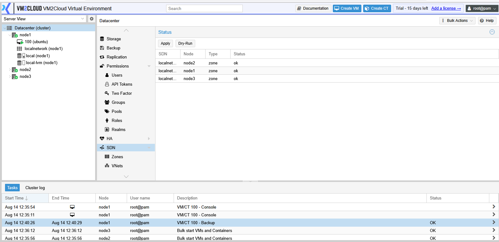

# SDN Overview

---

## Overview

**Software-Defined Networking (SDN)** lets you define virtual networks centrally at the datacenter level and have them appear automatically on every node, instead of configuring bridges and VLANs on each node by hand.

The problem it solves grows with the cluster. With five nodes and a new VLAN to add, [conventional networking](../../03-Nodes/System/Network/Network-Overview.md) means configuring it five times, consistently, without mistakes. With SDN you define it once and apply it cluster-wide.

SDN also does something conventional bridges cannot: it creates networks that **span nodes over an existing IP network**, without needing the physical switches to carry those VLANs.

---

## When to Use

Use SDN when:

* The same virtual networks are needed on every node.
* You add networks often enough that per-node configuration is a burden.
* Tenants or projects need isolated networks.
* Networks must span nodes without reconfiguring physical switches.
* Guests should keep their network when migrating between nodes.

Stick with conventional bridges and VLANs when:

* You have one or two nodes.
* The network layout rarely changes.
* Existing VLAN infrastructure already does the job.
* Nobody will own the additional complexity.

SDN is genuinely valuable at scale and genuinely unnecessary below it.

---

## Prerequisites

* The cluster has quorum.
* The SDN feature is available and installed.
* Nodes have working conventional networking as a foundation. See [Network Overview](../../03-Nodes/System/Network/Network-Overview.md).
* You know which physical interface or bridge SDN will build on.
* For VXLAN or EVPN zones, nodes can reach each other by IP and the MTU allows for encapsulation overhead.

> **Verify:** Confirm whether SDN is installed by default in this deployment or requires
> additional packages, and capture the Datacenter → SDN panel.

---

# How SDN Is Structured

Three layers, each contained by the one above.

```text
Zone          how the network is carried between nodes
  └── VNet    the virtual network guests attach to
        └── Subnet   the IP range on that VNet
```

| Layer | What it is | Guest-facing |
|---|---|---|
| **Zone** | The transport mechanism — VLAN, VXLAN, or a simple local bridge. Defines *how* traffic moves between nodes. | No |
| **VNet** | A virtual network within a zone. Appears on each node as a bridge guests can attach to. | Yes |
| **Subnet** | An IP range on a VNet, with optional gateway and address management. | Indirectly |

A guest attaches to a **VNet**, exactly as it would attach to a bridge. See [VNets](VNets.md).

---

# Zone Types

The zone type is the decision that shapes everything else. See [Zones](Zones.md) for configuration.

| Type | How it works | Use when |
|---|---|---|
| **Simple** | An isolated bridge on each node, with routing handled locally. | Isolated networks that do not need to span nodes. |
| **VLAN** | Uses VLAN tags on your existing physical network. | Your switches already carry the VLANs. |
| **QinQ** | Stacked VLAN tags, for tenant separation within a VLAN. | Service providers separating customers. |
| **VXLAN** | Encapsulates traffic over IP, so networks span nodes without switch changes. | Networks must span nodes and you cannot reconfigure switches. |
| **EVPN** | VXLAN plus a BGP control plane, adding routing and external exit points. | Routed multi-tenant networks. |

**VLAN** is the common choice where the infrastructure already supports it. **VXLAN** is the common choice where it does not — its appeal is that the physical network only has to carry IP traffic between nodes, and knows nothing about the virtual networks running over it.

> **Warning:** VXLAN adds encapsulation overhead to every packet. If the underlying network uses a standard 1500-byte MTU and you do not account for this, you get a network that works for small packets and fails for large ones — which presents as intermittent, hard-to-diagnose faults rather than an obvious outage. Either raise the MTU on the underlying network or reduce it inside the VNets.

---

# Staged Changes

SDN configuration is **staged and then applied**, rather than taking effect as you type.

```text
Create or edit zone / VNet / subnet
              |
              v
     Changes are pending
              |
         Click Apply
              |
              v
Configuration pushed to every node
```

This is deliberate — it lets you build a complete change and roll it out atomically, instead of leaving the cluster half-configured while you work.

It also means **nothing you configure works until you click Apply**, which is the single most common source of confusion with SDN.

---

### Screenshot 1

**Datacenter SDN Panel**



The Status panel reports every zone against every node, so a configuration that applied to
some nodes and not others is visible immediately. **Apply** pushes pending changes to all
nodes; **Dry-Run** reports what would change without doing it.

---

# Configuration / Options

Setting up SDN follows a fixed order, because each layer depends on the one above.

1. Create a **zone**, choosing the type and the interface it builds on.
2. Create one or more **VNets** in that zone.
3. Optionally add **subnets** to the VNets.
4. Click **Apply**.
5. Attach guests to the VNet, as you would to a bridge.

See [Zones](Zones.md) and [VNets](VNets.md).

---

# The SDN Panels

| Panel | Covers |
|---|---|
| [Zones](Zones.md) | How traffic is carried between nodes |
| [VNets](VNets.md) | The networks guests attach to, and their subnets |
| [SDN Options](SDN-Options.md) | Controllers, IPAM backends, and DNS backends |
| [IPAM](IPAM.md) | Which addresses are allocated to which guests |
| [VNet Firewall](VNet-Firewall.md) | Filtering traffic within a virtual network |
| [Fabrics](Fabrics.md) | Automatic routing between nodes on a routed underlay |
| [Route Maps](Route-Maps.md) | Which routes are exchanged with peers, and how they are modified |
| [Prefix Lists](Prefix-Lists.md) | Named sets of prefixes that route maps match on |

Most deployments use only **Zones** and **VNets**. The rest matter for EVPN, routed underlays, and multi-tenant isolation.

---

# Verification

Verify the following:

* Zones and VNets appear in the SDN panel with no pending changes.
* **Apply** completed without errors.
* The VNet appears as an available bridge when configuring a guest interface.
* A guest attached to the VNet reaches other guests on the same VNet.
* Guests on different nodes but the same VNet can reach each other.
* Guests on different VNets are isolated, if that was the intent.
* A guest keeps its network after migrating to another node.
* Large packets pass, not only small ones — this is what catches MTU problems.

That last check matters for VXLAN. Test with large transfers, not just a ping.

---

# Common Issues

| Issue | Resolution |
|-------|------------|
| Configuration has no effect | **Apply** was not clicked. Changes stay pending until then. |
| VNet not selectable on a guest | Apply has not run, or the zone does not include that node. |
| Guests on the same VNet cannot reach each other across nodes | Zone transport problem. For VXLAN, check node-to-node IP connectivity. |
| Small transfers work, large ones fail | MTU. VXLAN encapsulation overhead has not been accounted for. |
| Apply fails on one node | That node may have different underlying networking. Check its bridges match what the zone expects. |
| Guest loses network after migrating | The VNet does not exist on the target node. Confirm the zone covers all nodes. |
| Cannot delete a zone | VNets still exist inside it. Remove them first. |
| SDN panel absent | The feature is not installed. |

---

# Best Practices

- **Use SDN only if you need it.** Conventional bridges are simpler and adequate for small, stable environments.
- Choose the zone type deliberately — VLAN where switches support it, VXLAN where they do not.
- Plan MTU before deploying VXLAN, not after diagnosing an intermittent fault.
- Build the complete change, then Apply once.
- Test on a non-production VNet before moving workloads.
- Name zones and VNets after their purpose, not their technology.
- Verify migration keeps guests connected — that is a main reason for using SDN.
- Test with large transfers as well as pings.
- Document which VNet each tenant or project uses.

---

# Related Documentation

- [Zones](Zones.md)
- [VNets](VNets.md)
- [Network Overview](../../03-Nodes/System/Network/Network-Overview.md)
- [Manage Linux Bridge](../../03-Nodes/System/Network/Manage-Linux-Bridge.md)
- [Manage VLAN](../../03-Nodes/System/Network/Manage-VLAN.md)
- [Network Troubleshooting](../../03-Nodes/System/Network/Network-Troubleshooting.md)
- [CT Network](../../05-Containers/CT-Network.md)
- [Manage VM Hardware](../../04-Virtual-Machines/Manage-VM-Hardware.md)

---

# Summary

SDN defines virtual networks once at datacenter level and pushes them to every node, replacing per-node bridge and VLAN configuration. It is structured in three layers — zones carry traffic between nodes, VNets are the networks guests attach to, and subnets provide IP ranges.

Two things account for most SDN problems. Configuration is **staged**: nothing takes effect until you click Apply. And VXLAN adds encapsulation overhead, so an unadjusted MTU produces a network that passes small packets and fails large ones — which looks like an intermittent fault rather than a configuration error.
