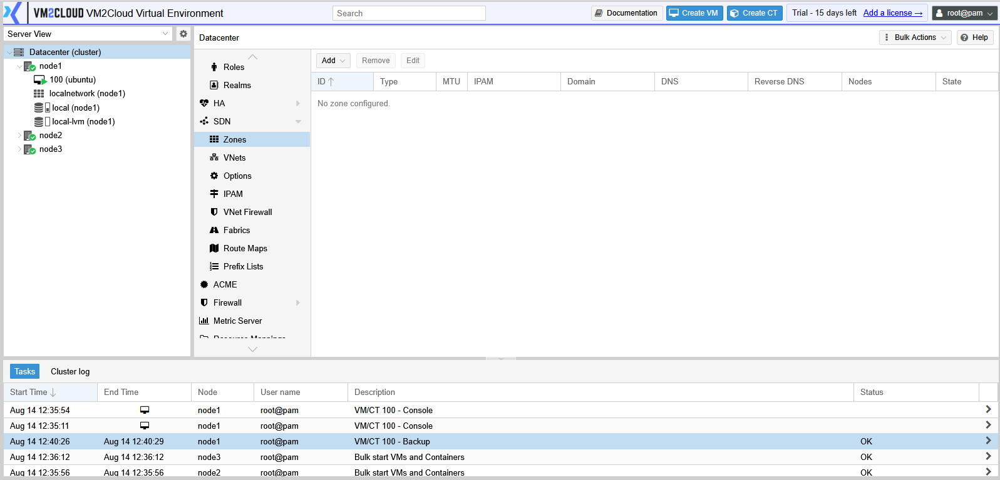
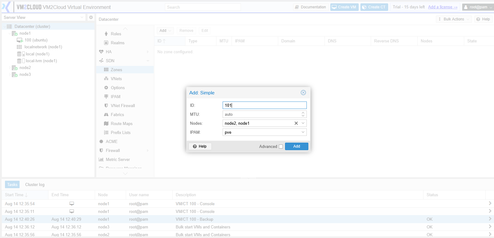
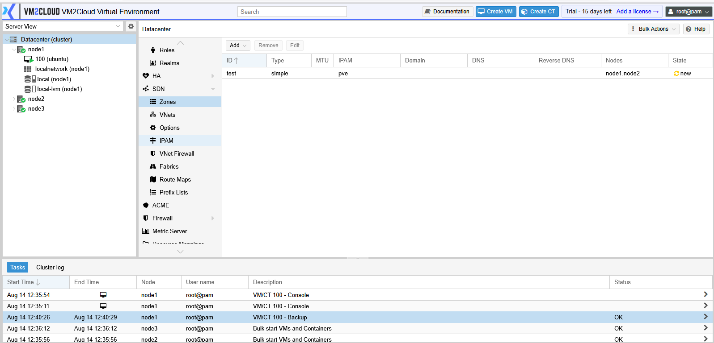

# SDN Zones

---

## Overview

A **zone** defines how SDN traffic is carried between nodes. It is the transport layer beneath the virtual networks guests actually attach to.

Choosing the zone type is the decision that shapes everything else, and it is difficult to change afterwards — the VNets inside a zone depend on it. Get this right before building on top.

Zones contain [VNets](VNets.md). For how the layers fit together and how staged changes work, see [SDN Overview](SDN-Overview.md).

---

## When to Use

Create a zone when you need to:

* Deploy SDN for the first time.
* Add a transport mechanism the existing zones do not provide.
* Separate tenants that must not share a transport.
* Extend SDN to nodes not covered by existing zones.

Most environments need **one or two** zones. Create more only when the transport genuinely differs — extra zones add complexity without isolation benefits that VNets cannot already provide.

---

## Prerequisites

* The cluster has quorum and SDN is available.
* Underlying networking on each node is configured and working.
* You know which bridge or interface the zone will build on, and that it exists on **every** node the zone covers.
* For VLAN zones, the physical switches carry the VLANs.
* For VXLAN zones, nodes can reach each other by IP and you have planned the MTU.

> **Warning:** A zone applies to the nodes you assign it to, and expects the same underlying bridge on each. If one node names its bridge differently, Apply fails for that node and the zone works everywhere except there.

---

# Choosing a Zone Type

| Type | Transport | Needs from the physical network | Spans nodes |
|---|---|---|---|
| **Simple** | Local bridge per node, routed locally | Nothing | No |
| **VLAN** | VLAN tags on an existing bridge | Switches must carry the VLANs | Yes |
| **QinQ** | Stacked VLAN tags | Switches must carry the outer VLAN | Yes |
| **VXLAN** | Encapsulated over IP | Only IP connectivity between nodes | Yes |
| **EVPN** | VXLAN with a BGP control plane | IP connectivity, plus BGP configuration | Yes, with routing |

## How to decide

**Do the guests need to talk across nodes?** If not, **Simple** is enough and adds nothing to maintain.

**Do your switches already carry the VLANs you need?** If yes, use **VLAN**. It is the simplest option that spans nodes, and performance is native — no encapsulation.

**Can you not change the switches?** Use **VXLAN**. The physical network only carries IP between nodes and never learns about the virtual networks. This is the usual choice in environments where the network team and the virtualization team are different people.

**Do you need routing between VNets, or an external exit point?** Use **EVPN**. It is VXLAN plus BGP, and it is the most complex option — take it only when routing is a genuine requirement.

> **Warning:** **VXLAN and EVPN add encapsulation overhead to every packet.** With a standard 1500-byte MTU on the underlying network and no adjustment, small packets pass and large ones are dropped. The result looks like an intermittent application fault rather than a network misconfiguration, and it can take a long time to diagnose. Either raise the MTU on the underlying network, or lower it inside the VNets.

---

# Procedure

## Step 1: Open the Zones Panel

1. Log in to the VM2Cloud VE web interface.
2. Select **Datacenter** in the resource tree.
3. Expand **SDN**.
4. Click **Zones**.

---

### Screenshot 1

**SDN Zones Panel**

The columns are ID, Type, MTU, IPAM, Domain, DNS, Reverse DNS, Nodes, and State. **Add** is
a dropdown — the zone type is chosen there rather than inside the dialog.

---

## Step 2: Create the Zone

1. Click **Add**.
2. Select the zone **type**.
3. Enter an **ID** — a short identifier used throughout SDN.
4. Configure the type-specific fields described below.
5. Select the **Nodes** the zone applies to.
6. Set the **MTU** if the type requires it.
7. Confirm.

---

### Screenshot 2

**Add Zone Dialog**

A Simple zone takes an ID, an MTU, the nodes it applies to, and an IPAM. **Nodes** is a
multi-select: a zone omitting a node simply does not exist there, which is the usual reason
a guest fails to reach its network after a migration. **Advanced** exposes the remaining
options, and the field set changes with the zone type.

---

## Step 3: Configure the Type-Specific Fields

**Simple**

No transport configuration. Traffic stays on the node.

**VLAN**

* **Bridge** — the existing bridge carrying the tagged traffic. Must exist with the same name on every selected node.

**QinQ**

* **Bridge** — as above.
* **Service VLAN** — the outer tag.

**VXLAN**

* **Peer address list** — the IP addresses of the participating nodes, used to build the overlay.
* **MTU** — set with encapsulation overhead in mind.

**EVPN**

* **VRF VXLAN ID** — identifier for the routing instance.
* **Controller** — the BGP controller for the zone.
* **Exit nodes** — nodes providing external routing.

> **Verify:** Capture the Add Zone dialog for each type available in this deployment and
> confirm the exact field labels and which types are offered.

---

## Step 4: Apply

Nothing works until this happens.

1. Return to the **SDN** panel.
2. Click **Apply**.
3. Wait for the task to complete on every node.
4. Confirm no pending changes remain.

---

### Screenshot 3

**Applying SDN Configuration**

A newly created zone shows **State: new** and does nothing yet. SDN configuration is staged
until applied, which is what makes a partial or mistaken change safe to correct before it
reaches the nodes. Run **Apply** from [SDN Overview](SDN-Overview.md) to commit it; the
state clears once every node reports the zone.

> **Capture:** Still needed — the Apply action running, with its task output. This image
> shows the pending state that Apply resolves, not the apply itself.

---

## Step 5: Verify the Zone

1. Confirm the zone appears with the intended type and nodes.
2. Confirm Apply completed on every node without error.
3. Create a test [VNet](VNets.md) inside it.
4. Attach a guest and confirm connectivity.

A zone with no VNet does nothing observable, so testing requires at least one.

---

## Step 6: Edit or Remove

**To edit:**

1. Select the zone.
2. Click **Edit**.
3. Change the fields.
4. Apply.

The zone **type** cannot be changed after creation. To change transport, create a new zone, move the VNets, and remove the old one.

**To remove:**

1. Remove every VNet in the zone.
2. Select the zone.
3. Click **Remove**.
4. Apply.

> **Warning:** Removing a zone disconnects every guest attached to VNets inside it. Confirm nothing is using it first.

---

# Configuration / Options

| Option | Applies to | Description |
|---|---|---|
| **Type** | All | Transport mechanism. Fixed at creation. |
| **ID** | All | Short identifier for the zone. |
| **Nodes** | All | Which nodes the zone applies to. |
| **MTU** | All | Maximum packet size. Critical for VXLAN and EVPN. |
| **Bridge** | VLAN, QinQ | Underlying bridge. Must exist identically on every node. |
| **Service VLAN** | QinQ | Outer VLAN tag. |
| **Peer address list** | VXLAN | Node IP addresses forming the overlay. |
| **VRF VXLAN ID** | EVPN | Routing instance identifier. |
| **Controller** | EVPN | BGP controller. |
| **Exit nodes** | EVPN | Nodes providing external routing. |
| **DNS / IPAM** | All | Optional integration for address management. |

---

# Verification

Verify the following:

* The zone appears with the correct type and node list.
* Apply completed on every node.
* No pending changes remain.
* A test VNet in the zone is available on all assigned nodes.
* Guests on the VNet reach each other across nodes, for zone types that span nodes.
* Large transfers succeed, not only pings.
* A guest keeps connectivity after migrating.

---

# Common Issues

| Issue | Resolution |
|-------|------------|
| Apply fails on one node | The underlying bridge is missing or named differently there. Check that node's network configuration. |
| Zone has no effect | Apply was not clicked, or no VNet exists in the zone. |
| Guests cannot reach each other across nodes | For VLAN, check the switches carry the tag. For VXLAN, check node-to-node IP connectivity. |
| Pings work but transfers fail | MTU. Account for encapsulation overhead on VXLAN and EVPN. |
| Cannot change the zone type | Correct — create a new zone and migrate the VNets. |
| Cannot remove the zone | VNets still exist inside it. |
| Guest loses network after migration | The zone does not include the target node. |
| EVPN routing not working | Check the controller and exit node configuration. |

---

# Best Practices

- Choose the type deliberately. It cannot be changed, and everything above depends on it.
- Prefer **VLAN** where the switches already support it — native performance, no encapsulation.
- Choose **VXLAN** when you cannot change the physical network.
- Plan MTU before deploying VXLAN or EVPN, not after diagnosing intermittent failures.
- Confirm the underlying bridge exists with the same name on every node in the zone.
- Keep the number of zones small. Use VNets for separation, not zones.
- Name zones by purpose rather than technology.
- Test with a throwaway VNet before moving workloads.
- Always Apply, and confirm it succeeded on every node.

---

# Related Documentation

- [SDN Overview](SDN-Overview.md)
- [VNets](VNets.md)
- [Network Overview](../../03-Nodes/System/Network/Network-Overview.md)
- [Manage Linux Bridge](../../03-Nodes/System/Network/Manage-Linux-Bridge.md)
- [Manage VLAN](../../03-Nodes/System/Network/Manage-VLAN.md)
- [Apply Network Configuration](../../03-Nodes/System/Network/Apply-Network-Configuration.md)
- [Network Troubleshooting](../../03-Nodes/System/Network/Network-Troubleshooting.md)

---

# Summary

A zone defines how SDN traffic moves between nodes, and its type is fixed at creation — so choose it before building anything on top. Use **Simple** when networks need not span nodes, **VLAN** when the switches already carry the tags, **VXLAN** when you cannot change the physical network, and **EVPN** only when routing between VNets is genuinely required.

Two failure modes dominate. A zone expects the same underlying bridge name on every node it covers, so a node that differs fails at Apply. And VXLAN and EVPN encapsulation shrinks the usable packet size — leave the MTU unadjusted and you get a network that passes pings and drops real traffic.
