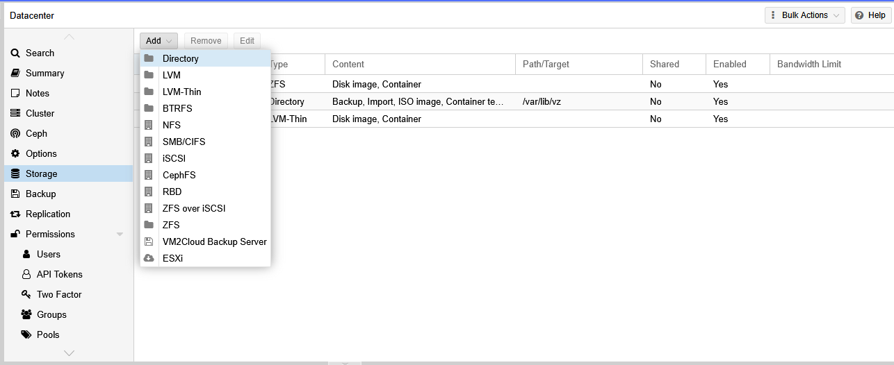
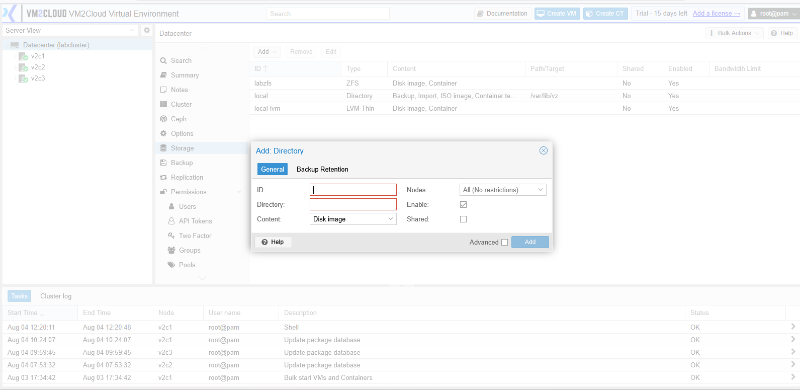
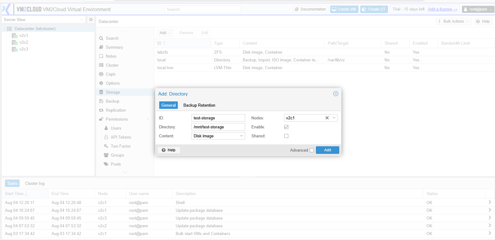
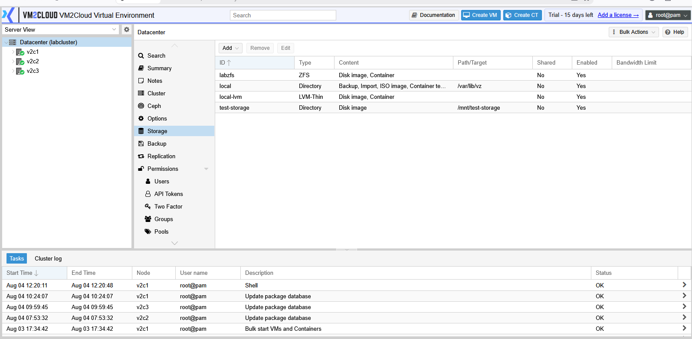

# Add Storage

---

## Overview

VM2Cloud VE allows you to add different types of storage to meet your infrastructure requirements. Storage can be local to a single node or shared across multiple nodes in a cluster. Once added, storage can be used for virtual machines, containers, ISO images, backups, templates, and other supported content.

---

## When to Use

Add storage when you need to:

* Increase available storage capacity.
* Connect shared storage to the cluster.
* Store virtual machine disks.
* Store container data.
* Upload ISO images or templates.
* Configure backup storage.

---

## Prerequisites

Before adding storage, ensure that:

* You have administrator privileges.
* The storage device or storage server is ready.
* Network connectivity is available for shared storage.
* The storage type is supported by VM2Cloud VE.

---

# Procedure

## Step 1: Open Storage Management

1. Log in to the VM2Cloud VE web interface.
2. Select **Datacenter**.
3. Click **Storage**.

---

---

## Step 2: Start Adding Storage

1. Click **Add**.
2. A list of supported storage types is displayed.

Available options may include:

* Directory
* LVM
* LVM-Thin
* ZFS over iSCSI
* NFS
* SMB/CIFS
* CephFS
* RBD
* ESXi
* iSCSI

> **Note:** The available storage types depend on your VM2Cloud VE installation and enabled features.

---

---

## Step 3: Select a Storage Type

1. Choose the storage type you want to configure.
2. The corresponding configuration window opens.

---

---

## Step 4: Configure Storage

Enter the required configuration details.

Depending on the selected storage type, you may need to provide:

* Storage ID
* Node
* Directory Path
* Server IP or Hostname
* Export Path or Share Name
* Username and Password
* Content Types
* Enable Storage option

Complete all required fields before continuing.

---

---

## Step 5: Save the Configuration

1. Review the configuration.
2. Click **Add**.
3. Wait for the storage configuration to complete.

---

---

## Step 6: Verify the Storage

After the operation completes:

* The storage appears in **Datacenter → Storage**.
* The storage status is **Enabled**.
* The configured content types are displayed.
* The storage is ready for use.

---

# Verification

Verify the following:

* The new storage appears in the Storage list.
* The storage status is **Enabled**.
* Capacity information is displayed correctly.
* The **Content** tab opens successfully.
* The configured content types match your requirements.

---

# Common Issues

| Issue                               | Resolution                                                              |
| ----------------------------------- | ----------------------------------------------------------------------- |
| Storage cannot be added             | Verify the required configuration fields are completed correctly.       |
| Unable to connect to remote storage | Confirm network connectivity and verify the server address.             |
| Authentication failed               | Verify the username and password for the storage server.                |
| Storage appears disabled            | Review the storage configuration and enable it if required.             |
| Storage not visible after creation  | Refresh the interface and confirm the operation completed successfully. |

---

# Summary

A new storage resource has been successfully added to VM2Cloud VE. The storage is now available for storing virtual machine disks, container data, ISO images, templates, backups, and other supported content based on its configured content types.
