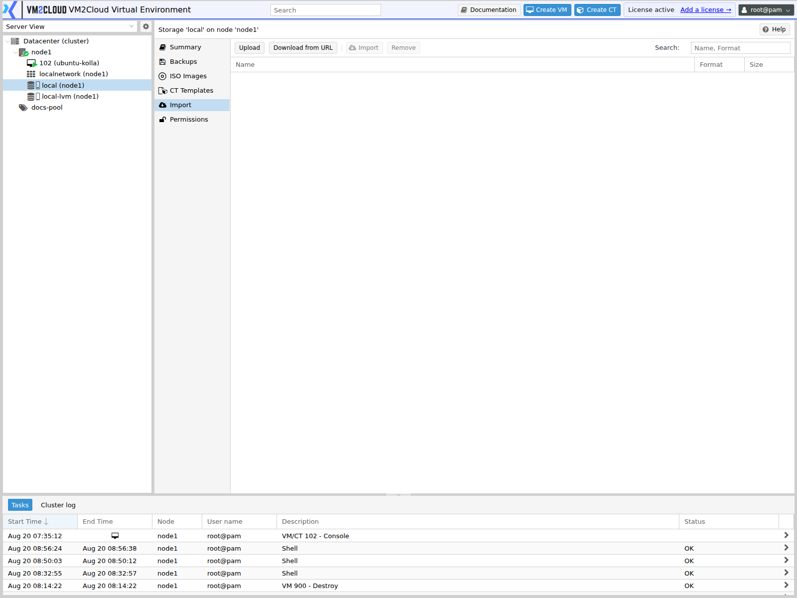

# Storage Import

---

## Overview

The **Import** tab lists disk images placed on a storage that can be imported into VM2Cloud VE as guest disks.

It exists for one main purpose: bringing virtual machines in from another platform. Rather than rebuilding a machine, you place its exported disk image where VM2Cloud VE can see it, then attach that image to a new machine.

Import is a **file-level** operation. It handles the disk; it does not carry across the machine's configuration, its network settings, or the drivers the guest operating system needs. Those are your responsibility afterwards, and they are usually where the work actually is.

> **Verify:** Confirm which disk image formats the Import tab accepts in this deployment,
> and whether it also supports importing a complete machine definition rather than disks
> alone.

---

## When to Use

Use Import when you need to:

* Migrate a virtual machine from another virtualization platform.
* Bring in a vendor-supplied appliance image.
* Attach a disk image produced outside VM2Cloud VE.
* Recover a guest from a disk image held outside the backup system.

Do **not** use it for:

* Moving guests between VM2Cloud VE nodes — use [Migrate Virtual Machine](../../04-Virtual-Machines/Migrate-Virtual-Machine.md).
* Restoring a VM2Cloud VE backup — use [Storage Content Browser](Storage-Content-Browser.md).
* Creating new machines from a base image — use a [template](../../04-Virtual-Machines/Convert-to-Template.md).

---

## Prerequisites

Before importing, ensure that:

* You have permission to modify the storage and create guests.
* The storage is configured to hold importable content, and the Import tab is present.
* You have the disk image, and it is in a supported format.
* The storage has room for the imported disk.
* You know the guest operating system, so the machine can be configured to match.
* For a Windows guest, you understand the driver requirement described below.

---

# Procedure

## Step 1: Place the Disk Image on the Storage

Copy the image into the location the storage exposes for import. For a directory-backed storage this means placing the file in the import directory on the node; for other storage types the mechanism differs.

> **Verify:** Confirm the exact path or upload mechanism used to make an image visible on
> the Import tab in this deployment.

---

## Step 2: Open the Import Tab

1. Log in to the VM2Cloud VE web interface.
2. Expand the node in the resource tree.
3. Select the storage.
4. Click **Import**.

Images available for import are listed.

---

### Screenshot 1

**Storage Import Tab**



The **Import** tab lists disk images and appliance files staged on the storage that can be
turned into guests. It only appears on storage configured to hold `import` content.

---

## Step 3: Create the Target Machine

Create a virtual machine to attach the disk to. See [Create Virtual Machine](../../04-Virtual-Machines/Create-Virtual-Machine.md).

Match the original where it matters:

1. Set the correct **OS Type**, which tunes the virtual hardware defaults.
2. Give it CPU and memory comparable to the source.
3. Configure networking.
4. Do not add a large disk you will not use — the imported image becomes the disk.

---

## Step 4: Import the Image

1. Select the image on the Import tab.
2. Choose the target guest and the storage the disk should live on.
3. Confirm.
4. Monitor the task.

Import copies and converts the image, so a large disk takes time. The task output reports progress.

---

### Screenshot 2

**Import Dialog**

```text
[ Place Screenshot Here ]
```

> **Capture:** The import dialog for a disk image, showing the target guest and target
> storage fields.

---

### Screenshot 3

**Import Task Running**

```text
[ Place Screenshot Here ]
```

> **Capture:** The task output of a disk image import in progress or completed.

---

## Step 5: Attach and Set the Boot Order

1. Open the machine's [Hardware](../../04-Virtual-Machines/Manage-VM-Hardware.md) tab.
2. Confirm the imported disk is attached.
3. If it appears as an unused disk, attach it as a proper disk device.
4. Open [VM Options](../../04-Virtual-Machines/VM-Options.md) and set the boot order so the imported disk boots first.

A machine that will not boot after an import is nearly always a boot order problem, not a corrupt image.

---

### Screenshot 4

**Imported Disk Attached**

```text
[ Place Screenshot Here ]
```

> **Capture:** The Hardware tab of a machine showing the imported disk attached.

---

## Step 6: Start and Fix the Guest

1. Start the machine.
2. Open the [Console](../../04-Virtual-Machines/VM-Console.md) and watch the boot.

Expect work here. A disk imported from another platform boots into an operating system that expects different hardware:

* **Network interfaces** are new devices, so the guest may not bring them up. Reconfigure networking inside the guest.
* **Storage drivers** may be missing. If the machine will not boot at all, this is the usual cause.
* **Platform guest tools** from the previous system should be removed.
* **Licensing** tied to hardware identity may need reactivating.

> **Warning:** A Windows guest imported from another platform will often fail to boot with a stop error, because it has no driver for the virtual disk controller it now sees. The usual fix is to attach the disk using a controller type the guest already has drivers for, boot successfully, install the appropriate drivers inside the guest, and only then switch to the faster controller. Trying to boot straight onto an unfamiliar controller does not work.

---

## Step 7: Verify and Clean Up

1. Confirm the guest boots reliably across a restart.
2. Confirm networking works.
3. Confirm applications run.
4. Install the guest agent. See [VM Options](../../04-Virtual-Machines/VM-Options.md).
5. Take a backup of the working machine.
6. Remove the source image from the import location to reclaim space.

---

# Configuration / Options

| Option | Description |
|---|---|
| **Source image** | The disk image being imported. |
| **Target guest** | The virtual machine the disk will belong to. |
| **Target storage** | Where the imported disk is written. |
| **Format** | The format the disk is converted to on the target storage. |

> **Verify:** Capture the import dialog and confirm the exact field labels, the accepted
> source formats, and the available target formats.

---

# Verification

Verify the following:

* The import task completed without errors.
* The disk appears on the machine's Hardware tab.
* Boot order points at the imported disk.
* The machine boots.
* It boots again after a restart, not only the first time.
* Networking works inside the guest.
* Applications behave as they did on the source platform.
* Disk size and data are as expected.
* A backup of the working machine has been taken.

---

# Common Issues

| Issue | Resolution |
|-------|------------|
| Image not listed on the Import tab | It is in the wrong location, or in an unsupported format. |
| Import fails partway | Usually target storage capacity. Check the task output. |
| Machine will not boot after import | Check boot order first. Then suspect missing storage drivers. |
| Windows guest stops during boot | No driver for the virtual disk controller. Attach the disk on a controller the guest supports, boot, install drivers, then switch. |
| Boots but has no network | The guest sees a new interface. Reconfigure networking inside the guest. |
| Disk appears as unused | Attach it as a disk device on the Hardware tab. |
| Poor performance after import | The guest may be using a generic controller. Install the appropriate drivers and switch to a paravirtualized one. |
| Import tab absent | The storage is not configured for importable content. See [Manage Storage](Manage-Storage.md). |
| Storage filling up | Source images remain after import. Delete them once the guest is verified. |

---

# Best Practices

- Import into a **test** guest first and confirm it boots before committing to the migration.
- Set the correct OS Type when creating the target machine — it tunes hardware defaults that affect whether the guest boots.
- For Windows, plan the driver step before you start. It is the single most common reason an import appears to fail.
- Remove the previous platform's guest tools from inside the guest.
- Check boot order before concluding an image is bad.
- Take a backup as soon as the imported machine works, so the effort is not repeated.
- Delete source images once verified — they are often large.
- Import during a maintenance window; conversion is I/O heavy.
- Record where each imported guest came from.

---

# Related Documentation

- [Storage Content Browser](Storage-Content-Browser.md)
- [Upload Content](Upload-Content.md)
- [Manage Storage](Manage-Storage.md)
- [Storage Types](Storage-Types.md)
- [Create Virtual Machine](../../04-Virtual-Machines/Create-Virtual-Machine.md)
- [Manage VM Hardware](../../04-Virtual-Machines/Manage-VM-Hardware.md)
- [VM Options](../../04-Virtual-Machines/VM-Options.md)
- [VM Console](../../04-Virtual-Machines/VM-Console.md)
- [VM Troubleshooting](../../04-Virtual-Machines/VM-Troubleshooting.md)

---

# Summary

The Import tab brings disk images from outside VM2Cloud VE in as guest disks, which is how machines are migrated from another virtualization platform. Place the image where the storage exposes it, create a target machine, import the disk, attach it, and set the boot order.

Importing the disk is the easy half. The guest operating system boots into hardware it has never seen, so expect to reconfigure networking, remove the previous platform's tools, and — for Windows especially — deal with missing storage drivers before it will boot at all. Test with a throwaway guest first, and back up the working machine as soon as you have one.
