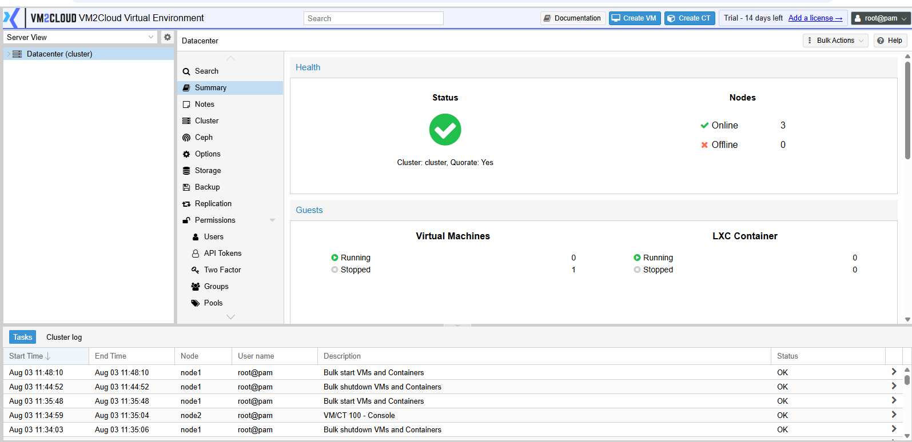
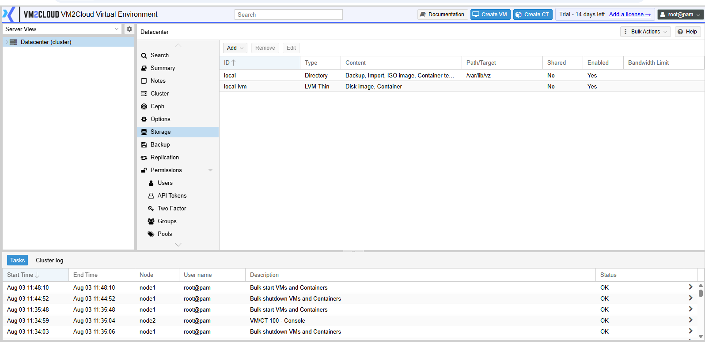
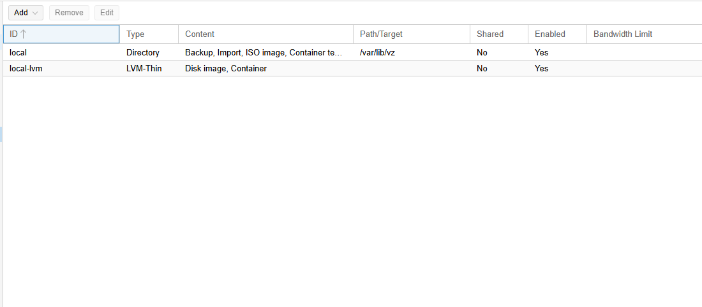
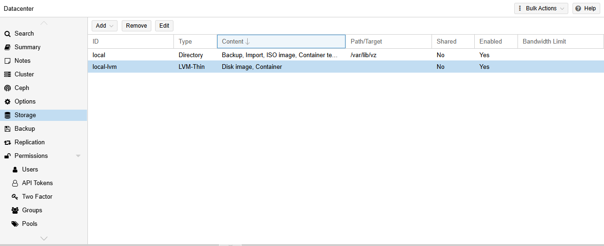

# Storage Overview

---

## Overview

Storage in VM2Cloud VE is used to store virtual machine disks, container root filesystems, ISO images, backups, templates, and other resources required by the virtualization platform. Before creating virtual machines or containers, at least one storage location must be available.

VM2Cloud VE supports both local storage attached to a single node and shared storage that can be accessed by multiple nodes in a cluster.

---

## When to Use

Use the **Storage** page to:

* View configured storage resources.
* Check storage capacity and utilization.
* Verify storage availability.
* Review the type of each storage.
* Access the content stored on a storage resource.

---

## Prerequisites

Before viewing storage information, ensure that:

* You have administrator privileges.
* The VM2Cloud VE web interface is accessible.
* At least one storage resource has been configured.

---

# Procedure

## Step 1: Log in to VM2Cloud VE

1. Open the VM2Cloud VE web interface.
2. Sign in using an administrator account.

---

---

## Step 2: Open the Storage Page

1. In the left navigation pane, select **Datacenter**.
2. Click **Storage**.

The Storage page displays all storage resources configured in the environment.

---

---

## Step 3: Review the Storage List

The Storage page displays information such as:

* Storage Name
* Storage Type
* Node
* Status
* Total Capacity
* Used Space
* Available Space
* Content Types

Review the information to verify that the required storage is available and online.

---

---

## Step 4: View Storage Details

Select a storage resource from the list to view additional information.

Depending on the storage type, you can review:

* Capacity
* Utilization
* Enabled content types
* Storage path
* Assigned node
* Shared storage status

---

---

## Step 5: View Storage Content

Select the **Content** tab to view the files stored on the selected storage.

Depending on how the storage is configured, the Content page may contain:

* ISO Images
* Virtual Machine Disks
* Container Root Filesystems
* Container Templates
* Backup Files
* Snippets

---

---

## Understanding Storage Types

VM2Cloud VE supports multiple storage technologies. The configured storage type determines what data can be stored and how it is accessed.

Common storage types include:

* Directory
* LVM
* LVM-Thin
* ZFS
* NFS
* SMB/CIFS
* Ceph (if configured)

A detailed explanation of each storage type is provided in the **Storage Types** document.

---

# Verification

Verify the following:

* The required storage appears in the Storage list.
* The storage status is **Enabled**.
* Capacity and utilization information is displayed correctly.
* The Content tab opens successfully.
* Required files are visible on the storage.

---

# Common Issues

| Issue                          | Resolution                                                                        |
| ------------------------------ | --------------------------------------------------------------------------------- |
| Storage is not displayed       | Verify that the storage has been configured and assigned to the appropriate node. |
| Storage appears offline        | Confirm that the storage device or remote storage server is reachable.            |
| Unable to open the Content tab | Verify that the storage is enabled and accessible.                                |
| Incorrect capacity information | Refresh the interface and confirm the underlying storage is healthy.              |

---

# Summary

The Storage page provides a centralized view of all storage resources configured in VM2Cloud VE. From this page, administrators can monitor storage capacity, review available content, and verify that storage resources are ready for virtual machines, containers, backups, and installation media.
