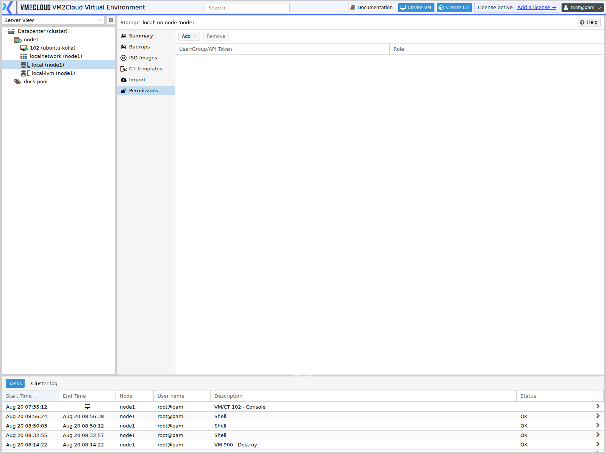

# Storage Permissions

---

## Overview

The **Permissions** tab on a storage shows who can use it, and lets you grant access directly.

Storage permissions are easy to overlook, and the symptom when they are missing is confusing: a user with full rights over a guest cannot create a disk for it, or cannot see the ISO they need. The guest permission was granted; the storage permission was not.

Permissions here apply to the path `/storage/<storage-id>`. The tab also lists permissions inherited from broader paths.

For the permission model itself, see [Assign Permissions](../Permissions/Assign-Permissions.md).

---

## When to Use

Use this tab when you need to:

* Let a team create guest disks on a particular storage.
* Give users access to ISO images or container templates.
* Restrict an expensive or sensitive storage to specific teams.
* Investigate why a user cannot create a disk or select an ISO.
* Review who can consume a storage's capacity.

---

## Prerequisites

* You have permission to modify permissions on the storage.
* The user or group already exists.
* You know which [role](../Permissions/Roles.md) grants the access needed.

---

# Procedure

## Step 1: Open the Storage Permissions Tab

1. Log in to the VM2Cloud VE web interface.
2. Expand the node in the resource tree.
3. Select the storage.
4. Click **Permissions**.

---

### Screenshot 1

**Storage Permissions Tab**



Each storage has its own **Permissions** tab, showing the access control entries whose path
covers this storage. Granting here is the same three-part binding used everywhere else —
a path, a principal, and a role.

---

## Step 2: Read the Permission List

| Column | Meaning |
|---|---|
| **Path** | Where the permission was granted. `/storage/<id>` is direct; `/` is inherited. |
| **User / Group** | Who it applies to. |
| **Role** | What they can do with the storage. |
| **Propagate** | Whether it extends below the path. |

A permission granted at a broader path cannot be removed here.

---

## Step 3: Grant Access

1. Click **Add**.
2. Choose **Group Permission** or **User Permission**.
3. Select the group or user.
4. Select the **Role**.
5. Confirm.

Grant to a **group** rather than a user wherever possible.

---

### Screenshot 2

**Adding a Storage Permission**

```text
[ Place Screenshot Here ]
```

> **Capture:** The Add Permission dialog opened from a storage's Permissions tab.

---

## Step 4: Understand What Storage Access Means

Storage access is capacity access. Someone who can allocate disks on a storage can consume all of it.

Consider:

* **Shared storage** is consumed by everyone. One team filling it affects every guest using it.
* **Backup storage** holds restore points for guests across the cluster. Access to delete files there is a significant grant.
* **Fast or expensive storage** is often deliberately restricted, so it is not used for workloads that do not need it.

Grant allocation rights on shared capacity deliberately, not as a convenience.

> **Verify:** Confirm which roles grant disk allocation versus read-only access to
> storage content in this deployment, and capture the role list.

---

## Step 5: Verify

1. Ask the user to log in, or use a test account.
2. Confirm they can select the storage when creating a disk, if that is intended.
3. Confirm they can see ISO images or templates on it, if that is intended.
4. Confirm they **cannot** use storages they should not.

---

## Step 6: Remove Access

1. Select the permission.
2. Click **Remove**.
3. Confirm.

> **Warning:** Removing storage access does not remove existing guest disks, but it can prevent the user managing guests that depend on that storage — including starting them, in some cases. Check what depends on the access before removing it.

---

# Configuration / Options

| Option | Description |
|---|---|
| **Path** | Fixed to this storage when adding from this tab. |
| **User** or **Group** | Who the permission applies to. |
| **Role** | The privileges granted over the storage. |
| **Propagate** | Whether the permission extends below the path. |

---

# Verification

Verify the following:

* The permission appears with the correct path, user or group, and role.
* The user can select the storage where intended.
* The user can see the content types they need.
* The user cannot use storages they should not.
* Guest creation works end to end for the user, not just guest visibility.
* Inherited permissions are as expected.

The end-to-end check matters. Guest permission and storage permission are separate, and a user needs both to create a working guest.

---

# Common Issues

| Issue | Resolution |
|-------|------------|
| User can create a guest but not its disk | They lack permission on the storage. This is the classic symptom. |
| Storage not listed when creating a disk | No permission on that storage, or it does not accept that content type. |
| User cannot see ISO images | They need access to the storage holding them, not just to the guest. |
| Cannot remove a permission | It was granted at a broader path. Remove it there. |
| User still has access after removal | They hold it via a group or a broader path. |
| A team filled shared storage | Allocation rights were granted more widely than intended. Review who holds them. |
| Guest will not start for a user | Some operations need storage access. Check both guest and storage permissions. |
| Permissions tab absent | Confirm a storage is selected rather than a node or guest. |

---

# Best Practices

- Grant guest and storage permissions **together**. A guest permission alone produces confusing half-working access.
- Grant to groups, not individuals.
- Treat allocation rights on shared storage as capacity delegation, because that is what it is.
- Restrict backup storage tightly — deletion there removes restore points.
- Keep at least one storage that only administrators can allocate on.
- Verify by creating a guest end to end as a test user, not by reading the permission list.
- Review storage permissions when teams change.
- Document why any storage is restricted, so the restriction is not removed later as an obstacle.

---

# Related Documentation

- [Assign Permissions](../Permissions/Assign-Permissions.md)
- [Permissions Overview](../Permissions/Permissions-Overview.md)
- [Roles](../Permissions/Roles.md)
- [Groups](../Permissions/Groups.md)
- [Pools](../Permissions/Pools.md)
- [Storage Overview](Storage-Overview.md)
- [Manage Storage](Manage-Storage.md)
- [Storage Content Browser](Storage-Content-Browser.md)
- [Permissions Troubleshooting](../Permissions/Permissions-Troubleshooting.md)

---

# Summary

The storage Permissions tab controls who can use a storage — allocating disks on it, and seeing the ISO images, templates, and backups it holds. It lists both direct grants and ones inherited from broader paths.

The failure this prevents is a specific and confusing one: a user with full rights over a guest who cannot create its disk, because the guest permission was granted and the storage permission was not. Grant both together. And remember that allocation rights on shared storage are effectively rights to consume shared capacity, so grant them deliberately.
