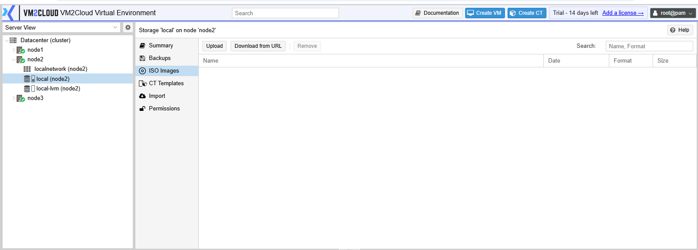
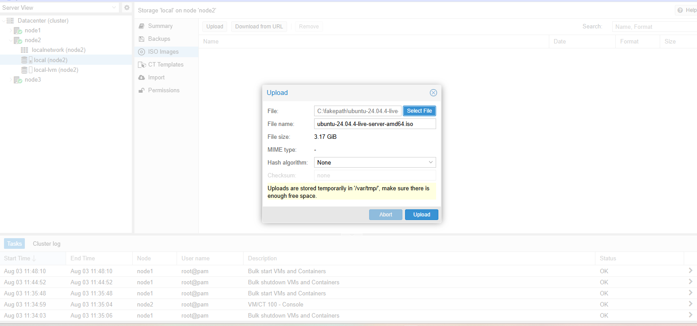
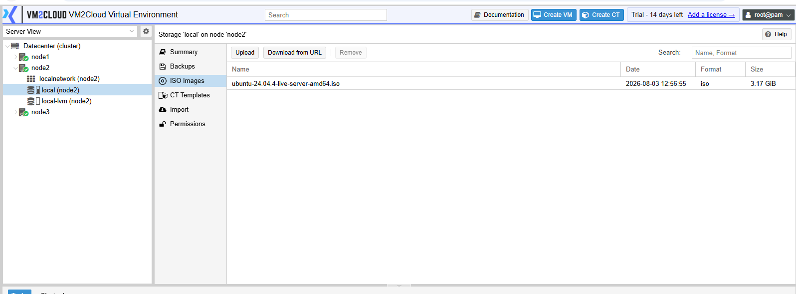
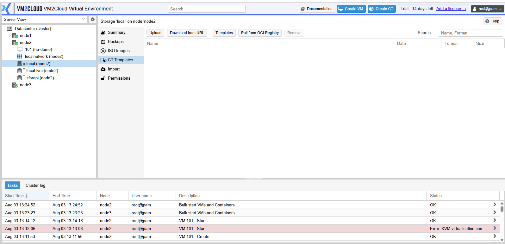
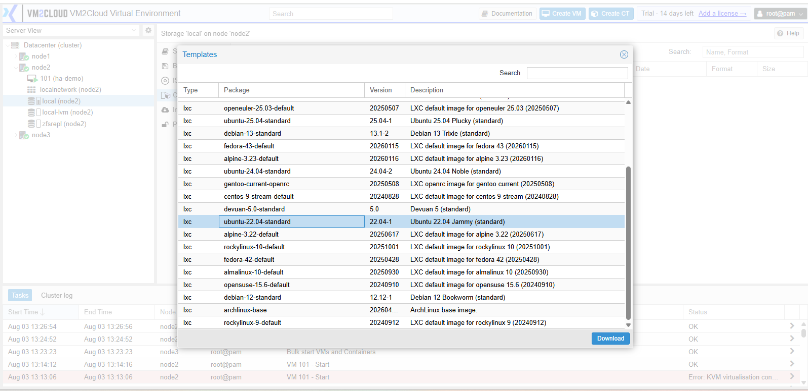
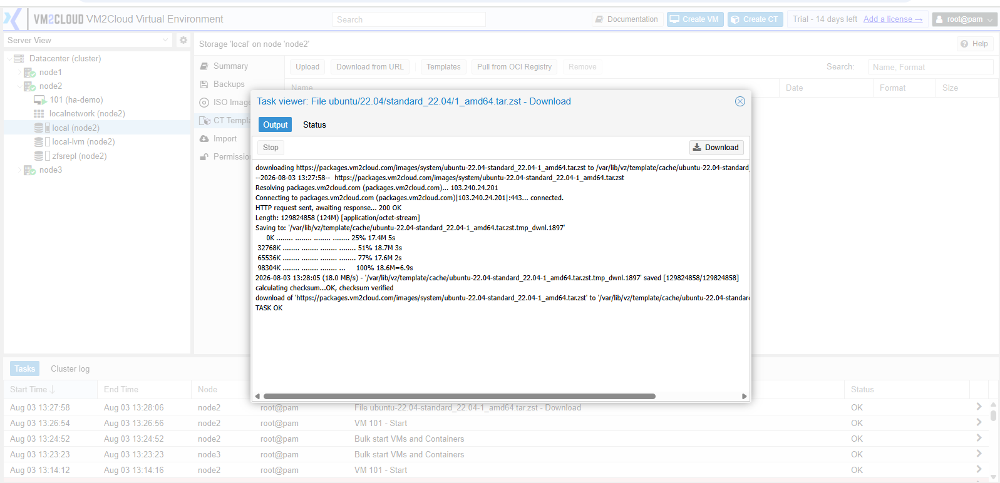
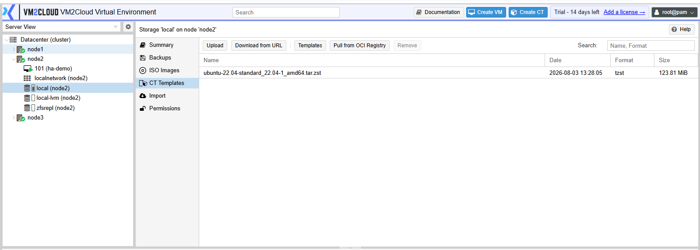

# Upload Content

---

## Overview

The **Upload Content** feature allows administrators to upload files that can be used by VM2Cloud VE. Depending on the storage configuration, supported content includes ISO images, container templates, backup files, and snippets.

Before uploading any content, verify that the selected storage supports the required content type.

---

## When to Use

Upload content when you need to:

* Upload an operating system ISO image.
* Upload a Linux container template.
* Import a backup file.
* Upload snippets for Cloud-Init or automation (if supported).
* Make installation media available for virtual machines.

---

## Prerequisites

Before uploading content, ensure that:

* You have administrator privileges.
* The storage is online and accessible.
* The storage supports the content type being uploaded.
* Sufficient free space is available.

---

# Upload ISO Images

## Step 1: Open the Storage

1. Log in to the VM2Cloud VE web interface.
2. Expand the required node.
3. Select the storage where the ISO will be uploaded (for example, **local**).
4. Click **ISO Images**.

---

---

## Step 2: Upload the ISO

1. Click **Upload**.
2. Click **Select File**.
3. Browse and select the ISO image.
4. Click **Upload**.

---

---

## Step 3: Verify the Upload

After the upload completes:

* The ISO appears in the storage content list.
* The upload task completes successfully.

---

---

# Upload Container Templates

## Step 1: Open Container Templates

1. Select the required storage.
2. Open **CT Templates**.

---

---

## Step 2: Upload or Download a Template

Depending on your VM2Cloud VE configuration, you can:

* Upload a local container template.
* Download a template from the configured template repository.

Select the required template and complete the operation.

---

---

## Step 3: Monitor the Download

The Task viewer opens and displays the download progress.

Wait until the task reports **TASK OK**, which confirms the template was downloaded and its checksum verified.

---

**Download Complete**

---

## Step 4: Verify the Template

Verify that the container template appears in the **CT Templates** list.

---

---

# Verification

Verify the following:

* The uploaded file appears in the appropriate content list.
* The upload task completed successfully.
* The file is available for use.
* No upload errors are displayed.

---

# Common Issues

| Issue                             | Resolution                                                            |
| --------------------------------- | --------------------------------------------------------------------- |
| Upload option is unavailable      | Verify that the selected storage supports the content type.           |
| Upload fails                      | Confirm sufficient free space is available on the storage.            |
| File does not appear after upload | Refresh the page and verify the upload task completed successfully.   |
| Unsupported file format           | Ensure the selected file is compatible with the chosen content type.  |
| Permission denied                 | Verify that your account has the required administrative permissions. |

---

# Summary

The Upload Content feature allows administrators to add ISO images, container templates, backup files, and other supported content to VM2Cloud VE storage. Once uploaded, these files become available for virtual machine deployment, container creation, backup restoration, and other administrative tasks.
