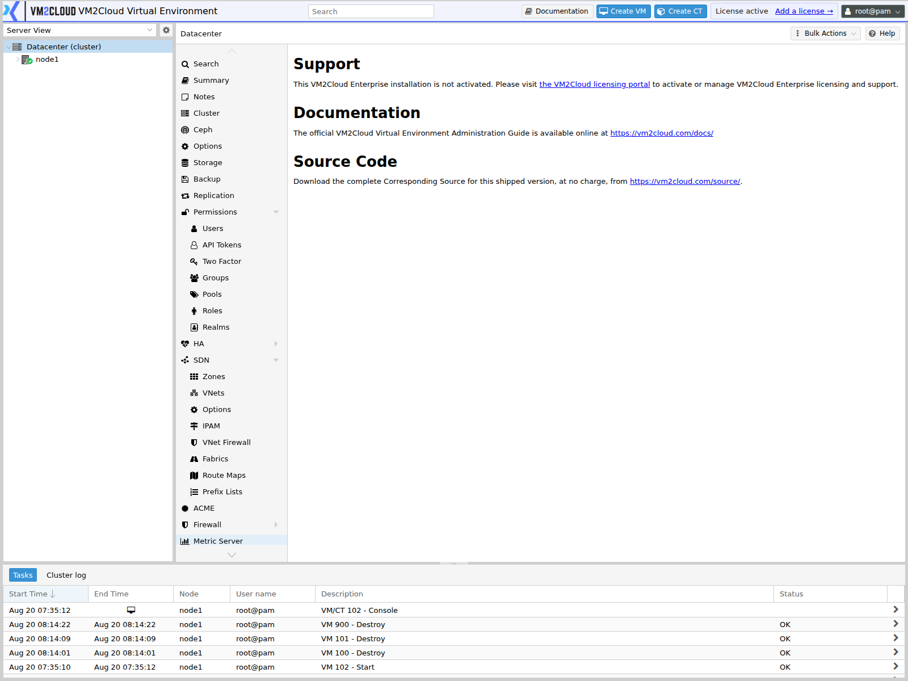

# Support

---

## Overview

The **Support** panel shows the support entitlement covering this environment, and is where you find the information needed when raising a support case.

Its practical value is at two moments: confirming coverage is current before you need it, and gathering the right details quickly when something is broken.

Subscription keys are applied **per node**, on each node's own Subscription panel. This datacenter view is where you see coverage across the cluster as a whole. See [Subscription](../03-Nodes/Subscription.md).

> **Verify:** The Datacenter menu was not fully visible in the screenshots available when
> this page was written, so **confirm the Support panel exists in this deployment** and
> capture it. Support arrangements are also vendor-specific, so confirm the contact
> routes and entitlement levels described here match your actual agreement.

---

## When to Use

Open the Support panel when you need to:

* Confirm the environment is covered before relying on support.
* Check when coverage expires.
* Find the correct contact route for a support case.
* Gather environment details for a case.
* Confirm every node is licensed, not just some.

---

## Prerequisites

* You have permission to view datacenter configuration.
* For applying keys, you have the subscription keys and administrator access to each node.

---

# Procedure

## Step 1: Open the Support Panel

1. Log in to the VM2Cloud VE web interface.
2. Select **Datacenter** in the resource tree.
3. Click **Support**.

---

### Screenshot 1

**Support Panel**



The Support panel is informational rather than interactive. It states the activation status
of the installation and links to the administration guide and to the corresponding source
for the shipped version.

---

## Step 2: Review Coverage

Check:

* The support level in effect.
* The expiry date.
* Whether coverage applies to all nodes.
* The contact route for raising a case.

---

## Step 3: Confirm Every Node Is Covered

Coverage is per node, and a partially licensed cluster is easy to end up with — a node added last year, or one rebuilt after a failure, quietly running unlicensed.

1. Select each node in turn.
2. Open its **Subscription** panel.
3. Confirm a valid key is present and current.

Do this across the whole cluster rather than checking one node and assuming.

---

### Screenshot 2

**Node Subscription Status**

```text
[ Place Screenshot Here ]
```

> **Capture:** A node → Subscription, showing a valid subscription with its level and
> expiry date.

---

## Step 4: Gather Information Before Raising a Case

Having this ready shortens every support interaction:

| Information | Where to find it |
|---|---|
| Subscription key or customer reference | Node → [Subscription](../03-Nodes/Subscription.md) |
| Product version | [Node Summary](../03-Nodes/Node-Summary.md) |
| Number of nodes and cluster layout | [Cluster Overview](Cluster/Cluster-Overview.md) |
| What changed recently | [Task History](../03-Nodes/Task-History.md) |
| Relevant task output | The failing task's Output tab |
| System log extracts | Node → [Syslog](../03-Nodes/System/Syslog.md) |
| Storage configuration | [Storage Overview](Storage/Storage-Overview.md) |
| Cluster health | `pvecm status` — see [Quorum](Cluster/Quorum.md) |

The most useful single item is usually **the failing task's output**, not a description of the symptom. Copy the full output rather than summarising it.

---

## Step 5: Renew Before Expiry

1. Note the expiry date.
2. Set a reminder well ahead of it.
3. Obtain renewed keys.
4. Apply them per node. See [Subscription](../03-Nodes/Subscription.md).
5. Confirm each node shows the new expiry.

Expired coverage is discovered at the worst possible moment — during an incident, when raising the case is the whole plan.

---

# Configuration / Options

The Support panel is read-only. Keys are applied per node.

| Item | Where |
|---|---|
| View entitlement across the cluster | Datacenter → Support |
| Apply or update a key | Node → [Subscription](../03-Nodes/Subscription.md) |
| Product version | [Node Summary](../03-Nodes/Node-Summary.md) |

---

# Verification

Verify the following:

* The Support panel shows current entitlement.
* The expiry date is in the future.
* **Every** node shows a valid subscription.
* Subscription level matches what was purchased.
* A renewal reminder exists ahead of expiry.
* The contact route is recorded somewhere reachable without the interface.

That last point matters. If the interface is down, support details held only inside it are unreachable exactly when needed. Keep them in [Datacenter Notes](Notes.md) as well, and ideally outside the system entirely.

---

# Common Issues

| Issue | Resolution |
|-------|------------|
| A node shows no subscription | Its key was never applied, or was lost in a rebuild. Apply it on that node. |
| Subscription shows invalid | Check the key was entered correctly and the node can reach the validation endpoint. |
| Coverage expired | Renew and reapply per node. |
| Some nodes covered, others not | Common after adding or rebuilding a node. Audit the whole cluster. |
| Cannot reach the validation endpoint | Check outbound connectivity and any firewall rules. See [Node Firewall](../03-Nodes/Node-Firewall.md). |
| Support asks for information you cannot find | Use the table in Step 4. |
| Panel not present | Support information may be presented elsewhere. See the Verify note above. |

---

# Best Practices

- Audit subscription status across **every** node quarterly, not just when something breaks.
- Reapply the key immediately after rebuilding a node — a reinstall keeps nothing.
- Set a renewal reminder at least a month before expiry.
- Record the support contact route in [Datacenter Notes](Notes.md), and somewhere outside VM2Cloud VE as well.
- Gather the information in Step 4 before opening a case rather than during it.
- Include full task output rather than a summary.
- Note the subscription key location in your password manager, not in the notes themselves.
- Check coverage as part of any cluster expansion.

---

# Related Documentation

- [Subscription](../03-Nodes/Subscription.md)
- [Node Summary](../03-Nodes/Node-Summary.md)
- [Datacenter Notes](Notes.md)
- [Cluster Overview](Cluster/Cluster-Overview.md)
- [Task History](../03-Nodes/Task-History.md)
- [Syslog](../03-Nodes/System/Syslog.md)
- [Quorum](Cluster/Quorum.md)
- [Node Troubleshooting](../03-Nodes/Node-Troubleshooting.md)

---

# Summary

The Support panel shows support entitlement across the cluster and the route for raising cases. Keys themselves are applied per node, which is where partial coverage creeps in — a node added or rebuilt without its key runs unlicensed and nobody notices until support is needed.

Audit every node rather than checking one, set a renewal reminder well before expiry, and keep the support contact route recorded outside VM2Cloud VE as well as inside it. Details stored only in the interface are unreachable during exactly the outage that makes you need them.
