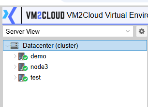
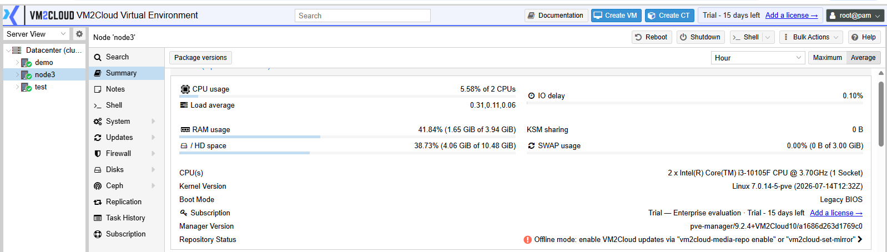
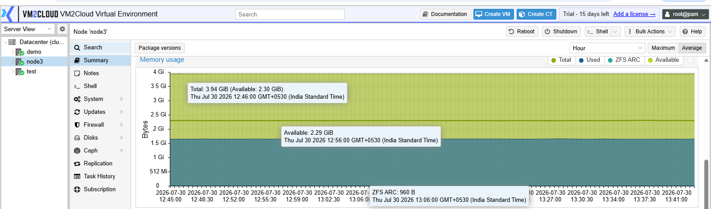

# Node Overview

---

## Overview

The **Node Overview** page provides a centralized view of the selected VM2Cloud node. It displays the current health, resource utilization, hardware information, storage, networking, and system details of the physical server.

This page helps administrators monitor the node and quickly identify any resource or system-related issues.

---

## When to Use

Open the **Node Overview** page when you need to:

* Monitor node health.
* Check CPU and memory utilization.
* Review storage capacity.
* View network information.
* Verify system information.
* Monitor resource usage before deploying workloads.

---

## Prerequisites

Before viewing the Node Overview, ensure that:

* You have administrator privileges.
* The node is online.
* The VM2Cloud web interface is accessible.

---

# Procedure

## Step 1: Open the Node

1. Log in to the VM2Cloud web interface.
2. Expand **Datacenter**.
3. Select the required node.

---

**Open Node**

---

## Step 2: Open the Summary Page

1. From the node navigation menu, click **Summary**.
2. The Summary page opens.

---

**Summary Page**

---

## Summary

The **Summary** page provides an overview of the node's current status and resource utilization.

Information typically displayed includes:

* Node Name
* Status
* Uptime
* CPU Usage
* Memory Usage
* Storage Usage
* Load Average
* Network Traffic
* Running Virtual Machines
* Running Containers

---

**Node Summary**

---

## CPU Information

The CPU section displays processor-related information for the selected node.

Information may include:

* CPU Model
* Number of Sockets
* Number of Cores
* Threads
* CPU Frequency
* Current CPU Utilization
* System Load

---

**CPU Information**

---

## Memory Information

The Memory section displays the current memory usage of the node.

Information may include:

* Total Memory
* Used Memory
* Available Memory
* Memory Utilization
* Swap Usage

---

**Memory Information**

---

## Storage Information

The Storage section provides information about storage resources available on the node.

Information may include:

* Storage Name
* Storage Type
* Total Capacity
* Used Space
* Available Space
* Storage Status

---

**Storage Information**

---

## Network Information

The Network section displays network activity and interface information.

Information may include:

* Network Interfaces
* IP Address
* Network Traffic
* Receive Rate
* Transmit Rate
* Link Status

---

**Network Information**

---

## System Information

The System section provides general information about the node.

Information may include:

* Hostname
* Operating System
* Kernel Version
* VM2Cloud Version
* Uptime
* Time Zone
* Hardware Information

---

**System Information**

---

# Verification

Verify the following:

* The Summary page loads successfully.
* CPU and memory graphs are displayed.
* Storage information is available.
* Network information is displayed correctly.
* System information matches the selected node.
* No warning or error messages are present.

---

# Common Issues

| Issue                               | Resolution                                                               |
| ----------------------------------- | ------------------------------------------------------------------------ |
| Summary page does not load          | Refresh the page and verify the node is online.                          |
| Resource graphs are missing         | Wait a few moments for monitoring data to update.                        |
| Storage information is unavailable  | Verify the storage is configured correctly and connected to the node.    |
| Network statistics are not updating | Check the network interfaces and ensure the node is connected.           |
| Incorrect system information        | Verify that you have selected the correct node from the Datacenter tree. |

---

# Summary

The Node Overview page provides a comprehensive view of the selected VM2Cloud node. It enables administrators to monitor system health, review hardware resources, track storage and network utilization, and verify the operational status of the server from a single location.
