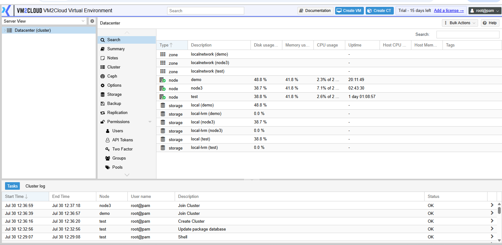
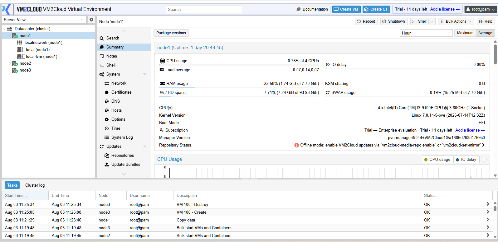
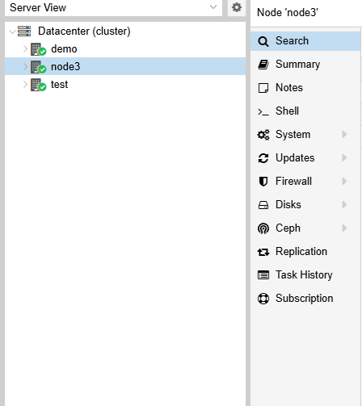

# View Node Information

---

## Overview

A node represents a physical server that is part of the VM2Cloud environment. Each node provides the compute, memory, storage, and networking resources required to run virtual machines and containers. The Node page allows administrators to monitor the server, manage resources, and perform administrative tasks.

---

## When to Use

Access the Node page when you need to:

* View information about a physical server.
* Monitor node health and resource usage.
* Manage virtual machines and containers hosted on the node.
* Configure node-specific settings.
* Perform maintenance and administrative operations.

---

## Prerequisites

Before viewing node information, ensure that:

* You have administrator privileges.
* The VM2Cloud node is online.
* The VM2Cloud web interface is accessible.

---

# Procedure

## Step 1: Log in to VM2Cloud

1. Open the VM2Cloud web interface.
2. Sign in using an administrator account.

---

### Screenshot 1

**VM2Cloud Login**

---

## Step 2: Expand Datacenter

1. In the left navigation pane, locate **Datacenter**.
2. Click the expand icon next to **Datacenter**.

---

### Screenshot 2

**Datacenter Navigation**

---

## Step 3: Select a Node

1. Under **Datacenter**, click the node you want to manage.
2. The selected node will open in the main workspace.

---

### Screenshot 3

**Select Node**

---

## Step 4: Review the Available Options

After selecting the node, the following management options are available from the left menu.

* Summary
* Notes
* Shell
* System
* Updates
* Repositories
* Firewall
* Disks
* Ceph (if configured)
* Task History
* Subscription
* Local Storage
* Virtual Machines
* Containers

> **Note:** The available options may vary depending on your VM2Cloud configuration and installed services.

---

### Screenshot 4

**Node Navigation Menu**

---

## Step 5: Open the Required Section

Select the required option from the node menu to perform monitoring, configuration, or maintenance tasks.

---

# Verification

Verify the following:

* The selected node opens successfully.
* The node name is displayed correctly.
* The node navigation menu is visible.
* Node information loads without errors.
* Administrative options are accessible.

---

# Common Issues

| Issue                          | Resolution                                                                     |
| ------------------------------ | ------------------------------------------------------------------------------ |
| Node is not visible            | Verify that the node has been added to the VM2Cloud environment and is online. |
| Unable to access the node      | Confirm you have the required administrator permissions.                       |
| Node information does not load | Refresh the page and verify the node is reachable.                             |
| Node shows Offline             | Verify network connectivity and ensure the server is powered on.               |

---

# Summary

The Node page is the primary interface for managing an individual VM2Cloud server. From this page, administrators can monitor system resources, configure services, manage storage and networking, perform maintenance tasks, and access the virtual machines and containers hosted on the selected node.
