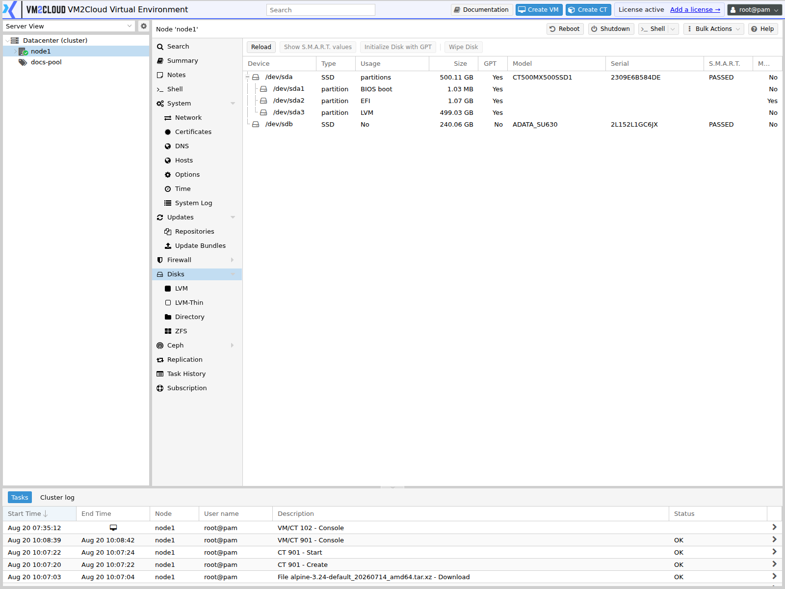
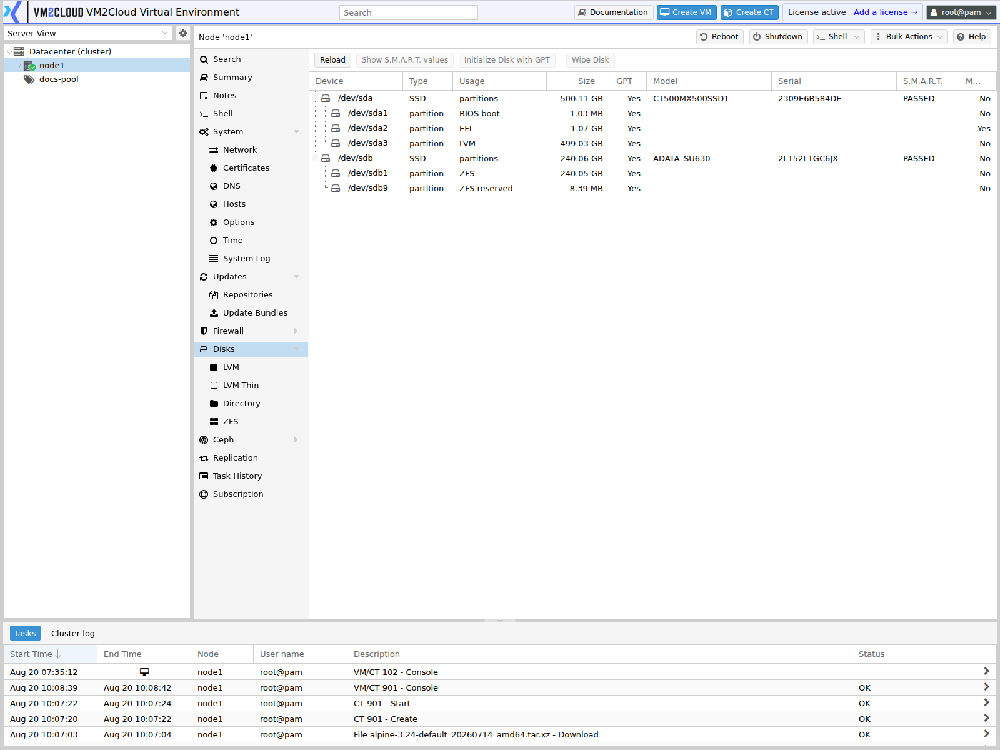

# Disks Overview

---

## Overview

The **Disks** section in VM2Cloud VE provides administrators with tools to view and manage the physical storage devices attached to a node.

Disk management is performed at the **node level**. From the node's **Disks** section, administrators can inspect available physical disks and use supported disk-management functions to prepare storage for VM2Cloud VE storage configurations.

Physical disks can be used as the foundation for different storage technologies, including LVM, LVM-Thin, ZFS, and directory-based storage. The available options depend on the disk, existing configuration, and underlying storage technology.

---

## When to Use

Use the **Disks** section when you need to:

* View physical disks detected by a node.
* Identify available disks before creating storage.
* Check disk capacity and device information.
* Determine whether disks are already in use.
* Prepare disks for storage configuration.
* Configure supported local storage technologies.
* Inspect disk health information where supported.
* Troubleshoot disk-detection problems.
* Identify the correct physical disk before performing disk-management operations.

---

## Prerequisites

Before working with disks:

* You must be able to log in to VM2Cloud VE.
* You must have access to the required node.
* The node must be online.
* The physical disk must be connected to the node.
* You must have sufficient permissions to view or manage node disks.
* Before destructive operations, ensure that important data has been backed up.

> **Warning:** Disk-management operations can permanently destroy data. Always verify the physical disk and its existing contents before performing operations such as wiping, initializing, or reusing a disk.

---

# Procedure

## Step 1: Open the VM2Cloud VE Web Interface

1. Open the VM2Cloud VE web interface.
2. Log in using an account with the required permissions.
3. Wait for the VM2Cloud VE management interface to load.

### Screenshot 1

```text
[ Place Screenshot Here — VM2Cloud VE Web Interface ]
```

---

## Step 2: Select the Required Node

1. Locate the resource tree on the left side of the VM2Cloud VE interface.
2. Expand the required cluster if applicable.
3. Select the node whose physical disks you want to manage.
4. Wait for the node management interface to load.

### Screenshot 2

```text
[ Place Screenshot Here — Select Node ]
```

---

## Step 3: Open Disks

1. In the node navigation menu, locate **Disks**.
2. Click **Disks**.
3. The disk-management page for the selected node opens.

### Screenshot 3

**Disks Panel**



Node → Disks lists every physical device with its **Device**, **Type**, **Usage**,
**GPT**, **Model**, **Serial**, **S.M.A.R.T.** status, and **Size**. The Usage column is
the one that matters — it says whether a disk is free or already claimed.

---

## Step 4: Review the Disk Management Interface

1. Review the list of physical disks detected by the node.
2. Identify the available disk devices.
3. Review the information displayed for each disk.
4. Identify disks that are already being used.
5. Identify disks that may be available for a new storage configuration.
6. Review the available disk-management actions.

### Screenshot 4

**Disk in Use**



Once a disk is claimed, Usage names what claimed it. A disk showing no usage is available;
anything else is in use and wiping it destroys whatever is there.

---

# Configuration / Options

The available disk information and actions depend on the physical hardware, existing disk configuration, storage technology, and VM2Cloud VE version.

The following concepts are important when working with the **Disks** section.

---

## Physical Disk

A physical disk is a storage device attached directly to the VM2Cloud VE node.

Examples include:

* HDD
* SATA SSD
* SAS disk
* NVMe SSD

A physical disk can be used as the underlying device for supported storage configurations.

---

## Device Identifier

Each physical disk is identified by a device path or other identifier.

Typical Linux device names include:

```text
/dev/sda
/dev/sdb
/dev/nvme0n1
```

The actual identifier depends on the hardware and operating system.

Always verify the identifier before performing a destructive operation.

---

## Disk Capacity

The disk capacity indicates the amount of storage available on the physical device.

Capacity information is useful when:

* Selecting a disk for storage creation.
* Comparing multiple disks.
* Planning storage capacity.
* Identifying a physical disk.

The capacity displayed by the operating system may differ slightly from the manufacturer's advertised capacity because different units and measurement conventions may be used.

---

## Disk Usage

Before using a physical disk, determine whether it is already being used.

A disk may contain:

* Existing partitions.
* LVM metadata.
* LVM-Thin configuration.
* ZFS configuration.
* A filesystem.
* Existing VM or container data.
* Operating-system data.
* Other storage metadata.

A disk that contains existing data must not be treated as an unused disk.

---

## SMART and Disk Health

VM2Cloud VE's underlying platform supports SMART-based disk monitoring for local hard disks.

SMART can provide information about the health and condition of supported disks. VM2Cloud VE installs `smartmontools`, and the `smartd` service monitors supported devices.

Disk health should be considered before placing important production workloads on a physical disk.

For hardware RAID controllers, disk health and array information may instead need to be obtained using the controller vendor's management tools.

---

## Storage Technologies

Physical disks can be used with different storage technologies.

Common local storage technologies include:

### LVM

LVM provides logical volume management over physical storage.

It can be used to create logical volumes that can then be used by VM2Cloud VE.

### LVM-Thin

LVM-Thin provides a thin-provisioned storage pool.

It is commonly used for VM and container disks where thin provisioning is required.

### ZFS

ZFS combines filesystem and storage-management functionality and provides features such as:

* Storage pools.
* Data integrity.
* Snapshots.
* Software RAID configurations.
* Checksumming.

### Directory Storage

A disk can also be prepared with a filesystem and exposed as directory-based storage.

The specific filesystem and storage configuration should be selected according to the workload requirements.

---

# Disk States and Considerations

## Unused Disk

An unused disk does not contain a storage configuration required by the node.

An unused disk can potentially be prepared for a new storage configuration.

Always verify its contents before using it.

---

## Disk Already in Use

A disk may already be associated with an existing storage configuration.

Before changing or removing its configuration:

1. Identify the storage using the disk.
2. Check whether VMs or containers depend on that storage.
3. Verify whether important data is present.
4. Confirm that required backups exist.
5. Only then perform the required storage or disk operation.

---

## System Disk

The system disk contains the VM2Cloud VE node's operating-system installation.

Do not wipe or reinitialize the system disk unless you intentionally plan to reinstall or rebuild the node.

---

# Verification

After opening the **Disks** section, verify:

1. The expected node is selected.
2. The expected physical disks are displayed.
3. Disk identifiers are correctly displayed.
4. Disk capacities correspond to the installed hardware.
5. Existing storage configurations can be identified.
6. The expected unused disks are visible.
7. No expected disk is missing.

If a newly installed disk is not displayed, investigate hardware and operating-system disk detection before attempting to create storage.

---

# Common Issues

## Disk Is Not Visible

If a physical disk does not appear:

1. Verify that the disk is physically connected.
2. Verify the power connection.
3. Check whether the server BIOS/UEFI detects the disk.
4. Check whether the storage controller detects the disk.
5. Check whether the operating system detects the device.
6. Refresh the VM2Cloud VE interface.
7. If the disk remains unavailable, investigate the hardware or controller configuration.

---

## Disk Is Already in Use

If a disk appears to be used:

1. Identify the existing storage configuration.
2. Determine whether any VM or container depends on it.
3. Check whether important data exists on the disk.
4. Confirm that a backup is available.
5. Do not wipe or reinitialize the disk unless it has been confirmed that the existing data is no longer required.

---

## Disk Has an Existing Partition or Storage Signature

A disk may contain metadata from a previous configuration.

Examples include:

* Partition tables.
* LVM metadata.
* ZFS metadata.
* Filesystem signatures.

Do not remove the metadata simply because the disk appears to be available.

First determine whether the disk belongs to an existing or recoverable configuration.

---

## Disk Is Detected but Cannot Be Used

Possible causes include:

* Existing storage configuration.
* Existing filesystem.
* LVM metadata.
* ZFS configuration.
* Hardware RAID configuration.
* Insufficient permissions.
* Disk health problems.

Identify the existing configuration before attempting to modify the disk.

---

## Hardware RAID Disk Information Is Unavailable

If disks are behind a hardware RAID controller, the operating system may not expose the physical disks individually.

In such environments, use the RAID controller's management tools to inspect the physical disks and RAID array.

For disks presented through a hardware RAID controller, use the vendor-specific tools supplied with the controller. VM2Cloud VE cannot inspect the individual disks behind the controller.

---

# Best Practices

* Always identify a physical disk before modifying it.
* Never assume that an apparently unused disk contains no important data.
* Keep backups before destructive storage operations.
* Document physical disk assignments in production environments.
* Monitor disk health regularly.
* Do not use a failing disk for production workloads.
* Avoid modifying the system disk unintentionally.
* Verify storage dependencies before removing or reusing disks.
* Use appropriate redundancy for production storage.
* When using hardware RAID, monitor the RAID controller and array in addition to the operating system.

---

# Related Documentation

* [View Disk Information](View-Disk-Information.md)
* [Disk Management](Disk-Management.md)
* [LVM](LVM.md)
* [LVM-Thin](LVM-Thin.md)
* [ZFS](ZFS.md)
* [Directory](Directory.md)
* [Disk Troubleshooting](Disk-Troubleshooting.md)
* [Storage Overview](../../02-Datacenter/Storage/Storage-Overview.md)

---

# Summary

The **Disks** section provides node-level access to physical disk information and disk-management functionality.

Administrators should use this section to identify physical disks, review their state and capacity, prepare storage, and investigate disk-related problems.

Before performing any operation that can modify or destroy disk data, always verify the selected disk, understand its current use, and ensure that required data is backed up.
