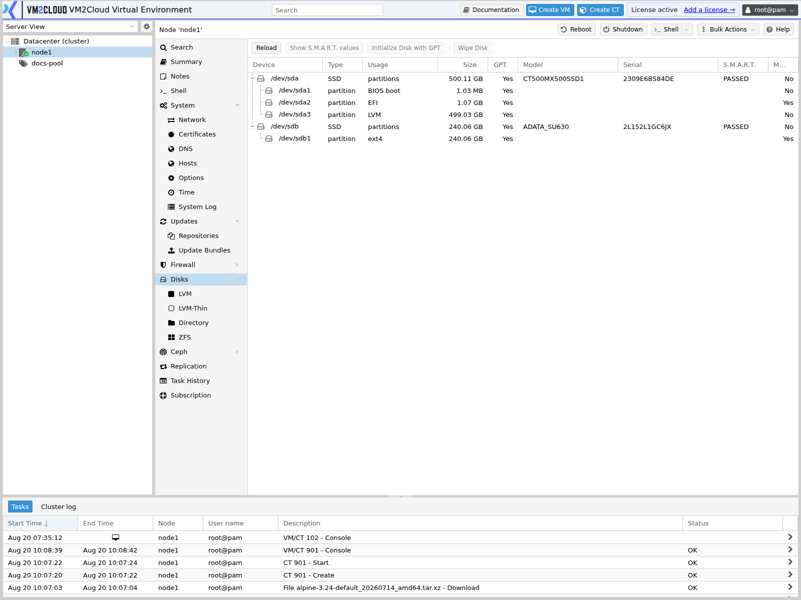

# View Disk Information

---

## Overview

The **Disks** section in VM2Cloud VE provides an overview of physical disks attached to the selected node.

Administrators can use this page to inspect the disks detected by the node before using them for storage configuration or other disk-management operations.

Disk information is useful when identifying available drives, checking disk capacity and status, and determining which disks are available for operations such as LVM, LVM-Thin, or ZFS configuration.

The node-level **Disks** page provides an overview of attached disks and the disk-management capabilities available for them.

---

## When to Use

Use **View Disk Information** when you need to:

* Identify physical disks attached to a node.
* Check which disks are detected by VM2Cloud VE.
* Review disk capacity and device information.
* Determine whether a disk is already being used.
* Identify disks before creating storage.
* Verify that a newly installed disk is detected.
* Investigate disk-related problems.
* Identify the correct disk before performing a destructive disk operation.

---

## Prerequisites

Before viewing disk information:

* You must be able to log in to the VM2Cloud VE web interface.
* You must have access to the required node.
* The node should be online and accessible.
* The physical disk must be connected to the node.
* For detailed disk information, the required disk-management permissions must be available to your account.

> **Warning:** Always verify the disk identity before performing any disk-management operation. Selecting the wrong disk during a destructive operation can permanently destroy data.

---

# Procedure

## Step 1: Open the VM2Cloud VE Web Interface

1. Open the VM2Cloud VE web interface.
2. Log in using an account with the required permissions.
3. Wait for the VM2Cloud VE management interface to load.

### Screenshot 1

```text
[ Place Screenshot Here — VM2Cloud VE login/interface ]
```

---

## Step 2: Select the Node

1. Locate the **Server View** or resource tree on the left side of the interface.
2. Expand the required cluster if the VM2Cloud VE installation is part of a cluster.
3. Select the node whose physical disks you want to inspect.
4. Wait for the node management page to load.

### Screenshot 2

```text
[ Place Screenshot Here — Select the required node ]
```

---

## Step 3: Open Disks

1. In the selected node's management menu, locate **Disks**.
2. Click **Disks**.
3. VM2Cloud VE displays the disk-management page for the selected node.

The node-level **Disks** section is intended to provide an overview of attached disks and to manage how those disks are used.

### Screenshot 3

**Disk List**


The list is read-only. Each row carries the device path, its type — `ssd`, `hdd`, or
`nvme` — its model and serial number for physical identification, and its S.M.A.R.T.
health.

---

## Step 4: Review the Disk List

1. Review the disks displayed in the disk list.
2. Identify the physical device you want to inspect.
3. Review the information displayed for the disk.
4. Compare the displayed device information with the physical hardware or server inventory when identifying a disk.

Do not select a disk for a destructive operation until its identity has been confirmed.

### Screenshot 4

**Partitioned Disk**



A partitioned disk expands to show its partitions and what each is used for.

---

# Configuration / Options

The exact information displayed depends on the detected hardware and what the disk reports.

When reviewing a disk, pay attention to the following information where available.

## Device / Disk Identifier

The device identifier identifies the physical disk as detected by the operating system.

Examples may include device names such as:

```text
/dev/sda
/dev/sdb
/dev/nvme0n1
```

Use the displayed identifier together with the other disk information when determining which physical disk is being inspected.

---

## Disk Size

The disk size indicates the capacity detected for the physical disk.

Use this value to distinguish between disks when multiple drives are installed.

For example:

```text
Disk 1 → 480 GB
Disk 2 → 960 GB
Disk 3 → 1.92 TB
```

The capacity shown by the system may differ slightly from the capacity printed on the physical disk because manufacturers and operating systems use different methods of representing storage capacity.

---

## Disk Usage

Check whether the disk is already being used by an existing configuration.

A disk that is already part of an existing storage configuration should not be treated as an unused disk.

Before reusing a disk, verify whether it contains:

* Existing partitions
* LVM configuration
* LVM-Thin configuration
* ZFS configuration
* Existing filesystem data
* VM or container data
* Other storage-related metadata

---

## Disk Health Information

Where supported by the hardware and VM2Cloud VE interface, review available health information.

Health information can help identify possible disk problems before using the disk for production storage.

If health information indicates a problem, investigate the disk before placing workloads on it.

---

## Disk Type

Where available, identify whether the device is:

* HDD
* SSD
* NVMe
* Another supported storage device

The device type can be useful when planning storage configuration and workload placement.

---

## Mounted / In-Use State

Determine whether the disk or its partitions are already being used.

A disk that is mounted or assigned to an existing storage configuration should not be initialized, wiped, or reused without first confirming that its data is no longer required.

---

# Verification

After opening **Node → Disks**, verify that:

1. The expected physical disks are listed.
2. The disk count matches the hardware installed in the node.
3. The expected disk sizes are displayed.
4. The device identifiers are visible or otherwise identifiable.
5. Existing disks used by the system can be distinguished from unused disks.
6. No expected disk is missing from the list.

If a newly installed disk is not displayed, do not proceed with storage creation until the disk-detection problem has been investigated.

---

# Common Issues

## Disk Is Not Displayed

If an expected disk does not appear:

1. Verify that the disk is physically connected.
2. Verify the disk's power connection.
3. Check the server's BIOS/UEFI to determine whether the hardware detects the disk.
4. Check whether the disk is connected through a RAID controller or HBA.
5. Verify that the storage controller is detected by the operating system.
6. Refresh the VM2Cloud VE interface.
7. If the disk is still missing, investigate the node's hardware and operating-system detection.

---

## Disk Appears but Cannot Be Used

A disk may already contain an existing configuration.

Check whether it is associated with:

* Existing partitions
* LVM
* LVM-Thin
* ZFS
* A mounted filesystem
* Existing VM or container storage

Do not wipe or initialize the disk until the existing data has been confirmed as unnecessary.

---

## Disk Capacity Is Different from the Manufacturer's Label

A difference between the advertised disk capacity and the capacity displayed by the operating system is normal.

Storage manufacturers generally use decimal units, while operating systems and management interfaces may display capacity using different unit conventions.

---

## Multiple Disks Are Difficult to Identify

When multiple disks have similar capacities:

1. Compare the displayed device identifiers.
2. Compare disk sizes.
3. Compare model information where available.
4. Compare serial information where available.
5. Cross-check the information against the server hardware inventory.
6. Do not rely only on the disk position in the server.

---

## Disk Is Already in Use

If the disk is already used by an existing storage configuration:

1. Identify the storage configuration using the disk.
2. Determine whether any VM, container, backup, or other data depends on it.
3. Confirm that the data is no longer required before changing the configuration.
4. Follow the appropriate storage-removal or disk-management procedure.

Do not wipe a disk merely because it appears in the disk list.

---

# Best Practices

* Always verify the disk identifier before performing disk operations.
* Compare disk information with the physical server inventory.
* Do not wipe a disk until its existing contents have been checked.
* Keep production data on appropriately designed storage.
* Monitor disk health where hardware and management tools support it.
* Maintain backups before performing destructive storage operations.
* Avoid using a disk for multiple incompatible storage configurations.
* Document which physical disks are assigned to each storage configuration.
* For production environments, use appropriate redundancy rather than relying on a single physical disk.

---

# Related Documentation

* [Disks Overview](Disks-Overview.md)
* [Disk Management](Disk-Management.md)
* [LVM](LVM.md)
* [LVM-Thin](LVM-Thin.md)
* [ZFS](ZFS.md)
* [Directory](Directory.md)
* [Disk Troubleshooting](Disk-Troubleshooting.md)

---

# Summary

The **Disks** page provides administrators with an overview of physical disks detected by the selected VM2Cloud VE node.

Use this page before performing disk-management or storage-creation operations to identify the correct physical disk, review its available information, and determine whether it is already being used.

Always verify the disk identity before performing destructive operations such as wiping or reinitializing a disk.
