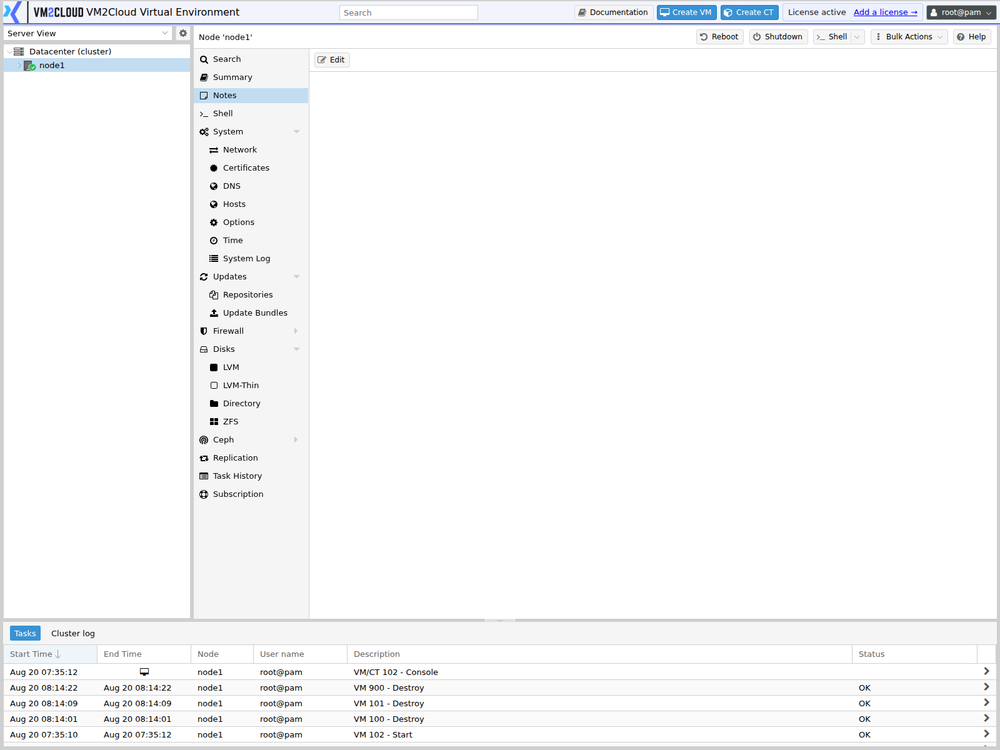

# Node Notes

---

## Overview

The **Notes** tab on a node holds free-text documentation attached to that specific server.

Where [Datacenter Notes](../02-Datacenter/Notes.md) describe the environment, node notes describe **this machine** — its hardware, its physical location, what makes it different from its peers, and anything someone should know before working on it.

Notes support Markdown formatting.

The value shows during maintenance and incidents. When a node fails at an inconvenient hour, whoever responds needs to know where it physically is, what it has attached, and whether anything about it is unusual — without hunting through a separate asset system.

---

## When to Use

Use Node Notes for:

* Physical location — data centre, rack, unit position.
* Out-of-band management address, so console access can be found quickly.
* Hardware detail — model, serial number, warranty and support contract.
* What makes this node different from the others.
* Special roles — a node holding a QDevice, or dedicated hardware.
* Physical dependencies — shared power feeds, single-homed network paths.
* Local storage layout that is not obvious from the interface.
* Known quirks and their history.

Do **not** use it for:

* Credentials or secrets. Every administrator with node access can read them.
* Anything applying to the whole cluster — use [Datacenter Notes](../02-Datacenter/Notes.md).
* Guest-specific information — use the guest's own Notes panel.

---

## Prerequisites

* You have permission to modify the node.
* The node is online.

---

# Procedure

## Step 1: Open the Notes Tab

1. Log in to the VM2Cloud VE web interface.
2. Expand **Datacenter** in the resource tree.
3. Select the node.
4. Click **Notes**.

---

### Screenshot 1

**Node Notes Tab**



A free-text area attached to this node, with a single **Edit** control. Unlike Datacenter
Notes, what you write here belongs to this node alone.

---

## Step 2: Edit the Notes

1. Click the edit control.
2. Enter or update the text.
3. Save.

---

### Screenshot 2

**Editing Node Notes**

```text
[ Place Screenshot Here ]
```

> **Capture:** The node Notes tab in edit mode, showing the text area and save control.

---

## Step 3: Use a Consistent Structure

Every node having the same shape of notes makes them scannable under pressure:

```markdown
# v2c1

**Location:** DC1 / Rack 14 / U22-U23
**Out-of-band:** https://10.0.99.11  (see password manager)
**Hardware:** Dell R740xd, service tag ABC1234
**Support:** Contract expires 2027-03-31

## Storage
- 2 x 480GB SSD  — boot, mirrored
- 8 x 4TB SAS    — ZFS pool `tank`
- 2 x 1.6TB NVMe — ZFS pool `fast-nvme`, reserved for databases

## Network
- eno1 / eno2 → bond0 → vmbr0  (management + guests)
- eno3 / eno4 → bond1          (cluster network, separate switch pair)

## Warnings
- Shares a power feed with v2c2. Do not schedule maintenance on both
  at once.
- Front panel disk numbering runs right to left on this chassis.
```

Note that the out-of-band address is recorded but the credentials are not — the notes point at the password manager instead.

---

## Step 4: Record What You Learn

The most useful node notes accumulate over time. When you discover something awkward — a disk bay numbered unexpectedly, a NIC that needs a specific driver setting, a BIOS option that had to change — write it down here.

That kind of detail is otherwise lost, and rediscovered by the next person under time pressure.

---

## Step 5: Keep Them Current

Review node notes when:

* Hardware is added, replaced, or removed.
* The node moves rack or data centre.
* Storage layout changes.
* Network configuration changes.
* A warning stops applying.
* The node is rebuilt — a reinstall keeps nothing, including these notes.

> **Warning:** Node notes are lost when a node is reinstalled. If you [re-add a removed node](../02-Datacenter/Cluster/Re-Add-Removed-Node.md), copy the notes somewhere first, or they go with the installation.

---

# Configuration / Options

| Element | Description |
|---|---|
| **Notes content** | Free text with Markdown formatting. |

> **Verify:** Confirm the exact edit control on the node Notes tab and whether Markdown
> is rendered in this deployment.

---

# Verification

Verify the following:

* The Notes tab shows the saved content.
* Markdown renders as intended.
* Location and out-of-band details are accurate.
* Hardware detail matches the actual machine.
* Warnings still apply.
* No credentials have been written there.
* Another administrator can read the notes.

Check the out-of-band address actually works. A recorded address that nobody has tested is worth little at three in the morning.

---

# Common Issues

| Issue | Resolution |
|-------|------------|
| Notes cannot be saved | Confirm you have permission to modify the node, and that it is online. |
| Notes not visible to another administrator | They need permission on the node. See [Assign Permissions](../02-Datacenter/Permissions/Assign-Permissions.md). |
| Notes disappeared after a rebuild | Expected. Reinstalling a node removes them. Keep a copy elsewhere. |
| Markdown not rendering | Check the syntax; confirm rendering is supported. |
| Notes describe the wrong hardware | The node was replaced without updating them. Review after any hardware change. |
| Someone recorded a password | Remove it and rotate the credential. |
| Notes are inconsistent between nodes | Adopt one structure and apply it to every node. |

---

# Best Practices

- Record physical location and out-of-band access first. These are what you need when something is wrong.
- Point at the password manager rather than recording credentials.
- Use the same structure on every node so they can be read quickly.
- Document physical dependencies — shared power, shared switches, single network paths.
- Write down awkward details as you discover them, rather than trusting memory.
- Review notes after any hardware or network change.
- Copy notes out before rebuilding a node.
- Test the out-of-band address occasionally, so it is known to work before it is needed.

---

# Related Documentation

- [Datacenter Notes](../02-Datacenter/Notes.md)
- [Node Summary](Node-Summary.md)
- [Node Troubleshooting](Node-Troubleshooting.md)
- [Disks Overview](Disks/Disks-Overview.md)
- [Network Overview](System/Network/Network-Overview.md)
- [Reset Root Password](Reset-Root-Password.md)
- [Re-Add a Removed Node](../02-Datacenter/Cluster/Re-Add-Removed-Node.md)
- [Reboot Node](Reboot-Node.md)

---

# Summary

Node Notes document one physical server: where it is, how to reach its out-of-band management, what hardware it has, and what makes it different from its peers. They earn their value during incidents, when whoever responds needs that information immediately.

Record the location and out-of-band address first, point at the password manager rather than storing credentials, and use the same structure on every node. Remember they do not survive a reinstall — copy them out before rebuilding a node.
