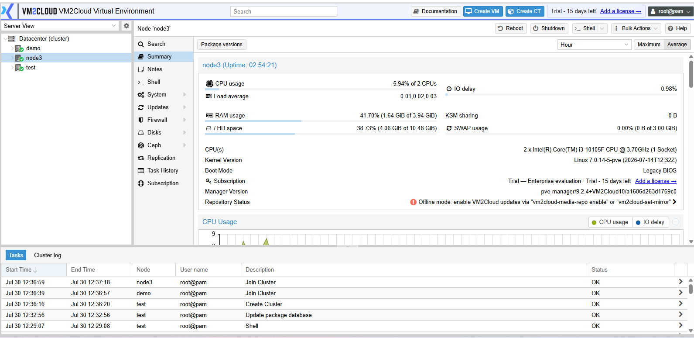
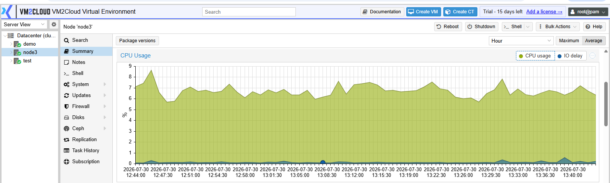
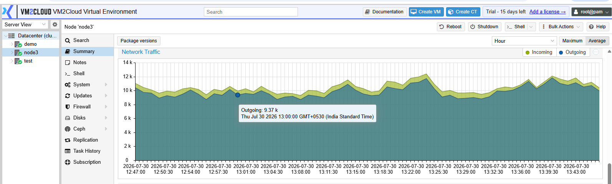

# Node Summary

---

## Overview

A node represents a physical server that is part of the VM2Cloud environment. Each node provides the compute, memory, storage, and networking resources required to run virtual machines and containers.

The **Summary** page is the default view for a node. It displays the current health, resource utilization, hardware information, storage, networking, and system details of the physical server.

This page helps administrators monitor the node and quickly identify any resource or system-related issues.

---

## When to Use

Open the node **Summary** page when you need to:

* View information about a physical server.
* Monitor node health.
* Check CPU and memory utilization.
* Review storage capacity.
* View network information.
* Verify system information.
* Monitor resource usage before deploying workloads.
* Locate the administrative options available for the node.

---

## Prerequisites

Before viewing node information, ensure that:

* You have administrator privileges.
* The node is online.
* The VM2Cloud web interface is accessible.

---

# Procedure

## Step 1: Log in to VM2Cloud

1. Open the VM2Cloud web interface.
2. Sign in using an administrator account.

---

**VM2Cloud Login**

---

## Step 2: Expand Datacenter

1. In the left navigation pane, locate **Datacenter**.
2. Click the expand icon next to **Datacenter**.

---

**Datacenter Navigation**

---

## Step 3: Select a Node

1. Under **Datacenter**, click the node you want to manage.
2. The selected node will open in the main workspace.

---

**Select Node**

---

## Step 4: Open the Summary Page

1. From the node navigation menu, click **Summary**.
2. The Summary page opens.

---

**Summary Page**

---

# Node Navigation Menu

After selecting the node, the following management options are available from the left menu.

* Summary
* Notes
* Shell
* System
* Updates
* Repositories
* Firewall
* Disks
* Ceph (if configured)
* Task History
* Subscription
* Local Storage
* Virtual Machines
* Containers

> **Note:** The available options may vary depending on your VM2Cloud configuration and installed services.

---

**Node Navigation Menu**

---

# Summary Page Contents

The **Summary** page provides an overview of the node's current status and resource utilization.

Information typically displayed includes:

* Node Name
* Status
* Uptime
* CPU Usage
* Memory Usage
* Storage Usage
* Load Average
* Network Traffic
* Running Virtual Machines
* Running Containers

---

**Node Summary**

---

## CPU Information

The CPU section displays processor-related information for the selected node.

Information may include:

* CPU Model
* Number of Sockets
* Number of Cores
* Threads
* CPU Frequency
* Current CPU Utilization
* System Load

---

**CPU Information**

---

## Memory Information

The Memory section displays the current memory usage of the node.

Information may include:

* Total Memory
* Used Memory
* Available Memory
* Memory Utilization
* Swap Usage

---

**Memory Information**

---

## Storage Information

The Storage section provides information about storage resources available on the node.

Information may include:

* Storage Name
* Storage Type
* Total Capacity
* Used Space
* Available Space
* Storage Status

---

## Network Information

The Network section displays network activity and interface information.

Information may include:

* Network Interfaces
* IP Address
* Network Traffic
* Receive Rate
* Transmit Rate
* Link Status

---

**Network Information**

---

## System Information

The System section provides general information about the node.

Information may include:

* Hostname
* Operating System
* Kernel Version
* VM2Cloud Version
* Uptime
* Time Zone
* Hardware Information

---

# Verification

Verify the following:

* The selected node opens successfully.
* The node name is displayed correctly.
* The node navigation menu is visible.
* The Summary page loads successfully.
* CPU and memory graphs are displayed.
* Storage information is available.
* Network information is displayed correctly.
* System information matches the selected node.
* No warning or error messages are present.

---

# Common Issues

| Issue                               | Resolution                                                               |
| ----------------------------------- | ------------------------------------------------------------------------ |
| Node is not visible                 | Verify that the node has been added to the VM2Cloud environment and is online. |
| Unable to access the node           | Confirm you have the required administrator permissions.                 |
| Node shows Offline                  | Verify network connectivity and ensure the server is powered on.         |
| Summary page does not load          | Refresh the page and verify the node is online.                          |
| Resource graphs are missing         | Wait a few moments for monitoring data to update.                        |
| Storage information is unavailable  | Verify the storage is configured correctly and connected to the node.    |
| Network statistics are not updating | Check the network interfaces and ensure the node is connected.           |
| Incorrect system information        | Verify that you have selected the correct node from the Datacenter tree. |

---

# Summary

The node **Summary** page is the primary interface for monitoring an individual VM2Cloud server. From this page, administrators can review system health, hardware resources, storage and network utilization, and the operational status of the server from a single location. The node navigation menu provides access to the remaining node-level tasks, including configuration, maintenance, and the guests hosted on the node.
