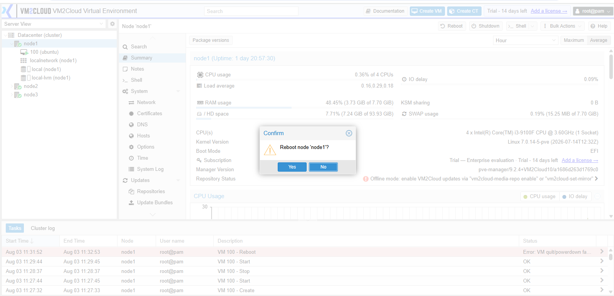
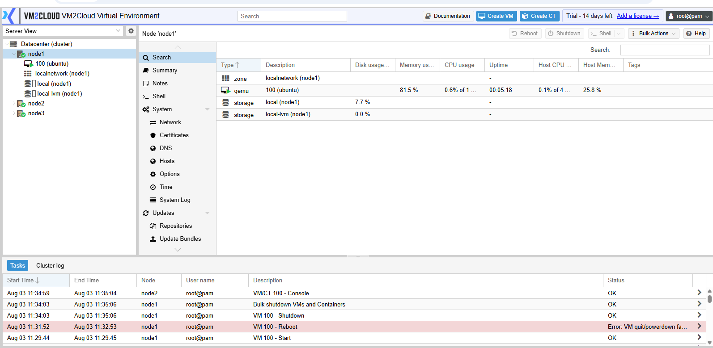

# Reboot Node

---

## Overview

Rebooting a node restarts the physical server hosting the VM2Cloud VE services. This operation is commonly performed after installing system updates, applying configuration changes, or during scheduled maintenance.

> **Important:** Restarting a node will temporarily interrupt the virtual machines and containers running on that node unless they have been migrated or are protected by High Availability (HA).

---

## When to Use

Reboot a node when you need to:

* Complete a system update.
* Apply kernel or system configuration changes.
* Restart the server during scheduled maintenance.
* Resolve temporary system issues.

---

## Prerequisites

Before rebooting a node, ensure that:

* You have administrator privileges.
* Critical virtual machines and containers have been migrated or shut down.
* No backup, migration, or restore tasks are in progress.
* Users have been informed of the maintenance, if required.

---

# Procedure

## Step 1: Open the Node

1. Log in to the VM2Cloud VE web interface.
2. Expand **Datacenter**.
3. Select the node you want to restart.

---

**Select Node**

---

## Step 2: Review Running Workloads

1. Verify the virtual machines and containers currently running on the node.
2. Migrate or shut down workloads if necessary.
3. Ensure no critical tasks are in progress.

---

**Running Workloads**

---

## Step 3: Restart the Node

1. Click **Reboot** in the top-right corner of the node page.
2. Review the confirmation message.
3. Click **Yes** to continue.

---

**Reboot Confirmation**

---

## Step 4: Wait for the Node to Restart

1. Allow the reboot process to complete.
2. Wait for the node to reconnect to the VM2Cloud VE interface.

---

**Node Restarting**

---

## Step 5: Verify the Node Status

1. Refresh the VM2Cloud VE web interface.
2. Confirm the node status is **Online**.
3. Verify that hosted virtual machines and containers are running as expected.

---

**Node Online**

---

# Verification

Verify the following:

* The node is displayed as **Online**.
* No warning or error messages are shown.
* Virtual machines and containers are running as expected.
* Recent Tasks indicates that the reboot completed successfully.

---

# Common Issues

| Issue                           | Resolution                                                                          |
| ------------------------------- | ----------------------------------------------------------------------------------- |
| Node does not come back online  | Verify that the server has completed the reboot and check the console if necessary. |
| Virtual machines remain stopped | Start the virtual machines manually or verify High Availability settings.           |
| Unable to click Reboot          | Confirm you have administrator privileges.                                          |
| Running tasks prevent reboot    | Wait for active tasks to complete before restarting the node.                       |

---

# Summary

The node has been successfully restarted. Rebooting a node is a routine maintenance task that helps apply system updates and configuration changes while ensuring the server continues to operate correctly after maintenance.
