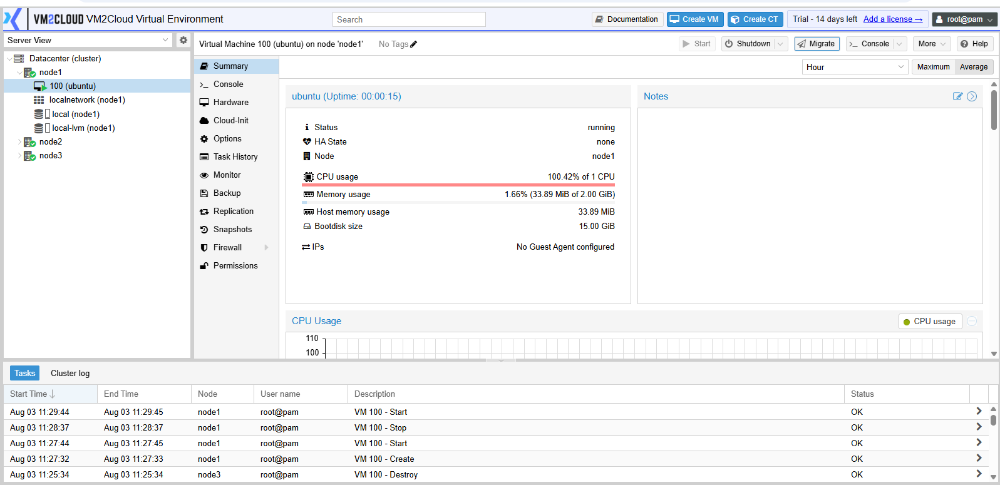
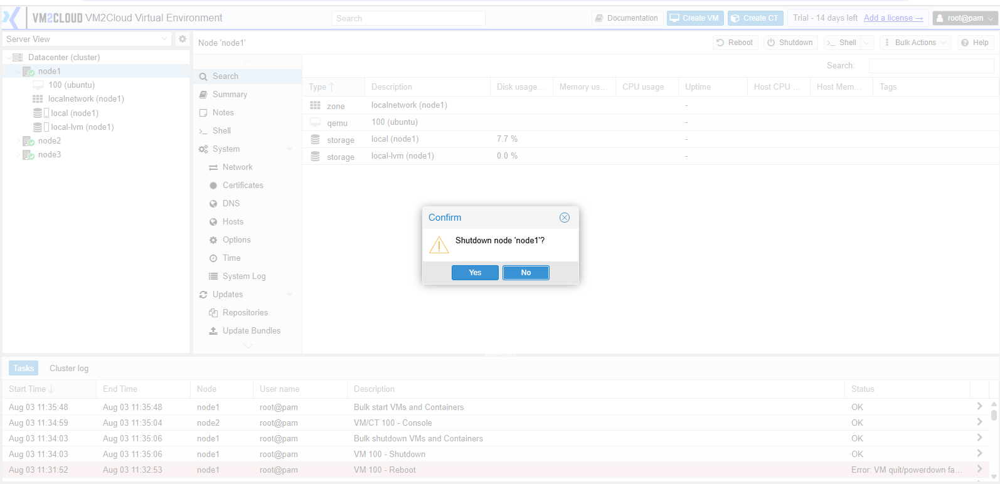
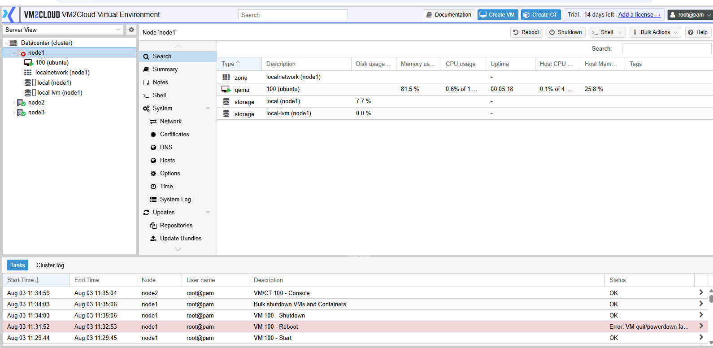

# Shutdown Node

---

## Overview

Shutting down a node powers off the physical server hosting the VM2Cloud VE services. This operation is typically performed during planned maintenance, hardware replacement, infrastructure upgrades, or when permanently removing a server from the environment.

> **Important:** Shutting down a node will stop all virtual machines and containers running on that node unless they have been migrated to another node beforehand.

---

## When to Use

Shut down a node when you need to:

* Perform scheduled hardware maintenance.
* Replace or upgrade server components.
* Power off a server that is no longer required.
* Prepare a node for decommissioning.
* Move the server to a different location.

---

## Prerequisites

Before shutting down a node, ensure that:

* You have administrator privileges.
* All critical virtual machines have been migrated or shut down.
* All containers have been migrated or stopped.
* No backup, migration, restore, or update tasks are currently running.
* Users have been informed of the maintenance, if applicable.

---

# Procedure

## Step 1: Open the Node

1. Log in to the VM2Cloud VE web interface.
2. Expand **Datacenter**.
3. Select the node you want to shut down.

---

**Select Node**

---

## Step 2: Review Running Workloads

1. Verify the virtual machines running on the node.
2. Verify the containers running on the node.
3. Migrate or stop any workloads that should remain available.
4. Confirm that no critical tasks are currently running.

---

**Running Workloads**

---

## Step 3: Shut Down the Node

1. Click **Shutdown** in the top-right corner of the node page.
2. Review the confirmation message.
3. Click **Yes** to confirm the shutdown.

---

**Shutdown Confirmation**

---

## Step 4: Wait for the Shutdown to Complete

1. Wait for the node to complete the shutdown process.
2. The node will disappear from the active online nodes after it has powered off.

---

**Node Shutting Down**

---

## Step 5: Verify the Shutdown

1. Refresh the VM2Cloud VE web interface.
2. Confirm that the node status changes to **Offline**.
3. Verify that the server has powered off successfully.

---

**Node Offline**

---

# Verification

Verify the following:

* The node is displayed as **Offline**.
* The physical server has powered off successfully.
* No shutdown errors are reported.
* Remaining cluster nodes continue operating normally, if applicable.

---

# Common Issues

| Issue                                      | Resolution                                                                               |
| ------------------------------------------ | ---------------------------------------------------------------------------------------- |
| Shutdown option is unavailable             | Verify that you have administrator privileges.                                           |
| Node does not shut down                    | Check for active tasks or workloads that may be preventing the shutdown.                 |
| Virtual machines were stopped unexpectedly | Migrate or gracefully shut down workloads before powering off the node.                  |
| Node still appears online                  | Refresh the VM2Cloud VE interface and verify the server has completed the shutdown process. |

---

# Summary

The node has been successfully shut down. Before powering off any VM2Cloud VE node, always ensure that virtual machines and containers have been migrated or stopped to avoid unexpected service interruptions. Proper planning helps maintain the availability of the remaining infrastructure during maintenance or hardware operations.
