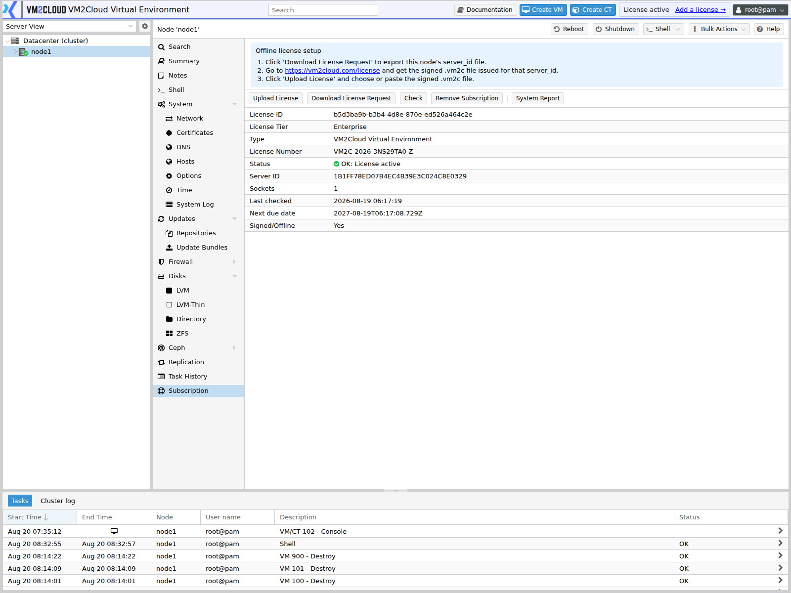

# Subscription

---

## Overview

The **Subscription** page displays the subscription status of the selected VM2Cloud VE node.

It allows administrators to review the current subscription information and determine whether the node has an active subscription.

---

## When to Use

Use the **Subscription** page to:

- Check the current subscription status.
- View subscription information.
- Verify whether the node has an active subscription.
- Review subscription-related messages.
- Troubleshoot subscription status issues.

---

## Prerequisites

Before viewing Subscription information, ensure that:

- You are logged in to the VM2Cloud VE web interface.
- You have permission to view node information.
- The selected node is online.

---

# View Subscription Information

## Step 1: Open Subscription

1. Log in to the VM2Cloud VE web interface.
2. Select the required node.
3. Open **Subscription**.

---

### Screenshot 1

**Subscription Page**



The panel reports the node's subscription status and carries the controls to upload or
remove a key.

Status is per node, not per cluster. In a cluster each node is licensed separately, and the
Datacenter Summary reports the worst case across all of them.
---

## Step 2: Review Subscription Status

Review the information displayed on the Subscription page.

Depending on the VM2Cloud VE version, information may include:

- Subscription Status
- Subscription Level
- Subscription Key
- Validity Information
- Subscription Message

---

# Subscription Status

The displayed status indicates the current subscription state of the node.

| Status | Description |
|---|---|
| Active | The node has a valid active subscription. |
| Not Subscribed | No active subscription is configured. |
| Expired | The previous subscription is no longer valid. |
| Invalid | The configured subscription information could not be validated. |

---

# Subscription Verification

After adding or changing subscription information:

1. Open the **Subscription** page.
2. Review the displayed subscription status.
3. Confirm that the subscription information is correct.
4. Verify that no subscription-related errors are displayed.

---

### Screenshot 2

**Verified Subscription**

```text
[ Place Screenshot Here ]
```

> **Capture:** The page after the status has been checked, showing no errors.

---

# Common Issues

| Issue | Resolution |
|---|---|
| Subscription is not detected | Verify the subscription information and network connectivity. |
| Subscription has expired | Renew or update the subscription according to your organization's licensing arrangement. |
| Subscription cannot be validated | Verify that the node can reach the required subscription service. |
| Incorrect subscription status | Refresh the page and verify the configured subscription information. |

---

# Best Practices

- Monitor subscription status regularly.
- Keep subscription information up to date.
- Ensure nodes can reach required subscription services.
- Do not expose subscription keys or sensitive licensing information in screenshots or documentation.

---

# Verification

Verify the following:

- The Subscription page opens successfully.
- The displayed subscription status is correct.
- Subscription information is valid.
- No subscription-related errors are displayed.

---

# Related Documentation

- Node Overview
- Repositories
- Updates
- Node Troubleshooting

---

# Summary

The **Subscription** page provides administrators with information about the subscription status of a VM2Cloud VE node. Regularly checking this information helps ensure that the node has the appropriate subscription configuration and access to the services associated with that subscription.
