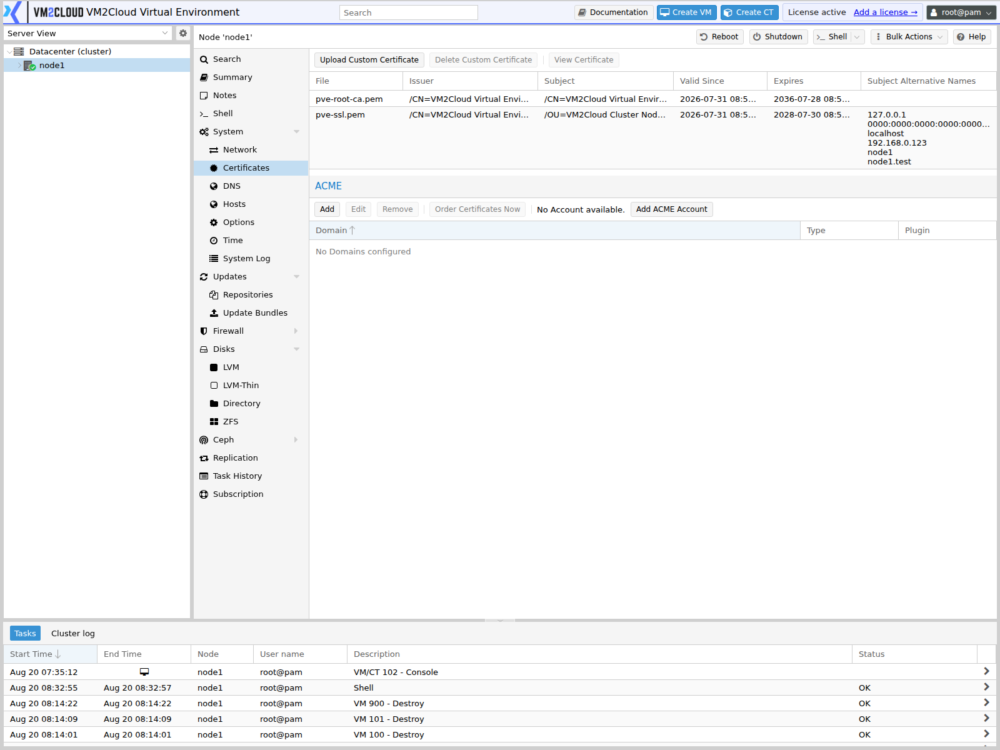
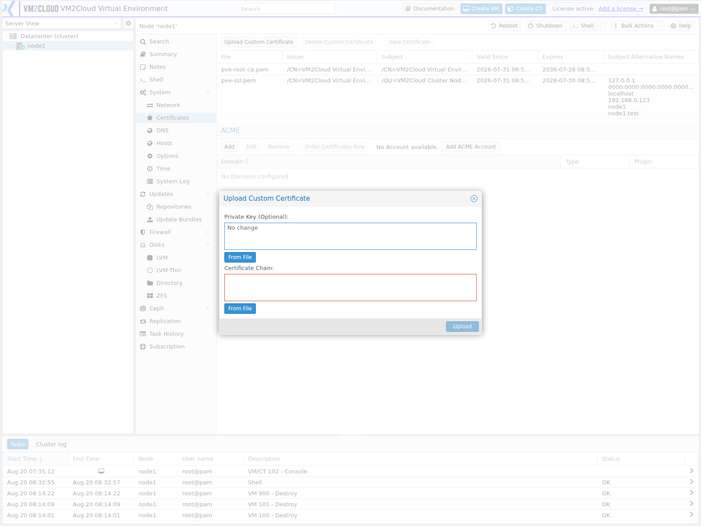

# Certificates

---

## Overview

The **Certificates** page allows administrators to view and manage the SSL/TLS certificates used by the VM2Cloud VE node.

The certificate is used to secure communication between administrators and the VM2Cloud VE web interface. Administrators can review the current certificate, its validity information, and certificate-related configuration.

---

## When to Use

Use the **Certificates** page to:

- View the certificate currently used by the node.
- Check certificate validity.
- Review certificate information.
- Replace a certificate when required.
- Troubleshoot certificate-related access problems.

---

## Prerequisites

Before managing certificates, ensure that:

- You are logged in to the VM2Cloud VE web interface.
- You have administrative privileges.
- The selected node is online.
- You have a valid certificate and private key if replacing the existing certificate.

---

# View the Node Certificate

## Step 1: Open Certificates

1. Log in to the VM2Cloud VE web interface.
2. Select the required node.
3. Select **System**.
4. Open **Certificates**.

---

### Screenshot 1

**Certificates Page**



The panel lists the certificates installed on this node with **File**, **Issuer**,
**Subject**, **Valid Since**, **Expires**, and **Subject Alternative Names**. Two exist on a
fresh install: `pve-root-ca.pem`, the cluster's own certificate authority, and
`pve-ssl.pem`, the certificate this node serves the web interface with.

Read the **Subject Alternative Names** column rather than the subject. A browser matches
the address you typed against those names, so a node reachable at an address missing from
that list warns even when the certificate itself is valid.
---

## Step 2: Review Certificate Information

Review the certificate information displayed by VM2Cloud VE.

Depending on the VM2Cloud VE version, the page may display information such as:

- Certificate status
- Subject
- Issuer
- Valid From
- Valid Until
- Fingerprint
- Certificate type

---

# Replace the Node Certificate

> **Note**
>
> Replace the certificate only when required. An incorrect certificate or private key can prevent secure access to the VM2Cloud VE web interface.

## Step 1: Open Certificate Management

1. Open **Node → System → Certificates**.
2. Select the certificate management option provided by the interface.

---

### Screenshot 2

**Upload Control**



The control is labelled **Upload Custom Certificate**, alongside **Delete Custom
Certificate** and **View Certificate**.

The dialog takes the private key and the certificate chain, each as pasted text or an
uploaded file. Both are required together — a certificate without its matching key is
rejected.
---

## Step 2: Provide the Certificate

Provide the required certificate information.

Depending on the available VM2Cloud VE interface, this may include:

- Certificate
- Private Key
- Certificate Chain

Verify that the certificate and private key belong together.

---

## Step 3: Apply the Certificate

1. Review the certificate information.
2. Confirm the operation.
3. Apply the changes.

The VM2Cloud VE web service may need to reload or restart before the new certificate becomes active.

---

### Screenshot 3

**Applied Certificate**

```text
[ Place Screenshot Here ]
```

> **Capture:** The panel after upload, showing the new certificate in place.

---

# Verify the Certificate

After applying a certificate:

1. Open the VM2Cloud VE web interface again.
2. Verify that the connection is established using HTTPS.
3. Check the certificate information in the browser.
4. Confirm that the certificate is valid and has not expired.

---

## Certificate Validity

Check the following information:

| Information | Purpose |
|---|---|
| Subject | Identifies the certificate owner. |
| Issuer | Identifies the certificate authority that issued the certificate. |
| Valid From | Indicates when the certificate becomes valid. |
| Valid Until | Indicates when the certificate expires. |
| Fingerprint | Provides a unique identifier for the certificate. |

---

## Best Practices

- Use certificates issued by a trusted certificate authority for production environments.
- Ensure the certificate matches the hostname used to access VM2Cloud VE.
- Monitor certificate expiration dates.
- Keep the private key secure.
- Do not expose private keys in documentation or screenshots.
- Test certificate changes before applying them to production nodes.

---

# Common Issues

| Issue | Resolution |
|---|---|
| Browser reports an invalid certificate | Verify the certificate validity, hostname, and certificate chain. |
| Certificate has expired | Replace it with a valid certificate. |
| Certificate does not match the hostname | Obtain or configure a certificate containing the correct hostname. |
| Web interface becomes inaccessible after certificate replacement | Verify the certificate and private key and check the VM2Cloud VE web service. |
| Certificate is not trusted | Verify that the certificate was issued by a trusted CA and that the required certificate chain is available. |

---

# Verification

Verify the following after certificate changes:

- The VM2Cloud VE web interface is accessible over HTTPS.
- The certificate is valid.
- The certificate hostname matches the address used to access VM2Cloud VE.
- The certificate has not expired.
- No browser certificate warnings are displayed.

---

# Related Documentation

- Node Overview
- System Overview
- DNS
- Hosts
- Node Troubleshooting

---

# Summary

The **Certificates** page provides administrators with access to the SSL/TLS certificate configuration of a VM2Cloud VE node. Regularly reviewing certificate validity and replacing certificates before expiration helps maintain secure access to the VM2Cloud VE management interface.
