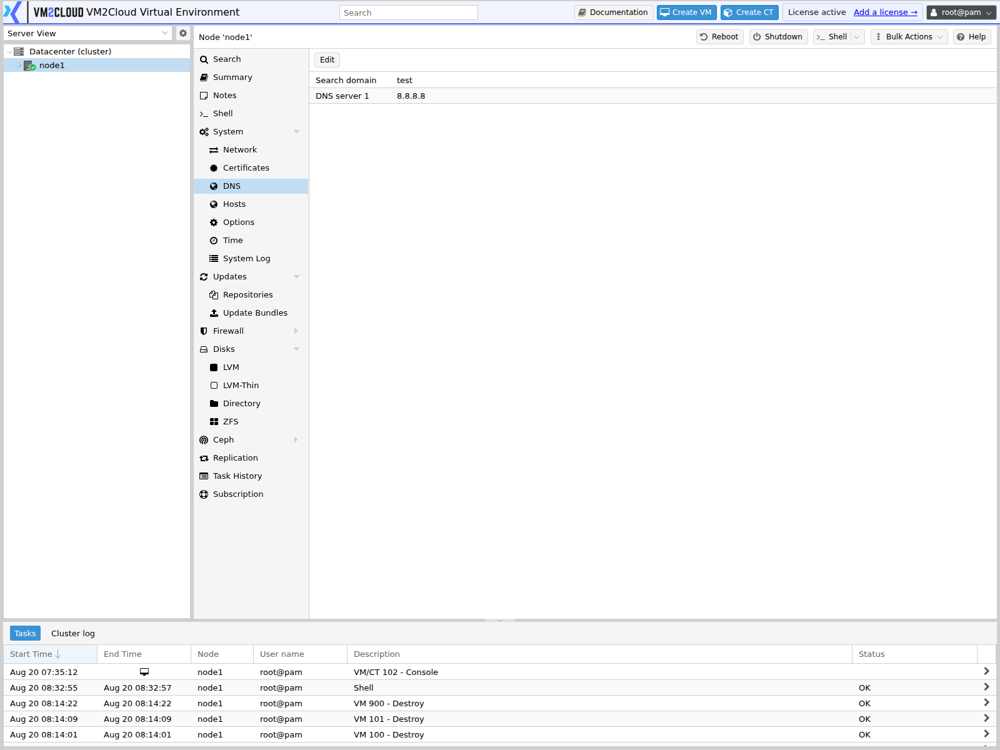
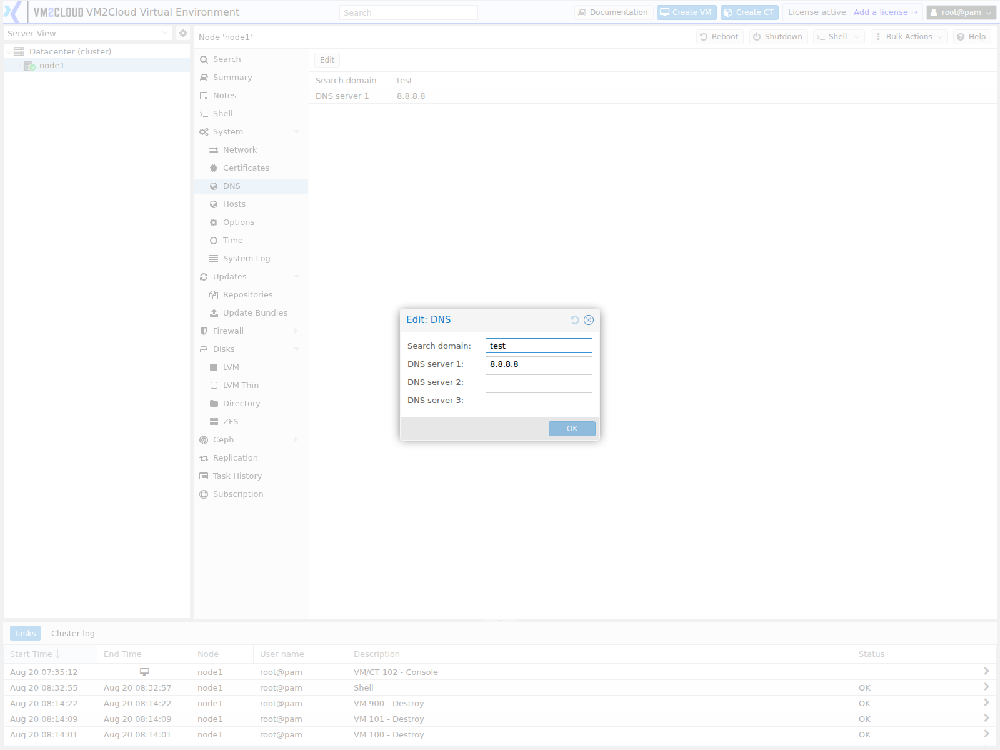

# DNS

---

## Overview

The **DNS** page allows administrators to configure the Domain Name System (DNS) settings used by a VM2Cloud VE node. DNS is responsible for translating hostnames into IP addresses, enabling the node to communicate with other systems using domain names instead of numeric IP addresses.

Proper DNS configuration is essential for software updates, package installation, cluster communication, authentication services, backups, and access to external resources.

---

## When to Use

Use the **DNS** page to:

- Configure DNS servers.
- Configure the search domain.
- Verify the current DNS configuration.
- Update DNS settings after network changes.
- Troubleshoot name resolution issues.

---

## Prerequisites

Before modifying the DNS configuration, ensure that:

- You are logged in to the VM2Cloud VE web interface.
- You have administrative privileges.
- The selected node is online.
- The DNS server addresses are valid and reachable.

---

# View DNS Configuration

## Step 1: Open the DNS Page

1. Log in to the VM2Cloud VE web interface.
2. Select the required node.
3. Expand **System**.
4. Select **DNS**.

---

### Screenshot 1

**DNS Page**

A short read-only summary with a single **Edit** control: the search domain and up to three
resolvers.

These are the node's own resolvers, not the guests'. Containers inherit them unless
overridden — see [CT DNS](../../05-Containers/CT-DNS.md).
---

## Step 2: Review the DNS Configuration

The DNS page displays the current DNS settings.

| Field | What it shows |
|---|---|
| **Search domain** | Domain appended to short names, so `fileserver` resolves as `fileserver.example.com`. |
| **DNS server 1** | Primary resolver. Queried first. |
| **DNS server 2** | Used when the first does not answer. |
| **DNS server 3** | Used when neither of the first two answers. |

These are the node's own resolvers. Containers inherit them unless overridden — see [CT DNS](../../05-Containers/CT-DNS.md).

Review the values to ensure they match your network configuration.

---

# Modify DNS Settings

## Step 1: Open the DNS Configuration

1. On the **DNS** page, click **Edit**.

---

### Screenshot 2

**Edit Control**

**Edit** opens the only dialog this panel has.

Four fields: **Search domain**, and **DNS server 1**, **2**, and **3**. Only the first
server is required. Configure at least two — with one, any outage of that resolver stops
name resolution on the node, which surfaces as backups, updates, and cluster joins failing
rather than as an obvious DNS problem.
---

## Step 2: Configure the DNS Settings

Configure the required values.

| Field | What to enter |
|---|---|
| **Search domain** | Your internal domain. Leave empty if short names are not used. |
| **DNS server 1** | The resolver to query first. |
| **DNS server 2** | A second resolver, on different infrastructure from the first where possible. |
| **DNS server 3** | Optional third resolver. |

**Configure at least two servers.** With one, any outage of that resolver stops name resolution on the node — which presents as backups, updates, and cluster operations failing for unrelated-looking reasons rather than as an obvious DNS fault.

In a cluster, use the same resolvers on every node unless there is a specific reason not to.

After entering the required values, click **OK**.

---

## Example DNS Configuration

The following example illustrates a typical configuration.

| Setting | Example |
|----------|---------|
| Search Domain | example.local |
| DNS Server 1 | 8.8.8.8 |
| DNS Server 2 | 1.1.1.1 |
| DNS Server 3 | 8.8.4.4 |

Use values appropriate for your environment.

---

## Why DNS Is Important

Correct DNS configuration enables the node to:

- Resolve hostnames.
- Download software updates.
- Access package repositories.
- Communicate with authentication services.
- Connect to backup servers.
- Access remote storage services.
- Communicate with external systems using domain names.

---

## Best Practices

- Configure at least two DNS servers whenever possible.
- Use reliable and reachable DNS servers.
- Configure the correct search domain for your environment.
- Verify DNS functionality after making changes.
- Use internal DNS servers when required by your organization.

---

# Verification

Verify the following:

- The configured DNS servers are displayed correctly.
- The search domain is correct.
- Hostnames can be resolved successfully.
- Network services that depend on DNS operate normally.

---

# Common Issues

| Issue | Resolution |
|--------|------------|
| Hostnames cannot be resolved | Verify that the configured DNS server addresses are correct and reachable. |
| Incorrect search domain | Update the search domain and apply the changes. |
| Software updates fail due to name resolution | Verify the DNS configuration and test connectivity to the configured DNS servers. |
| Unable to save DNS settings | Confirm that your account has administrative privileges and the node is online. |

---

# Related Documentation

- System Overview
- Hosts
- Network Time (NTP)
- Network Management

---

# Summary

The **DNS** page allows administrators to configure and manage the DNS settings used by a VM2Cloud VE node. Proper DNS configuration ensures reliable hostname resolution and supports services such as software updates, authentication, backups, and communication with other systems.
